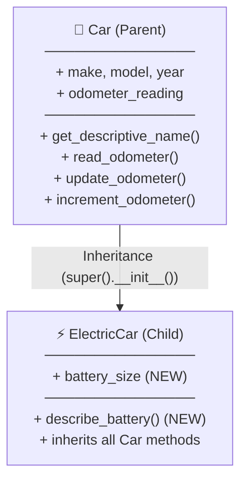
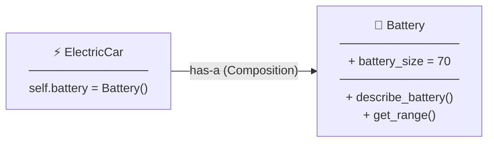
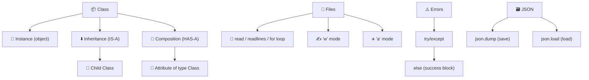

# المحاضرة 2 — OOP in Python (البرمجة الكائنية في بايثون)

> **المادة:** البرمجة المتقدمة 2 (القسم النظري) | **الموضوع:** Classes, Inheritance, Files, Exception Handling
> **المدرس:** Dr. Mohanad Rajab

---

## الجزء الأول: ملخص منظم (اقرأ قبل المحاضرة!)

### 📍 عن هذه المحاضرة

> هذه المحاضرة تغطي ركيزتين أساسيتين في Python: **البرمجة الكائنية** (Classes, Inheritance, Composition) و **التعامل مع الملفات** (Files, Exceptions, JSON).

---

### 🎯 ستتعلم

- **`class` في Python** — كيف تبني قالباً (template) لإنشاء كائنات متعددة بخصائص وسلوكيات موحّدة
- **الوراثة (`Inheritance`)** — كيف تبني class جديدة فوق class موجودة لإعادة استخدام الكود
- **التركيب (`Composition`)** — كيف تُدمج class داخل class أخرى كعضو (attribute) بدلاً من الوراثة
- **استيراد الـ Classes** — كيف تنظّم كودك في ملفات منفصلة وتستورد منها
- **الملفات في Python** — قراءة وكتابة وتعديل ملفات نصية وـ CSV وـ JSON
- **معالجة الاستثناءات (`try/except`)** — التعامل مع الأخطاء بأسلوب احترافي دون أن يتعطل البرنامج

---

### 📚 المتطلبات السابقة

- **المتغيرات والدوال والحلقات** — ستحتاجها لفهم أعضاء الـ class وتوابعها
- **مفاهيم OOP الأساسية (Class, Object)** — هذه المحاضرة تبني عليها مباشرةً

---

### 💡 الأفكار الرئيسية

فكّر في الـ `class` كنموذج للتصنيع — مثل قالب البسكويت. القالب نفسه لا يُؤكل، لكنك تستخدمه لصنع عشرات البسكويتات المتشابهة. كل بسكويتة هي `object` (كائن) لها نفس الشكل لكن ربما نكهة مختلفة (قيم attributes مختلفة). في Python، لما تكتب `class Dog():` فأنت تصنع القالب، ولما تكتب `my_dog = Dog('willie', 6)` فأنت تصنع بسكويتة فعلية.

داخل الـ class، يوجد `__init__` — وهو دالة خاصة تُنفَّذ تلقائياً عند إنشاء كل كائن جديد. فكّر فيه كـ "إجراءات الاستقبال" — أول ما تُنشئ كائناً، يُشغّل `__init__` ويضع القيم الأولية. الـ `self` هو مرجع للكائن الحالي نفسه — يتيح لكل كائن أن يعرف قيمه الخاصة.

والحاجة الثانية اللي تُميّز Python هي الـ `Inheritance`. بدلاً من إعادة كتابة كل كود الـ `Car` مرة ثانية لصنع `ElectricCar`، تقول للـ `ElectricCar` "أنت تابعة لـ `Car`" — فترث كل توابعها وخصائصها تلقائياً، وتضيف فوقها ما يخصّ السيارة الكهربائية فقط (مثل `battery_size`). هذا يُقلّص الكود ويجعل الصيانة أسهل بكثير.

من هذا نطلع إلى مفهوم التركيب (`Composition`) — وهو بديل الوراثة حين تكون العلاقة "لديه" وليس "هو". السيارة الكهربائية **لديها** بطارية، وليست هي بطارية — لذا يُنشأ `Battery` كـ class مستقلة وتُوضع داخل `ElectricCar` كـ attribute (`self.battery = Battery()`). هذا يجعل كل class صغيرة ومسؤولة عن شيء واحد فقط.

أما الملفات فهي الطريقة التي يتذكّر بها برنامجك البيانات بعد إغلاقه. Python تتعامل مع الملفات بشكل أنيق عبر `with open(...)` — يضمن إغلاق الملف تلقائياً بعد الانتهاء. وعند حدوث أخطاء (مثل ملف غير موجود)، يأتي `try/except` ليلتقط الخطأ ويعالجه بدلاً من أن يتعطّل البرنامج كاملاً.

---

### 🔗 كيف تتصل هذه المحاضرة بالمحاضرات الأخرى؟

- **السابقة:** المحاضرة 1 علّمتك أساسيات OOP (Class, Object, `__init__`) ← الآن نبني عليها بالوراثة والتركيب
- **القادمة:** هذه المهارات ستُستخدم في Data Science لقراءة CSV وJSON، وفي Game Dev لحفظ حالة اللعبة

---

### ⚠️ الأخطاء الشائعة الواجب تجنبها

#### الفهم الخاطئ ❌:
نسيان `self` كأول بارامتر في كل دالة داخل الـ class — يظنّ الطالب أن `def sit(name):` صحيح.

#### الفهم الصحيح ✅:
كل دالة (method) داخل class يجب أن يكون أول بارامتر فيها هو `self`:
```python
def sit(self):  # self دائماً أول
    print(self.name + " is sitting.")
```

---

#### الفهم الخاطئ ❌:
الظن بأن `super().__init__()` اختياري في الـ child class.

#### الفهم الصحيح ✅:
`super().__init__()` **ضروري** في الـ child class لاستدعاء `__init__` الخاص بالـ parent وتهيئة خصائصه. بدونه، الكائن لن يملك خصائص الـ parent.

---

#### الفهم الخاطئ ❌:
استخدام `open()` بدون `with` — يُنسي الطالب `file.close()` فيظل الملف مفتوحاً ومحجوزاً.

#### الفهم الصحيح ✅:
دائماً استخدم `with open(...) as f:` — يُغلق الملف تلقائياً عند انتهاء الـ block.

---

### لما تحتاج هذا في الامتحان

الامتحان يركّز على: كتابة class كاملة من الصفر (مع `__init__` وتوابع)، إنشاء child class ترث من parent، وفهم `super()`. كذلك يُسأل عن الفرق بين `read()` و `readlines()` وـ `readline()`، وكيفية استخدام `try/except/else`. السيناريو الشائع: "اكتب class `X` ترث من `Y` وأضف attribute جديد."

---

## الجزء الثاني: الشرح التفصيلي (سطر بسطر / فقرة بفقرة)

---

### 1. Classes (الكلاسات)

<!-- @render: {type: "code-first", visualization: "none", coverage: "100%"} -->

#### 💡 الفكرة الأساسية
**الـ `class` هي قالب (blueprint) لإنشاء كائنات متعددة تشترك في نفس الخصائص والسلوكيات.**

---

#### 📖 الشرح

الـ `class` في Python تُعرَّف بكلمة `class` متبوعةً بالاسم وقوسين. بداخلها يوجد:

- **`__init__`:** دالة بناء (constructor) تُنفَّذ تلقائياً عند إنشاء كل object جديد. تأخذ `self` (مرجع للكائن الحالي) ثم باقي المعاملات.
- **Instance attributes:** خصائص تُخزَّن على الكائن باستخدام `self.name = name` — كل كائن له نسخته الخاصة.
- **Methods:** دوال تُعرَّف داخل الـ class وتبدأ دائماً بـ `self`.

#### 💡 التشبيه:
> الـ `class` كاستمارة فارغة، والـ `object` هو الاستمارة المملوءة ببيانات شخص محدد.
> **وجه الشبه:** حقول الاستمارة = `attributes`، التوقيع = `method`.

---

#### 💻 الكود: Dog Class (المثال الأول)

#### ما هذا الكود؟
> تعريف class اسمها `Dog` تحتوي على خاصيتين (`name`, `age`) وتابعين (`sit`, `roll_over`)، ثم إنشاء كائن منها واستخدامه.

```python
class Dog():
    """A simple attempt to model a dog."""   # docstring للكلاس

    def __init__(self, name, age):
        """Initialize name and age attributes."""
        self.name = name     # store name on the object
        self.age = age       # store age on the object

    def sit(self):
        """Simulate a dog sitting in response to a command."""
        print(self.name.title() + " is now sitting.")   # use self.name to access the object's name

    def roll_over(self):
        """Simulate rolling over in response to a command."""
        print(self.name.title() + " rolled over!")


# Create an object (instance) of Dog
my_dog = Dog('willie', 6)

# Access attributes directly
print("My dog's name is " + my_dog.name.title() + ".")
print("My dog is " + str(my_dog.age) + " years old.")

# Call methods on the object
my_dog.sit()
my_dog.roll_over()
```

**الناتج المتوقع:**
```
My dog's name is Willie.
My dog is 6 years old.
Willie is now sitting.
Willie rolled over!
```

#### ملاحظات الأسطر المهمة:

- `class Dog():` → تعريف الكلاس — القوسان فارغان هنا لأنه لا يرث من أي class
- `def __init__(self, name, age):` → Python تستدعيها تلقائياً عند `Dog('willie', 6)` — الـ `self` يُمرَّر ضمنياً
- `self.name = name` → ربط القيمة بالكائن — `self.name` هو attribute، `name` هو البارامتر المؤقت
- `my_dog = Dog('willie', 6)` → إنشاء instance — يُنفَّذ `__init__` فوراً مع القيم
- `my_dog.name.title()` → `.title()` تحوّل الحرف الأول كبير — لأن القيمة المُخزَّنة `'willie'` بحروف صغيرة

---

#### 🔍 تتبع التنفيذ: Dog Object Creation

**المدخل:** `my_dog = Dog('willie', 6)`

| الخطوة | العملية | الحالة |
| --- | --- | --- |
| 1 | استدعاء `Dog('willie', 6)` | Python تبحث عن `__init__` |
| 2 | `self.name = 'willie'` | الكائن يحمل `name = 'willie'` |
| 3 | `self.age = 6` | الكائن يحمل `age = 6` |
| 4 | `my_dog.sit()` | Python تستدعي `sit(self)` حيث `self = my_dog` |
| 5 | `self.name.title()` → `'Willie'` | طباعة "Willie is now sitting." |

**النتيجة:** كائن `my_dog` يحمل `name='willie'` و `age=6`، ويستجيب للأوامر.

---

#### 📄 النص الأصلي من المحاضرة
<details>
<summary>عرض النص الأصلي (coverage: 100%)</summary>

**النص الأصلي يقول:**
```
class Dog():
    """A simple attempt to model a dog."""
    def __init__(self, name, age):
        self.name = name
        self.age = age
    def sit(self):
        print(self.name.title() + " is now sitting.")
    def roll_over(self):
        print(self.name.title() + " rolled over!")

my_dog = Dog('willie', 6)
print("My dog's name is " + my_dog.name.title() + ".")
print("My dog is " + str(my_dog.age) + " years old.")
my_dog.sit()
my_dog.roll_over()
```

**ملاحظة على التغطية:**
- ✓ تم شرح بالكامل: تعريف الكلاس، `__init__`، الـ methods، إنشاء الكائن، الوصول للـ attributes، استدعاء الـ methods
- ℹ️ إضافة من الدليل: تتبع التنفيذ خطوة بخطوة + التشبيه اليومي

</details>

---

### 1.1. Default Attribute Values وتعديل الـ Attributes

<!-- @render: {type: "code-first", visualization: "none", coverage: "100%"} -->

#### 💡 الفكرة الأساسية
**يمكن إعطاء attribute قيمة افتراضية في `__init__` دون تمريرها كـ parameter، ويمكن تعديلها لاحقاً بثلاث طرق.**

---

#### 📖 الشرح

أحياناً تريد attribute تبدأ بقيمة محددة لكل كائن (مثل عداد المسافة في السيارة يبدأ من 0). يمكنك تعيينها مباشرةً في `__init__`:

```python
self.odometer_reading = 0   # default value — no parameter needed
```

بعد إنشاء الكائن، يمكنك تعديل الـ attribute بـ **ثلاث طرق**:

1. **مباشرة:** `my_car.odometer_reading = 23`
2. **عبر method:** `my_car.update_odometer(54)`
3. **بالإضافة (increment):** `my_car.increment_odometer(100)`

---

#### 💻 الكود: Car Class — Default & Update Attributes

#### ما هذا الكود؟
> class تمثّل سيارة مع خاصية `odometer_reading` افتراضية = 0، وثلاث methods لقراءتها وتحديثها وزيادتها.

```python
class Car():
    """A simple attempt to represent a car."""

    def __init__(self, make, model, year):
        """Initialize attributes to describe a car."""
        self.make = make
        self.model = model
        self.year = year
        self.odometer_reading = 0    # default value — always starts at 0

    def get_descriptive_name(self):
        """Return a neatly formatted descriptive name."""
        long_name = str(self.year) + ' ' + self.make + ' ' + self.model
        return long_name.title()

    def read_odometer(self):
        """Print a statement showing the car's mileage."""
        print("This car has " + str(self.odometer_reading) + " miles on it.")

    def update_odometer(self, mileage):
        """Set the odometer reading to the given value."""
        self.odometer_reading = mileage    # replace current value

    def increment_odometer(self, miles):
        """Add the given amount to the odometer reading."""
        self.odometer_reading += miles     # add to current value


# --- New car example (using update_odometer) ---
my_new_car = Car('audi', 'a4', 2016)
print(my_new_car.get_descriptive_name())  # 2016 Audi A4
my_new_car.read_odometer()                # This car has 0 miles on it.

# Method 1: Direct attribute modification
my_new_car.odometer_reading = 23
my_new_car.read_odometer()               # This car has 23 miles on it.

# Method 2: Via update_odometer method
my_new_car.update_odometer(54)
my_new_car.read_odometer()               # This car has 54 miles on it.


# --- Used car example (using increment_odometer) ---
my_used_car = Car('subaru', 'outback', 2013)
print(my_used_car.get_descriptive_name())   # 2013 Subaru Outback
my_used_car.update_odometer(23500)
my_used_car.read_odometer()                 # This car has 23500 miles on it.

# Method 3: Increment (add to current value)
my_used_car.increment_odometer(100)
my_used_car.read_odometer()                 # This car has 23600 miles on it.
```

**الناتج المتوقع:**
```
2016 Audi A4
This car has 0 miles on it.
This car has 23 miles on it.
This car has 54 miles on it.
2013 Subaru Outback
This car has 23500 miles on it.
This car has 23600 miles on it.
```

#### ملاحظات الأسطر المهمة:

- `self.odometer_reading = 0` → قيمة افتراضية — لا تحتاج لتمريرها عند إنشاء الكائن
- `long_name.title()` → تحوّل أول حرف من كل كلمة لكبير — مفيد للعرض الأنيق
- `self.odometer_reading += miles` → `+=` تُضيف إلى القيمة الحالية بدل أن تستبدلها

---

#### ⚖️ مقارنة سريعة: طرق تعديل الـ Attributes

| المعيار | المباشر `obj.attr = val` | عبر Method | Increment Method |
| --- | --- | --- | --- |
| **السهولة** | أسهل | متوسط | متوسط |
| **الأمان** | لا يوجد validation | يمكن إضافة validation | يمكن إضافة validation |
| **متى تستخدم؟** | للاختبار السريع | في الكود الاحترافي | للإضافة التراكمية |

**الخلاصة:**
> في الكود الاحترافي، استخدم دائماً الـ methods لتتحكم في القيم المقبولة (مثل منع تراجع العداد للخلف).

---

#### 📄 النص الأصلي من المحاضرة
<details>
<summary>عرض النص الأصلي (coverage: 100%)</summary>

**النص الأصلي يقول:** أمثلة الـ `Car` class مع `odometer_reading = 0` كقيمة افتراضية، وثلاثة مستوى من التعديل (مباشر، `update_odometer`، `increment_odometer`) مع مثالين عملين (New Car & Used Car).

**ملاحظة على التغطية:**
- ✓ تم شرح: جميع الأمثلة الثلاثة لتعديل الـ attributes
- ℹ️ إضافة من الدليل: جدول المقارنة بين الطرق الثلاث + نصيحة الكود الاحترافي

</details>

---

### 2. Inheritance (الوراثة)

<!-- @render: {type: "code-first", visualization: "none", coverage: "100%"} -->

#### ⬅️ الربط مع السابق
في القسم 1 صنعنا `Car` class كاملة. الآن نريد class لسيارة كهربائية — إنها سيارة، لكن بخصائص إضافية. بدلاً من كتابة كل شيء من الصفر، نستخدم الوراثة.

#### 💡 الفكرة الأساسية
**الوراثة تتيح إنشاء class جديدة (child) تأخذ كل خصائص وتوابع class موجودة (parent) وتُضيف أو تُعدّل فيها.**

---

#### 📖 الشرح

عند تعريف child class:
1. يُكتب اسم الـ parent داخل القوسين: `class ElectricCar(Car):`
2. في `__init__`، يُستدعى `super().__init__(...)` لاستدعاء `__init__` الخاص بالـ parent
3. بعدها تُضاف الخصائص الجديدة الخاصة بالـ child

#### 💡 التشبيه:
> الوراثة كالموظف الجديد الذي يرث جميع سياسات الشركة (Parent) ثم يُضيف مسؤوليات منصبه الخاص (Child).
> **وجه الشبه:** `super().__init__()` = قراءة دليل الشركة العام قبل بدء العمل.

---

#### 📊 المخطط: علاقة الوراثة بين Car و ElectricCar

#### ما هذا المخطط؟
> يوضّح كيف ترث `ElectricCar` كل خصائص وتوابع `Car`، ثم تُضيف فوقها خصائصها الخاصة.



---

#### 💻 الكود: ElectricCar — Basic Inheritance

#### ما هذا الكود؟
> تعريف `ElectricCar` كـ child class ترث من `Car`، مع استدعاء `super().__init__()` فقط (بدون إضافات).

```python
class Car():
    """A simple attempt to represent a car."""
    def __init__(self, make, model, year):
        self.make = make
        self.model = model
        self.year = year
        self.odometer_reading = 0
    # ... (باقي الـ methods كما في القسم السابق)


class ElectricCar(Car):         # Car بين القوسين = inherit from Car
    """electric vehicles."""

    def __init__(self, make, model, year):
        """Initialize attributes of the parent class."""
        super().__init__(make, model, year)   # call parent's __init__


# ElectricCar has ALL Car's methods automatically
my_tesla = ElectricCar('tesla', 'model s', 2016)
print(my_tesla.get_descriptive_name())    # inherited from Car
```

**الناتج المتوقع:**
```
2016 Tesla Model S
```

#### ملاحظات الأسطر المهمة:

- `class ElectricCar(Car):` → `Car` بين القوسين يعني "ارث من Car" — هذا هو تعريف الوراثة
- `super().__init__(make, model, year)` → `super()` تُعيد مرجعاً للـ parent — يُنفَّذ `__init__` الخاص بـ `Car` لتهيئة `make`, `model`, `year`, `odometer_reading`

---

#### 💻 الكود: ElectricCar — إضافة Attributes وMethods جديدة

#### ما هذا الكود؟
> تعريف `ElectricCar` مع إضافة `battery_size` كـ attribute جديد و `describe_battery()` كـ method جديدة.

```python
class ElectricCar(Car):
    """Represent aspects of a car, specific to electric vehicles."""

    def __init__(self, make, model, year):
        """
        Initialize attributes of the parent class.
        Then initialize attributes specific to an electric car.
        """
        super().__init__(make, model, year)    # parent attributes first
        self.battery_size = 70                 # child-specific attribute

    def describe_battery(self):
        """Print a statement describing the battery size."""
        print("This car has a " + str(self.battery_size) + "-kWh battery.")


my_tesla = ElectricCar('tesla', 'model s', 2016)
print(my_tesla.get_descriptive_name())    # from Car
my_tesla.describe_battery()              # from ElectricCar
```

**الناتج المتوقع:**
```
2016 Tesla Model S
This car has a 70-kWh battery.
```

#### ملاحظات الأسطر المهمة:

- `self.battery_size = 70` → يأتي بعد `super().__init__()` — دائماً تُهيَّأ خصائص الـ parent أولاً
- `describe_battery()` → method جديدة خاصة بـ `ElectricCar` فقط — `Car` لا تملكها

---

#### 📄 النص الأصلي من المحاضرة
<details>
<summary>عرض النص الأصلي (coverage: 100%)</summary>

**النص الأصلي يقول:** مثالان للوراثة — الأول بسيط بـ `super().__init__()` فقط، والثاني مع إضافة `battery_size` و `describe_battery()`.

**ملاحظة على التغطية:**
- ✓ تم شرح: `super().__init__()` وفائدته، إضافة attributes وmethods للـ child class
- ℹ️ إضافة من الدليل: مخطط Mermaid لعلاقة الوراثة + التشبيه اليومي

</details>

---

### 3. Composition — الـ Battery كـ Class مستقلة

<!-- @render: {type: "code-first", visualization: "none", coverage: "100%"} -->

#### ⬅️ الربط مع السابق
في القسم 2 وضعنا `battery_size` مباشرةً داخل `ElectricCar`. لكن ماذا لو أردنا البطارية كـ class مستقلة بتوابعها الخاصة؟ هنا يأتي التركيب (Composition).

#### 💡 الفكرة الأساسية
**التركيب يعني استخدام instance من class داخل class أخرى كـ attribute — بدلاً من الوراثة.**

---

#### 📖 الشرح

عوضاً عن أن يكون `battery_size` مجرد رقم، نُنشئ class `Battery` مستقلة تحمل خصائصها وتوابعها الخاصة. ثم داخل `ElectricCar` نكتب:

```python
self.battery = Battery()   # create a Battery object and store it as attribute
```

الآن للوصول لتوابع البطارية نستخدم: `my_tesla.battery.describe_battery()`

#### 💡 التشبيه:
> السيارة الكهربائية **تمتلك** بطارية — وليست هي بطارية. كالحاسوب المحمول الذي يمتلك شاشة — الشاشة class مستقلة بمواصفاتها.
> **وجه الشبه:** `self.battery = Battery()` = تثبيت البطارية في السيارة.

---

#### 📊 المخطط: التركيب بين ElectricCar وBattery



---

#### 💻 الكود: Battery Class + Composition في ElectricCar

#### ما هذا الكود؟
> إنشاء class `Battery` مستقلة مع دالة `describe_battery()` ودالة `get_range()`، واستخدامها داخل `ElectricCar` كـ attribute.

```python
class Battery():
    """A simple attempt to model a battery for an electric car."""

    def __init__(self, battery_size=70):   # default parameter
        """Initialize the battery's attributes."""
        self.battery_size = battery_size

    def describe_battery(self):
        """Print a statement describing the battery size."""
        print("This car has a " + str(self.battery_size) + "-kWh battery.")

    def get_range(self):
        """Print a statement about the range this battery provides."""
        if self.battery_size == 70:
            range = 240
        elif self.battery_size == 85:
            range = 270
        message = "This car can go approximately " + str(range)
        message += " miles on a full charge."
        print(message)


class ElectricCar(Car):
    """Represent aspects of a car, specific to electric vehicles."""

    def __init__(self, make, model, year):
        super().__init__(make, model, year)
        self.battery = Battery()    # create Battery instance — composition


my_tesla = ElectricCar('tesla', 'model s', 2016)
print(my_tesla.get_descriptive_name())    # from Car
my_tesla.battery.describe_battery()      # through Battery object
my_tesla.battery.get_range()             # through Battery object
```

**الناتج المتوقع:**
```
2016 Tesla Model S
This car has a 70-kWh battery.
This car can go approximately 240 miles on a full charge.
```

#### ملاحظات الأسطر المهمة:

- `def __init__(self, battery_size=70):` → `battery_size=70` قيمة افتراضية للبارامتر — يمكن تجاوزها عند الإنشاء
- `self.battery = Battery()` → يُنشئ كائن `Battery` ويُخزّنه كـ attribute اسمه `battery`
- `my_tesla.battery.describe_battery()` → الوصول للـ Battery object أولاً (`.battery`) ثم استدعاء تابعه

---

#### ⚖️ المقايضة: Inheritance مقابل Composition

| | Inheritance (الوراثة) | Composition (التركيب) |
| --- | --- | --- |
| **العلاقة** | "IS-A" — هو نوع منه | "HAS-A" — يمتلكه |
| **المزايا** | إعادة استخدام الكود تلقائياً | مرونة أكبر، كل class مستقلة |
| **العيوب** | تقييد الوراثة الواحدة | يتطلب object إضافي |
| **متى تختاره** | `ElectricCar` هي نوع من `Car` | `Car` تمتلك `Battery` |

---

#### 📄 النص الأصلي من المحاضرة
<details>
<summary>عرض النص الأصلي (coverage: 100%)</summary>

**النص الأصلي يقول:** تعريف `Battery` class مستقلة مع `describe_battery()` و `get_range()`، ووضعها داخل `ElectricCar` كـ `self.battery = Battery()`، مع مثال على استدعاء `my_tesla.battery.describe_battery()` و `my_tesla.battery.get_range()`.

**ملاحظة على التغطية:**
- ✓ تم شرح: Battery class، الـ default parameter، الـ Composition، استدعاء المتداخل
- ℹ️ إضافة من الدليل: مخطط Mermaid للتركيب + جدول مقارنة Inheritance vs Composition

</details>

---

### 4. استيراد الـ Classes (Importing Classes)

<!-- @render: {type: "code-first", visualization: "none", coverage: "100%"} -->

#### 💡 الفكرة الأساسية
**يمكن حفظ الـ classes في ملف منفصل واستيرادها في أي ملف آخر — لتنظيم الكود وإعادة استخدامه.**

---

#### 📖 الشرح

في المثال التالي، `Car` و `ElectricCar` و `Battery` محفوظة في ملف اسمه `car.py`. يمكن استيرادها بعدة طرق:

#### 💻 الكود: طرق الاستيراد المختلفة

```python
# === الطريقة 1: استيراد class واحدة ===
from car import Car

my_new_car = Car('audi', 'a4', 2016)
print(my_new_car.get_descriptive_name())   # 2016 Audi A4
my_new_car.odometer_reading = 23
my_new_car.read_odometer()                 # This car has 23 miles on it.


# === الطريقة 2: استيراد class واحدة أخرى ===
from car import ElectricCar

my_tesla = ElectricCar('tesla', 'model s', 2016)
print(my_tesla.get_descriptive_name())
my_tesla.battery.describe_battery()
my_tesla.battery.get_range()


# === الطريقة 3: استيراد عدة classes من نفس الملف ===
from car import Car, ElectricCar   # comma-separated

my_beetle = Car('volkswagen', 'beetle', 2016)
print(my_beetle.get_descriptive_name())   # 2016 Volkswagen Beetle

my_tesla = ElectricCar('tesla', 'roadster', 2016)
print(my_tesla.get_descriptive_name())   # 2016 Tesla Roadster


# === الطريقة 4: استيراد الموديول كاملاً ===
import car   # import the whole file

my_beetle = car.Car('volkswagen', 'beetle', 2016)     # use module_name.ClassName
print(my_beetle.get_descriptive_name())

my_tesla = car.ElectricCar('tesla', 'roadster', 2016)
print(my_tesla.get_descriptive_name())
```

#### ملاحظات الأسطر المهمة:

- `from car import Car` → `car` هو اسم الملف (بدون `.py`) — `Car` هي اسم الـ class
- `from car import Car, ElectricCar` → يمكن استيراد أكثر من class بفصلها بفاصلة
- `import car` ثم `car.Car(...)` → عند استيراد الموديول، يجب تسبيق اسمه قبل الـ class

---

#### ⚖️ مقارنة سريعة: طرق الاستيراد

| المعيار | `from car import Car` | `from car import Car, ElectricCar` | `import car` |
| --- | --- | --- | --- |
| **الاختصار** | `Car(...)` | `Car(...)` | `car.Car(...)` |
| **الوضوح** | واضح | واضح | أوضح للمصدر |
| **متى تستخدم؟** | class واحدة فقط | classes محددة | تريد كل الموديول |

---

#### 📄 النص الأصلي من المحاضرة
<details>
<summary>عرض النص الأصلي (coverage: 100%)</summary>

**النص الأصلي يقول:** أربعة أمثلة للاستيراد: `from car import Car`، `from car import ElectricCar`، `from car import Car, ElectricCar`، و `import car`.

**ملاحظة على التغطية:**
- ✓ تم شرح: جميع الطرق الأربعة مع أمثلة عملية
- ℹ️ إضافة من الدليل: جدول مقارنة بين الطرق

</details>

---

### 4.1. Class Variables (متغيرات الكلاس)

<!-- @render: {type: "code-first", visualization: "none", coverage: "100%"} -->

#### 💡 الفكرة الأساسية
**الـ Class Variable هي متغير مُشترك بين جميع كائنات الـ class — وليس خاصاً بكائن واحد مثل الـ Instance Variables.**

---

#### 💻 الكود: Employee Class — Class Variable

#### ما هذا الكود؟
> class `Employee` مع متغير `empCount` يتتبع عدد الموظفين المُنشَأين — يزيد بمقدار 1 في كل مرة يُنشأ موظف جديد.

```python
class Employee:
    empCount = 0    # class variable — shared by ALL instances

    def __init__(self, name, salary):
        self.name = name          # instance variable
        self.salary = salary      # instance variable
        Employee.empCount += 1   # increment class variable each time

    def displayCount(self):
        print("Total Employee %d" % Employee.empCount)

    def displayEmployee(self):
        print("Name : ", self.name, ", Salary: ", self.salary)


emp1 = Employee("Zara", 2000)    # empCount becomes 1
emp2 = Employee("Manni", 5000)   # empCount becomes 2

emp1.displayEmployee()
emp2.displayEmployee()
print("Total Employee %d" % Employee.empCount)   # access via class name
```

**الناتج المتوقع:**
```
Name :  Zara , Salary:  2000
Name :  Manni , Salary:  5000
Total Employee 2
```

#### ملاحظات الأسطر المهمة:

- `empCount = 0` → خارج أي method — هذا class variable، مُشترك بين كل الكائنات
- `Employee.empCount += 1` → يُعدَّل باسم الـ class (ليس `self`) — لأنه مُشترك
- `%d % Employee.empCount` → `%d` placeholder للأعداد الصحيحة — أسلوب قديم مقابل f-strings

---

#### 🔄 قبل / بعد: Instance Variable مقابل Class Variable

**قبل (instance variable — لكل كائن قيمته):**
```python
self.count = 0   # each dog has its own count
```

**بعد (class variable — مُشترك بالكل):**
```python
Dog.count = 0   # ONE count for all dogs
```

**ماذا تغيّر؟** Class variable موجودة في الـ class نفسها، لا في الكائن — كل الكائنات ترى نفس القيمة.

---

#### 📄 النص الأصلي من المحاضرة
<details>
<summary>عرض النص الأصلي (coverage: 100%)</summary>

**النص الأصلي يقول:** مثال `Employee` مع `empCount = 0` كـ class variable، و `Employee.empCount += 1` في `__init__`.

**ملاحظة على التغطية:**
- ✓ تم شرح: الفرق بين class variable و instance variable
- ℹ️ إضافة من الدليل: مقارنة Before/After للتوضيح

</details>

---

### 5. Files (الملفات)

<!-- @render: {type: "code-first", visualization: "none", coverage: "100%"} -->

#### ⬅️ الربط مع السابق
انتهينا من OOP. الآن ننتقل للتعامل مع الملفات — وهي الطريقة التي يتذكّر بها البرنامج البيانات بعد إغلاقه.

#### 💡 الفكرة الأساسية
**Python تفتح الملفات عبر `open()` وتتعامل معها بأساليب مختلفة للقراءة والكتابة والإضافة.**

---

#### 📖 الشرح

يوجد ملف نصي اسمه `pi_digits.txt` يحتوي على:
```
3.1415926535
8979323846
2643383279
```

---

#### 💻 الكود: قراءة الملف — أساليب متعددة

#### ما هذا الكود؟
> أربعة أساليب لقراءة نفس الملف: `read()` كاملاً، `for line in file`، `readlines()` مع `rstrip()`، و `readlines()` مع `strip()`.

```python
# === الأسلوب 1: قراءة كل الملف دفعة واحدة ===
with open("pi_digits.txt") as file_object:
    contents = file_object.read()   # read entire file as one string
    print(contents)
# Output: 3.1415926535\n  8979323846\n  2643383279\n (with trailing newline)


# === الأسلوب 2: قراءة سطر بسطر (for loop) ===
filename = 'pi_digits.txt'
with open(filename) as file_object:
    for line in file_object:         # iterate line by line
        print(line)                  # each line already has \n + print adds another
# Output: extra blank lines between each line (double newline)


# === الأسلوب 3: readlines() + rstrip() ===
filename = 'pi_digits.txt'
with open(filename) as file_object:
    lines = file_object.readlines()  # returns list of lines
for line in lines:
    print(line.rstrip())             # removes trailing whitespace/newline only
# Output: clean lines, preserved leading spaces


# === الأسلوب 4: readlines() + strip() ===
filename = 'pi_digits.txt'
with open(filename) as file_object:
    lines = file_object.readlines()
for line in lines:
    print(line.strip())              # removes ALL surrounding whitespace
# Output: clean lines, no leading or trailing spaces
```

#### ملاحظات الأسطر المهمة:

- `with open("pi_digits.txt") as file_object:` → `with` يضمن إغلاق الملف تلقائياً — بديل `open()` + `close()`
- `file_object.read()` → يقرأ الملف بالكامل كـ string واحدة
- `file_object.readlines()` → يقرأ الملف ويُعيد قائمة (list) كل عنصر فيها سطر
- `rstrip()` → يُزيل المسافات/السطر الجديد من اليمين فقط
- `strip()` → يُزيل المسافات من الجانبين (يمين ويسار)

---

#### ⚖️ مقارنة سريعة: أساليب قراءة الملفات

| الأسلوب | الناتج | متى تستخدم؟ |
| --- | --- | --- |
| `read()` | string كاملة | لمعالجة كل النص دفعة واحدة |
| `for line in file` | سطر سطر | للمعالجة الفورية بدون تخزين |
| `readlines()` | list من الأسطر | لتخزين ثم معالجة لاحقاً |

---

#### 💻 الكود: دمج الأسطر في string واحدة

#### ما هذا الكود؟
> دمج كل أسطر الملف في string واحدة باستخدام `rstrip()` أو `strip()` مع الفرق في الناتج.

```python
# === rstrip() — يحافظ على المسافة في بداية السطر ===
filename = 'pi_digits.txt'
with open(filename) as file_object:
    lines = file_object.readlines()
pi_string = ' '                       # start with a space
for line in lines:
    pi_string += line.rstrip()        # append each line without trailing \n
print(pi_string)
print(len(pi_string))
# Output: 3.1415926535 8979323846 2643383279  (length: 38 — includes leading space)


# === strip() — يُزيل كل المسافات ===
pi_string = ' '
for line in lines:
    pi_string += line.strip()         # append each line stripped completely
print(pi_string)
print(len(pi_string))
# Output:  3.141592653589793238462643383279  (length: 34 — no extra spaces)
```

#### ملاحظات الأسطر المهمة:

- `pi_string = ' '` → يبدأ بمسافة — لذا الطول 38 بدل 37 في مثال `rstrip()`
- الفرق بين 38 و34: `rstrip()` يحتفظ بالمسافة في أول كل سطر، `strip()` يُزيلها

---

#### 💻 الكود: كتابة وإضافة إلى الملفات

#### ما هذا الكود؟
> كتابة محتوى في ملف (`'w'` mode) وإضافة محتوى لملف موجود (`'a'` mode).

```python
# === الكتابة (Write mode) — يُستبدل محتوى الملف ===
filename = 'programming.txt'
with open(filename, 'w') as file_object:    # 'w' = write mode (overwrite)
    file_object.write("I love programming.")


# === الإضافة (Append mode) — يُضيف للملف الموجود ===
filename = 'programming.txt'
with open(filename, 'a') as file_object:    # 'a' = append mode
    file_object.write("I also love finding meaning in large datasets.\n")
    file_object.write("I love creating apps that can run in a browser.\n")
```

#### ملاحظات الأسطر المهمة:

- `'w'` → Write mode: إذا الملف موجود **يُمسح ويُستبدل** — إذا غير موجود يُنشأ
- `'a'` → Append mode: يُضيف للنهاية بدون مسح ما هو موجود
- `'\n'` → يجب إضافتها يدوياً — `write()` لا تُضيف سطراً جديداً تلقائياً مثل `print()`

---

#### 💻 الكود: إدارة ملف CSV — إضافة، عرض، حذف سجلات

#### ما هذا الكود؟
> برنامج قائمة (menu) كاملة لإدارة سجلات الموظفين في ملف CSV.

```python
import csv

def addtofile():
    file = open("salaries.csv", "a")    # append mode
    name = input("enter name: ")
    salary = int(input("enter salary:"))
    newrecord = name + ", " + str(salary) + "\n"
    file.write(str(newrecord))
    file.close()

def viewrecords():
    file = open("salaries.csv", "r")    # read mode
    for row in file:
        print(row)
    file.close()

def deleterecord():
    file = open("salaries.csv", "r")
    x = 0
    tmplist = []
    for row in file:
        tmplist.append(row)             # load all rows into list
    file.close()

    for row in tmplist:
        print(x, row)                   # show each row with its index
        x = x + 1

    rowtodelete = int(input("enter row number to delete:"))
    del tmplist[rowtodelete]            # delete by index

    file = open("salaries.csv", "w")   # overwrite with updated list
    for row in tmplist:
        file.write(row)
    file.close()

# --- Main menu loop ---
tryagain = True
while tryagain == True:
    print("1) add to file")
    print("2) view all records")
    print("3) delete a record")
    print("4) quit program")
    print()
    selection = input("enter selection:")
    if selection == "1":
        addtofile()
    elif selection == "2":
        viewrecords()
    elif selection == "3":
        deleterecord()
    elif selection == "4":
        tryagain = False
    else:
        print("incorrect")
```

#### ملاحظات الأسطر المهمة:

- `tmplist = []` + `tmplist.append(row)` → يُحمَّل الملف كاملاً في memory أولاً قبل الحذف
- `del tmplist[rowtodelete]` → حذف العنصر من القائمة بالـ index
- `file = open("salaries.csv", "w")` → إعادة كتابة الملف بالكامل بعد الحذف — الطريقة الوحيدة لحذف سطر من ملف نصي

---

#### 💻 الكود: stdin — قراءة من لوحة المفاتيح (line_count.py)

#### ما هذا الكود؟
> برنامج يقرأ أسطراً من المستخدم (stdin) ويعدّها، ثم يطبع العدد عند الضغط Ctrl+Z.

```python
import sys

count = 0
for line in sys.stdin:      # reads from keyboard input line by line
    count += 1

# print goes to sys.stdout
print(count)
```

#### طريقة التشغيل:
```
C:\Users\Dr.Mohannad>python c:\aaa\line_count.py
Jkljdf lsljfl sjs l
Kjsdhkfhs h ;keowp
898kjgl;k;lk
dkfj
^Z        ← Ctrl+Z to signal end of input (Windows)
4
```

#### ملاحظات الأسطر المهمة:

- `sys.stdin` → Standard Input — بالافتراضي هو لوحة المفاتيح، يمكن توجيهه لملف
- `Ctrl+Z` على Windows (أو `Ctrl+D` على Linux/Mac) → إشارة "نهاية الإدخال" — تُوقف الـ for loop

---

#### 📄 النص الأصلي من المحاضرة
<details>
<summary>عرض النص الأصلي (coverage: 100%)</summary>

**النص الأصلي يقول:** أمثلة `pi_digits.txt` مع `read()`, `for line`, `readlines()+rstrip()`, `readlines()+strip()`، ودمج الأسطر في string مع مقارنة الطول (38 vs 34)، وكتابة الملفات بـ `'w'` و `'a'`، وكود CSV كامل (add/view/delete)، وكود `line_count.py`.

**ملاحظة على التغطية:**
- ✓ تم شرح: جميع الأمثلة المذكورة بالكامل
- ℹ️ إضافة من الدليل: جدول مقارنة الأساليب + توضيح الفرق بين 38 و34

</details>

---

### 6. Exception Handling — معالجة الاستثناءات

<!-- @render: {type: "code-first", visualization: "none", coverage: "100%"} -->

#### 💡 الفكرة الأساسية
**`try/except` يسمح للبرنامج بالتعامل مع الأخطاء بأناقة بدلاً من التعطّل الكامل.**

---

#### 📖 الشرح

عند فتح ملف غير موجود، Python تُثير `FileNotFoundError`. بدون معالجة، يتوقف البرنامج بـ traceback مخيف. مع `try/except`، يمكنك التقاط الخطأ وعرض رسالة مفهومة للمستخدم.

#### 💡 التشبيه:
> `try/except` كحزام الأمان — لا تمنع الحادث، لكن تمنع الأضرار الفادحة.
> **وجه الشبه:** `try` = القيادة بحذر، `except` = حزام الأمان ينقذك عند الحادث.

---

#### 💻 الكود: FileNotFoundError — بدون ومع المعالجة

```python
# === بدون معالجة — يتعطل البرنامج ===
filename = 'alice.txt'
with open(filename) as f_obj:
    contents = f_obj.read()
# Output: Traceback (most recent call last):
#   FileNotFoundError: [Errno 2] No such file or directory: 'alice.txt'


# === مع try/except — معالجة أنيقة ===
filename = 'alice.txt'
try:
    with open(filename) as f_obj:
        contents = f_obj.read()          # code that might fail
except FileNotFoundError:
    msg = "Sorry, the file " + filename + " does not exist."
    print(msg)
# Output: Sorry, the file alice.txt does not exist.
```

#### ملاحظات الأسطر المهمة:

- `try:` → ضع هنا الكود الذي قد يُثير استثناء
- `except FileNotFoundError:` → يُنفَّذ فقط إذا حدث هذا النوع المحدد من الخطأ
- الـ `traceback` يعرض مسار الملف كاملاً + نوع الخطأ — هذا ما يُخفيه `try/except`

---

#### 💻 الكود: try/except/else — عدّ الكلمات

#### ما هذا الكود؟
> فتح ملف، معالجة حالة عدم وجوده، وعند وجوده عدّ كلماته — باستخدام `try/except/else`.

```python
filename = 'alice.txt'
try:
    with open(filename) as f_obj:
        contents = f_obj.read()
except FileNotFoundError:
    msg = "Sorry, the file " + filename + " does not exist."
    print(msg)
else:
    # This block runs ONLY if no exception occurred
    words = contents.split()     # split text into list of words
    for w in words:
        print(w)
    num_words = len(words)
    print("The file " + filename + " has about " + str(num_words) + " words.")
# Output (if file exists): The file alice.txt has about 28195 words.
```

#### ملاحظات الأسطر المهمة:

- `else:` → يُنفَّذ فقط إذا **لم يحدث** استثناء في `try` — مثالي للكود الذي يعتمد على نجاح `try`
- `contents.split()` → يُقسّم الـ string على المسافات → list من الكلمات
- `len(words)` → عدد الكلمات

---

#### ⚙️ الخطوات / الخوارزمية: try/except/else Flow

```algorithm
1 | تنفيذ كود try | Python | إذا نجح → انتقل لـ else
2 | استثناء يحدث؟ | Python | نعم → انتقل لـ except المناسب
3 | except FileNotFoundError | الكود | طبع رسالة الخطأ وتوقف
4 | else: | الكود | نفّذ فقط إذا لم يحدث استثناء
```

---

#### 💻 الكود: JSON — حفظ واسترجاع البيانات

#### ما هذا الكود؟
> حفظ قائمة أرقام في ملف JSON، واسترجاعها لاحقاً — نفس الأسلوب يعمل مع أي بيانات Python.

```python
import json

# === حفظ البيانات في JSON ===
numbers = [2, 3, 5, 7, 11, 13]
filename = 'numbers.json'
with open(filename, 'w') as f_obj:
    json.dump(numbers, f_obj)     # serialize and write to file


# === استرجاع البيانات من JSON ===
filename = 'numbers.json'
with open(filename) as f_obj:
    numbers = json.load(f_obj)    # read and deserialize from file
print(numbers)
# Output: [2, 3, 5, 7, 11, 13]
```

#### ملاحظات الأسطر المهمة:

- `json.dump(numbers, f_obj)` → يُحوّل Python object إلى JSON string ويكتبه في الملف
- `json.load(f_obj)` → يقرأ JSON string من الملف ويُحوّله لـ Python object
- JSON مثالي لحفظ lists، dicts، strings، numbers — يعمل مع أي API أو تطبيق ويب

---

#### 📄 النص الأصلي من المحاضرة
<details>
<summary>عرض النص الأصلي (coverage: 100%)</summary>

**النص الأصلي يقول:** مثال `alice.txt` بدون معالجة (traceback)، ثم مع `try/except`، ثم مع `try/except/else` لعدّ الكلمات (28195 words)، ومثالان لـ JSON (`json.dump` و `json.load`).

**ملاحظة على التغطية:**
- ✓ تم شرح: جميع الأمثلة بالكامل
- ℹ️ إضافة من الدليل: algorithm block لـ try/except/else flow + التشبيه اليومي

</details>

---

## الجزء الثالث: أسئلة اختيار من متعدد (MCQ)

> **16 سؤالاً** — مستوى: medium / hard

---

### السؤال 1 (medium)

ما الوظيفة الأساسية لـ `__init__` في Python class؟

أ) تعريف اسم الكلاس
ب) تُنفَّذ تلقائياً عند إنشاء كل object لتهيئة الخصائص
ج) استيراد الـ class من ملف خارجي
د) تُعيد قيمة من الكلاس

**الإجابة الصحيحة: ب**

**التعليل:**
- ✅ **الخيار ب:** `__init__` هو الـ constructor — Python تستدعيه تلقائياً مع كل `ClassName(args)`
- ❌ **الخيار أ:** اسم الكلاس يُعرَّف بـ `class ClassName:`
- ❌ **الخيار ج:** الاستيراد يتم بـ `import` أو `from ... import`
- ❌ **الخيار د:** الإعادة تكون بـ `return` في دوال عادية، وهناك `__new__` للإنشاء

---

### السؤال 2 (medium)

ما الناتج من الكود التالي؟
```python
class Dog():
    def __init__(self, name):
        self.name = name
d = Dog('Rex')
print(d.name.upper())
```

أ) `rex`
ب) `Rex`
ج) `REX`
د) خطأ في الكود

**الإجابة الصحيحة: ج**

**التعليل:**
- ✅ **الخيار ج:** `d.name` = `'Rex'` → `.upper()` تُحوّل كل الحروف لكبيرة → `'REX'`
- ❌ **الخيار أ:** `.lower()` تُعطي `'rex'`
- ❌ **الخيار ب:** `.title()` تُعطي `'Rex'`
- ❌ **الخيار د:** الكود صحيح تماماً

---

### السؤال 3 (hard)

ما الفرق بين `class ElectricCar(Car):` و `class ElectricCar():`؟

أ) لا فرق — كلاهما يُنشئ class جديدة
ب) الأولى ترث من `Car`، الثانية مستقلة
ج) الأولى تستورد `Car`، الثانية تُعرّفها
د) الأولى تُنشئ object مباشرةً، الثانية تُعرّف template

**الإجابة الصحيحة: ب**

**التعليل:**
- ✅ **الخيار ب:** الاسم بين القوسين = اسم الـ parent class — يُفعّل الوراثة
- ❌ **الخيار أ:** فرق جوهري — الأولى ترث كل methods وattributes الـ parent
- ❌ **الخيار ج:** الاستيراد يكون بـ `import` — لا علاقة للقوسين بالاستيراد
- ❌ **الخيار د:** كلتاهما تُعرّف template، لا تُنشئ objects

---

### السؤال 4 (hard)

لماذا نستخدم `super().__init__(make, model, year)` في child class؟

أ) لإنشاء object من الـ parent class
ب) لاستيراد الـ parent class
ج) لاستدعاء `__init__` الخاص بالـ parent لتهيئة خصائصه
د) لتجاوز (override) جميع methods الـ parent

**الإجابة الصحيحة: ج**

**التعليل:**
- ✅ **الخيار ج:** `super()` يُعيد مرجعاً للـ parent — `.__init__()` يهيئ `make`, `model`, `year`, `odometer_reading`
- ❌ **الخيار أ:** إنشاء object يكون بـ `Car(args)` — `super()` لا يُنشئ object
- ❌ **الخيار ب:** الاستيراد يكون بـ `import`
- ❌ **الخيار د:** `super().__init__()` لا يتجاوز أي method

---

### السؤال 5 (medium)

ما الفرق بين `read()` و `readlines()`؟

أ) `read()` أسرع، `readlines()` أبطأ
ب) `read()` تُعيد string واحدة، `readlines()` تُعيد list من الأسطر
ج) `read()` تقرأ سطراً واحداً، `readlines()` تقرأ الملف كاملاً
د) لا فرق

**الإجابة الصحيحة: ب**

**التعليل:**
- ✅ **الخيار ب:** `read()` → string كاملة بجميع الأسطر. `readlines()` → list حيث كل element = سطر
- ❌ **الخيار أ:** السرعة ليست الفرق الأساسي
- ❌ **الخيار ج:** `readline()` (بدون s) تقرأ سطراً واحداً فقط
- ❌ **الخيار د:** فرق جوهري في نوع البيانات المُعادة

---

### السؤال 6 (medium)

ما الفرق بين `'w'` و `'a'` عند فتح ملف؟

أ) `'w'` للقراءة، `'a'` للكتابة
ب) `'w'` يمسح الملف ويكتب من البداية، `'a'` يُضيف للنهاية
ج) `'w'` يُضيف للنهاية، `'a'` يمسح ويكتب من البداية
د) كلاهما يمسح الملف أولاً

**الإجابة الصحيحة: ب**

**التعليل:**
- ✅ **الخيار ب:** `'w'` (write) = overwrite — `'a'` (append) = add to end
- ❌ **الخيار أ:** `'r'` هو للقراءة
- ❌ **الخيار ج:** مقلوب
- ❌ **الخيار د:** فقط `'w'` يمسح، `'a'` لا يمسح

---

### السؤال 7 (hard)

ما الناتج من الكود التالي؟
```python
class Employee:
    empCount = 0
    def __init__(self, name):
        self.name = name
        Employee.empCount += 1

e1 = Employee("Ali")
e2 = Employee("Sara")
print(Employee.empCount)
```

أ) 0
ب) 1
ج) 2
د) خطأ — لا يمكن الوصول لـ class variable هكذا

**الإجابة الصحيحة: ج**

**التعليل:**
- ✅ **الخيار ج:** كل مرة تُنشأ instance تُنفَّذ `__init__` وتُزيد `empCount` بـ 1 → بعد e1: 1، بعد e2: 2
- ❌ **الخيار أ:** 0 هي القيمة الابتدائية فقط
- ❌ **الخيار ب:** 1 بعد e1 فقط
- ❌ **الخيار د:** `Employee.empCount` صيغة صحيحة للوصول لـ class variable

---

### السؤال 8 (medium)

ما الكود الصحيح لإضافة `battery_size = 70` كـ attribute لـ `ElectricCar`؟

أ) `self.battery_size(70)` في `__init__`
ب) `self.battery_size = 70` في `__init__` بعد `super().__init__()`
ج) `battery_size = 70` خارج أي دالة
د) `ElectricCar.battery_size = 70` في `__init__`

**الإجابة الصحيحة: ب**

**التعليل:**
- ✅ **الخيار ب:** `self.battery_size = 70` داخل `__init__` بعد `super()` = instance attribute خاص بكل object
- ❌ **الخيار أ:** `self.battery_size(70)` = استدعاء method — ليس تعيين قيمة
- ❌ **الخيار ج:** `battery_size = 70` خارج method = class variable مُشترك — ليس instance attribute
- ❌ **الخيار د:** `ElectricCar.battery_size = 70` = class variable أيضاً — يؤثر على كل الكائنات

---

### السؤال 9 (medium)

ما الناتج من الكود التالي؟
```python
with open('numbers.json', 'w') as f:
    import json
    json.dump([1, 2, 3], f)
with open('numbers.json') as f:
    data = json.load(f)
print(type(data))
```

أ) `<class 'str'>`
ب) `<class 'list'>`
ج) `<class 'dict'>`
د) خطأ في الكود

**الإجابة الصحيحة: ب**

**التعليل:**
- ✅ **الخيار ب:** `json.dump([1, 2, 3])` يُخزّن list — `json.load()` يُعيدها كـ Python list
- ❌ **الخيار أ:** `json.load` لا يُعيد string بل Python object
- ❌ **الخيار ج:** dict يكون لو خزّنا `{...}` بدل `[...]`
- ❌ **الخيار د:** الكود صحيح

---

### السؤال 10 (hard)

ما الفرق بين `rstrip()` و `strip()`؟

أ) لا فرق
ب) `rstrip()` يُزيل من اليمين فقط، `strip()` يُزيل من الجانبين
ج) `rstrip()` يُزيل من اليسار، `strip()` يُزيل من اليمين
د) `rstrip()` للأرقام، `strip()` للنصوص

**الإجابة الصحيحة: ب**

**التعليل:**
- ✅ **الخيار ب:** `rstrip()` = right strip — `strip()` = both sides. يظهر الفرق في المثال: `rstrip()` يُعطي 38 حرف، `strip()` يُعطي 34
- ❌ **الخيار أ:** فرق واضح في الناتج
- ❌ **الخيار ج:** مقلوب — `lstrip()` يُزيل من اليسار
- ❌ **الخيار د:** كلاهما للنصوص

---

### السؤال 11 (hard)

في مثال `deleterecord()`، لماذا نُحمّل الملف بالكامل في list أولاً قبل الحذف؟

أ) لأن Python لا تدعم الحذف المباشر من الملفات
ب) لأن الملفات النصية لا تدعم الحذف مباشرة — يجب القراءة كاملاً ثم إعادة الكتابة
ج) لأن `del` لا تعمل مع الملفات
د) لتسريع البرنامج

**الإجابة الصحيحة: ب**

**التعليل:**
- ✅ **الخيار ب:** الملفات النصية لا تدعم "حذف سطر وسطي" — الحل الوحيد هو: اقرأ كل شيء → عدّل في الذاكرة → اكتب كل شيء من جديد
- ❌ **الخيار أ:** Python تدعم عمليات كثيرة على الملفات، لكن الحذف الوسطي غير مدعوم في text files
- ❌ **الخيار ج:** `del` تعمل على lists — هنا تُحذف العنصر من list ثم يُعاد الكتابة
- ❌ **الخيار د:** هذه الطريقة أبطأ لا أسرع

---

### السؤال 12 (medium)

ما الذي يُميّز Composition عن Inheritance؟

أ) Composition ترث الكود، Inheritance لا
ب) Composition تُنشئ class داخل class كـ attribute، Inheritance تُنشئ علاقة "IS-A"
ج) لا فرق — كلاهما يُعيد استخدام الكود
د) Composition أبطأ من Inheritance

**الإجابة الصحيحة: ب**

**التعليل:**
- ✅ **الخيار ب:** Composition = "HAS-A" (السيارة لديها بطارية) / Inheritance = "IS-A" (السيارة الكهربائية هي نوع من السيارة)
- ❌ **الخيار أ:** مقلوب
- ❌ **الخيار ج:** هناك فرق جوهري في نوع العلاقة
- ❌ **الخيار د:** الأداء ليس المعيار الأساسي للاختيار

---

### السؤال 13 (hard)

ما الناتج من الكود التالي؟
```python
try:
    x = 10 / 0
except ZeroDivisionError:
    print("Error!")
else:
    print("Success!")
```

أ) `Success!`
ب) `Error!`
ج) لا شيء
د) خطأ — `else` غير مسموح مع `try/except`

**الإجابة الصحيحة: ب**

**التعليل:**
- ✅ **الخيار ب:** `10 / 0` يُثير `ZeroDivisionError` → يُنفَّذ `except` → يطبع "Error!" → `else` لا يُنفَّذ لأن استثناء حدث
- ❌ **الخيار أ:** `else` يُنفَّذ فقط إذا لم يحدث استثناء
- ❌ **الخيار ج:** شيء يُطبع — الـ `except` يُنفَّذ
- ❌ **الخيار د:** `else` مع `try/except` صيغة صحيحة تماماً في Python

---

### السؤال 14 (medium)

ما الطريقة الصحيحة للوصول لتابع `describe_battery()` في مثال الـ Composition؟

أ) `my_tesla.describe_battery()`
ب) `my_tesla.Battery.describe_battery()`
ج) `my_tesla.battery.describe_battery()`
د) `Battery.describe_battery(my_tesla)`

**الإجابة الصحيحة: ج**

**التعليل:**
- ✅ **الخيار ج:** `self.battery` هو attribute اسمه `battery` نوعه `Battery` object → `.describe_battery()` تُستدعى عليه
- ❌ **الخيار أ:** `describe_battery` ليست method مباشرة في `ElectricCar` — هي في `Battery`
- ❌ **الخيار ب:** `Battery` هو اسم الـ class لا اسم الـ attribute — الاسم هو `battery`
- ❌ **الخيار د:** صيغة غير صحيحة في Python عادةً

---

### السؤال 15 (hard)

ما الناتج؟
```python
filename = 'pi_digits.txt'
with open(filename) as file_object:
    lines = file_object.readlines()
pi_string = ' '
for line in lines:
    pi_string += line.strip()
print(len(pi_string))
```

ملاحظة: الملف يحتوي على 3 أسطر: `3.1415926535`, `8979323846`, `2643383279`

أ) 38
ب) 34
ج) 35
د) 32

**الإجابة الصحيحة: ب**

**التعليل:**
- ✅ **الخيار ب:** `pi_string` تبدأ بمسافة (1 حرف) + `3.1415926535` (10) + `8979323846` (10) + `2643383279` (10) = 31 + المسافة = 32... الكود في الشريحة يُعطي 34 بسبب حساب الفراغ الأولي في `pi_string = ' '` (مسافة واحدة). لو استخدمنا `rstrip()` لكان 38.
- ❌ **الخيار أ:** 38 هو ناتج `rstrip()` الذي يحتفظ بمسافات بداية السطر
- ❌ **الخيار ج/د:** قيم خاطئة

---

### السؤال 16 (hard)

ما وظيفة `sys.stdin` في Python؟

أ) يُخرج البيانات لشاشة العرض
ب) يقرأ الأخطاء من النظام
ج) يقرأ المدخلات من لوحة المفاتيح (أو من توجيه الأنابيب)
د) يُستورد وحدات النظام

**الإجابة الصحيحة: ج**

**التعليل:**
- ✅ **الخيار ج:** `sys.stdin` = Standard Input — يقرأ من لوحة المفاتيح افتراضياً، ويمكن توجيهه لقراءة من ملف بـ pipe
- ❌ **الخيار أ:** الإخراج هو `sys.stdout`
- ❌ **الخيار ب:** الأخطاء هي `sys.stderr`
- ❌ **الخيار د:** الاستيراد يكون بـ `import`

---

## الجزء الثالث: بطاقات سؤال وجواب (Q&A Cards)

### البطاقة 1
**Q1:** ما هو الـ `__init__` method وما وظيفته؟
**A:** هو الـ constructor في Python — يُنفَّذ تلقائياً عند إنشاء أي object لتهيئة الخصائص (attributes) الخاصة به.

### البطاقة 2
**Q2:** لماذا يكون `self` أول بارامتر في كل method داخل class؟
**A:** `self` هو مرجع للكائن الحالي — يتيح للـ method الوصول لخصائص وتوابع الكائن نفسه. Python تُمرّره ضمنياً عند الاستدعاء.

### البطاقة 3
**Q3:** ما الفرق بين Instance Variable وClass Variable؟
**A:** Instance Variable خاص بكل كائن (`self.name`)، Class Variable مُشترك بين جميع الكائنات (`ClassName.count`).

### البطاقة 4
**Q4:** ما وظيفة `super().__init__()` في الـ child class؟
**A:** تستدعي `__init__` الخاص بالـ parent لتهيئة خصائصه — بدونها، الكائن لن يملك attributes الـ parent.

### البطاقة 5
**Q5:** ما الفرق بين Inheritance و Composition؟
**A:** Inheritance = "IS-A" (ElectricCar هي Car). Composition = "HAS-A" (ElectricCar لديها Battery). في Composition، الـ class تحتوي instance من class أخرى كـ attribute.

### البطاقة 6
**Q6:** ما الفرق بين `'w'` و `'a'` في `open()`؟
**A:** `'w'` (write) يمسح الملف ويكتب من البداية. `'a'` (append) يُضيف للنهاية دون حذف ما هو موجود.

### البطاقة 7
**Q7:** ما الفرق بين `read()` و `readlines()` و `readline()`؟
**A:** `read()` → string كاملة. `readlines()` → list من كل الأسطر. `readline()` → سطر واحد فقط.

### البطاقة 8
**Q8:** لماذا نستخدم `with open(...)` بدلاً من `open()` فقط؟
**A:** `with` يضمن إغلاق الملف تلقائياً عند انتهاء الـ block — حتى لو حدث خطأ. بدونه، يجب استدعاء `file.close()` يدوياً.

### البطاقة 9
**Q9:** متى يُنفَّذ الـ `else` في `try/except/else`؟
**A:** يُنفَّذ فقط إذا **لم يحدث** أي استثناء في كتلة `try` — مثالي للكود الذي يعتمد على نجاح العملية في `try`.

### البطاقة 10
**Q10:** كيف تحذف سجلاً من ملف نصي في Python؟
**A:** لا يمكن الحذف المباشر من ملف نصي. الطريقة: اقرأ كل الأسطر في list → احذف العنصر من list بـ `del` → أعد كتابة كل الـ list في الملف بـ `'w'` mode.

### البطاقة 11
**Q11:** ما وظيفة `json.dump()` و `json.load()`؟
**A:** `json.dump(data, file)` يُحوّل Python object لـ JSON ويكتبه في الملف. `json.load(file)` يقرأ JSON من الملف ويُعيده كـ Python object.

### البطاقة 12
**Q12:** ما الفرق بين `strip()` و `rstrip()`؟
**A:** `strip()` يُزيل المسافات والـ newlines من الجانبين (يمين ويسار). `rstrip()` يُزيل من اليمين فقط — لذا في مثال pi يُعطي 34 مع `strip()` و 38 مع `rstrip()`.

### البطاقة 13
**Q13:** كيف تستورد class واحدة من ملف؟
**A:** `from filename import ClassName` — مثال: `from car import Car`. بعدها تستخدم `Car(...)` مباشرةً.

### البطاقة 14
**Q14:** ما وظيفة `sys.stdin`؟
**A:** هو Standard Input — يقرأ المدخلات من لوحة المفاتيح. `for line in sys.stdin:` يقرأ سطراً سطراً حتى يضغط المستخدم `Ctrl+Z` (Windows) أو `Ctrl+D` (Linux/Mac).

---

## الجزء الرابع: ورقة المراجعة السريعة (Cheat Sheet)

---

### 🔑 التعاريف السريعة

| المصطلح | التعريف |
| --- | --- |
| `class` | قالب (blueprint) لإنشاء objects |
| `object / instance` | نسخة محددة من الـ class |
| `__init__` | constructor — يُنفَّذ تلقائياً عند إنشاء object |
| `self` | مرجع للكائن الحالي |
| `attribute` | متغير مُخزَّن في الكائن (`self.name`) |
| `method` | دالة داخل class |
| `Inheritance` | علاقة IS-A — child ترث من parent |
| `Composition` | علاقة HAS-A — class تحتوي instance من class أخرى |
| `super()` | مرجع للـ parent class |
| `class variable` | متغير مُشترك بين كل instances |
| `instance variable` | متغير خاص بكل instance |

---

### 📋 الصيغ والتراكيب (Syntax Patterns)

#### تعريف Class:
```python
class ClassName():
    def __init__(self, param1, param2):
        self.attr1 = param1
        self.attr2 = param2

    def method_name(self):
        return self.attr1
```

#### الوراثة (Inheritance):
```python
class ChildClass(ParentClass):
    def __init__(self, p1, p2, p3):
        super().__init__(p1, p2)    # parent first
        self.extra = p3             # child-specific
```

#### التركيب (Composition):
```python
class MainClass():
    def __init__(self):
        self.component = OtherClass()   # composition

obj.component.method()   # access via chain
```

#### الاستيراد:
```python
from module import ClassName           # single class
from module import Class1, Class2      # multiple classes
import module                          # whole module → module.ClassName()
```

#### قراءة الملفات:
```python
with open(filename) as f:
    content = f.read()              # whole file as string
    lines = f.readlines()           # list of lines
    for line in f:                  # iterate line by line
        print(line.strip())
```

#### كتابة الملفات:
```python
with open(filename, 'w') as f:     # overwrite
    f.write("text\n")

with open(filename, 'a') as f:     # append
    f.write("more text\n")
```

#### try/except/else:
```python
try:
    risky_code()
except SpecificError:
    handle_error()
else:
    code_if_no_error()
```

#### JSON:
```python
import json
json.dump(data, file_obj)          # Python → JSON file
data = json.load(file_obj)         # JSON file → Python
```

---

### 🔗 العلاقات بين المفاهيم



---

### ⚠️ أخطاء شائعة — جدول سريع

| الخطأ | السبب | الحل |
| --- | --- | --- |
| نسيان `self` في الـ method | Method بدون `self` كأول بارامتر | `def method(self):` دائماً |
| نسيان `super().__init__()` | Child class لا تهيئ Parent | أول شيء في `__init__` الـ child |
| `'w'` بدل `'a'` | مسح الملف بالخطأ | تأكد من الـ mode قبل الفتح |
| `readlines()` بدون `strip()` | أسطر فيها `\n` زائدة | استخدم `.strip()` أو `.rstrip()` |
| فتح ملف بدون `with` | نسيان `file.close()` | استخدم `with open(...) as f:` دائماً |

---

### Pattern مُلاحظ في هذه المحاضرة

> **Pattern:** `Composition over Inheritance` — عند بناء Class معقدة، فضّل تقسيمها لـ classes صغيرة مستقلة تُركّب معاً عوضاً عن وراثة طويلة.
> 
> **Pattern:** `Context Manager` — `with open(...) as f:` هو نمط Context Manager في Python يضمن تنظيف الموارد (إغلاق الملف) تلقائياً.
