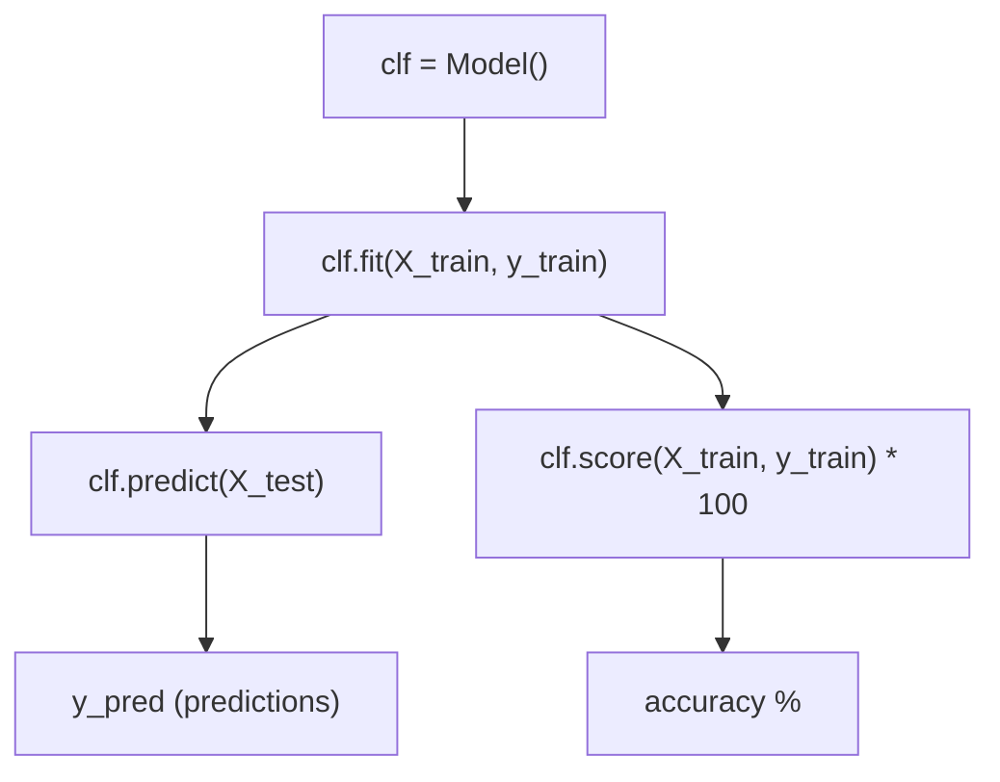

# المحاضرة 10 — Machine Learning Project (مشروع تعلم الآلة - Titanic)
> **المادة:** البرمجة المتقدمة 2 (القسم النظري) | **الموضوع:** مشروع كامل لتحليل بيانات Titanic وبناء نماذج تصنيف | **الدكتور:** Mohanad Rajab

---

## الجزء الأول: ملخص منظم (اقرأ قبل المحاضرة!)

### 📍 عن هذه المحاضرة
> هذه المحاضرة هي مشروع متكامل من الصفر إلى النهاية — تأخذ بيانات حقيقية (`Titanic`), تحللها، تهندس ميزاتها، ثم تبني نماذج `Machine Learning` للتنبؤ بمن نجا ومن لم ينجُ.

### 🎯 ستتعلم
- **قراءة وتقسيم البيانات** — كيف تفصل بيانات التدريب عن الاختبار وتفهم بنية `DataFrame`
- **تحليل البيانات (EDA)** — كيف تفهم العلاقات بين المتغيرات باستخدام `describe()`, `groupby()`, والرسوم البيانية
- **هندسة الميزات (Feature Engineering)** — كيف تحوّل بيانات خام (نصوص، قيم مفقودة، أعداد) إلى أرقام يفهمها النموذج
- **نشر النماذج (Model Deployment)** — كيف تجرّب عدة خوارزميات (`LogisticRegression`, `SVC`, `KNN`, `DecisionTree`) وتقارن دقتها
- **Pivot Tables والارتباط (Correlation)** — كيف تستخلص أنماطاً من البيانات بدون رسوم

### 📚 المتطلبات السابقة
- **`pandas` و `DataFrames`** — تحتاج تعرف `.head()`, `.describe()`, `.groupby()`, `.isnull()` لأن كل التحليل يعتمد عليها
- **`matplotlib` و `seaborn`** — تحتاجهم لرسم الـ `barplot` و `violinplot` و `heatmap`
- **`sklearn` أساسيات** — تحتاج تفهم `.fit()` و `.predict()` و `.score()` لأن كل النماذج تتبع نفس الواجهة

### 💡 الأفكار الرئيسية

المشروع ده فيه قصة واضحة — تخيّل إنك عندك بيانات 1309 راكب على سفينة غرقت، وعايز تفهم: مين اللي نجا ومين اللي ما نجاش؟ وهل تقدر تتنبأ بالنجاة بناءً على معلومات زي الجنس والعمر والدرجة؟

الخطوة الأولى دائماً هي فهم شكل البيانات — الـ `dataset` عنده 12 عمود: `PassengerId`, `Survived`, `Pclass`, `Name`, `Sex`, `Age`, `SibSp`, `Parch`, `Ticket`, `Fare`, `Cabin`, `Embarked`. البيانات الكاملة 1309 صف، بس نقسّمها: 891 للتدريب (`titanic_train`) و 418 للاختبار (`titanic_test`).

بعدين تجي مرحلة التحليل (الـ EDA — `Exploratory Data Analysis`). هنا تكتشف أشياء مثيرة جداً: النساء بيجوا بنسبة نجاة 74% مقابل 19% للرجال. ركاب الدرجة الأولى نجوا بنسبة 63% مقابل 24% للدرجة الثالثة. ده مش بس مثير للاهتمام تاريخياً — ده مفيد جداً للنموذج!

والحاجة الثانية اللي لازم تفهمها هي `Feature Engineering` — لأن البيانات الخام مش جاهزة للنموذج. عندك `Cabin` فيها 687 قيمة ناقصة من 891، وعندك `Age` فيها 177 ناقصة، وعندك `Ticket` نصوص غريبة زي `"STON/O2. 3101282"`. لازم تحوّل كل ده لأرقام — ازاي؟ بتستخرج `Title` من الاسم (`Mr`, `Mrs`, `Miss`...)، وبتقسّم العمر لشرائح (`AgeBand`)، وبتحسب حجم العيلة (`FamilySize = SibSp + Parch + 1`).

في النهاية بتجرّب نماذج مختلفة. النتائج بتقول إن `DecisionTree` وصل لـ 100% على التدريب (ده علامة `overfitting`!), و `SVC` وصل لـ 94.95%, و `LogisticRegression` وصل لـ 80.58%. الحكاية مش إيهو الأعلى على التدريب — الحكاية إيهو الأكثر تعميماً على بيانات جديدة.

### 🔗 كيف تتصل هذه المحاضرة بالمحاضرات الأخرى؟
- **السابقة:** المحاضرات السابقة علّمتك `pandas`, `seaborn`, وأساسيات `sklearn` ← الآن نطبّق كل ده في مشروع حقيقي متكامل
- **القادمة:** هذه المحاضرة تُعدّك لمفاهيم أعمق في `hyperparameter tuning`, `cross-validation`, و `ensemble methods`

### ⚠️ الأخطاء الشائعة الواجب تجنبها

#### الفهم الخاطئ ❌:
`DecisionTree` حقق 100% دقة على التدريب، إذن هو أفضل نموذج

#### الفهم الصحيح ✅:
100% على التدريب = `overfitting` — النموذج حفظ البيانات ولم يتعلّم. الأفضل دائماً هو النموذج اللي يؤدي أداء جيداً على **بيانات لم يرها من قبل** (test data).

#### الفهم الخاطئ ❌:
`clf.score(X_train, y_train)` بتقيس دقة النموذج على بيانات الاختبار

#### الفهم الصحيح ✅:
`clf.score(X_train, y_train)` بتقيس الدقة على **بيانات التدريب نفسها** — للحصول على دقة حقيقية استخدم `X_test` و `y_test` (لو عندك labels للـ test).

#### الفهم الخاطئ ❌:
تملأ القيم المفقودة في `Age` بالصفر لأنه أبسط

#### الفهم الصحيح ✅:
تملأها بقيم عشوائية في نطاق `[mean - std, mean + std]` — ده بيحافظ على التوزيع الإحصائي للبيانات ومش بيشوّه النموذج.

### لما تحتاج هذا في الامتحان
الامتحان ممكن يسألك عن: اكتب كود `groupby` لحساب نسبة النجاة حسب الجنس، اشرح لماذا نملأ `Age` بقيم عشوائية، ما الفرق بين `pd.cut()` و `pd.qcut()`، لماذا `DecisionTree` 100% مشكلة، اكتب كود تدريب نموذج `SVC` وقياس دقته. ركّز على `Feature Engineering` و `Model Deployment` — هما قلب المحاضرة.

---

## الجزء الثاني: الشرح التفصيلي (سطر بسطر / فقرة بفقرة)

---

### 1. مقدمة المشروع (Introduction)

<!-- @render: {type: "prose-first", visualization: "none", coverage: "100%"} -->
<!-- @connectivity: {prerequisite: "none"} -->

#### 💡 الفكرة الأساسية
**`Titanic` هو أشهر `dataset` في عالم `Machine Learning` — الهدف هو التنبؤ إذا كان الراكب نجا أم لا (تصنيف ثنائي: 0 = لم ينجُ، 1 = نجا).**

---

#### 📖 الشرح

مشروع `Titanic` هو `classification problem` — يعني النموذج لازم يخرج إجابة من اتنين: إما 0 (لم ينجُ) أو 1 (نجا). مش رقم مستمر زي السعر أو الدرجة — ده تصنيف محدد.

البيانات متاحة على `Kaggle` — منصة المسابقات في تعلم الآلة. الـ `dataset` الكامل فيه 1309 راكب، ومقسّم مسبقاً لـ `train` (891 راكب فيهم عمود `Survived` معروف) و `test` (418 راكب مش عارفين نجوا ولا لا — ده اللي نتنبأ به).

#### 💡 التشبيه:
> فكّر في الموضوع كأنك طبيب بيشخّص مرضى — عندك بيانات تاريخية عن مرضى قدامك (عمر، ضغط، أعراض) وتعرف مين اتعافى ومين لا. بتتعلّم من التاريخ وبعدين تشخّص حالات جديدة.
> **وجه الشبه:** المرضى القدامى = `titanic_train`، المرضى الجدد = `titanic_test`، التشخيص = قيمة `Survived`

#### 🎯 الملخص السريع
- المشروع = `binary classification` (0 أو 1)
- البيانات من `Kaggle`
- 891 للتدريب + 418 للاختبار

#### 📄 النص الأصلي من المحاضرة
<details>
<summary>عرض النص الأصلي (coverage: 100%)</summary>

**النص الأصلي يقول:**
> We are going to go through the popular Titanic dataset and try to predict whether a person survived the shipwreck. You can get this dataset from Kaggle. The Goal: Predict whether a passenger survived or not. 0 for not surviving, 1 for surviving.

**ملاحظة على التغطية:**
- ✓ تم شرح: الهدف، مصدر البيانات، ترميز 0/1
- ℹ️ إضافة من الدليل: تشبيه الطبيب، توضيح Binary Classification

</details>

---

### 2. قراءة البيانات وتقسيمها

<!-- @render: {type: "code-first", visualization: "none", coverage: "100%"} -->
<!-- @connectivity: {prerequisite: "section_1"} -->

#### 💡 الفكرة الأساسية
**البيانات الكاملة (1309 صف) مقسّمة لملفين: `titanic_train.csv` (891 صف) و `titanic_test.csv` (418 صف).**

---

#### 💻 الكود: قراءة البيانات وعرضها

```python
import pandas as pd
import numpy as np
import matplotlib.pyplot as plt
import seaborn as sns

# Load full dataset (both train+test merged)
tt = pd.read_csv('d:/datasets/titanic.csv')
tt  # display full dataframe

# Load train and test separately
titanic_train = pd.read_csv('d:/datasets/titanic_train.csv')
print(titanic_train.shape)       # shows (891, 12)
titanic_train.head(15)           # show first 15 rows

titanic_test = pd.read_csv('d:/datasets/titanic_test.csv')
print(titanic_test.shape)        # shows (418, 12)
titanic_test.tail(10)            # show last 10 rows
```

#### ملاحظات الأسطر المهمة:
- `pd.read_csv(path)` → يقرأ ملف `CSV` ويحوّله لـ `DataFrame` — الطريقة الأساسية لتحميل البيانات
- `.shape` → يرجع `tuple` من `(rows, columns)` — مهم جداً لتأكيد حجم البيانات
- `.head(15)` → أول 15 صف فقط — بيساعدك تفهم شكل البيانات بسرعة
- `.tail(10)` → آخر 10 صفوف — مفيد لتأكيد آخر الصفوف

---

#### 📊 المخطط: بنية الأعمدة الـ 12

#### ما هذا المخطط؟
> يوضّح 12 عمود الـ `dataset` وأنواعها وهل فيها قيم مفقودة أم لا.

| # | العمود | النوع | الوصف | قيم مفقودة في Train |
|---|--------|-------|-------|---------------------|
| 0 | `PassengerId` | `int64` | رقم تعريفي للراكب | لا |
| 1 | `Survived` | `int64` | 0=لم ينجُ، 1=نجا | لا |
| 2 | `Pclass` | `int64` | درجة التذكرة (1,2,3) | لا |
| 3 | `Name` | `object` | اسم الراكب كاملاً | لا |
| 4 | `Sex` | `object` | `male` أو `female` | لا |
| 5 | `Age` | `float64` | العمر | **177 ناقصة** |
| 6 | `SibSp` | `int64` | عدد الأشقاء/الزوج على السفينة | لا |
| 7 | `Parch` | `int64` | عدد الآباء/الأطفال على السفينة | لا |
| 8 | `Ticket` | `object` | رقم التذكرة | لا |
| 9 | `Fare` | `float64` | سعر التذكرة | لا |
| 10 | `Cabin` | `object` | رقم الكابينة | **687 ناقصة** |
| 11 | `Embarked` | `object` | ميناء الصعود (S/C/Q) | **2 ناقصة** |

---

#### 💻 الكود: فحص القيم المفقودة

```python
# Check null values in training data
titanic_train.isnull().sum()
```

**الناتج:**
```
PassengerId      0
Survived         0
Pclass           0
Name             0
Sex              0
Age            177   ← مشكلة كبيرة
SibSp            0
Parch            0
Ticket           0
Fare             0
Cabin          687   ← معظمها ناقص!
Embarked         2
```

#### ملاحظة:
> `Cabin` فيها 687 قيمة ناقصة من 891 — يعني 77% ناقصة! مش ممكن نستخدمها مباشرة. `Feature Engineering` هو الحل.

#### 🤔 تفعيل الفهم (اسأل نفسك):
> **سؤال:** لماذا `Age` فيها قيم مفقودة بينما `Pclass` لا؟
> **لماذا هذا مهم؟** لأن القيم المفقودة في عمود مهم كالعمر تؤثر على دقة النموذج — لازم تعرف كيف تتعامل معها قبل التدريب.

#### 🎯 الملخص السريع
- `titanic_train`: 891 × 12
- `titanic_test`: 418 × 12
- `Age`: 177 ناقصة، `Cabin`: 687 ناقصة، `Embarked`: 2 ناقصة

#### 📄 النص الأصلي من المحاضرة
<details>
<summary>عرض النص الأصلي (coverage: 100%)</summary>

**النص الأصلي يقول:**
> Dividing the Dataset to titanic_train (891 x 12) and titanic_test (418 x 12). titanic_train.isnull().sum() → Age: 177, Cabin: 687, Embarked: 2

**ملاحظة على التغطية:**
- ✓ تم شرح: التقسيم، القيم المفقودة لكل عمود
- ℹ️ إضافة من الدليل: جدول تفصيلي لكل عمود، لماذا Cabin مشكلة

</details>

---

### 3. تحليل البيانات الإحصائي

<!-- @render: {type: "equation-first", visualization: "none", coverage: "100%"} -->
<!-- @connectivity: {prerequisite: "section_2"} -->

#### 💡 الفكرة الأساسية
**دالة `describe()` تعطيك ملخصاً إحصائياً شاملاً — `count`, `mean`, `std`, `min`, percentiles, `max` — لكل عمود رقمي.**

---

#### 💻 الكود: الإحصاء الوصفي

```python
titanic_train.describe()          # numeric columns
titanic_train.describe(include=['O'])  # object (text) columns
```

**ناتج `describe()` للأعمدة الرقمية (train):**

| | `PassengerId` | `Survived` | `Pclass` | `Age` | `SibSp` | `Parch` | `Fare` |
|--|--|--|--|--|--|--|--|
| count | 891 | 891 | 891 | 714 | 891 | 891 | 891 |
| mean | 446 | 0.38 | 2.31 | 29.7 | 0.52 | 0.38 | 32.2 |
| std | 257.35 | 0.49 | 0.84 | 14.53 | 1.10 | 0.81 | 49.69 |
| min | 1 | 0 | 1 | 0.42 | 0 | 0 | 0 |
| 25% | 223.5 | 0 | 2 | 20.1 | 0 | 0 | 7.91 |
| 50% | 446 | 0 | 3 | 28 | 0 | 0 | 14.45 |
| 75% | 668.5 | 1 | 3 | 38 | 1 | 0 | 31.0 |
| max | 891 | 1 | 3 | 80 | 8 | 6 | 512.33 |

---

#### 📐 الصيغة: الانحراف المعياري (Standard Deviation)

$$
\sigma = \sqrt{\frac{\sum(x - \bar{x})^2}{n-1}}
$$

**الشرح:**
> $\bar{x}$ = المتوسط (mean)
> $x$ = كل قيمة فردية
> $n$ = عدد القيم
> $n-1$ بدل $n$ لأن ده الـ `sample std` مش الـ `population std`

#### 💡 التشبيه:
> الانحراف المعياري كأنه المسافة المتوسطة بين الطلاب وعلامة الفصل — إذا كل الطلاب حصلوا على نفس العلامة تقريباً، الـ `std` صغير (عمود مستقر). إذا كان فيه طلاب فاشلين وناجحين، الـ `std` كبير.
> **وجه الشبه:** `Fare` فيها `std` = 49.69 بينما `min` = 0 و `max` = 512 — ده يقول إن أسعار التذاكر كانت متباينة جداً!

---

#### 📖 الشرح: القراءة الذكية لـ describe()

**معنى `mean = 0.38` في `Survived`:** نسبة من نجوا = 38.4% (لأن `Survived` هو 0 أو 1، فالمتوسط = النسبة المئوية).

**معنى الـ Quartiles:**
الـ Quartiles بتحتاج البيانات تكون مرتّبة. لو عندنا 891 قيمة:
- `Q1 (25%)`: الوسيط بين أول قيمة وآخر قيمة في النصف الأول = `(1+446)/2 = 223.5`
- `Q2 (50%)`: الوسيط الكلي = `(1+891)/2 = 446`
- `Q3 (75%)`: الوسيط بين `Q2` و آخر قيمة = `(446+891)/2 = 668.5`

**ناتج `describe(include=['O'])` للأعمدة النصية (train):**

| | `Name` | `Sex` | `Ticket` | `Cabin` | `Embarked` |
|--|--|--|--|--|--|
| count | 891 | 891 | 891 | 204 | 889 |
| unique | 891 | 2 | 681 | 147 | 3 |
| top | Hickman... | male | 1601 | B96 B98 | S |
| freq | 1 | 577 | 7 | 4 | 644 |

**الملاحظات:**
- `Sex`: فقط 2 قيم فريدة، الأكثر تكراراً `male` (577 من 891)
- `Embarked`: 3 قيم (`S`, `C`, `Q`)، الأغلبية صعدوا من `S` (Southampton) = 644
- `Cabin`: 204 فقط غير ناقصة من 891، 147 قيمة فريدة

#### 🎯 الملخص السريع
- `describe()` = إحصاء رقمي سريع
- `mean` في `Survived` = نسبة النجاة
- `std` = مقياس التشتّت
- `describe(include=['O'])` = للأعمدة النصية

#### 📄 النص الأصلي من المحاضرة
<details>
<summary>عرض النص الأصلي (coverage: 100%)</summary>

**النص الأصلي يقول:**
> titanic_test.describe() — shows count, mean, std, min, 25%, 50%, 75%, max for each numeric column. For quartile must be sorted: Quartile-1 (1+446)/2 median=223.5, Quartile-2 (1+891)/2 median=446, Quartile-3 (446+891) median=668.5

**ملاحظة على التغطية:**
- ✓ تم شرح: كل الإحصاءات، شرح الـ Quartiles رياضياً، صيغة std
- ℹ️ إضافة من الدليل: تشبيه الطلاب، تفسير mean في Survived

</details>

---

### 4. تحليل العلاقة بين الميزات والنجاة

<!-- @render: {type: "code-first", visualization: "none", coverage: "100%"} -->
<!-- @connectivity: {prerequisite: "section_3"} -->

#### 📍 أين نحن الآن؟
انتهينا من الإحصاء الوصفي — الآن نبحث في **لماذا** نجا بعض الركاب وليس غيرهم.

#### 💡 الفكرة الأساسية
**`EDA` (Exploratory Data Analysis) تكشف الأنماط الخفية — الجنس، الدرجة، والعمر كلها تؤثر على النجاة.**

---

### 4.1. النجاة الإجمالية

<!-- @render: {type: "code-first", coverage: "100%"} -->

#### 💻 الكود: حساب نسب النجاة

```python
survived = titanic_train[titanic_train['Survived'] == 1]       # survived passengers
not_survived = titanic_train[titanic_train['Survived'] == 0]   # not survived

# Print counts and percentages
print("Survived: %i (%.1f%%)" % (len(survived), float(len(survived))/len(titanic_train)*100.0))
print("Not Survived: %i (%.1f%%)" % (len(not_survived), float(len(not_survived))/len(titanic_train)*100.0))
print("Total: %i" % len(titanic_train))
```

**الناتج:**
```
Survived: 342 (38.4%)
Not Survived: 549 (61.6%)
Total: 891
```

#### ملاحظة:
> 61.6% لم ينجوا — البيانات **غير متوازنة** (imbalanced). ده ممكن يأثر على النماذج.

---

### 4.2. الدرجة (Pclass) مقابل النجاة

<!-- @render: {type: "code-first", coverage: "100%"} -->

#### 💡 الفكرة الأساسية
**ركاب الدرجة الأولى نجوا بنسبة أعلى بكثير من الدرجة الثالثة — الثروة كانت عاملاً في النجاة.**

#### 💻 الكود

```python
# Count passengers per class
titanic_train.Pclass.value_counts()
# 3: 491, 1: 216, 2: 184

# Survival counts by class
titanic_train.groupby('Pclass').Survived.value_counts()
# Pclass 1: Survived=136, Not=80
# Pclass 2: Not=97, Survived=87
# Pclass 3: Not=372, Survived=119

# Survival rate bar chart
sns.barplot(x='Pclass', y='Survived', data=titanic_train)
```

#### 🔍 تتبع التنفيذ: حساب نسب النجاة يدوياً

**المدخل:** بيانات `Pclass` و `Survived`

| الدرجة | ناجون | إجمالي | نسبة النجاة |
|--------|-------|---------|------------|
| 1 | 136 | 216 | **63.0%** |
| 2 | 87 | 184 | **47.3%** |
| 3 | 119 | 491 | **24.2%** |

**النتيجة:** الدرجة الأولى = ضعف احتمال النجاة مقارنة بالثالثة

#### ملاحظة:
> الشرطة السوداء فوق كل بار في `sns.barplot` = **Confidence Interval (CI)**. شرطة قصيرة = البيانات مستقرة وثقة عالية، شرطة طويلة = تباين كبير وثقة منخفضة.

#### 📄 النص الأصلي من المحاضرة
<details>
<summary>عرض النص الأصلي (coverage: 100%)</summary>

**النص الأصلي يقول:**
> 136/216=62.96, 87/184=47.28, 119/491=24.23 — الشرطة قصيرة - البيانات مستقرة ودقيقة. Higher class passengers have better survival chance.

**ملاحظة على التغطية:**
- ✓ تم شرح: الأرقام، الحسابات، معنى الشرطة
- ℹ️ إضافة من الدليل: جدول النسب، شرح CI بالتفصيل

</details>

---

### 4.3. الجنس (Sex) مقابل النجاة

<!-- @render: {type: "code-first", coverage: "100%"} -->

#### 💡 الفكرة الأساسية
**النساء نجوا بنسبة 74% مقابل 19% للرجال — قاعدة "النساء والأطفال أولاً" تطبّقت فعلاً!**

#### 💻 الكود

```python
# Survival counts by sex
titanic_train.groupby('Sex').Survived.value_counts()
# female: Survived=233, Not=81
# male: Not=468, Survived=109

# Calculate survival RATE (mean works because Survived is 0/1)
titanic_train[['Sex', 'Survived']].groupby(['Sex'], as_index=False).mean()
# female: 0.742038
# male: 0.188908

sns.barplot(x='Sex', y='Survived', data=titanic_train)
```

#### 🤔 تفعيل الفهم (اسأل نفسك):
> **سؤال:** لماذا نستخدم `.mean()` لحساب نسبة النجاة بدلاً من `.count()`؟
> **لماذا هذا مهم؟** لأن `Survived` قيمه إما 0 أو 1 — المتوسط = مجموع القيم ÷ العدد = عدد الناجين ÷ الإجمالي = النسبة المئوية تلقائياً!

#### 💡 التشبيه:
> تخيّل إن عندك 10 طلاب، 7 نجحوا (1) و 3 رسبوا (0). المتوسط = (7×1 + 3×0) ÷ 10 = 0.7 = 70%. نفس الفكرة بالضبط.
> **وجه الشبه:** الـ `mean()` على عمود 0/1 = نسبة الـ 1s دائماً.

#### 📄 النص الأصلي من المحاضرة
<details>
<summary>عرض النص الأصلي (coverage: 100%)</summary>

**النص الأصلي يقول:**
> Females have better survival chance. female: Survived=0.742038, male: 0.188908. Because survived is (0,1), mean calculates percentage of survived in each group.

**ملاحظة على التغطية:**
- ✓ تم شرح: الأرقام، سبب استخدام mean، الرسم البياني
- ℹ️ إضافة من الدليل: مثال الطلاب، التشبيه

</details>

---

### 4.4. Pclass, Sex & Embarked مع العمر — الـ catplot

<!-- @render: {type: "code-first", coverage: "100%"} -->

#### 💡 الفكرة الأساسية
**`sns.catplot()` يرسم نقاط فردية لكل راكب مصنّفة حسب النجاة، يكشف أنماطاً أعمق من الـ `barplot`.**

#### 💻 الكود

```python
# Embarked vs Age vs Survived (scatter by survival color)
sns.catplot(x="Embarked", y="Age", hue="Survived", data=titanic_train)

# Pclass vs Age vs Survived
sns.catplot(x="Pclass", y="Age", hue="Survived", data=titanic_train)

# Sex vs Age vs Survived
sns.catplot(x="Sex", y="Age", hue="Survived", data=titanic_train)

# Complex 4-variable catplot
sns.catplot(x='Pclass', y='Survived', hue='Sex', col='Embarked', kind='bar', data=titanic_train)
```

#### ملاحظات الأسطر المهمة:
- `hue="Survived"` → يلوّن النقاط بناءً على قيمة `Survived` (0=أزرق، 1=برتقالي)
- `col='Embarked'` → يقسّم الرسم لـ 3 مخططات جانباً لبعض (واحد لكل ميناء)
- `kind='bar'` → يحوّل الـ `catplot` لـ `barplot` بدل `stripplot`

#### 🖼️ وصف الشاشة: ما تراه في الـ catplot المركّب
> **الشريحة:** رسم catplot رباعي المتغيرات
> يُظهر 3 مخططات أفقية (S, C, Q) — في كل منها: 3 مجموعات للـ `Pclass` (1,2,3) × عمودين لكل مجموعة (ذكور = أزرق، إناث = برتقالي). يتضح أن الإناث في كل الدرجات ومن كل المواني نجوا بنسبة أعلى بكثير.

**الاستنتاجات من الـ catplot:**
- تقريباً **كل الإناث من Pclass 1 و 2 نجوا**
- الإناث اللي ماتوا كانت معظمهم من **Pclass 3**
- الذكور من Pclass 1 لديهم نسبة نجاة **أعلى قليلاً فقط** من Pclass 2 و 3

#### 📄 النص الأصلي من المحاضرة
<details>
<summary>عرض النص الأصلي (coverage: 100%)</summary>

**النص الأصلي يقول:**
> Almost all females from Pclass 1 and 2 survived. Females dying were mostly from 3rd Pclass. Males from Pclass 1 only have slightly higher survival chance than Pclass 2 and 3.

**ملاحظة على التغطية:**
- ✓ تم شرح: كل الاستنتاجات، شرح hue و col و kind

</details>

---

### 4.5. ميناء الصعود (Embarked) مقابل النجاة

<!-- @render: {type: "code-first", coverage: "100%"} -->

#### 💻 الكود

```python
titanic_train[['Embarked', 'Survived']].groupby(['Embarked'], as_index=False).mean()
# C (Cherbourg): 0.553571
# Q (Queenstown): 0.389610
# S (Southampton): 0.336957

sns.barplot(x='Embarked', y='Survived', data=titanic_train)
```

**الاستنتاج:** من `C` (شيربورغ) عنده أعلى نسبة نجاة (55%) — ربما لأن ركاب شيربورغ كانوا أكثر في الدرجة الأولى.

#### 📄 النص الأصلي من المحاضرة
<details>
<summary>عرض النص الأصلي (coverage: 100%)</summary>

**النص الأصلي يقول:**
> Embarked vs. Survived — C: 0.553571, Q: 0.389610, S: 0.336957

**ملاحظة على التغطية:**
- ✓ تم شرح: القيم والاستنتاج

</details>

---

### 4.6. Parch مقابل النجاة

<!-- @render: {type: "code-first", coverage: "100%"} -->

#### 💻 الكود

```python
titanic_train[['Parch', 'Survived']].groupby(['Parch'], as_index=False).mean()
# Parch=0: 0.344, 1: 0.551, 2: 0.500, 3: 0.600, 4: 0.000, 5: 0.200, 6: 0.000

sns.barplot(x='Parch', y='Survived', ci=None, data=titanic_train)
```

**الاستنتاج:** من كان معه 1-3 آباء/أطفال كان لديه فرصة أفضل للنجاة. من كان لوحده (Parch=0) أو العائلات الكبيرة جداً (4,6) كانوا أسوأ حظاً.

---

### 4.7. العمر (Age) مقابل النجاة — Violin Plot

<!-- @render: {type: "code-first", coverage: "100%"} -->

#### 💡 الفكرة الأساسية
**`violinplot` يجمع بين `boxplot` و `KDE` (توزيع الكثافة) — يُظهر توزيع العمر للناجين مقابل غير الناجين.**

#### 💻 الكود

```python
fig = plt.figure(figsize=(15,5))
ax1 = fig.add_subplot(131)   # 1 row, 3 cols, position 1
ax2 = fig.add_subplot(132)   # position 2
ax3 = fig.add_subplot(133)   # position 3

# Three violin plots side by side
sns.violinplot(x="Embarked", y="Age", hue="Survived", data=titanic_train, split=True, ax=ax1)
sns.violinplot(x="Pclass", y="Age", hue="Survived", data=titanic_train, split=True, ax=ax2)
sns.violinplot(x="Sex", y="Age", hue="Survived", data=titanic_train, split=True, ax=ax3)
```

#### ملاحظات الأسطر المهمة:
- `fig.add_subplot(131)` → الرقم `131` = 1 صف، 3 أعمدة، الموضع 1
- `split=True` → يقسم الـ violin لنصفين (ناجو/لم ينجوا) في نفس الشكل
- `hue="Survived"` → يلوّن كل نصف بلون مختلف

**الاستنتاجات من Violin Plot (من المحاضرة):**

**من Pclass:**
- الدرجة الأولى فيها **أطفال أقل** مقارنة بالدرجتين الثانية والثالثة
- الدرجة الأولى فيها **كبار سن أكثر**
- تقريباً **كل أطفال Pclass 2 (0-10 سنوات) نجوا**
- معظم أطفال Pclass 3 نجوا
- **الصغار في Pclass 1** نجوا أكثر من الكبار

**من Sex:**
- معظم **الأطفال الذكور (0-14 سنة)** نجوا
- **الإناث من 18-40 سنة** لديهن فرصة نجاة أفضل

#### 📄 النص الأصلي من المحاضرة
<details>
<summary>عرض النص الأصلي (coverage: 100%)</summary>

**النص الأصلي يقول:**
> From Pclass violinplot: 1st Pclass has very few children compared to other two. 1st has more old people. Almost all children (0-10) of 2nd Pclass survived. Most children of 3rd Pclass survived. Younger people of 1st Pclass survived vs older ones. From Sex: Most male children (0-14) survived. Females 18-40 have better survival chance.

**ملاحظة على التغطية:**
- ✓ تم شرح: كل الاستنتاجات، شرح الكود بالتفصيل

</details>

---

### 4.8. خريطة الحرارة والارتباط (Heatmap & Correlation)

<!-- @render: {type: "equation-first", coverage: "100%"} -->

#### 💡 الفكرة الأساسية
**معامل ارتباط `Pearson` يقيس قوة العلاقة الخطية بين متغيرين — قيمته بين -1 و 1.**

---

#### 📐 الصيغة: Pearson Correlation Coefficient

$$
r = \frac{n(\sum xy) - (\sum x)(\sum y)}{\sqrt{[n\sum x^2 - (\sum x)^2][n\sum y^2 - (\sum y)^2]}}
$$

**الشرح:**
> $n$ = عدد القيم
> $x, y$ = المتغيران
> $r$ = معامل الارتباط (بين -1 و 1)

**تفسير القيم:**
| النطاق | التفسير |
|--------|---------|
| 0 – 0.39 | ارتباط ضعيف |
| 0.40 – 0.69 | ارتباط متوسط |
| 0.70 – 1.0 | ارتباط قوي |
| قيم سالبة | ارتباط عكسي |

---

#### 💻 الكود: Heatmap

```python
# Simple heatmap — numeric cols only
df_num = titanic_train[['Age', 'SibSp', 'Parch', 'Fare']]
sns.heatmap(df_num.corr())

# Full annotated heatmap
plt.figure(figsize=(15,6))
sns.heatmap(titanic_train.drop('PassengerId', axis=1).corr(),
            vmax=0.6,
            square=True,
            annot=True)    # show numbers inside cells
```

#### ملاحظات الأسطر المهمة:
- `.corr()` → تحسب مصفوفة الارتباط بين كل الأعمدة الرقمية تلقائياً
- `annot=True` → يكتب قيمة الارتباط داخل كل خلية
- `vmax=0.6` → يضبط الحد الأقصى لسلّم الألوان (مفيد للإبراز)
- `drop('PassengerId', axis=1)` → يحذف `PassengerId` لأنه مجرد رقم تعريفي بلا معنى إحصائي

**نتائج الارتباط مع `Survived`:**

| العمود | الارتباط مع Survived | التفسير |
|--------|---------------------|---------|
| `Pclass` | -0.34 | كلما ارتفعت الدرجة (3=الأسوأ)، قلّت فرصة النجاة |
| `Fare` | +0.26 | كلما زاد السعر، زادت فرصة النجاة |
| `Age` | -0.077 | ارتباط ضعيف جداً |
| `SibSp` | -0.035 | ضعيف جداً |
| `Parch` | +0.082 | ضعيف |

---

#### 🔍 مثال حساب r يدوياً (من المحاضرة)

**البيانات:**
| x | y | x² | y² | xy |
|---|---|----|----|----|
| 4 | 3 | 16 | 9 | 12 |
| 15 | 10 | 225 | 100 | 150 |
| 8 | 6 | 64 | 36 | 48 |
| 8 | 7 | 64 | 49 | 56 |
| 6 | 4 | 36 | 16 | 24 |
| **41** | **30** | **405** | **210** | **290** |

**الحساب:**
$$n = 5$$
$$n(\sum xy) - (\sum x)(\sum y) = 5 \times 290 - 41 \times 30 = 1450 - 1230 = 220$$
$$\sqrt{[5 \times 405 - 1681][5 \times 210 - 900]} = \sqrt{344 \times 150} = \sqrt{51600} \approx 227$$
$$r = \frac{220}{227} \approx 0.97 \quad \text{(ارتباط قوي جداً!)}$$

#### 🤔 تفعيل الفهم (اسأل نفسك):
> **سؤال:** من الـ heatmap، `SibSp` و `Parch` عندهم ارتباط = 0.41 مع بعض. ماذا يعني هذا؟
> **لماذا هذا مهم؟** يعني من عنده إخوة غالباً عنده أهل معه على السفينة — ده منطقي. لكن ارتباطهم مع `Survived` ضعيف، فمش مفيدين للنموذج بقدر `Sex` و `Pclass`.

#### 📄 النص الأصلي من المحاضرة
<details>
<summary>عرض النص الأصلي (coverage: 100%)</summary>

**النص الأصلي يقول:**
> Pearson correlation coefficient [-1,1]: [0-0.39, 0.40-0.69, 0.70-1.0]. Heatmap example: Survived vs Pclass=-0.34, Age=-0.077, SibSp=-0.035, Parch=0.082, Fare=0.26. Manual calculation example with r=0.97.

**ملاحظة على التغطية:**
- ✓ تم شرح: الصيغة، التفسير، الكود، الحساب اليدوي
- ℹ️ إضافة من الدليل: جدول التفسير، ملاحظات الكود

</details>

---

### 5. Pivot Tables (جداول المحاور)

<!-- @render: {type: "code-first", coverage: "100%"} -->

#### 📍 أين نحن الآن؟
بعد الرسوم البيانية — الآن نستخرج نفس الأنماط بشكل جدولي رقمي مع `pd.pivot_table()`.

#### 💡 الفكرة الأساسية
**`pivot_table` يلخّص البيانات كجداول متقاطعة — مثالي لمقارنة متغيرات متعددة في وقت واحد.**

---

#### 💻 الكود: Pivot Tables متنوعة

```python
# Mean of Age, Fare, Parch, SibSp grouped by Survived
pd.pivot_table(titanic_train,
               index="Survived",
               values=["Age", "SibSp", "Parch", "Fare"])
```

**الناتج:**

| Survived | Age | Fare | Parch | SibSp |
|----------|-----|------|-------|-------|
| 0 | 30.63 | 22.12 | 0.33 | 0.55 |
| 1 | 28.34 | 48.40 | 0.46 | 0.47 |

**الاستنتاجات الأربعة من المحاضرة:**
1. **Age:** متوسط عمر الناجين 28 — الأصغر سناً بقوا أفضل
2. **Fare:** الناجون دفعوا أكثر من ضعف السعر (48 مقابل 22) — الأغنياء نجوا أكثر
3. **Parch:** من كان معه آباء/أطفال نجا أكثر — ربما الآباء أنقذوا أطفالهم أولاً
4. **SibSp:** من كان طفلاً مع إخوة كانت فرصته أقل

```python
# Count per Pclass and Survived
print(pd.pivot_table(titanic_train,
                     index="Survived",
                     columns="Pclass",
                     values="Ticket",
                     aggfunc="count"))
# Survived 0: Pclass1=80, Pclass2=97, Pclass3=372
# Survived 1: Pclass1=136, Pclass2=87, Pclass3=119

# Count per Sex and Survived
print(pd.pivot_table(titanic_train,
                     index="Survived",
                     columns="Sex",
                     values="Ticket",
                     aggfunc="count"))
# Survived 0: female=81, male=468
# Survived 1: female=233, male=109

# Count per Embarked and Survived
print(pd.pivot_table(titanic_train,
                     index="Survived",
                     columns="Embarked",
                     values="Ticket",
                     aggfunc="count"))
# Survived 0: C=75, Q=47, S=427
# Survived 1: C=93, Q=30, S=217
```

**الاستنتاجات (من المحاضرة):**
1. **Pclass:** ركاب الدرجة الأولى نجوا بنسبة كبيرة رغم أنهم أقل عدداً — الأغنياء نجوا
2. **Sex:** معظم النساء نجوا، معظم الرجال ماتوا — "المرأة والأطفال أولاً" تطبّقت فعلاً
3. **Embarked:** شيربورغ (C) عنده أعلى نسبة نجاة — يبدو غير مهم جداً

#### ⚙️ الخطوات السريعة: بناء Pivot Table

```algorithm
1 | حدّد الـ index | index="Survived" | الصفوف تمثل قيم Survived (0 و 1)
2 | حدّد الأعمدة | columns="Pclass" | كل Pclass يصبح عمود
3 | حدّد القيمة | values="Ticket" | ما الذي تريد حسابه
4 | حدّد الدالة | aggfunc="count" | count=عدد، mean=متوسط
5 | اقرأ النتائج | -- | اقارن الصفوف 0 vs 1
```

#### 📄 النص الأصلي من المحاضرة
<details>
<summary>عرض النص الأصلي (coverage: 100%)</summary>

**النص الأصلي يقول:**
> pd.pivot_table — avg age of survivors is 28, people who paid higher fare rates were more likely to survive (double), parents saved kids (Parch), children with siblings had less chance. Pclass confirms rich survived. Sex: women and children first. Embarked: Cherbourg had higher chance.

**ملاحظة على التغطية:**
- ✓ تم شرح: الكود الكامل، كل الاستنتاجات الأربعة

</details>

---

### 6. هندسة الميزات (Feature Engineering)

<!-- @render: {type: "code-first", visualization: "none", coverage: "100%"} -->

#### 📍 أين نحن الآن؟
بعد الفهم والتحليل — الآن نحوّل البيانات الخام لشكل يفهمه النموذج.

#### ⬅️ الربط مع السابق
في القسم السابق اكتشفنا أن `Ticket` و `Cabin` صعب استخدامهم مباشرة — الآن نهندس ميزات منهم.

#### 💡 الفكرة الأساسية
**`Feature Engineering` = تحويل بيانات خام (نصوص، قيم ناقصة، أرقام خام) إلى ميزات رقمية مفيدة للنموذج.**

---

#### ⚙️ الخطوات السريعة: خطوات Feature Engineering في المحاضرة

```algorithm
1 | حذف الـ nulls في Embarked | .dropna() | يحذف 2 صفوف فقط
2 | استخراج cabin_multiple | lambda + len(split) | عدد الكابينات لكل راكب
3 | استخراج cabin_adv | lambda + str[0] | الحرف الأول من رقم الكابينة
4 | استخراج numeric_ticket | lambda + isnumeric() | هل التذكرة رقمية (0 أو 1)
5 | استخراج ticket_letters | lambda + join + lower | الحروف في رقم التذكرة
6 | استخراج name_title | lambda + split(',')[1].split('.')[0].strip() | اللقب (Mr, Mrs...)
7 | استخراج Title | str.extract regex | تنقية الألقاب ودمجها
8 | تحويل Title لأرقام | map({Mr:1, Miss:2, Mrs:3, Master:4, Other:5}) | أرقام للنموذج
9 | تحويل Sex لأرقام | map({female:1, male:0}) | إزالة النصوص
10 | ملء Embarked الناقص | fillna('S') | S = الأكثر شيوعاً
11 | تحويل Embarked لأرقام | map({S:0, C:1, Q:2}) | أرقام للنموذج
12 | ملء Age الناقص | random in [mean±std] | يحافظ على التوزيع
13 | تصنيف Age لشرائح | pd.cut(5 bins) → 0,1,2,3,4 | AgeBand
14 | ملء Fare الناقص | fillna(median) | القيمة المتوسطة
15 | تصنيف Fare لشرائح | pd.qcut(4 bins) → 0,1,2,3 | FareBand
16 | حساب FamilySize | SibSp + Parch + 1 | حجم العيلة
17 | حساب IsAlone | FamilySize==1 → 1, else 0 | هل مسافر لوحده؟
18 | حذف الأعمدة الزائدة | drop() | إزالة Name, Ticket, Cabin, AgeBand, FareBand...
```

---

### 6.1. تحويلات الـ Cabin

<!-- @render: {type: "code-first", coverage: "100%"} -->

#### 💻 الكود: cabin_multiple — عدد الكابينات

```python
# Print sample cabin values
print(titanic_train.Cabin[0])    # nan
print(titanic_train.Cabin[1])    # C85
print(titanic_train.Cabin[27])   # C23 C25 C27  ← multiple!
print(titanic_train.Cabin[75])   # F G73
print(titanic_train.Cabin[311])  # B57 B59 B63 B66

# Count number of cabins (0 if null, else count spaces+1)
titanic_train['cabin_multiple'] = titanic_train.Cabin.apply(
    lambda x: 0 if pd.isna(x) else len(x.split(' '))
)
titanic_train['cabin_multiple'].value_counts()
# 0: 687 (null → 0)
# 1: 180 (single cabin)
# 2: 16, 3: 6, 4: 2
```

#### ملاحظات الأسطر المهمة:
- `pd.isna(x)` → يرجع `True` إذا كانت القيمة ناقصة (`NaN`)
- `x.split(' ')` → يقسم النص عند كل مسافة — `"C23 C25 C27".split(' ')` = `['C23', 'C25', 'C27']`
- `len(...)` → طول القائمة = عدد الكابينات

---

#### 💻 الكود: cabin_adv — الحرف الأول من الكابينة

```python
# Extract first character of cabin (deck letter)
titanic_train['cabin_adv'] = titanic_train.Cabin.apply(lambda x: str(x)[0])
titanic_train['cabin_adv'].value_counts()
# n (nan→'n'): 687, C: 59, B: 47, D: 33, E: 32, A: 15, F: 13, G: 4, T: 1
```

#### ملاحظة:
> `str(nan)[0]` = `'n'` — الحرف الأول من كلمة `'nan'` هو `'n'`! لذلك 687 راكب بدون كابينة معروفة يصبحون `'n'`.

#### 🔄 قبل / بعد: تحويل Cabin

**قبل:**
```python
titanic_train.Cabin[27]
# C23 C25 C27
```

**بعد:**
```python
titanic_train.cabin_multiple[27]  # 3 (three cabins)
titanic_train.cabin_adv[27]       # 'C' (deck C)
```

**ماذا تغيّر؟** حوّلنا نص غير منظّم لعددين رقميين يستطيع النموذج فهمهما.

#### 📄 النص الأصلي من المحاضرة
<details>
<summary>عرض النص الأصلي (coverage: 100%)</summary>

**النص الأصلي يقول:**
> Transformers — cabin_multiple: 0 if pd.isna(x) else len(x.split(' ')). cabin_adv: str(x)[0]. Pivot table shows cabin_multiple vs Survived.

**ملاحظة على التغطية:**
- ✓ تم شرح: الكودين، الأرقام، الاستنتاج

</details>

---

### 6.2. تحويلات الـ Ticket

<!-- @render: {type: "code-first", coverage: "100%"} -->

#### 💻 الكود: numeric_ticket و ticket_letters

```python
# Is the ticket purely numeric? (1=yes, 0=no)
titanic_train['numeric_ticket'] = titanic_train.Ticket.apply(
    lambda x: 1 if x.isnumeric() else 0
)

# Extract letter prefix from ticket (lowercase, no dots/slashes)
titanic_train['ticket_letters'] = titanic_train.Ticket.apply(
    lambda x: ''.join(x.split(' ')[:-1])        # join all parts except last
              .replace('.', '')                  # remove dots
              .replace('/', '')                  # remove slashes
              .lower()                           # lowercase
              if len(x.split(' ')[:-1]) > 0      # only if has prefix
              else 0                             # else 0
)
```

#### ملاحظات الأسطر المهمة:
- `x.isnumeric()` → `True` فقط إذا كل الحروف أرقام — `"113803".isnumeric()` = `True`، `"A/5 21171".isnumeric()` = `False`
- `x.split(' ')[:-1]` → كل الكلمات ما عدا الأخيرة — `"A/5 21171".split(' ')` = `['A/5', '21171']`، `[:-1]` = `['A/5']`
- `.replace('.','').replace('/','')` → تنظيف الرموز من `"STON/O2."` → `"STONO2"`

**نتيجة على بعض القيم:**

| `Ticket` الأصلية | `numeric_ticket` | `ticket_letters` |
|-----------------|-----------------|-----------------|
| `A/5 21171` | 0 | `a5` |
| `PC 17599` | 0 | `pc` |
| `STON/O2. 3101282` | 0 | `stono2` |
| `113803` | 1 | 0 |
| `373450` | 1 | 0 |

#### 📄 النص الأصلي من المحاضرة
<details>
<summary>عرض النص الأصلي (coverage: 100%)</summary>

**النص الأصلي يقول:**
> numeric_ticket = lambda x: 1 if x.isnumeric() else 0. ticket_letters = join all parts except last, remove dots/slashes, lowercase.

**ملاحظة على التغطية:**
- ✓ تم شرح: الكود كاملاً، التفسير، جدول الأمثلة

</details>

---

### 6.3. استخراج اللقب من الاسم (Title)

<!-- @render: {type: "code-first", coverage: "100%"} -->

#### 💡 الفكرة الأساسية
**اسم الراكب يحتوي على لقب (`Mr`, `Mrs`, `Miss`, `Master`) — هذا اللقب مفيد جداً لأنه يحدد الجنس والعمر تقريباً.**

#### 💻 الكود: الطريقة الأولى (name_title بسيطة)

```python
# Extract title from name — name format: "Last, Title. First"
titanic_train['name_title'] = titanic_train.Name.apply(
    lambda x: x.split(',')[1]    # get part after comma
               .split('.')[0]    # get part before first dot
               .strip()          # remove spaces
)
titanic_train['name_title'].value_counts()
# Mr: 517, Miss: 182, Mrs: 125, Master: 40, Dr: 7, Rev: 6, ...
```

#### 💻 الكود: الطريقة المتقدمة (Title مع regex)

```python
# Combine train and test for consistent processing
titanic_combined_data = [titanic_train, titanic_test]

for dataset in titanic_combined_data:
    # Extract title using regex — matches word(s) followed by a dot
    dataset['Title'] = dataset.Name.str.extract(' ([A-Za-z]+)\.')

for dataset in titanic_combined_data:
    # Group rare titles into 'Other'
    dataset['Title'] = dataset['Title'].replace(
        ['Lady', 'Countess', 'Capt', 'Col', 'Don', 'Dr',
         'Major', 'Rev', 'Sir', 'Jonkheer', 'Dona'], 'Other'
    )
    # Standardize equivalent titles
    dataset['Title'] = dataset['Title'].replace('Mlle', 'Miss')  # French for Miss
    dataset['Title'] = dataset['Title'].replace('Ms', 'Miss')
    dataset['Title'] = dataset['Title'].replace('Mme', 'Mrs')    # French for Mrs
```

#### ملاحظات الأسطر المهمة:
- `str.extract(' ([A-Za-z]+)\.')` → `regex`: ابحث عن مسافة ثم حروف ثم نقطة — يستخرج الكلمة بين المسافة والنقطة
- `[A-Za-z]+` → مجموعة أي حروف إنجليزية (كبيرة أو صغيرة) واحدة أو أكثر
- المجموعة `(..)` تعني الجزء الذي نريد استخراجه
- `'Mlle' → 'Miss'` لأن `Mlle` هو `Mademoiselle` بالفرنسية = نفس `Miss`

**نسب النجاة حسب اللقب:**

| Title | نسبة النجاة |
|-------|------------|
| Mrs | 79.4% |
| Miss | 70.3% |
| Master | 57.5% |
| Other | 34.8% |
| Mr | 15.7% |

#### 💻 الكود: تحويل Title لأرقام

```python
# Map title strings to numbers
title_mapping = {"Mr": 1, "Miss": 2, "Mrs": 3, "Master": 4, "Other": 5}

for dataset in titanic_combined_data:
    dataset['Title'] = dataset['Title'].map(title_mapping)
    dataset['Title'] = dataset['Title'].fillna(0)   # fill unmapped with 0
```

#### 📄 النص الأصلي من المحاضرة
<details>
<summary>عرض النص الأصلي (coverage: 100%)</summary>

**النص الأصلي يقول:**
> name_title = lambda x: x.split(',')[1].split('.')[0].strip(). Full Title extraction with regex and grouping rare titles. Survival by title: Master=0.575, Miss=0.703, Mr=0.157, Mrs=0.794, Other=0.348. Map to {Mr:1, Miss:2, Mrs:3, Master:4, Other:5}.

**ملاحظة على التغطية:**
- ✓ تم شرح: كلا الطريقتين، الـ regex، الأرقام، جدول النجاة

</details>

---

### 6.4. تحويل الجنس والميناء لأرقام

<!-- @render: {type: "code-first", coverage: "100%"} -->

#### 💻 الكود

```python
# Convert Sex to numeric: female=1, male=0
for dataset in titanic_combined_data:
    dataset['Sex'] = dataset['Sex'].map({'female': 1, 'male': 0}).astype(int)

# Check Embarked values
titanic_train.Embarked.unique()   # ['S', 'C', 'Q', nan]
titanic_train.Embarked.value_counts()   # S: 644, C: 168, Q: 77

# Fill missing Embarked with most common (S)
for dataset in titanic_combined_data:
    dataset['Embarked'] = dataset['Embarked'].fillna('S')

# Convert Embarked to numeric
for dataset in titanic_combined_data:
    dataset['Embarked'] = dataset['Embarked'].map({'S': 0, 'C': 1, 'Q': 2}).astype(int)
```

#### ملاحظات الأسطر المهمة:
- `.map({'female': 1, 'male': 0})` → يبدّل كل نص بالرقم المقابل
- `.astype(int)` → يضمن أن النوع `int64` وليس `float`
- `fillna('S')` → يملأ الـ 2 قيم الناقصة بـ `S` (الأكثر شيوعاً = 644 راكب)
- الترميز: `S=0`, `C=1`, `Q=2` (ترتيب تعسفي — ما في أفضلية)

#### 📄 النص الأصلي من المحاضرة
<details>
<summary>عرض النص الأصلي (coverage: 100%)</summary>

**النص الأصلي يقول:**
> Sex map {female:1, male:0}. Embarked unique: S, C, Q, nan. value_counts: S=644, C=168, Q=77. fillna('S'). map {S:0, C:1, Q:2}.

**ملاحظة على التغطية:**
- ✓ تم شرح: كل التحويلات، سبب S للملء

</details>

---

### 6.5. ملء القيم المفقودة في العمر (Age)

<!-- @render: {type: "code-first", coverage: "100%"} -->

#### 💡 الفكرة الأساسية
**بدلاً من ملء 177 قيمة ناقصة بالمتوسط (يشوّه التوزيع)، نملأها بأرقام عشوائية في نطاق [mean - std, mean + std].**

#### 💻 الكود

```python
import sys

for dataset in titanic_combined_data:
    age_avg = dataset['Age'].mean()             # average age
    age_std = dataset['Age'].std()              # standard deviation
    age_null_count = dataset['Age'].isnull().sum()  # how many missing

    # Generate random integers in [mean-std, mean+std]
    age_null_random_list = np.random.randint(
        age_avg - age_std,       # lower bound ≈ 15
        age_avg + age_std,       # upper bound ≈ 45
        size=age_null_count      # number of values needed
    )
    # Fill missing values
    dataset['Age'][np.isnan(dataset['Age'])] = age_null_random_list
    dataset['Age'] = dataset['Age'].astype(int)  # convert to integer

print(age_avg)         # 30.27
print(age_null_count)  # 86 (in test) or 177 (in train)
```

#### ملاحظات الأسطر المهمة:
- `np.random.randint(low, high, size)` → يولّد `size` عدد من الأعداد الصحيحة العشوائية بين `low` و `high`
- `np.isnan(dataset['Age'])` → `mask` بوليانية — `True` حيث يوجد `NaN`
- `dataset['Age'][mask] = list` → يضع القيم العشوائية محل الـ `NaN` فقط

#### مهم للامتحان ⚠️:
> لماذا نملأ بقيم عشوائية في [mean±std] بدل المتوسط فقط؟ لأن ملء كل القيم الناقصة بالمتوسط يخلق **"spike" مصطنع** عند المتوسط في التوزيع — يشوّه إحصاءات البيانات. القيم العشوائية في النطاق تحافظ على التوزيع الطبيعي.

---

### 6.6. تصنيف العمر والسعر لشرائح (AgeBand & FareBand)

<!-- @render: {type: "code-first", coverage: "100%"} -->

#### 💡 الفكرة الأساسية
**بدلاً من العمر كرقم مستمر (0-80)، نقسّمه لـ 5 شرائح (0,1,2,3,4) — ده بيقلّل الضوضاء ويساعد النموذج.**

#### 💻 الكود: AgeBand

```python
# Cut Age into 5 equal-width bins
titanic_train['AgeBand'] = pd.cut(titanic_train['Age'], 5)

# Show survival rate by age band
print(titanic_train[['AgeBand', 'Survived']].groupby(['AgeBand'], as_index=False).mean())
# (-0.08, 16.0]:  0.526  → age 0-16
# (16.0, 32.0]:   0.352  → age 16-32
# (32.0, 48.0]:   0.372  → age 32-48
# (48.0, 64.0]:   0.435  → age 48-64
# (64.0, 80.0]:   0.091  → age 64-80

# Map bands to integers 0-4
for dataset in titanic_combined_data:
    dataset.loc[dataset['Age'] <= 16, 'Age'] = 0
    dataset.loc[(dataset['Age'] > 16) & (dataset['Age'] <= 32), 'Age'] = 1
    dataset.loc[(dataset['Age'] > 32) & (dataset['Age'] <= 48), 'Age'] = 2
    dataset.loc[(dataset['Age'] > 48) & (dataset['Age'] <= 64), 'Age'] = 3
    dataset.loc[dataset['Age'] > 64, 'Age'] = 4
```

#### ملاحظات الأسطر المهمة:
- `pd.cut(col, 5)` → يقسم إلى 5 فترات **متساوية العرض** (كل فترة 16 سنة تقريباً)
- `dataset.loc[condition, 'Age'] = value` → يضع القيمة فقط حيث الشرط = `True`
- الشرط المركب: `(dataset['Age'] > 16) & (dataset['Age'] <= 32)` → الـ `&` للـ "AND" بين شرطين

**الفرق بين pd.cut و pd.qcut:**

| المعيار | `pd.cut()` | `pd.qcut()` |
|---------|-----------|------------|
| التقسيم | فترات متساوية العرض | فترات متساوية العدد |
| مناسب لـ | توزيع منتظم | توزيع متحيز |
| مثال | Ages: 0-16, 16-32, 32-48 | كل ربع يحوي 25% من البيانات |

---

#### 💻 الكود: FareBand

```python
# Fill missing Fare with median
for dataset in titanic_combined_data:
    dataset['Fare'] = dataset['Fare'].fillna(titanic_train['Fare'].median())

# Cut Fare into 4 equal-count bins (quantile)
titanic_train['FareBand'] = pd.qcut(titanic_train['Fare'], 4)

print(titanic_train[['FareBand', 'Survived']].groupby(['FareBand'], as_index=False).mean())
# (-0.001, 7.91]:  0.197  → cheapest fares
# (7.91, 14.454]:  0.304
# (14.454, 31.0]:  0.455
# (31.0, 512.329]: 0.581  → most expensive → highest survival!

# Map to integers 0-3
for dataset in titanic_combined_data:
    dataset.loc[dataset['Fare'] <= 7.91, 'Fare'] = 0
    dataset.loc[(dataset['Fare'] > 7.91) & (dataset['Fare'] <= 14.454), 'Fare'] = 1
    dataset.loc[(dataset['Fare'] > 14.454) & (dataset['Fare'] <= 31), 'Fare'] = 2
    dataset.loc[dataset['Fare'] > 31, 'Fare'] = 3
    dataset['Fare'] = dataset['Fare'].astype(int)
```

#### ملاحظة:
> لماذا `pd.qcut` للـ `Fare` بدل `pd.cut`؟ لأن `Fare` موزّع بشكل منحرف جداً (معظم الركاب دفعوا سعراً رخيصاً وقليل دفعوا أسعاراً عالية جداً) — `pd.qcut` يضمن أن كل ربع يحوي نفس عدد الركاب تقريباً.

#### 📄 النص الأصلي من المحاضرة
<details>
<summary>عرض النص الأصلي (coverage: 100%)</summary>

**النص الأصلي يقول:**
> pd.cut(titanic_train['Age'], 5) → 5 bins. map to 0-4 with dataset.loc. Fare: fillna(median), pd.qcut(4 bins), map to 0-3.

**ملاحظة على التغطية:**
- ✓ تم شرح: كلا الكودين، الفرق pd.cut/pd.qcut، جداول النتائج

</details>

---

### 6.7. حجم العيلة (FamilySize) و هل مسافر لوحده (IsAlone)

<!-- @render: {type: "code-first", coverage: "100%"} -->

#### 💡 الفكرة الأساسية
**`FamilySize = SibSp + Parch + 1` (1 للراكب نفسه) — ميزة مشتقة تجمع معلومتين في واحدة.**

#### 💻 الكود

```python
for dataset in titanic_combined_data:
    dataset['FamilySize'] = dataset['SibSp'] + dataset['Parch'] + 1  # +1 for self

# Survival rate by family size
print(titanic_train[['FamilySize', 'Survived']].groupby(['FamilySize'], as_index=False).mean())
# 1 (alone):   0.304
# 2:           0.553
# 3:           0.578
# 4:           0.724  ← best!
# 5:           0.200
# 6:           0.136
# 7:           0.333
# 8:           0.000
# 11:          0.000

for dataset in titanic_combined_data:
    dataset['IsAlone'] = 0                                              # default: not alone
    dataset.loc[dataset['FamilySize'] == 1, 'IsAlone'] = 1             # alone if family=1

# Survival by IsAlone
print(titanic_train[['IsAlone', 'Survived']].groupby(['IsAlone'], as_index=False).mean())
# Not Alone (0): 0.506
# Alone (1):     0.304
```

#### ملاحظات الأسطر المهمة:
- `+1` في `FamilySize` = نحسب الراكب نفسه ضمن عيلته
- العيلات المثالية = حجم 4 (72% نجاة) — كبيرة كفاية للمساعدة، صغيرة كفاية للتنسيق
- العيلات الكبيرة جداً (8, 11) = 0% نجاة! صعب تنسيق كل ده في حالة طوارئ

#### 💡 التشبيه:
> مسافر لوحده زي شخص بيواجه كارثة بدون أهل — مش عنده أحد يساعده أو يحميه. العيلات الصغيرة (2-4) كانت الأفضل لأن الأب مثلاً يقدر يحمي أطفاله ويوصّلهم للقوارب بسرعة.
> **وجه الشبه:** `IsAlone = 1` = الراكب المنفرد الذي ليس له من يهتم به

#### 📄 النص الأصلي من المحاضرة
<details>
<summary>عرض النص الأصلي (coverage: 100%)</summary>

**النص الأصلي يقول:**
> FamilySize = SibSp + Parch + 1. Survival rates: 1=0.304, 2=0.553, 3=0.578, 4=0.724, etc. IsAlone=0 if FamilySize!=1 else 1. Not Alone: 0.506, Alone: 0.304.

**ملاحظة على التغطية:**
- ✓ تم شرح: الكود، الأرقام، التفسير

</details>

---

### 6.8. حذف الأعمدة غير الضرورية وتحضير X, y

<!-- @render: {type: "code-first", coverage: "100%"} -->

#### 💻 الكود: حذف الميزات غير المفيدة

```python
# Drop raw features that are now encoded or irrelevant
features_drop1 = ['Name', 'SibSp', 'Parch', 'Ticket', 'Cabin', 'FamilySize']
features_drop2 = ['cabin_multiple', 'cabin_adv', 'numeric_ticket', 'ticket_letters', 'name_title']

titanic_train = titanic_train.drop(features_drop1, axis=1)
titanic_train = titanic_train.drop(features_drop2, axis=1)

titanic_test = titanic_test.drop(features_drop1, axis=1)

# Drop temporary band columns
titanic_train = titanic_train.drop(['AgeBand', 'FareBand'], axis=1)

titanic_train.head()
# PassengerId | Survived | Pclass | Sex | Age | Fare | Embarked | Title | IsAlone
#      1      |     0    |   3    |  0  |  1  |  0   |    0     |   1   |   0
```

#### 💻 الكود: تحضير X و y للتدريب

```python
# Split features and target
X_train = titanic_train.drop('Survived', axis=1)   # all columns except target
y_train = titanic_train['Survived']                  # target column only

X_test = titanic_test.drop("Survived", axis=1).copy()  # test features

print(X_train.shape, y_train.shape, X_test.shape)
# ((891, 8), (891,), (418, 8))
```

#### ملاحظات الأسطر المهمة:
- `drop('Survived', axis=1)` → `axis=1` يعني عمود (لا صف) — يحذف عمود `Survived` من الأعمدة
- `y_train = titanic_train['Survived']` → الـ target فقط (ما نريد التنبؤ به)
- `.copy()` → ضروري لـ `X_test` لتجنب `SettingWithCopyWarning`

**الشكل النهائي للبيانات:**

| | `PassengerId` | `Pclass` | `Sex` | `Age` | `Fare` | `Embarked` | `Title` | `IsAlone` |
|--|--|--|--|--|--|--|--|--|
| كل قيمة | رقم | 1,2,3 | 0,1 | 0,1,2,3,4 | 0,1,2,3 | 0,1,2 | 1,2,3,4,5 | 0,1 |
| نوع | `int64` | `int64` | `int32` | `int32` | `int32` | `int32` | `int64` | `int64` |

#### 🤔 تفعيل الفهم (اسأل نفسك):
> **سؤال:** لماذا نحذف `FamilySize` رغم أننا حسبناها؟
> **لماذا هذا مهم؟** لأنها تحتوي نفس المعلومات الموجودة في `SibSp` + `Parch` + `IsAlone` — أخذنا منها `IsAlone` الذي هو أفضل تمثيل، وحذفنا `SibSp` و `Parch` و `FamilySize` لتجنب الـ redundancy.

#### 📄 النص الأصلي من المحاضرة
<details>
<summary>عرض النص الأصلي (coverage: 100%)</summary>

**النص الأصلي يقول:**
> features_drop1=['Name','SibSp','Parch','Ticket','Cabin','FamilySize'], features_drop2=[...]. X_train=(891,8), y_train=(891,), X_test=(418,8).

**ملاحظة على التغطية:**
- ✓ تم شرح: كل الكود، الجدول النهائي، سبب الحذف

</details>

---

### 7. نشر النماذج (Model Deployment)

<!-- @render: {type: "code-first", visualization: "none", coverage: "100%"} -->

#### 📍 أين نحن الآن؟
بعد تحضير البيانات — الآن نُدرّب عدة نماذج ونقارن دقتها.

#### ⬅️ الربط مع السابق
`X_train`, `y_train`, `X_test` جاهزة — كل النماذج تستخدم نفس الواجهة: `.fit()` للتدريب، `.predict()` للتنبؤ، `.score()` للدقة.

#### 💡 الفكرة الأساسية
**كل نماذج `sklearn` تتبع نفس الـ API — فقط الخوارزمية تختلف، بقية الكود ثابت.**

---

#### 📊 المخطط: دورة تدريب النموذج

#### ما هذا المخطط؟
> يوضّح الخطوات المتكررة لكل نموذج.

| # | المرحلة | الدخل | الخرج | الملاحظات |
|---|---------|-------|-------|-----------|
| 1 | إنشاء النموذج | params | object | `clf = ModelName()` |
| 2 | التدريب | X_train, y_train | trained model | `clf.fit()` |
| 3 | التنبؤ | X_test | predictions array | `clf.predict()` |
| 4 | قياس الدقة | X_train, y_train | float (0-100) | `clf.score() * 100` |



---

#### 💻 الكود: استيراد النماذج

```python
from sklearn.linear_model import LogisticRegression
from sklearn.svm import SVC, LinearSVC
from sklearn.neighbors import KNeighborsClassifier
from sklearn.tree import DecisionTreeClassifier
from sklearn.ensemble import RandomForestClassifier
from sklearn.naive_bayes import GaussianNB
from sklearn.linear_model import Perceptron
from sklearn.linear_model import SGDClassifier
```

---

#### 💻 الكود: Logistic Regression

```python
clf = LogisticRegression()
clf.fit(X_train, y_train)                                      # train
y_pred_log_reg = clf.predict(X_test)                           # predict on test
acc_log_reg = round(clf.score(X_train, y_train) * 100, 2)     # accuracy on TRAIN
print(str(acc_log_reg) + ' percent')
# 80.58 percent
```

---

#### 💻 الكود: SVC و LinearSVC و KNN

```python
# SVC (Support Vector Classifier with kernel)
clf = SVC()
clf.fit(X_train, y_train)
y_pred_svc = clf.predict(X_test)
acc_svc = round(clf.score(X_train, y_train) * 100, 2)
print(acc_svc)   # 94.95

# LinearSVC (Linear kernel)
clf = LinearSVC()
clf.fit(X_train, y_train)
y_pred_linear_svc = clf.predict(X_test)
acc_linear_svc = round(clf.score(X_train, y_train) * 100, 2)
print(acc_linear_svc)   # 80.81

# K Nearest Neighbors
clf = KNeighborsClassifier(n_neighbors=3)   # use 3 nearest neighbors
clf.fit(X_train, y_train)
y_pred_knn = clf.predict(X_test)
acc_knn = round(clf.score(X_train, y_train) * 100, 2)
print(acc_knn)   # 79.57
```

---

#### 💻 الكود: Decision Tree و GaussianNB و Perceptron

```python
# Decision Tree
clf = DecisionTreeClassifier()
clf.fit(X_train, y_train)
y_pred_decision_tree = clf.predict(X_test)
acc_decision_tree = round(clf.score(X_train, y_train) * 100, 2)
print(acc_decision_tree)   # 100.0  ← OVERFITTING!

# Gaussian Naive Bayes
clf = GaussianNB()
clf.fit(X_train, y_train)
y_pred_gnb = clf.predict(X_test)
acc_gnb = round(clf.score(X_train, y_train) * 100, 2)
print(acc_gnb)   # 77.78

# Perceptron
clf = Perceptron(max_iter=5, tol=None)
clf.fit(X_train, y_train)
y_pred_perceptron = clf.predict(X_test)
acc_perceptron = round(clf.score(X_train, y_train) * 100, 2)
print(acc_perceptron)   # 61.95
```

---

#### ⚖️ مقارنة سريعة: النماذج المُختبَرة

| النموذج | الدقة على Train | الملاحظة |
|---------|----------------|---------|
| `DecisionTreeClassifier` | **100.0%** | ⚠️ Overfitting |
| `SVC` | **94.95%** | ✅ أفضل (تعقيد عالٍ، ممتاز لبيانات صغيرة) |
| `LinearSVC` | **80.81%** | جيد |
| `LogisticRegression` | **80.58%** | جيد وسريع |
| `KNeighborsClassifier(3)` | **79.57%** | مقبول |
| `GaussianNB` | **77.78%** | ضعيف نسبياً |
| `Perceptron` | **61.95%** | الأضعف |

#### مهم للامتحان ⚠️:
> `clf.score(X_train, y_train)` تقيس الدقة على **بيانات التدريب نفسها** وليس الاختبار! ده شائع جداً في الامتحانات. لو `score` على `X_train` = 100% ده `overfitting` وليس "أداء ممتاز".

#### الفهم الخاطئ ❌:
النموذج ذو الدقة الأعلى على التدريب هو الأفضل دائماً

#### الفهم الصحيح ✅:
النموذج الأفضل هو الذي يُعمّم جيداً على بيانات لم يرها — `100%` على التدريب = `Overfitting` = النموذج حفظ البيانات ولم يتعلّم الأنماط الحقيقية

#### 📄 النص الأصلي من المحاضرة
<details>
<summary>عرض النص الأصلي (coverage: 100%)</summary>

**النص الأصلي يقول:**
> Model Deployment: LogisticRegression=80.58, SVC=94.95, LinearSVC=80.81, KNN(3)=79.57, DecisionTree=100.0, GaussianNB=77.78, Perceptron=61.95. Various sklearn models imported and run with default parameters.

**ملاحظة على التغطية:**
- ✓ تم شرح: كل النماذج، الكود، جدول المقارنة، تحذير Overfitting

</details>

---

## الجزء الثالث: أسئلة اختيار من متعدد (MCQ)

> **16 سؤالاً** — مستوى: medium / hard

---

### السؤال 1 (medium)

ما نسبة الركاب الذين نجوا في `titanic_train`؟

أ) 61.6%
ب) 38.4%
ج) 50.0%
د) 27.7%

**الإجابة الصحيحة: ب**

**التعليل:**
- ✅ **الخيار ب:** 342 من 891 = 38.4% نجوا
- ❌ **الخيار أ:** 61.6% هي نسبة من لم ينجوا (549)
- ❌ **الخيار ج:** 50% كانت ستعني أعداداً متساوية وهذا غير صحيح
- ❌ **الخيار د:** رقم اعتباطي

---

### السؤال 2 (medium)

لماذا نستخدم `.mean()` على عمود `Survived` لحساب نسبة النجاة؟

أ) لأن `.count()` لا يعمل على هذا العمود
ب) لأن قيم `Survived` هي 0 أو 1 فقط، والمتوسط يساوي نسبة الـ 1
ج) لأن `mean()` أسرع من `count()`
د) لأن المحاضرة اختارت ذلك بشكل عشوائي

**الإجابة الصحيحة: ب**

**التعليل:**
- ✅ **الخيار ب:** مجموع (0 و 1) ÷ العدد الكلي = عدد الناجين ÷ الإجمالي = النسبة المئوية
- ❌ **الخيار أ:** `.count()` يعمل على أي عمود لكنه يعطي العدد لا النسبة
- ❌ **الخيار ج:** السرعة ليست السبب
- ❌ **الخيار د:** اختيار له مبرر إحصائي

---

### السؤال 3 (hard)

ما الذي يفعله هذا الكود؟
```python
titanic_train['cabin_multiple'] = titanic_train.Cabin.apply(
    lambda x: 0 if pd.isna(x) else len(x.split(' '))
)
```

أ) يحذف صفوف الـ NaN في عمود `Cabin`
ب) يحوّل كل قيمة في `Cabin` لعدد الكابينات المذكورة فيها (0 إذا كانت ناقصة)
ج) يحسب عدد الأحرف في كل قيمة `Cabin`
د) يملأ الـ NaN بصفر ثم يقسّم `Cabin` على مسافات

**الإجابة الصحيحة: ب**

**التعليل:**
- ✅ **الخيار ب:** `pd.isna(x)` = يتحقق من الـ NaN، إذا NaN يضع 0، وإلا `len(x.split(' '))` = عدد الكلمات = عدد الكابينات
- ❌ **الخيار أ:** `.apply()` لا تحذف صفوفاً
- ❌ **الخيار ج:** `x.split(' ')` يقسم على مسافات لا يحسب الأحرف
- ❌ **الخيار د:** الـ NaN لا تُملأ — الشرط يضع 0 مباشرة

---

### السؤال 4 (hard)

في `Feature Engineering`، لماذا نملأ القيم المفقودة في `Age` بقيم عشوائية في `[mean - std, mean + std]` بدلاً من المتوسط فقط؟

أ) لأن المتوسط أصعب حساباً
ب) للحفاظ على التوزيع الإحصائي وتجنب "spike" مصطنع عند المتوسط
ج) لأن القيم العشوائية دائماً أفضل من القيم الثابتة
د) لأن `sklearn` تتطلب ذلك

**الإجابة الصحيحة: ب**

**التعليل:**
- ✅ **الخيار ب:** ملء كل القيم المفقودة بالمتوسط يخلق تجمّعاً مصطنعاً عند نقطة واحدة يشوّه التوزيع
- ❌ **الخيار أ:** المتوسط حسابه بسيط جداً `.mean()`
- ❌ **الخيار ج:** القيم العشوائية ليست دائماً الأفضل — هنا هي الأنسب لهذا السياق
- ❌ **الخيار د:** `sklearn` لا تفرض ذلك

---

### السؤال 5 (medium)

ما الفرق بين `pd.cut()` و `pd.qcut()`؟

أ) `pd.cut()` للأعداد الصحيحة، `pd.qcut()` للأعداد العشرية
ب) `pd.cut()` تقسّم لفترات متساوية العرض، `pd.qcut()` تقسّم لفترات متساوية العدد
ج) `pd.cut()` أسرع من `pd.qcut()`
د) لا فرق بينهما في النتائج

**الإجابة الصحيحة: ب**

**التعليل:**
- ✅ **الخيار ب:** `cut` = equal-width bins (مثل 0-16, 16-32...) — `qcut` = equal-frequency bins (كل bin يحوي نفس العدد تقريباً)
- ❌ **الخيار أ:** كلاهما يعمل مع الأعداد العشرية
- ❌ **الخيار ج:** السرعة ليست معيار الاختلاف
- ❌ **الخيار د:** نتائجهما مختلفة

---

### السؤال 6 (medium)

ما معنى `FamilySize = 1` وكيف يتعلق بـ `IsAlone`؟

أ) الراكب معه شخص آخر فقط
ب) الراكب وحيد (لا أشقاء ولا آباء) — `IsAlone = 1`
ج) الراكب لديه عيلة من 1 طفل
د) الـ `FamilySize` لا يتعلق بـ `IsAlone`

**الإجابة الصحيحة: ب**

**التعليل:**
- ✅ **الخيار ب:** `FamilySize = SibSp + Parch + 1` — إذا `SibSp=0` و `Parch=0`، فـ `FamilySize=1` = وحيد = `IsAlone=1`
- ❌ **الخيار أ:** لو معه شخص آخر ستكون `FamilySize = 2`
- ❌ **الخيار ج:** الطفل يُحسب في `Parch` وليس `FamilySize` مباشرة
- ❌ **الخيار د:** `IsAlone` يُبنى مباشرة من `FamilySize`

---

### السؤال 7 (hard)

`DecisionTreeClassifier` حقق `100%` دقة على `X_train`. ماذا يعني هذا؟

أ) النموذج ممتاز ويجب استخدامه في الإنتاج
ب) هناك `Overfitting` — النموذج حفظ بيانات التدريب ولن يُعمّم جيداً
ج) البيانات مثالية وليس فيها ضوضاء
د) `DecisionTree` هو دائماً الأفضل في `Titanic`

**الإجابة الصحيحة: ب**

**التعليل:**
- ✅ **الخيار ب:** 100% على التدريب = النموذج "حفظ" كل مثال — فشل في التعميم على بيانات جديدة
- ❌ **الخيار أ:** 100% على التدريب تحديداً هي علامة خطر لا تحسين
- ❌ **الخيار ج:** كل بيانات حقيقية فيها ضوضاء
- ❌ **الخيار د:** هذا ادعاء زائف بناءً على نتيجة مضلّلة

---

### السؤال 8 (medium)

ما وظيفة `hue` في `sns.catplot(x="Sex", y="Age", hue="Survived", ...)`؟

أ) يغيّر لون كل نقطة بشكل عشوائي
ب) يلوّن النقاط حسب قيمة `Survived` — لون لكل 0 ولون لكل 1
ج) يضيف محوراً ثالثاً للرسم
د) يُظهر فقط النقاط ذات `Survived=1`

**الإجابة الصحيحة: ب**

**التعليل:**
- ✅ **الخيار ب:** `hue` تضيف تمييزاً لوني لمتغير ثالث — ناجو = برتقالي، لم ينجوا = أزرق
- ❌ **الخيار أ:** الألوان مرتبطة بقيم متغير محدد لا عشوائية
- ❌ **الخيار ج:** الرسم يبقى ثنائي الأبعاد — اللون هو الـ "بُعد" الثالث
- ❌ **الخيار د:** تُظهر كل النقاط لكن بألوان مختلفة

---

### السؤال 9 (hard)

ما ناتج `' ([A-Za-z]+)\.'` كـ `regex` على `"Braund, Mr. Owen Harris"`؟

أ) `"Braund"`
ب) `"Mr"`
ج) `"Owen"`
د) `"Harris"`

**الإجابة الصحيحة: ب**

**التعليل:**
- ✅ **الخيار ب:** `[A-Za-z]+` يبحث عن حروف تتبعها نقطة — `"Mr."` يطابق، والـ capture group `(..)` تُرجع `"Mr"` بدون النقطة
- ❌ **الخيار أ:** `"Braund"` لا تتبعها نقطة (يتبعها فاصلة)
- ❌ **الخيار ج:** `"Owen"` لا تتبعها نقطة
- ❌ **الخيار د:** `"Harris"` نهاية الجملة بلا نقطة

---

### السؤال 10 (hard)

ما ناتج هذا الكود بالضبط؟
```python
x = "STON/O2. 3101282"
''.join(x.split(' ')[:-1]).replace('.','').replace('/','').lower()
```

أ) `"ston/o2"`
ب) `"stono2"`
ج) `"3101282"`
د) `"STONO2"`

**الإجابة الصحيحة: ب**

**التعليل:**
- ✅ **الخيار ب:** `split(' ')` = `['STON/O2.', '3101282']`، `[:-1]` = `['STON/O2.']`، `join` = `'STON/O2.'`، `.replace('.','')` = `'STON/O2'`، `.replace('/','')` = `'STONO2'`، `.lower()` = `'stono2'`
- ❌ **الخيار أ:** الـ `/` لم يُحذف بعد
- ❌ **الخيار ج:** `[:-1]` يحذف آخر عنصر وهو الرقم
- ❌ **الخيار د:** `.lower()` يحوّل لحروف صغيرة

---

### السؤال 11 (medium)

لماذا نستخدم `pd.qcut()` للـ `Fare` بينما نستخدم `pd.cut()` للـ `Age`؟

أ) لأن `Fare` أرقامها أكبر من `Age`
ب) لأن `Fare` موزّع بشكل منحرف (متحيز) فنحتاج bins متساوية العدد، بينما `Age` موزّع بشكل أكثر انتظاماً
ج) لأن `pd.qcut` أسرع من `pd.cut`
د) لا فرق — كلاهما يعطي نفس النتيجة

**الإجابة الصحيحة: ب**

**التعليل:**
- ✅ **الخيار ب:** `Fare` فيها outliers كبيرة (max=512) و معظم القيم صغيرة — `qcut` يوزّع الركاب بالتساوي على الـ bins
- ❌ **الخيار أ:** الحجم لا يحدد أيهما تستخدم
- ❌ **الخيار ج:** السرعة ليست السبب
- ❌ **الخيار د:** النتائج مختلفة جوهرياً

---

### السؤال 12 (medium)

ما وظيفة `axis=1` في `titanic_train.drop('Survived', axis=1)`؟

أ) يحذف الصف رقم 1
ب) يحذف عمود `Survived`
ج) يحذف أول عمود في الـ DataFrame
د) يحذف كل الصفوف ما عدا الأول

**الإجابة الصحيحة: ب**

**التعليل:**
- ✅ **الخيار ب:** `axis=1` = عمليات على الأعمدة (columns) — يحذف العمود المُسمّى
- ❌ **الخيار أ:** حذف الصف رقم 1 يتطلب `axis=0` وليس `axis=1`
- ❌ **الخيار ج:** نحدد الاسم صراحةً، ليس الموقع
- ❌ **الخيار د:** وهم تماماً

---

### السؤال 13 (hard)

عند مقارنة دقة النماذج، نجد أن `SVC` = 94.95% و `LogisticRegression` = 80.58%. أيهما ستختار للإنتاج ولماذا؟

أ) `SVC` دائماً لأنه أعلى دقة
ب) يعتمد — `SVC` أعلى دقة لكن يحتاج تحقق من بيانات الاختبار الفعلية وليس التدريب فقط
ج) `LogisticRegression` لأنه أبسط وأسرع دائماً
د) `GaussianNB` لأن دقته تُناسب البيانات المتوازنة

**الإجابة الصحيحة: ب**

**التعليل:**
- ✅ **الخيار ب:** الدقة هنا مُقاسة على `X_train` — لا نعرف الأداء الحقيقي على `X_test`. يجب `cross_validation` أو `test set` حقيقي
- ❌ **الخيار أ:** ممكن يكون `SVC` يُبالغ في الـ fit على التدريب
- ❌ **الخيار ج:** البساطة وحدها لا تكفي — الدقة مهمة جداً
- ❌ **الخيار د:** `GaussianNB` = 77.78% الأضعف بين الخيارات الجيدة

---

### السؤال 14 (medium)

ما ناتج `str(float('nan'))[0]`؟

أ) `'N'`
ب) `'n'`
ج) خطأ `TypeError`
د) `'0'`

**الإجابة الصحيحة: ب**

**التعليل:**
- ✅ **الخيار ب:** `float('nan')` = القيمة `nan`، `str(nan)` = النص `'nan'`، `'nan'[0]` = `'n'` — هذا بالضبط ما يحدث في `cabin_adv`
- ❌ **الخيار أ:** `'N'` كبيرة لكن `str(nan)` = `'nan'` بحروف صغيرة
- ❌ **الخيار ج:** `Python` تتعامل مع `nan` كقيمة صالحة
- ❌ **الخيار د:** `'0'` ليس حرف `nan`

---

### السؤال 15 (hard)

ما ناتج `titanic_train[['Sex', 'Survived']].groupby(['Sex'], as_index=False).mean()` إذا كان `female: Survived=233, Not=81` و `male: Survived=109, Not=468`؟

أ) `female: 233, male: 109`
ب) `female: 0.742, male: 0.189`
ج) `female: 0.258, male: 0.811`
د) `female: 314, male: 577`

**الإجابة الصحيحة: ب**

**التعليل:**
- ✅ **الخيار ب:** `female mean = 233 / (233+81) = 233/314 ≈ 0.742`, `male = 109/(109+468) = 109/577 ≈ 0.189`
- ❌ **الخيار أ:** ده العدد لا النسبة
- ❌ **الخيار ج:** ده معكوس (نسبة من لم ينجو)
- ❌ **الخيار د:** ده الإجمالي لكل جنس

---

### السؤال 16 (hard)

ما الغرض من `titanic_combined_data = [titanic_train, titanic_test]` ثم استخدامه في `for dataset in titanic_combined_data`؟

أ) لدمج الـ DataFrames في واحد
ب) لتطبيق نفس التحويلات على كلا الـ datasets في نفس الوقت دون تكرار الكود
ج) لأن `sklearn` تتطلب ذلك
د) لمقارنة الـ datasets

**الإجابة الصحيحة: ب**

**التعليل:**
- ✅ **الخيار ب:** بدل كتابة نفس الكود مرتين (مرة للـ train ومرة للـ test)، نضعهم في قائمة ونُطبّق التحويل دفعة واحدة — يضمن تطابق معالجة الـ datasets
- ❌ **الخيار أ:** `[list]` لا تدمج — `pd.concat()` تدمج
- ❌ **الخيار ج:** `sklearn` لا تتطلب ذلك
- ❌ **الخيار د:** هي لتطبيق التحويل لا للمقارنة

---

## الجزء الثالث: بطاقات سؤال وجواب (Q&A Cards)

### البطاقة 1
**Q1:** ما هدف مشروع `Titanic` في `Machine Learning`؟
**A:** التنبؤ بما إذا كان الراكب نجا (1) أم لم ينجُ (0) — هو `binary classification problem` يعتمد على ميزات كالجنس والعمر والدرجة.

### البطاقة 2
**Q2:** ما حجم `titanic_train` و `titanic_test`؟
**A:** `titanic_train` = 891 × 12، `titanic_test` = 418 × 12. بعد `Feature Engineering`، `X_train` = (891, 8) و `X_test` = (418, 8).

### البطاقة 3
**Q3:** كيف تحسب نسبة النجاة حسب الجنس بكود واحد؟
**A:** `titanic_train[['Sex', 'Survived']].groupby(['Sex'], as_index=False).mean()` — لأن `Survived` هو 0 أو 1، الـ `mean()` يعطي النسبة مباشرة (female=0.742, male=0.189).

### البطاقة 4
**Q4:** ما الفرق بين `pd.cut()` و `pd.qcut()`؟
**A:** `pd.cut()` = فترات متساوية العرض (equal-width bins). `pd.qcut()` = فترات متساوية العدد (equal-frequency bins، كل bin يحوي نفس عدد الركاب تقريباً). نستخدم `cut` للـ `Age` و `qcut` للـ `Fare` (موزّع منحرف).

### البطاقة 5
**Q5:** لماذا `DecisionTree` بدقة 100% يُعتبر مشكلة؟
**A:** لأن 100% على التدريب = `Overfitting` — النموذج حفظ كل مثال في التدريب بدلاً من تعلّم الأنماط. لن يؤدي هذا الأداء على بيانات جديدة.

### البطاقة 6
**Q6:** ما هو `FamilySize` وكيف يُحسب؟
**A:** `FamilySize = SibSp + Parch + 1` (1 للراكب نفسه). يمثل إجمالي حجم العيلة على السفينة. `IsAlone = 1` إذا كان `FamilySize == 1`.

### البطاقة 7
**Q7:** لماذا نملأ `Age` الناقص بقيم عشوائية في [mean±std] بدلاً من المتوسط فقط؟
**A:** لأن ملء كل القيم المفقودة بالمتوسط يخلق `spike` مصطنع في التوزيع عند نقطة واحدة. القيم العشوائية في النطاق [mean-std, mean+std] تحافظ على التوزيع الطبيعي للبيانات.

### البطاقة 8
**Q8:** ما الذي يفعله `str.extract(' ([A-Za-z]+)\.')` للاسم `"Braund, Mr. Owen Harris"`؟
**A:** يستخرج `"Mr"` — الـ `regex` يبحث عن مسافة ثم حروف إنجليزية ثم نقطة، والـ capture group `(..)` ترجع الحروف بدون النقطة.

### البطاقة 9
**Q9:** ما نسبة النجاة لكل درجة (`Pclass`) وما الاستنتاج؟
**A:** Pclass 1 = 63%, Pclass 2 = 47%, Pclass 3 = 24%. الاستنتاج: الدرجة الأولى (الأغنياء) نجوا بنسبة أعلى بكثير — الثروة كانت عاملاً في النجاة.

### البطاقة 10
**Q10:** ما وظيفة `annot=True` في `sns.heatmap()`؟
**A:** يكتب قيمة الارتباط (كرقم) داخل كل خلية من الـ heatmap — يجعل القراءة أسهل بدلاً من الاعتماد على اللون فقط.

### البطاقة 11
**Q11:** ما معنى الشرطة (CI bar) في `sns.barplot()`؟
**A:** الشرطة = `Confidence Interval` (فترة الثقة). شرطة قصيرة = البيانات مستقرة والتقدير دقيق. شرطة طويلة = تباين كبير وعدم يقين في التقدير.

### البطاقة 12
**Q12:** ما الـ 8 ميزات النهائية التي يستخدمها النموذج بعد `Feature Engineering`؟
**A:** `PassengerId`, `Pclass`, `Sex` (0/1), `Age` (0-4), `Fare` (0-3), `Embarked` (0-2), `Title` (1-5), `IsAlone` (0/1). كلها أرقام صحيحة جاهزة للنموذج.

### البطاقة 13
**Q13:** ما الفرق بين `clf.score(X_train, y_train)` و `clf.score(X_test, y_test)`؟
**A:** الأول يقيس الدقة على **بيانات رآها النموذج** أثناء التدريب — قد يكون متحيزاً (overfitting). الثاني يقيس الدقة على **بيانات لم يرها** — هذا هو القياس الحقيقي للأداء.

### البطاقة 14
**Q14:** لماذا نستخدم `for dataset in titanic_combined_data` بدلاً من تطبيق التحويل على كل dataset بشكل منفصل؟
**A:** لتجنب تكرار الكود وضمان تطابق المعالجة على `train` و `test` — أي تغيير في الكود يُطبَّق تلقائياً على كليهما.

---

## الجزء الرابع: ورقة المراجعة السريعة (Cheat Sheet)

### 🔑 التعاريف السريعة

| المصطلح | التعريف القصير |
|---------|---------------|
| `Binary Classification` | مشكلة تنبؤ بإجابة من اثنين (0 أو 1) |
| `EDA` | Exploratory Data Analysis — تحليل البيانات استكشافياً |
| `Feature Engineering` | تحويل بيانات خام لميزات رقمية مفيدة |
| `Overfitting` | النموذج يحفظ بيانات التدريب ولا يُعمّم |
| `Pivot Table` | جدول تلخيص متقاطع للبيانات |
| `Pearson r` | معامل الارتباط الخطي بين متغيرين (-1 إلى 1) |
| `pd.cut()` | تقسيم العمود لفترات متساوية العرض |
| `pd.qcut()` | تقسيم العمود لفترات متساوية العدد |
| `FamilySize` | SibSp + Parch + 1 (حجم العيلة الكاملة) |
| `IsAlone` | 1 إذا كان الراكب وحيده (FamilySize=1) |
| `CI bar` | Confidence Interval — فترة الثقة في barplot |
| `hue` | في seaborn: يلوّن البيانات حسب متغير ثالث |
| `col` | في catplot: يقسّم الرسم لمخططات جانباً لبعض |

---

### 🔑 جداول المقارنة

#### مقارنة النماذج

| النموذج | الدقة (Train) | الملاحظة |
|---------|--------------|---------|
| `DecisionTreeClassifier` | 100.0% | Overfitting |
| `SVC` | 94.95% | أفضل (kernel trick) |
| `LinearSVC` | 80.81% | SVM خطي |
| `LogisticRegression` | 80.58% | سريع وقابل للتفسير |
| `KNeighborsClassifier(3)` | 79.57% | بسيط |
| `GaussianNB` | 77.78% | يفترض توزيعاً طبيعياً |
| `Perceptron` | 61.95% | الأضعف |

#### نسبة النجاة حسب المتغيرات

| المتغير | القيمة | نسبة النجاة |
|--------|--------|------------|
| `Sex` | female | 74.2% |
| `Sex` | male | 18.9% |
| `Pclass` | 1 | 63.0% |
| `Pclass` | 2 | 47.3% |
| `Pclass` | 3 | 24.2% |
| `Embarked` | C | 55.4% |
| `Embarked` | Q | 38.9% |
| `Embarked` | S | 33.7% |
| `Title` | Mrs | 79.4% |
| `Title` | Miss | 70.3% |
| `Title` | Master | 57.5% |
| `Title` | Mr | 15.7% |
| `IsAlone` | 0 (not alone) | 50.6% |
| `IsAlone` | 1 (alone) | 30.4% |

---

### 🔑 المكتبات والأدوات

| الأداة | الوظيفة | متى تستخدم |
|--------|---------|-----------|
| `pd.read_csv()` | تحميل ملف CSV | بداية كل مشروع |
| `df.describe()` | إحصاء وصفي | فهم البيانات |
| `df.isnull().sum()` | عدد القيم المفقودة | فحص البيانات |
| `df.groupby().mean()` | متوسط حسب مجموعة | حساب نسب النجاة |
| `pd.pivot_table()` | جدول متقاطع ملخّص | تحليل العلاقات |
| `sns.barplot()` | رسم بياني عمودي + CI | مقارنة الفئات |
| `sns.catplot()` | رسم نقاط فئوي | رؤية التوزيع الفردي |
| `sns.violinplot()` | رسم كمان | توزيع + density |
| `sns.heatmap(.corr())` | خريطة حرارة الارتباط | رؤية العلاقات بين المتغيرات |
| `pd.cut()` | تقسيم لفترات متساوية العرض | AgeBand |
| `pd.qcut()` | تقسيم لفترات متساوية العدد | FareBand |
| `np.random.randint()` | توليد أعداد صحيحة عشوائية | ملء Age الناقص |
| `.map(dict)` | استبدال قيم بأرقام | تحويل Sex, Embarked, Title |
| `.fillna(value)` | ملء القيم المفقودة | Fare, Embarked |
| `.apply(lambda)` | تطبيق دالة على كل قيمة | Cabin, Ticket, Name |
| `str.extract(regex)` | استخراج نص بـ regex | Title |
| `.drop(cols, axis=1)` | حذف أعمدة | Feature Selection |
| `clf.fit(X, y)` | تدريب النموذج | Model Training |
| `clf.predict(X)` | التنبؤ | Model Inference |
| `clf.score(X, y)` | قياس الدقة | Evaluation |

---

### 🔑 قواعد ذهبية لا تُنسى

| # | القاعدة |
|---|---------|
| 1 | 100% دقة على التدريب = Overfitting وليس نجاحاً |
| 2 | `clf.score(X_train, y_train)` ≠ الدقة الحقيقية — استخدم X_test |
| 3 | `mean()` على عمود 0/1 = النسبة المئوية تلقائياً |
| 4 | `pd.cut` = عرض متساوٍ، `pd.qcut` = عدد متساوٍ |
| 5 | املأ Age بـ random[mean±std] لا بالمتوسط لتجنب الـ spike |
| 6 | طبّق نفس الـ Feature Engineering على Train و Test معاً |
| 7 | `SibSp + Parch + 1 = FamilySize` (1 للراكب نفسه) |
| 8 | كل نماذج sklearn: `.fit()` → `.predict()` → `.score()` |

---

### 🔑 قاموس المصطلحات

| المصطلح | المعنى |
|---------|-------|
| `SibSp` | Siblings + Spouses (أشقاء + زوج/زوجة على السفينة) |
| `Parch` | Parents + Children (آباء + أطفال على السفينة) |
| `Pclass` | Passenger Class — درجة التذكرة (1=أولى، 3=ثالثة) |
| `Embarked` | ميناء الصعود (S=Southampton، C=Cherbourg، Q=Queenstown) |
| `Cabin` | رقم الكابينة (مفقود لـ 77% من الركاب) |
| `Ticket` | رقم التذكرة (قد يكون نصاً أو رقماً) |
| `Fare` | سعر التذكرة |
| `cabin_multiple` | عدد الكابينات المخصصة للراكب الواحد |
| `cabin_adv` | الحرف الأول من رقم الكابينة (يمثل الطابق) |
| `numeric_ticket` | هل رقم التذكرة رقمي بالكامل؟ (0/1) |
| `ticket_letters` | الحروف البادئة في رقم التذكرة |
| `name_title` / `Title` | اللقب المستخرج من الاسم (Mr, Mrs, Miss, Master...) |
| `AgeBand` | شريحة العمر (0-4) بعد تقسيم Age بـ pd.cut |
| `FareBand` | شريحة السعر (0-3) بعد تقسيم Fare بـ pd.qcut |

---

### 🔑 الخطوات السريعة

#### خطوات المشروع الكامل

```algorithm
1  | تحميل البيانات | pd.read_csv() | Train (891×12), Test (418×12)
2  | استكشاف البيانات | .describe(), .isnull().sum() | فهم الشكل والقيم المفقودة
3  | تحليل العلاقات | .groupby().mean(), sns.barplot() | كشف الأنماط
4  | Pivot Tables | pd.pivot_table() | تلخيص متقاطع
5  | Feature Engineering - Cabin | lambda + split/str[0] | cabin_multiple, cabin_adv
6  | Feature Engineering - Ticket | isnumeric + join | numeric_ticket, ticket_letters
7  | Feature Engineering - Name | split + strip / regex | name_title, Title
8  | تحويل Title لأرقام | .map(dict) + fillna(0) | 1-5
9  | تحويل Sex لأرقام | .map({female:1, male:0}) | 0/1
10 | ملء Embarked | fillna('S') + map({S:0,C:1,Q:2}) | 0/1/2
11 | ملء Age | random[mean±std] + astype(int) | أعداد صحيحة
12 | AgeBand | pd.cut(5) + loc mapping 0-4 | Age: 0,1,2,3,4
13 | ملء Fare | fillna(median) | ---
14 | FareBand | pd.qcut(4) + loc mapping 0-3 | Fare: 0,1,2,3
15 | FamilySize | SibSp + Parch + 1 | int
16 | IsAlone | FamilySize==1 → 1 | 0/1
17 | حذف الأعمدة | .drop(features_list, axis=1) | 9 أعمدة مفيدة فقط
18 | X_train, y_train | drop('Survived') / ['Survived'] | (891,8) / (891,)
19 | تدريب النموذج | clf.fit(X_train, y_train) | Trained model
20 | التنبؤ | clf.predict(X_test) | y_pred array
21 | قياس الدقة | clf.score(X_train, y_train) * 100 | accuracy %
```

#### نمط تدريب أي نموذج sklearn

```algorithm
1 | إنشاء النموذج | clf = ModelName(params) | object فارغ
2 | التدريب | clf.fit(X_train, y_train) | يتعلّم من البيانات
3 | التنبؤ | clf.predict(X_test) | يُخرج 0 أو 1 لكل راكب
4 | الدقة | round(clf.score(X_train, y_train) * 100, 2) | نسبة مئوية
```
