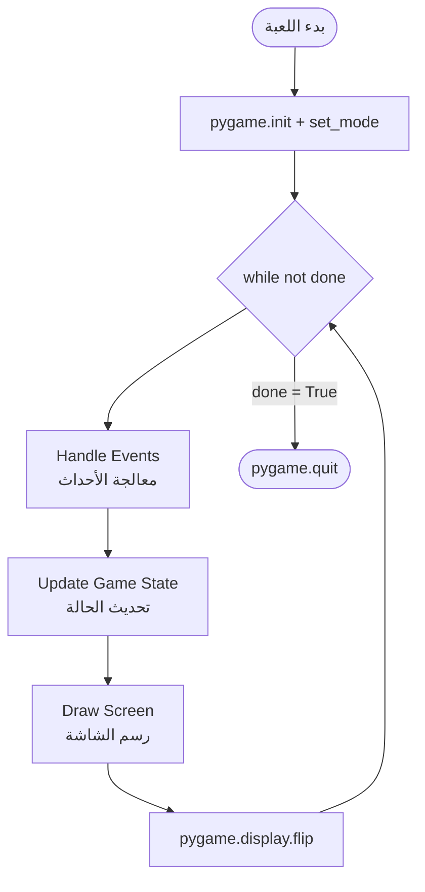
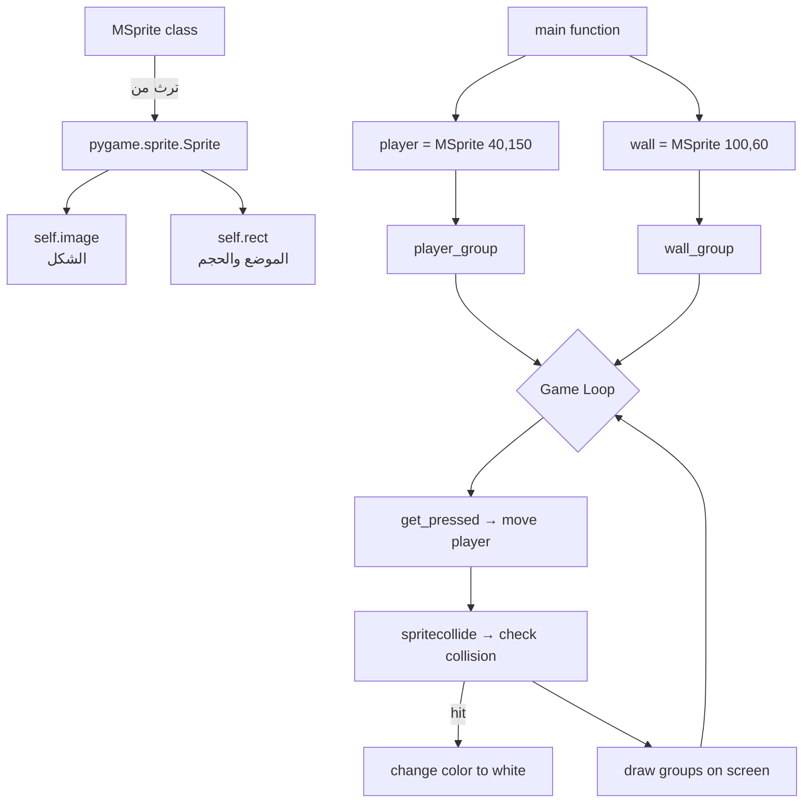

# المحاضرة 12 — Game Programming (برمجة الألعاب)

> **المادة:** البرمجة المتقدمة 2 (القسم النظري) | **الموضوع:** برمجة الألعاب باستخدام مكتبة `Pygame` في Python

---

## الجزء الأول: ملخص منظم (اقرأ قبل المحاضرة!)

### 📍 عن هذه المحاضرة
> هذه المحاضرة تعلّمك كيف تبني لعبة فيديو بسيطة باستخدام مكتبة `Pygame` في Python، من إنشاء النافذة وحتى حركة الكائنات واكتشاف التصادم.

### 🎯 ستتعلم
- ما هي `Pygame` وكيف تعمل — مكتبة Python لبناء الألعاب ثنائية الأبعاد
- `Game Loop` — الحلقة اللانهائية التي تُشغّل أي لعبة: معالجة الأحداث، تحديث الحالة، رسم الشاشة
- `Surface` و `Rect` — المفهومان الأساسيان لعرض الصور والأشكال
- رسم الأشكال الهندسية — خطوط، مستطيلات، دوائر، مضلعات، وأقواس
- معالجة الكيبورد — `KEYDOWN`, `KEYUP`, `get_pressed()`
- الخطوط والنصوص — عرض نص على الشاشة بخطوط النظام
- `Sprite` و اكتشاف التصادم — `spritecollide()` للتحقق من تلاقي كائنين
- `Frames Per Second (FPS)` — التحكم في سرعة اللعبة

### 📚 المتطلبات السابقة
- أساسيات Python (متغيرات، دوال، حلقات، شروط) — لأن كل الأكواد مبنية عليها
- `Classes` و `Objects` في OOP — لأن `Sprite` تُبنى كـ class يرث من `pygame.sprite.Sprite`

### 💡 الأفكار الرئيسية

`Python` موجودة في كل مجال حاسوبي تقريباً — من Machine Learning وحتى الألعاب. وفي مجال الألعاب، أشهر مكتبتين هما `Pygame` و `Pyglet`، والمحاضرة تركّز على `Pygame`.

`Pygame` مكتبة `cross-platform` (تعمل على Windows, Linux, macOS) كتبها Pete Shinners لتحلّ محل مكتبة `PySDL`. هي مجموعة من modules تجمع بين رسوميات الحاسوب والصوت، وتسمح لك ببناء ألعاب كاملة تُشغَّل كـ standalone executable.

الحلقة القلبية في أي لعبة هي **Game Loop** — حلقة `while True` تدور باستمرار وتفعل ثلاثة أشياء بالترتيب: تعالج الأحداث (ضغطات الكيبورد والماوس)، تُحدّث حالة اللعبة (مواضع الكائنات)، ثم ترسم الشاشة من جديد. بدون هذه الحلقة، اللعبة تجمد.

`Surface` هي "ورقة الرسم" — أي شيء تراه على الشاشة هو `Surface`. النافذة نفسها `Surface`، الصورة التي تحمّلها `Surface`، والنص الذي ترسمه يُحوَّل لـ `Surface` أيضاً. و `Rect` هو المستطيل الذي يُعرّف موضع وحجم كل `Surface` — يحتوي على `x, y, width, height` ومجموعة ضخمة من الخصائص الجاهزة مثل `center`, `topleft`, `bottomright`.

لرسم الأشكال، `pygame.draw` يوفّر دوالاً جاهزة: `rect()`, `circle()`, `line()`, `polygon()`, `ellipse()`, `arc()`. كلها تأخذ `surface`, `color`, وإحداثيات — وإذا كانت `width=0` يكون الشكل ممتلئاً.

للكيبورد، هناك فرق مهم: `KEYDOWN` يُطلَق لحظة الضغط (مرة واحدة)، بينما `get_pressed()` يُعطيك حالة المفتاح الحالية (مضغوط الآن أم لا) — وهذا يُستخدم للحركة المستمرة.

`Sprite` يُبسّط إدارة الكائنات في اللعبة — كل كائن (لاعب، عدو، رصاصة) يكون class يرث من `pygame.sprite.Sprite`، وكلها تُجمَع في `Group`. ثم `spritecollide()` يكتشف تلقائياً إذا تلامس كائنان.

### 🔗 كيف تتصل هذه المحاضرة بالمحاضرات الأخرى؟
- **السابقة:** محاضرات OOP علّمتك الـ Classes والـ Inheritance ← الآن تطبّقها في Sprite classes
- **القادمة:** المشاريع النهائية قد تعتمد على هذه الأساسيات لبناء لعبة كاملة

### ⚠️ الأخطاء الشائعة الواجب تجنبها

#### الفهم الخاطئ ❌:
نسيان استدعاء `pygame.display.flip()` أو `pygame.display.update()` في نهاية كل frame — فيبدو أن اللعبة لا تتحرك أو تتجمد.

#### الفهم الصحيح ✅:
في نهاية كل دورة من `Game Loop`، لا بد من استدعاء `flip()` أو `update()` — هذا يدفع ما رسمته من الذاكرة إلى الشاشة الفعلية.

---

#### الفهم الخاطئ ❌:
استخدام `KEYDOWN` للحركة المستمرة — الشخصية ستتحرك خطوة واحدة فقط عند كل ضغطة.

#### الفهم الصحيح ✅:
للحركة المستمرة استخدم `pygame.key.get_pressed()` التي ترجع حالة كل المفاتيح في اللحظة الحالية.

---

#### الفهم الخاطئ ❌:
نسيان `screen.fill()` في بداية كل frame — تظل آثار الإطار السابق على الشاشة وتبدو كـ trail.

#### الفهم الصحيح ✅:
في بداية كل دورة، امسح الشاشة بـ `screen.fill(color)` قبل رسم أي شيء جديد.

### لما تحتاج هذا في الامتحان
أسئلة الامتحان غالباً تشمل: تحديد الخطأ في Game Loop، اختيار الدالة الصحيحة للرسم، فهم الفرق بين `KEYDOWN` و `get_pressed()`، وقراءة كود Sprite وتحديد ماذا يحدث عند التصادم. الكود الكامل للعبة البسيطة (P_8.py) مهم جداً لفهمه سطراً بسطر.

---

## الجزء الثاني: الشرح التفصيلي (سطر بسطر / فقرة بفقرة)

---

### 1. Python و Pygame — المقدمة

<!-- @render: {type: "prose-first", visualization: "none", coverage: "100%"} -->

#### 💡 الفكرة الأساسية
**`Python` لغة شاملة موجودة في كل مجال حاسوبي، و`Pygame` هي مكتبتها لبناء الألعاب.**

#### 📖 الشرح

`Python` تُوصَف بأنها لغة الجيل القادم — ليس لأنها جديدة، بل لأن انتشارها المتسارع في كل تخصص جعلها الخيار الأول للمبتدئ والخبير معاً. تقريباً أي مجال ناشئ في علوم الحاسوب، ستجد `Python` حاضرة فيه.

في مجال Machine Learning، المكتبات الأساسية هي `NumPy` (العمليات الرياضية)، `Pandas` (معالجة البيانات)، `Matplotlib` (الرسوم البيانية). في Artificial Intelligence، `PyTorch` و `TensorFlow`. وفي مجال الألعاب، `Pygame` و `Pyglet`. المحاضرة تركز على `Pygame`.

> **ملاحظة:** المحاضرة تذكر `Panda3D` كمكتبة ألعاب متقدمة لمن يريد الذهاب لمستوى أعلى من `Pygame`.

#### 💡 التشبيه:
> تخيّل `Python` كسكينة الجيش السويسري — أداة واحدة تحل مشاكل عشرة مجالات مختلفة.
> **وجه الشبه:** كما أن السكينة تحتوي على مقص ومفك وملقط، Python تحتوي على مكتبات لكل احتياج.

#### 🎯 الملخص السريع
- `Python` هي لغة البرمجة الأكثر انتشاراً حالياً
- لكل مجال في علوم الحاسوب مكتبات `Python` متخصصة
- للألعاب: `Pygame` (أبسط) و `Pyglet` و `Panda3D` (أكثر تقدماً)

#### 📄 النص الأصلي من المحاضرة
<details>
<summary>عرض النص الأصلي (coverage: 100%)</summary>

**النص الأصلي يقول:**
> Python is the most popular programming language or nothing wrong to say that it is the next-generation programming language. In every emerging field in computer science, Python makes its presence actively. Python has vast libraries for various fields such as Machine Learning (Numpy, Pandas, Matplotlib), Artificial intelligence (Pytorch, TensorFlow), and Game development (Pygame, Pyglet). In this tutorial, we are going to learn about game development using the Pygame (Python library). More advanced game libraries such as Panda3D are for those who wish to take it to another level.

**ملاحظة على التغطية:**
- ✓ تم شرح بالكامل: انتشار Python + قائمة المكتبات + Panda3D
- ℹ️ إضافة من الدليل: تشبيه سكينة الجيش السويسري

</details>

---

### 2. ما هي Pygame؟

<!-- @render: {type: "prose-first", visualization: "none", coverage: "100%"} -->

#### 💡 الفكرة الأساسية
**`Pygame` مجموعة `modules` من `Python` لبناء ألعاب فيديو، تجمع رسوميات الحاسوب والصوت في مكتبة واحدة.**

#### 📖 الشرح

`Pygame` تعني "Python + Game" — هي مجموعة من modules تعمل على أنظمة مختلفة (Windows, Linux, macOS) مما يجعلها `cross-platform`. تحتوي على دوال للرسم، الصوت، قراءة المدخلات (كيبورد، ماوس)، وإدارة الزمن.

كتبها Pete Shinners لتحلّ محل مكتبة `PySDL` (التي كانت أصعب استخداماً). ميزتها الكبيرة أنها مناسبة لبناء تطبيقات `client-side` يمكن تحويلها لملف `executable` يعمل بدون الحاجة لتثبيت Python.

#### 💡 التشبيه:
> `Pygame` كأنها "صندوق لعب جاهز" — بدلاً من بناء كل أداة من الصفر (رسم pixel بـ pixel، إدارة الصوت، قراءة الكيبورد)، `Pygame` جهّزت كل هذا لك.
> **وجه الشبه:** كما تشتري لعبة مونتاج مع كل القطع، `Pygame` تأتي بكل أدوات اللعبة جاهزة.

#### 🎯 الملخص السريع
- `Pygame` = مجموعة Python modules لبناء ألعاب فيديو
- `cross-platform`: تعمل على Windows / Linux / macOS
- كتبها Pete Shinners بديلاً لـ `PySDL`
- مناسبة لـ client-side applications قابلة للتحويل لـ executable

#### 📄 النص الأصلي من المحاضرة
<details>
<summary>عرض النص الأصلي (coverage: 100%)</summary>

**النص الأصلي يقول:**
> Pygame is a cross-platform set of Python modules which is used to create video games. It consists of computer graphics and sound libraries designed to be used with the Python programming language. Pygame was officially written by Pete Shinners to replace PySDL. Pygame is suitable to create client-side applications that can be potentially wrapped in a standalone executable.

**ملاحظة على التغطية:**
- ✓ تم شرح بالكامل: تعريف Pygame + Pete Shinners + PySDL + executable

</details>

---

### 3. أول برنامج Pygame — فتح نافذة فارغة

<!-- @render: {type: "code-first", visualization: "none", coverage: "100%"} -->

#### 💡 الفكرة الأساسية
**أي برنامج `Pygame` يبدأ بـ `init()`, ينشئ نافذة بـ `set_mode()`, ويدور في حلقة `while` حتى يُغلق.**

#### 💻 الكود: P_1.py — نافذة فارغة (الهيكل الأساسي)

#### ما هذا الكود؟
> هذا هو الهيكل الأساسي لأي برنامج Pygame — ينشئ نافذة 400×500 ويبقيها مفتوحة حتى يضغط المستخدم X.

```python
import pygame                              # import pygame library

pygame.init()                              # initialize all pygame modules
screen = pygame.display.set_mode((400, 500))  # create window 400 wide x 500 tall
done = False                               # game loop control flag

while not done:                            # Game Loop — runs forever until done=True
    for event in pygame.event.get():       # get all events this frame
        if event.type == pygame.QUIT:      # if user clicked X button
            done = True                    # set flag to exit loop

    pygame.display.flip()                  # push buffer to screen — MUST call every frame

pygame.quit()                              # clean up pygame resources
```

#### ملاحظات الأسطر المهمة:
- `pygame.init()` → يُهيّئ **كل** modules داخل `Pygame` دفعة واحدة — يجب استدعاؤه أولاً دائماً
- `pygame.display.set_mode((400, 500))` → ينشئ نافذة ويُرجع `Surface` object يمثّل المنطقة المرئية — **لاحظ أن الأبعاد tuple داخل tuple**
- `pygame.event.get()` → يُفرّغ قائمة الأحداث — بدونها، الأحداث تتراكم والـ OS يظنّ البرنامج تجمّد
- `pygame.QUIT` → الحدث الذي يُطلَق عند الضغط على زر الإغلاق X
- `pygame.display.flip()` → `Pygame` يستخدم **double buffering** — ترسم على buffer خفي، ثم `flip()` يُظهره على الشاشة

#### 🔄 نسخة بديلة — P_1_0.py

> فرق بسيط: `pygame.quit()` يُستدعى **داخل** الحدث مباشرةً بدلاً من نهاية البرنامج.

```python
import pygame

pygame.init()
screen = pygame.display.set_mode((400, 500))
done = False

while not done:
    for event in pygame.event.get():
        if event.type == pygame.QUIT:
            pygame.quit()   # quit pygame immediately inside the event
            done = True
    pygame.display.flip()
```

#### 📊 المخطط: Game Loop — دورة اللعبة الأساسية

#### ما هذا المخطط؟
> يوضّح الدورة المستمرة التي تُشغّل أي لعبة: ثلاث مراحل تتكرر بلا توقف حتى تنتهي اللعبة.

| # | المرحلة | الدخل | الخرج | الملاحظات |
|---|---------|-------|-------|-----------|
| 1 | Handle Events | أحداث الكيبورد والماوس | تغييرات في الحالة | `pygame.event.get()` |
| 2 | Update Game State | الحالة الحالية | الحالة الجديدة | تحديث مواضع الكائنات |
| 3 | Draw Screen | الحالة الجديدة | صورة على الشاشة | `display.flip()` في النهاية |



#### 🎯 الملخص السريع
- `import pygame` → `pygame.init()` → `set_mode()` → `while loop` → `pygame.quit()`
- حلقة اللعبة: **معالجة أحداث** → **تحديث حالة** → **رسم شاشة**
- `flip()` إلزامي في نهاية كل دورة لإظهار التغييرات

#### 📄 النص الأصلي من المحاضرة
<details>
<summary>عرض النص الأصلي (coverage: 100%)</summary>

**النص الأصلي يقول (شرح كل دالة):**
> - `import pygame` — provides access to the pygame framework
> - `pygame.init()` — initializes all the required modules of pygame
> - `pygame.display.set_mode((width, height))` — displays a window of desired size; returns a Surface object
> - `pygame.event.get()` — empties the event queue; without it messages pile up and game becomes unresponsive
> - `pygame.QUIT` — terminates the event when clicking the close button
> - `pygame.display.flip()` — pygame is double-buffered; shifts the buffers; essential to make updates visible

**ملاحظة على التغطية:**
- ✓ تم شرح كل دالة بالتفصيل مع السبب
- ℹ️ إضافة: مخطط Game Loop بـ Mermaid

</details>

---

### 4. Pygame Surface — سطح الرسم

<!-- @render: {type: "prose-first", visualization: "none", coverage: "100%"} -->

#### 💡 الفكرة الأساسية
**كل ما تراه في `Pygame` مرسوم على `Surface` — هي الوحدة الأساسية لعرض أي محتوى بصري.**

#### 📖 الشرح

تخيّل `Surface` كـ"ورقة رسم رقمية" — يمكنك إنشاء أوراق رسم متعددة وتراصّها فوق بعضها. النافذة الرئيسية نفسها `Surface`، وأي صورة تحملها تُصبح `Surface`.

خصائص `Surface`:
- لونها الافتراضي أسود
- حجمها يُحدَّد بـ `size` argument عند إنشائها
- يمكن أن تحتوي على `alpha planes` (للشفافية)، `color keys`, و `source rectangle clipping`
- تُعرّف منطقة مستطيلة يمكن الرسم عليها

لإنشاء النافذة الرئيسية نستخدم `pygame.display.set_mode()` الذي يُرجع `Surface` يمثّل الجزء المرئي من النافذة. هذا الـ `Surface` هو الذي نمرّره لدوال الرسم مثل `pygame.draw.circle()`. وعندما ننتهي من الرسم، `pygame.display.flip()` يدفع محتوياته للشاشة.

#### 💡 التشبيه:
> `Surface` كطبقات في برنامج `Photoshop` — كل طبقة مستقلة، وفي النهاية تُدمج كلها في صورة واحدة.
> **وجه الشبه:** الـ `Surface` الرئيسية (النافذة) تستقبل محتويات الـ `Surfaces` الأخرى (الصور، النصوص) عبر `blit()`.

#### 🎯 الملخص السريع
- `Surface` = ورقة رسم رقمية (مستطيلة)
- النافذة الرئيسية هي `Surface` يُنشئها `set_mode()`
- ادفع محتويات `Surface` للشاشة بـ `pygame.display.flip()`
- `blit()` = الصق `Surface` فوق `Surface` أخرى

#### 📄 النص الأصلي من المحاضرة
<details>
<summary>عرض النص الأصلي (coverage: 100%)</summary>

**النص الأصلي يقول:**
> The pygame Surface is used to display any image. The Surface color is by default black. Its size is defined by passing the size argument. Surfaces can have the number of extra attributes like alpha planes, color keys, source rectangle clipping, etc. The Surface defines a rectangular area on which you can draw. In pygame, everything is viewed on a single user-created display, which can be a window or a full screen. The display is created using .set_mode(), which returns a Surface representing the visible part of the window. It is this Surface that you pass into drawing functions like pygame.draw.circle(), and the contents of that Surface are pushed to the display when you call pygame.display.flip().

**ملاحظة على التغطية:**
- ✓ تم شرح بالكامل: تعريف Surface + خصائصها + علاقتها بـ set_mode و flip و blit

</details>

---

### 5. Images و Rects — الصور والمستطيلات

<!-- @render: {type: "prose-first", visualization: "none", coverage: "100%"} -->

#### 💡 الفكرة الأساسية
**الصور تُحمَّل إلى `Surface` عبر `image module`، والمستطيلات (`Rect`) هي الطريقة الأساسية لتحديد موضع وحجم أي شيء في `Pygame`.**

#### 📖 الشرح

يمكنك الرسم مباشرةً على الـ `Surface` (كما في P_3.py)، لكن يمكنك أيضاً تحميل صور من القرص الصلب. `pygame.image.load('path/image.png')` يُحمّل الصورة ويُرجعها كـ `Surface`. يدعم صيغ شائعة مثل PNG, JPG, GIF.

**`Rect`** هو اختصار لـ Rectangle — يُخزّن إحداثيات وأبعاد مستطيل. كل `Surface` في `Pygame` مُمثَّلة بـ `Rect` يعرف: أين هي؟ وكم حجمها؟

لأن المستطيلات تُستخدم كثيراً جداً في الألعاب (كل كائن يحتاج موضعاً وحجماً)، `Pygame` يوفّر `Rect` class خاص بها مليء بالخصائص المريحة.

#### 📄 النص الأصلي من المحاضرة
<details>
<summary>عرض النص الأصلي (coverage: 100%)</summary>

**النص الأصلي يقول:**
> Your basic pygame program drew a shape directly onto the display's Surface, but you can also work with images on the disk. The image module allows you to load and save images in a variety of popular formats. Images are loaded into Surface objects. Surface objects are represented by rectangles, as are many other objects in pygame, such as images and windows. Rectangles are so heavily used that there is a special Rect class just to handle them.

**ملاحظة على التغطية:**
- ✓ تم شرح بالكامل

</details>

---

### 6. عرض صورة — P_2.py

<!-- @render: {type: "code-first", visualization: "none", coverage: "100%"} -->

#### 💡 الفكرة الأساسية
**لتحميل وعرض صورة: `pygame.image.load()` ثم `surface.blit(image, position)`.**

#### 💻 الكود: P_2.py — تحميل وعرض صورة

#### ما هذا الكود؟
> يُنشئ نافذة بيضاء 400×400 ويعرض فيها صورة من ملف PNG في الزاوية العلوية اليسرى.

```python
import pygame

pygame.init()
white = (255, 255, 255)      # RGB white color
height = 400
width = 400
display_surface = pygame.display.set_mode((height, width))
pygame.display.set_caption('Image')              # set window title

image = pygame.image.load('images/bio.png')      # load image into Surface object
done = False

while not done:
    display_surface.fill(white)                  # clear screen with white each frame
    display_surface.blit(image, (0, 0))          # draw image at position (0,0) = top-left

    for event in pygame.event.get():
        if event.type == pygame.QUIT:
            done = True

    pygame.display.update()                      # update display (alternative to flip())

pygame.quit()
```

#### ملاحظات الأسطر المهمة:
- `pygame.display.set_caption('Image')` → تضع عنواناً لنافذة اللعبة (يظهر في title bar)
- `pygame.image.load('images/bio.png')` → يُحمّل الصورة من المسار المحدد — الصورة يجب أن تكون في نفس مجلد الكود أو في مجلد فرعي
- `display_surface.fill(white)` → يمسح الشاشة في كل frame — ضروري لتجنب "أثر" الإطار السابق
- `display_surface.blit(image, (0, 0))` → `blit` = Block Transfer — يرسم الـ `image Surface` فوق `display_surface` في الموضع (0,0)
- `pygame.display.update()` → بديل لـ `flip()` — الفرق أن `update()` يمكن تمرير منطقة محددة فقط لتحديثها (أكفأ أحياناً)

#### 🎯 الملخص السريع
- `pygame.image.load(path)` → تحميل صورة
- `surface.blit(image, (x, y))` → رسم صورة في موضع محدد
- `set_caption(title)` → عنوان النافذة
- `update()` = بديل `flip()` — كلاهما يُظهر التغييرات

#### 📄 النص الأصلي من المحاضرة
<details>
<summary>عرض النص الأصلي (coverage: 100%)</summary>

**النص الأصلي يقول:** كود P_2.py كما هو في المحاضرة

</details>

---

### 7. تحريك صورة — P_2_0.py

<!-- @render: {type: "code-first", visualization: "none", coverage: "100%"} -->

#### 💡 الفكرة الأساسية
**الحركة في `Pygame` تعني تغيير إحداثيات الكائن في كل frame — مع `FPS Clock` للتحكم في سرعة اللعبة.**

#### 💻 الكود: P_2_0.py — تحريك صورة في مسار مربع

#### ما هذا الكود؟
> يُحرّك صورة في مسار مربعي (يمين، أسفل، يسار، فوق) بسرعة منضبطة بـ 30 frame/sec.

```python
import pygame, sys
from pygame.locals import *       # import pygame constants directly (QUIT, etc.)

pygame.init()
FPS = 30                          # target frames per second
fpsClock = pygame.time.Clock()    # clock object to control FPS

DISPLAYSURF = pygame.display.set_mode((400, 300), 0, 32)  # 32-bit color depth
pygame.display.set_caption('Animation')

WHITE = (255, 255, 255)
catImg = pygame.image.load('images/bio.gif')   # load the image

catx = 10    # starting x position
caty = 10    # starting y position
direction = 'right'   # starting movement direction

while True:
    DISPLAYSURF.fill(WHITE)   # clear screen

    # update position based on direction
    if direction == 'right':
        catx += 5
        if catx == 280:          # reached right boundary
            direction = 'down'
    elif direction == 'down':
        caty += 5
        if caty == 220:          # reached bottom boundary
            direction = 'left'
    elif direction == 'left':
        catx -= 5
        if catx == 10:           # reached left boundary
            direction = 'up'
    elif direction == 'up':
        caty -= 5
        if caty == 10:           # reached top boundary — reset to right
            direction = 'right'

    DISPLAYSURF.blit(catImg, (catx, caty))    # draw image at new position

    for event in pygame.event.get():
        if event.type == QUIT:
            pygame.quit()
            sys.exit()

    pygame.display.update()
    fpsClock.tick(FPS)    # pause to maintain 30 FPS
```

#### ملاحظات الأسطر المهمة:
- `from pygame.locals import *` → يستورد ثوابت `Pygame` مثل `QUIT` مباشرةً (بدلاً من `pygame.QUIT`)
- `pygame.time.Clock()` → ينشئ كائن ساعة للتحكم في الـ FPS
- `fpsClock.tick(FPS)` → يُسبب توقفاً مناسباً لضمان أن البرنامج لا يتجاوز 30 frame/sec
- الحركة تعمل بتغيير `catx` أو `caty` بمقدار 5 pixels في كل frame
- `direction` string تتحكم في الاتجاه — نمط `state machine` بسيط

#### 📊 مسار حركة الصورة (شرح زيادة للفهم):
```
(10,10) ──right──→ (280,10)
                       ↓ down
(10,220) ←──left── (280,220)
   ↑ up
(10,10)
```

#### 📄 النص الأصلي من المحاضرة
<details>
<summary>عرض النص الأصلي (coverage: 100%)</summary>

**النص الأصلي يقول:** كود P_2_0.py كما هو في المحاضرة مع الصور

</details>

---

### 8. Pygame Rect — المستطيل

<!-- @render: {type: "prose-first", visualization: "none", coverage: "100%"} -->

#### 💡 الفكرة الأساسية
**`Rect` هو كائن يُخزّن موضع وحجم مستطيل، ويأتي مع عشرات الخصائص الجاهزة للتحريك والمحاذاة.**

#### 📖 الشرح

`Rect` تُنشأ بـ 4 قيم: `(left, top, width, height)`. الفرق بين `left` وبين `x` هو نفسه — كلاهما الإحداثية الأفقية للركن الأيسر العلوي.

ما يميّز `Rect` هو مجموعة الخصائص الافتراضية التي تُسهّل الحسابات الهندسية كثيراً:

| الفئة | الخصائص |
|-------|---------|
| الأركان | `topleft`, `topright`, `bottomleft`, `bottomright` |
| المنتصف | `center`, `centerx`, `centery` |
| الجوانب | `top`, `left`, `right`, `bottom` |
| النقطة | `x`, `y` |
| الحجم | `size`, `width`, `height`, `w`, `h` |
| المنتصف الجانبي | `midtop`, `midleft`, `midbottom`, `midright` |

**مهم للامتحان ⚠️:** دالة `rect()` **تُرجع نسخة جديدة** من المستطيل بعد التعديل — لا تُعدّل الأصلي.

**تغيير الحجم فقط** يحدث عند تعيين: `size`, `width`, أو `height`. أما باقي الخصائص فتُحرّك المستطيل بدون تغيير حجمه.

#### 💡 التشبيه:
> `Rect` كبطاقة هوية للكائن في اللعبة — تخبرك "أنا في موضع (x, y) وحجمي (w × h)".
> **وجه الشبه:** كما أن البطاقة تحمل كل بيانات الشخص بسهولة، `Rect` تحمل كل إحداثيات الكائن.

#### 🎯 الملخص السريع
- `pygame.Rect(left, top, width, height)` → ينشئ مستطيلاً
- عشرات الخصائص الجاهزة: `center`, `topleft`, `bottomright`...
- تغيير `width`/`height` → يُغيّر الحجم | تغيير باقي الخصائص → يُحرّك فقط

#### 📄 النص الأصلي من المحاضرة
<details>
<summary>عرض النص الأصلي (coverage: 100%)</summary>

**النص الأصلي يقول:**
> Rect is used to draw a rectangle in Pygame. Pygame uses Rect objects to store and manipulate rectangular areas. A Rect can be formed from a combination of left, top, width, and height values. It can also be created from Python objects that are already a Rect or have an attribute named "rect". The rect() function is used to perform changes in the position or size of a rectangle. It returns the new copy of the Rect with the affected changes. No modification happens in the original rectangle. The dimension of the rectangle can be changed by assigning the size, width, or height. All other assignment moves the rectangle without resizing it. If the width or height is a non-zero value of Rect, then it will return True for a non-zero test.

**ملاحظة على التغطية:**
- ✓ تم شرح بالكامل + جدول الخصائص

</details>

---

### 9. رسم مستطيل — P_3.py

<!-- @render: {type: "code-first", visualization: "none", coverage: "100%"} -->

#### 💡 الفكرة الأساسية
**`pygame.draw.rect(surface, color, Rect)` يرسم مستطيلاً على الشاشة.**

#### 💻 الكود: P_3.py — رسم مستطيل أزرق

```python
import pygame

pygame.init()
screen = pygame.display.set_mode((400, 300))
done = False

while not done:
    for event in pygame.event.get():
        if event.type == pygame.QUIT:
            done = True

    # draw filled blue rectangle at (30,30) with size 60x60
    pygame.draw.rect(screen, (0, 125, 255), pygame.Rect(30, 30, 60, 60))

    pygame.display.flip()

pygame.quit()
```

#### ملاحظات الأسطر المهمة:
- `(0, 125, 255)` → لون أزرق فاتح بصيغة RGB (Red=0, Green=125, Blue=255)
- `pygame.Rect(30, 30, 60, 60)` → مستطيل يبدأ من (30,30) وحجمه 60×60
- `width` parameter غير موجود هنا → قيمته الافتراضية 0 → المستطيل ممتلئ (filled)

#### 📄 النص الأصلي من المحاضرة
<details>
<summary>عرض النص الأصلي (coverage: 100%)</summary>

**النص الأصلي يقول:** كود P_3.py كما هو في المحاضرة

</details>

---

### 10. معالجة الكيبورد — KEYDOWN و KEYUP

<!-- @render: {type: "prose-first", visualization: "none", coverage: "100%"} -->

#### 💡 الفكرة الأساسية
**`KEYDOWN` يكتشف لحظة الضغط (مرة واحدة)، `KEYUP` يكتشف لحظة الرفع، و`get_pressed()` يُعطي الحالة المستمرة للمفتاح.**

#### 📖 الشرح

في `Pygame`، معالجة الكيبورد لها طريقتان:

**الطريقة 1: أحداث `KEYDOWN` / `KEYUP`** — يُطلَقان مرة واحدة لحظة الضغط أو الرفع. مناسب لأفعال تحدث مرة واحدة (إطلاق رصاصة، القفز).

**الطريقة 2: `get_pressed()`** — يُرجع list من True/False لكل مفاتيح الكيبورد. يُعطيك الحالة الحالية: هل المفتاح مضغوط الآن؟ مناسب للحركة المستمرة.

كل حدث `KEYDOWN`/`KEYUP` يحمل خاصيتين:
- `key`: رقم صحيح يُعرّف المفتاح (مثلاً `pygame.K_SPACE` للمسافة)
- `mod`: bitmask للمفاتيح التعديلية المضغوطة معه (Shift, Ctrl, Alt)

#### ⚖️ المقايضة: KEYDOWN vs get_pressed()

| | `KEYDOWN` event | `get_pressed()` |
|--|--|--|
| **متى يُطلَق؟** | مرة واحدة عند الضغط | في كل frame |
| **الاستخدام** | أفعال one-shot (إطلاق، قفز) | حركة مستمرة |
| **المثال** | تغيير اللون بالمسافة | تحريك الشخصية بالأسهم |

#### 📄 النص الأصلي من المحاضرة
<details>
<summary>عرض النص الأصلي (coverage: 100%)</summary>

**النص الأصلي يقول:**
> Pygame KEYDOWN and KEYUP detect the event if a key is physically pressed and released. KEYDOWN detects the key press and KEYUP detects the key release. Both events have two attributes: key (integer id which represents every key on the keyboard) and mod (bitmask of all modifier keys in pressed state when event occurred).

**ملاحظة على التغطية:**
- ✓ تم شرح بالكامل + جدول مقارنة

</details>

---

### 11. مثال كيبورد — P_4.py و P_5.py

<!-- @render: {type: "code-first", visualization: "none", coverage: "100%"} -->

#### 💡 الفكرة الأساسية
**P_4 يطبع أسماء المفاتيح، P_5 يُحرّك مستطيلاً ويغيّر لونه.**

#### 💻 الكود: P_4.py — طباعة المفاتيح المضغوطة

```python
import pygame

pygame.init()
pygame.display.set_caption('Keyboard events')
pygame.display.set_mode((400, 400))
done = False

while not done:
    event = pygame.event.wait()   # wait for an event (blocking — no busy loop)

    if event.type == pygame.QUIT:
        done = True

    if event.type in (pygame.KEYDOWN, pygame.KEYUP):
        key_name = pygame.key.name(event.key)   # get human-readable key name
        key_name = key_name.upper()              # convert to uppercase

        if event.type == pygame.KEYDOWN:
            print('"{}" key pressed'.format(key_name))
        elif event.type == pygame.KEYUP:
            print('"{}" key released'.format(key_name))

pygame.quit()
```

#### ملاحظات الأسطر المهمة:
- `pygame.event.wait()` → يوقف البرنامج حتى يأتي حدث ما (أكفأ من `get()` في برامج لا تحتاج رسم مستمر)
- `pygame.key.name(event.key)` → يُحوّل رقم المفتاح لاسم مقروء مثل "space", "right ctrl"

---

#### 💻 الكود: P_5.py — مستطيل متحرك قابل للتغيير اللون

#### ما هذا الكود؟
> يُحرّك مستطيلاً بمفاتيح الأسهم، وعند الضغط على Space يتبادل بين اللون الأزرق والبرتقالي.

```python
import pygame

pygame.init()
screen = pygame.display.set_mode((400, 300))
done = False
is_blue = True   # toggle for color
x, y = 30, 30   # starting position

while not done:
    for event in pygame.event.get():
        if event.type == pygame.QUIT:
            done = True
        if event.type == pygame.KEYDOWN and event.key == pygame.K_SPACE:
            is_blue = not is_blue   # toggle color on space press (one-shot)

    # continuous movement using get_pressed()
    pressed = pygame.key.get_pressed()
    if pressed[pygame.K_UP]:    y -= 3
    if pressed[pygame.K_DOWN]:  y += 3
    if pressed[pygame.K_LEFT]:  x -= 3
    if pressed[pygame.K_RIGHT]: x += 3

    # choose color based on toggle
    if is_blue:
        color = (0, 128, 255)
    else:
        color = (255, 100, 0)

    pygame.draw.rect(screen, color, pygame.Rect(x, y, 60, 60))
    pygame.display.flip()

pygame.quit()
```

#### ملاحظات الأسطر المهمة:
- `event.key == pygame.K_SPACE` → `K_SPACE` هو ثابت يمثل مفتاح المسافة — قائمة كاملة في وثائق Pygame
- `is_blue = not is_blue` → تبديل Boolean — أبسط طريقة لعمل toggle
- `pressed[pygame.K_UP]` → `True` إذا كان مفتاح الأسهم للأعلى مضغوطاً **الآن**
- لاحظ: الحركة بـ `get_pressed()` (مستمرة)، تغيير اللون بـ `KEYDOWN` event (مرة واحدة)

#### 📄 النص الأصلي من المحاضرة
<details>
<summary>عرض النص الأصلي (coverage: 100%)</summary>

**النص الأصلي يقول:** كودَي P_4.py و P_5.py كما هما في المحاضرة

</details>

---

### 12. Pygame Draw — رسم الأشكال الهندسية

<!-- @render: {type: "code-first", visualization: "none", coverage: "100%"} -->

#### 💡 الفكرة الأساسية
**`pygame.draw` يوفّر دوالاً جاهزة لرسم أشكال هندسية — كلها تأخذ `surface`, `color`, وإحداثيات.**

#### 📖 الشرح

`Color` في `pygame.draw` يمكن أن تكون:
- `pygame.Color` object
- tuple من RGB: `(255, 0, 0)` للأحمر
- tuple من RGBA: `(255, 0, 0, 128)` (مع شفافية)
- قيمة integer مُعيَّنة لـ pixel format الـ surface

معظم الدوال تقبل `width` parameter:
- `width == 0` → ممتلئ (filled) — القيمة الافتراضية
- `width > 0` → سُمك الحدود فقط
- `width < 0` → لا يُرسم شيء

---

#### 📊 جدول دوال الرسم

| الدالة | الصيغة | الاستخدام |
|--------|--------|-----------|
| `draw.rect` | `(surface, color, Rect, width=0)` | مستطيل |
| `draw.circle` | `(surface, color, center, radius, width=0)` | دائرة |
| `draw.line` | `(surface, color, start_pos, end_pos, width=1)` | خط مستقيم |
| `draw.lines` | `(surface, color, closed, points, width=1)` | خطوط متصلة |
| `draw.polygon` | `(surface, color, points, width=0)` | مضلع |
| `draw.ellipse` | `(surface, color, Rect, width=0)` | قطع ناقص |
| `draw.arc` | `(surface, color, Rect, start_angle, stop_angle, width=1)` | قوس |

---

#### 💻 الكود: P_6.py — رسم كل الأشكال

```python
import pygame
from math import pi

pygame.init()
size = [400, 300]
screen = pygame.display.set_mode(size)
pygame.display.set_caption("Example program to draw geometry")
done = False
clock = pygame.time.Clock()

while not done:
    clock.tick(10)   # limit to 10 FPS (static scene doesn't need more)
    for event in pygame.event.get():
        if event.type == pygame.QUIT:
            done = True

    screen.fill((0, 0, 0))   # black background

    # straight line — green, from (0,0) to (50,30), thickness 5
    pygame.draw.line(screen, (0, 255, 0), [0, 0], [50, 30], 5)

    # connected lines — white, 4 points, not closed
    pygame.draw.lines(screen, (255, 255, 255), False, [[0, 80], [50, 90], [200, 80], [220, 30]], 5)

    # rectangle outline only (width=2)
    pygame.draw.rect(screen, (100, 150, 150), [75, 10, 50, 20], 2)

    # filled rectangle (no width = default 0 = filled)
    pygame.draw.rect(screen, (150, 100, 255), [150, 10, 50, 20])

    # ellipse outline (width=2)
    pygame.draw.ellipse(screen, (255, 0, 0), [225, 10, 50, 20], 2)

    # filled ellipse
    pygame.draw.ellipse(screen, (255, 0, 0), [300, 10, 50, 20])

    # triangle polygon — 3 points, outline only (width=5)
    pygame.draw.polygon(screen, (255, 100, 0), [[100, 100], [0, 200], [200, 200]], 5)

    # filled circle — blue, center=(60,250), radius=40
    pygame.draw.circle(screen, (0, 0, 255), [60, 250], 40)

    # arc — blue, from angle 0 to pi/2 (90 degrees), thickness 5
    pygame.draw.arc(screen, (0, 0, 255), [210, 175, 150, 125], 0, pi / 2, 5)

    pygame.display.flip()

pygame.quit()
```

#### ملاحظات الأسطر المهمة:
- `draw.lines(screen, color, False, points, width)` → `False` يعني "لا تغلق المضلع" — `True` سيصل الأول بالأخير
- `draw.polygon(screen, color, points, width)` → القائمة تحتوي على نقاط الرؤوس — minimum 3 نقاط
- `draw.arc(screen, color, Rect, start, stop, width)` → الزوايا بـ radians — `pi/2` = 90 درجة

#### 🔍 تتبع التنفيذ: شرح draw.arc

**المدخل:** `[210, 175, 150, 125]` = مستطيل في (210,175) بحجم 150×125

| الخطوة | العملية | الحالة |
|--------|---------|--------|
| 1 | `start_angle = 0` | يبدأ من الجهة اليمينية (الشرقية) |
| 2 | `stop_angle = pi/2` | ينتهي في الأعلى (الشمالية) |
| 3 | يُرسم عكس عقارب الساعة | ربع دائرة في الربع الأول |

**ملاحظة:** `start < stop` → يُرسم عكس عقارب الساعة. `start > stop` → يُضاف `tau (=2π)` للـ stop.

#### 📄 النص الأصلي من المحاضرة
<details>
<summary>عرض النص الأصلي (coverage: 100%)</summary>

**النص الأصلي يقول:**
> شرح pygame.draw + شرح كل من: draw.rect, draw.polygon, draw.ellipse, draw.line, draw.circle, draw.arc مع الكود P_6.py

**ملاحظة على التغطية:**
- ✓ تم شرح جميع الدوال + الجدول + الكود كاملاً

</details>

---

### 13. Pygame Text و Font — الخطوط والنصوص

<!-- @render: {type: "code-first", visualization: "none", coverage: "100%"} -->

#### 💡 الفكرة الأساسية
**لعرض نص: حمّل خط بـ `SysFont()`, أنشئ `Surface` من النص بـ `render()`, ثم `blit()` على الشاشة.**

#### 📖 الشرح

النص في `Pygame` لا يُرسم مباشرةً على الشاشة — بل يُحوَّل أولاً إلى `Surface`. الخطوات:
1. `pygame.font.SysFont(name, size)` → تحميل خط من خطوط النظام
2. `font.render(text, antialias, color)` → إنشاء `Surface` تحتوي النص
3. `screen.blit(text_surface, position)` → رسم هذا الـ `Surface` على الشاشة

**الدوال المهمة للـ Font object:**
- `render(text, antialias, color, background=None)` → يُنشئ Surface بالنص
- `size(text)` → يُرجع (width, height) بدون رسم — للحسابات والـ word-wrapping
- `set_bold(bool)` → تحديد هل الخط bold أم لا

#### 💻 الكود: P_7.py — عرض نص في منتصف الشاشة

```python
import pygame

pygame.init()
screen = pygame.display.set_mode((640, 480))
done = False

# load system font "Times New Roman" size 72
font = pygame.font.SysFont("Times new Roman", 72)

# create text Surface — antialias=True for smooth edges, color dark red
text = font.render("Hello, Pygame", True, (158, 16, 16))

while not done:
    for event in pygame.event.get():
        if event.type == pygame.QUIT:
            done = True
        if event.type == pygame.KEYDOWN and event.key == pygame.K_ESCAPE:
            done = True   # also exit on Escape key

    screen.fill((255, 255, 255))   # white background

    # calculate centered position: screen_center - half_text_size
    screen.blit(text, (320 - text.get_width() // 2, 240 - text.get_height() // 2))

    pygame.display.flip()

pygame.quit()
```

#### ملاحظات الأسطر المهمة:
- `pygame.font.SysFont("Times new Roman", 72)` → يبحث عن الخط في خطوط النظام — إذا لم يجده، يستخدم default
- `font.render("Hello, Pygame", True, (158, 16, 16))` → `True` = antialias (حواف ناعمة) — استخدم `True` دائماً لنصوص جميلة
- `text.get_width()` و `text.get_height()` → أبعاد الـ Surface النصية — مفيد لتوسيط النص
- `320 - text.get_width() // 2` → إحداثية X للمركز: منتصف الشاشة (320) ناقص نصف عرض النص

#### 🔍 تتبع حساب التوسيط (شرح زيادة للفهم):

**المدخل:** شاشة 640×480، نص عرضه 250px وارتفاعه 70px

| الحساب | القيمة |
|--------|--------|
| `320 - 250 // 2` | `320 - 125 = 195` (x) |
| `240 - 70 // 2` | `240 - 35 = 205` (y) |

**النتيجة:** يبدأ النص من (195, 205) — ليكون مركزه عند (320, 240) = مركز الشاشة

#### 🎯 الملخص السريع
- `SysFont(name, size)` → خط من النظام
- `font.render(text, True, color)` → Surface نصية
- `surface.get_width()` / `get_height()` → أبعاد الـ Surface
- لتوسيط: `screen_center - text_size // 2`

#### 📄 النص الأصلي من المحاضرة
<details>
<summary>عرض النص الأصلي (coverage: 100%)</summary>

**النص الأصلي يقول:**
> We can load fonts from the system using pygame.font.SysFont(). Font objects are created with pygame.font.Font(). Font objects are generally used to render the text into new Surface objects. render(): draws text on a new Surface. size(): determines space needed to render text. set_bold(): for bold rendering.

**ملاحظة على التغطية:**
- ✓ تم شرح جميع الدوال + كود التوسيط

</details>

---

### 14. Sprite و Collision Detection — الكائنات واكتشاف التصادم

<!-- @render: {type: "prose-first", visualization: "none", coverage: "100%"} -->

#### 💡 الفكرة الأساسية
**`Sprite` هو كائن في اللعبة (لاعب، عدو، رصاصة) — `Pygame` يُجمّعها في Groups ويكتشف تصادمها تلقائياً.**

#### 📖 الشرح

**`Sprite`** في `Pygame` هو class يُمثّل كائناً مرئياً في اللعبة. أي class ترثه من `pygame.sprite.Sprite` يحصل على:
- `self.image` → الـ `Surface` الخاصة بالكائن (كيف يبدو)
- `self.rect` → الـ `Rect` الخاص بالكائن (أين هو وكم حجمه)

**ميزة الـ `Groups`:** بدلاً من إدارة كل `Sprite` بشكل منفرد، تُجمّعها في `pygame.sprite.Group()` ثم:
- `group.draw(screen)` → يرسم كل Sprites في المجموعة دفعة واحدة
- `group.update()` → يُحدّث كل Sprites دفعة واحدة

**اكتشاف التصادم:** `pygame.sprite.spritecollide(sprite, group, dokill)`:
- `sprite`: الكائن الذي تتحقق منه
- `group`: المجموعة التي قد يتصادم معها
- `dokill`: إذا `True`، يحذف الكائنات المتصادمة من المجموعة تلقائياً

#### 💡 التشبيه:
> تخيّل مدرسة — كل طالب `Sprite`، والفصل `Group`. بدلاً من أن تنادي كل طالب بالاسم، تقول "الفصل الثالث، اخرجوا للملعب" (`group.update()`) والكل يتحرك.
> **وجه الشبه:** الـ `Group` يُبسّط إدارة كميات كبيرة من الكائنات.

#### 📄 النص الأصلي من المحاضرة
<details>
<summary>عرض النص الأصلي (coverage: 100%)</summary>

**النص الأصلي يقول:**
> A pygame sprite is a two-dimensional image that is part of the large graphical scene. One of the most advantages of working with sprites is the ability to work with them in groups. We can easily move and draw all the sprites with the one command if they are in the group. The Sprite module contains the various simple classes to be used within the games. Pygame provides sprites and sprite groups that help for collision detection. Collision detection is the process when two objects on the screen collide each other.

</details>

---

### 15. Frames Per Second (FPS) — التحكم في سرعة اللعبة

<!-- @render: {type: "prose-first", visualization: "none", coverage: "100%"} -->

#### 💡 الفكرة الأساسية
**بدون FPS Control، الكمبيوتر يُشغّل اللعبة بأقصى سرعة ممكنة — `pygame.time.Clock.tick(fps)` يضبط السرعة.**

#### 📖 الشرح

الكمبيوتر يستطيع تنفيذ ملايين العمليات في الثانية — بدون ضبط، حلقة اللعبة قد تدور آلاف المرات في الثانية، مما يجعل كل شيء يتحرك بسرعة لا يمكن رؤيتها.

المعيار:
- **24 FPS** → أدنى حد مقبول (ما دونه يبدو متقطعاً)
- **30-60 FPS** → نطاق الألعاب العادية
- **أكثر من 100** → أسرع مما تستطيع العين متابعته

```python
FPS = pygame.time.Clock()   # create clock object
FPS.tick(60)                # call inside game loop — pauses to maintain 60 FPS
```

`tick(fps)` يحسب كم مضى من الوقت منذ آخر استدعاء، ثم يُسبّب توقفاً كافياً للحفاظ على الـ FPS المطلوب.

#### 📄 النص الأصلي من المحاضرة
<details>
<summary>عرض النص الأصلي (coverage: 100%)</summary>

**النص الأصلي يقول:**
> Computer's are extremely fast and can complete millions of loop cycles in under a second. As reference, movies are run at 24 frames per second. Anything less than that will have obvious stutter, and values over 100 may cause things to move too fast. The tick() method belongs to the pygame.time.Clock class and must be used with an object of this class.

</details>

---

### 16. مثال Sprite الكامل — P_8.py

<!-- @render: {type: "code-first", visualization: "none", coverage: "100%"} -->

#### 💡 الفكرة الأساسية
**مثال متكامل: Sprite class مخصصة، لاعب يتحرك بالأسهم، وكائن ثابت (wall) — عند التصادم يتغير لون اللاعب.**

#### 💻 الكود: P_8.py — Sprite مع اكتشاف التصادم

```python
import pygame
import sys

# ─── Sprite Class ──────────────────────────────────────────────────
class MSprite(pygame.sprite.Sprite):
    def __init__(self, pos):
        pygame.sprite.Sprite.__init__(self)    # MUST call parent __init__
        self.image = pygame.Surface([20, 20])  # create 20x20 surface (the sprite's look)
        self.image.fill((255, 0, 255))         # fill with magenta color
        self.rect = self.image.get_rect()      # get rect from surface
        self.rect.center = pos                 # set center position

# ─── Main Function ─────────────────────────────────────────────────
def main():
    pygame.init()
    clock = pygame.time.Clock()
    fps = 50
    bg = [0, 0, 0]       # black background
    size = [300, 300]
    screen = pygame.display.set_mode(size)

    # create player at position (40, 150)
    player = MSprite([40, 150])
    player.move = [pygame.K_LEFT, pygame.K_RIGHT, pygame.K_UP, pygame.K_DOWN]
    player.vx = 5    # horizontal speed
    player.vy = 5    # vertical speed

    # create wall at position (100, 60)
    wall = MSprite([100, 60])

    # create sprite groups
    wall_group = pygame.sprite.Group()
    wall_group.add(wall)
    player_group = pygame.sprite.Group()
    player_group.add(player)

    # ─── Game Loop ─────────────────────────────────────────────────
    while True:
        for event in pygame.event.get():
            if event.type == pygame.QUIT:
                return False   # exit main function

        key = pygame.key.get_pressed()

        # horizontal movement (index 0=LEFT, 1=RIGHT)
        for i in range(2):
            if key[player.move[i]]:
                player.rect.x += player.vx * [-1, 1][i]  # -1 for left, +1 for right

        # vertical movement (index 0=UP, 1=DOWN from move[2:4])
        for i in range(2):
            if key[player.move[2:4][i]]:
                player.rect.y += player.vy * [-1, 1][i]  # -1 for up, +1 for down

        screen.fill(bg)   # clear screen

        # check collision — True = remove collided sprites from wall_group
        hit = pygame.sprite.spritecollide(player, wall_group, True)
        if hit:
            player.image.fill((255, 255, 255))   # change to white on collision

        player_group.draw(screen)   # draw all sprites in player group
        wall_group.draw(screen)     # draw all sprites in wall group
        pygame.display.update()
        clock.tick(fps)

    pygame.quit()
    sys.exit

main()
```

#### ملاحظات الأسطر المهمة:
- `pygame.sprite.Sprite.__init__(self)` → إلزامي عند الوراثة من Sprite — بدونه لن تعمل Group
- `self.rect = self.image.get_rect()` → `get_rect()` يُنشئ Rect بنفس حجم الـ Surface — موضعه (0,0) افتراضياً
- `self.rect.center = pos` → يضع مركز الـ Rect في الموضع المحدد
- `player.vx * [-1, 1][i]` → حيلة أنيقة: `[-1, 1][0] = -1` (اليسار)، `[-1, 1][1] = +1` (اليمين) — بدل if/else
- `spritecollide(player, wall_group, True)` → True يحذف wall من المجموعة عند التصادم — جرّب False لترى الفرق

#### 📊 المخطط: هيكل الكود



#### 🎯 الملخص السريع
- Sprite class: `__init__` + `self.image` + `self.rect`
- Groups: `pygame.sprite.Group()` → `add()` → `draw()` → `update()`
- Collision: `spritecollide(sprite, group, dokill)` → يُرجع list الكائنات المتصادمة

#### 📄 النص الأصلي من المحاضرة
<details>
<summary>عرض النص الأصلي (coverage: 100%)</summary>

**النص الأصلي يقول:** كود P_8.py كاملاً كما في المحاضرة

</details>

---

### 17. مثال لعبة كاملة — Simple Car Game

<!-- @render: {type: "code-first", visualization: "none", coverage: "100%"} -->

#### 💡 الفكرة الأساسية
**لعبة سيارات: لاعب يتحرك يميناً ويساراً، عدو يتحرك للأسفل تلقائياً، عند التصادم: Game Over.**

#### 📖 الشرح الكلي للعبة

اللعبة تتكوّن من:
- **Player (السيارة الزرقاء):** تتحرك يميناً/يساراً بمفاتيح الأسهم
- **Enemy (السيارة الحمراء):** تنزل للأسفل تلقائياً وتظهر من أعلى الشاشة في مواضع عشوائية
- **Score:** يزداد كلما عبر العدو الشاشة
- **Speed:** يزداد مع مرور الوقت (كل ثانية +0.5)
- **Game Over:** عند التصادم بين السيارتين

#### 💻 هيكل اللعبة (مُقسَّم للفهم):

**الجزء 1: الإعداد والثوابت**
```python
import pygame, sys
from pygame.locals import *
import random, time

pygame.init()
FPS = 60
FramePerSec = pygame.time.Clock()

# colors
BLUE = (0, 0, 255)
RED = (255, 0, 0)
GREEN = (0, 255, 0)
BLACK = (0, 0, 0)
WHITE = (255, 255, 255)

SCREEN_WIDTH = 400
SCREEN_HEIGHT = 600
SPEED = 5         # initial enemy speed
SCORE = 0

# fonts
font = pygame.font.SysFont("Verdana", 60)
font_small = pygame.font.SysFont("Verdana", 20)
game_over = font.render("Game Over", True, BLACK)

background = pygame.image.load("AnimatedStreet.png")   # road background
DISPLAYSURF = pygame.display.set_mode((400, 600))
pygame.display.set_caption("Game")
```

**الجزء 2: كلاس العدو**
```python
class Enemy(pygame.sprite.Sprite):
    def __init__(self):
        super().__init__()   # call Sprite.__init__
        self.image = pygame.image.load("enemy.png")
        self.surf = pygame.Surface((50, 80))
        # spawn at random x position, y=0 (top of screen)
        self.rect = self.surf.get_rect(
            center=(random.randint(40, SCREEN_WIDTH - 40), 0)
        )

    def move(self):
        global SCORE
        self.rect.move_ip(0, SPEED)   # move down by SPEED pixels
        if self.rect.top > 600:        # if went off screen bottom
            SCORE += 1
            self.rect.top = 0          # reset to top
            self.rect.center = (random.randint(30, 370), 0)
```

**الجزء 3: كلاس اللاعب**
```python
class Player(pygame.sprite.Sprite):
    def __init__(self):
        super().__init__()
        self.image = pygame.image.load("download.png")
        self.surf = pygame.Surface((50, 100))
        self.rect = self.surf.get_rect(center=(150, 500))   # start near bottom

    def move(self):
        pressed_keys = pygame.key.get_pressed()
        # boundary check before moving
        if self.rect.left > 0:
            if pressed_keys[K_LEFT]:
                self.rect.move_ip(-5, 0)   # move left by 5
        if self.rect.right < SCREEN_WIDTH:
            if pressed_keys[K_RIGHT]:
                self.rect.move_ip(5, 0)    # move right by 5
```

**الجزء 4: Game Loop**
```python
P1 = Player()
E1 = Enemy()
enemies = pygame.sprite.Group()
enemies.add(E1)
all_sprites = pygame.sprite.Group()
all_sprites.add(P1)
all_sprites.add(E1)

# custom event: increase speed every 1000ms (1 second)
INC_SPEED = pygame.USEREVENT + 1
pygame.time.set_timer(INC_SPEED, 1000)

while True:
    for event in pygame.event.get():
        if event.type == INC_SPEED:
            SPEED += 0.5      # increase speed every second
        if event.type == QUIT:
            pygame.quit()
            sys.exit()

    DISPLAYSURF.blit(background, (0, 0))   # draw road background
    scores = font_small.render(str(SCORE), True, BLACK)
    DISPLAYSURF.blit(scores, (10, 10))     # draw score top-left

    for entity in all_sprites:
        DISPLAYSURF.blit(entity.image, entity.rect)   # draw sprite
        entity.move()                                  # move sprite

    # check if player collided with any enemy
    if pygame.sprite.spritecollideany(P1, enemies):
        pygame.mixer.Sound('crash.wav').play()    # play crash sound
        time.sleep(0.5)
        DISPLAYSURF.fill(RED)                     # flash red
        DISPLAYSURF.blit(game_over, (30, 250))    # show Game Over
        pygame.display.update()
        for entity in all_sprites:
            entity.kill()   # remove all sprites
        time.sleep(2)
        pygame.quit()
        sys.exit()

    pygame.display.update()
    FramePerSec.tick(FPS)
```

#### ملاحظات الأسطر المهمة:
- `super().__init__()` → بديل عصري لـ `pygame.sprite.Sprite.__init__(self)` — نفس التأثير
- `self.rect.move_ip(dx, dy)` → `move in place` — يُحرّك الـ Rect بمقدار (dx, dy) ويُعدّل الأصلي (لا ينشئ نسخة)
- `pygame.USEREVENT + 1` → ثابت حدث مخصص — `pygame.time.set_timer()` يُطلقه كل 1000ms
- `spritecollideany(sprite, group)` → بديل `spritecollide` يُرجع أول تصادم (أو None) — أسرع لأنه يتوقف عند أول تصادم
- `entity.kill()` → يُزيل الـ Sprite من كل المجموعات التي ينتمي لها

#### 🎯 الملخص السريع
- `move_ip(dx, dy)` → تحريك في مكانه (in place)
- `pygame.USEREVENT + 1` + `set_timer()` → أحداث مخصصة بتوقيت
- `spritecollideany()` → أسرع من `spritecollide()` للتصادم مع مجموعة
- `entity.kill()` → يُزيل Sprite من كل Groups

#### 📄 النص الأصلي من المحاضرة
<details>
<summary>عرض النص الأصلي (coverage: 100%)</summary>

**النص الأصلي يقول:** كود اللعبة الكاملة (simple car game) مقسّماً على عدة شرائح

</details>

---

### 18. مقارنة Pygame و Pyglet

<!-- @render: {type: "prose-first", visualization: "none", coverage: "100%"} -->

#### ⚖️ مقارنة سريعة: Pygame vs Pyglet

| المعيار | `Pyglet` | `Pygame` |
|---------|---------|---------|
| **دعم ثلاثي الأبعاد** | ✅ (مدمج مع OpenGL) | ❌ (ثنائي الأبعاد فقط) |
| **Cross-platform** | ✅ Windows, Linux, macOS | ✅ Windows, Linux, macOS |
| **اللغة** | Python خالص | Python + SDL (C library) |
| **سهولة الاستخدام** | متوسط | سهل — Python syntax طبيعي |
| **الـ API** | معقد نسبياً | مباشر جداً |
| **نظام الرسم** | OpenGL مباشر | Canvas system مرن |
| **الشعبية** | أقل شيوعاً | أكثر شيوعاً وأكبر community |
| **متى تختاره؟** | لعبة 3D أو رسوميات OpenGL | لعبة 2D مع سهولة تعلم |

**الخلاصة:**
> للمبتدئ وللألعاب ثنائية الأبعاد، `Pygame` هو الخيار الأفضل لسهولة API وضخامة المجتمع. للألعاب ثلاثية الأبعاد أو من يريد التحكم في OpenGL مباشرةً، `Pyglet` هو الخيار.

#### 📄 النص الأصلي من المحاضرة
<details>
<summary>عرض النص الأصلي (coverage: 100%)</summary>

**النص الأصلي يقول:** جدول مقارنة Pyglet vs Pygame بـ 4 نقاط: 3D support, Cross-platform, Written in pure Python, Less/More Popularity

</details>

---

## الجزء الثالث — أسئلة اختيار من متعدد (MCQ)

> **16 سؤالاً** — مستوى: medium / hard

---

### السؤال 1 (medium)

ما الدالة التي يجب استدعاؤها **أولاً** في أي برنامج `Pygame`؟

أ) `pygame.display.set_mode()`
ب) `pygame.init()`
ج) `pygame.event.get()`
د) `pygame.display.flip()`

**الإجابة الصحيحة: ب**

**التعليل:**
- ✅ **ب)** `pygame.init()` يُهيّئ جميع modules الداخلية — بدونه لن تعمل أي دالة أخرى
- ❌ **أ)** `set_mode()` تحتاج modules مهيّأة أولاً
- ❌ **ج)** `event.get()` لا معنى له بدون نافذة
- ❌ **د)** `flip()` لا معنى له بدون surface

---

### السؤال 2 (medium)

ما الفرق بين `pygame.display.flip()` و `pygame.display.update()`؟

أ) `flip()` أسرع دائماً
ب) `update()` يمكنه تحديث منطقة محددة فقط بينما `flip()` يُحدّث الشاشة كلها
ج) `flip()` للنوافذ و `update()` للشاشة الكاملة
د) لا فرق بينهما تماماً

**الإجابة الصحيحة: ب**

**التعليل:**
- ✅ **ب)** `update()` يقبل Rect argument لتحديث منطقة محددة — أكفأ أحياناً. `flip()` يُحدّث كل شيء دائماً
- ❌ **أ)** ليس صحيحاً — أحياناً `update()` بمنطقة محددة أسرع
- ❌ **ج)** كلاهما يعمل بنفس الطريقة مع النافذة والشاشة
- ❌ **د)** هناك فرق دقيق في إمكانية تحديث جزء فقط

---

### السؤال 3 (hard)

ما ناتج هذا الكود عند رسم مستطيل؟
```python
pygame.draw.rect(screen, (255, 0, 0), pygame.Rect(10, 10, 50, 50), 0)
```

أ) مستطيل أحمر فارغ (حدود فقط)
ب) مستطيل أحمر ممتلئ في (10,10) بحجم 50×50
ج) دائرة حمراء
د) لا يرسم شيئاً لأن width=0

**الإجابة الصحيحة: ب**

**التعليل:**
- ✅ **ب)** `width=0` تعني "ممتلئ" (filled) — هذه هي القيمة الافتراضية
- ❌ **أ)** حدود فقط تحتاج `width > 0` مثل `width=2`
- ❌ **ج)** `draw.rect` يرسم مستطيلاً — الدائرة بـ `draw.circle`
- ❌ **د)** `width=0` لا تعني "لا ترسم" — بل تعني "ممتلئ"

---

### السؤال 4 (hard)

ماذا يفعل هذا الكود؟
```python
pressed = pygame.key.get_pressed()
if pressed[pygame.K_RIGHT]: x += 5
```

أ) ينتظر حتى يُضغط مفتاح K_RIGHT مرة واحدة ثم يتحرك
ب) يتحقق من حالة K_RIGHT الآن — إذا مضغوط يُحرّك x بمقدار 5
ج) يُطلق حدث KEYDOWN
د) يُوقف اللعبة حتى يُرفع المفتاح

**الإجابة الصحيحة: ب**

**التعليل:**
- ✅ **ب)** `get_pressed()` يُرجع snapshot لحالة كل مفاتيح الكيبورد في اللحظة الحالية
- ❌ **أ)** "مرة واحدة" هو سلوك `KEYDOWN` event — لا `get_pressed()`
- ❌ **ج)** `get_pressed()` لا يُطلق أحداثاً — يقرأ الحالة فقط
- ❌ **د)** لا توقف هنا — الكود يفحص ويُكمل

---

### السؤال 5 (medium)

ما وظيفة `pygame.event.get()` في Game Loop؟

أ) يُعطيك آخر حدث واحد فقط
ب) يُفرّغ قائمة الأحداث ويُرجعها — ضروري لمنع تراكم الأحداث وتجمّد البرنامج
ج) يُرسل حدثاً للـ OS
د) يوقف البرنامج حتى يأتي حدث

**الإجابة الصحيحة: ب**

**التعليل:**
- ✅ **ب)** يُفرّغ queue الأحداث — بدونه تتراكم الأحداث والـ OS يظنّ البرنامج hang
- ❌ **أ)** `event.wait()` هو من ينتظر حدثاً واحداً — `get()` يُرجع كلها
- ❌ **ج)** لا يُرسل أحداثاً — يقرأها فقط
- ❌ **د)** التوقف هو سلوك `event.wait()`

---

### السؤال 6 (hard)

ما الفرق بين `KEYDOWN` event و `pygame.key.get_pressed()`؟

أ) `KEYDOWN` يعمل كل frame، `get_pressed()` يعمل مرة واحدة
ب) `KEYDOWN` يُطلَق مرة واحدة عند الضغط، `get_pressed()` يُعطي الحالة المستمرة في كل frame
ج) لا فرق بينهما
د) `get_pressed()` أبطأ دائماً

**الإجابة الصحيحة: ب**

**التعليل:**
- ✅ **ب)** هذا الفرق الجوهري — `KEYDOWN` = one-shot، `get_pressed()` = continuous
- ❌ **أ)** العكس تماماً
- ❌ **ج)** الفرق جوهري جداً في الاستخدام
- ❌ **د)** السرعة ليست المعيار — الاستخدام هو المعيار

---

### السؤال 7 (medium)

لإنشاء `Sprite` مخصصة في `Pygame`، ما الشرطان الإلزاميان في الـ `__init__`؟

أ) `self.color` و `self.size`
ب) `self.image` و `self.rect`
ج) `self.x` و `self.y`
د) `self.speed` و `self.direction`

**الإجابة الصحيحة: ب**

**التعليل:**
- ✅ **ب)** `Pygame` يتوقع `self.image` (الشكل) و `self.rect` (الموضع/الحجم) في كل Sprite — بدونهما لن تعمل `Group.draw()`
- ❌ **أ)** `color` و `size` ليسا شرطاً إلزامياً في Pygame
- ❌ **ج)** `x` و `y` موجودان ضمن `self.rect` — لا تحتاج لتعريفهما منفصلَين
- ❌ **د)** هذه خصائص اختيارية تُضيفها حسب احتياج لعبتك

---

### السؤال 8 (hard)

ما ناتج هذا الكود؟
```python
hit = pygame.sprite.spritecollide(player, wall_group, True)
if hit:
    player.image.fill((255, 255, 255))
```

أ) يتحقق من التصادم ويُغيّر لون player إلى أبيض فقط
ب) يتحقق من التصادم، يحذف walls المتصادمة من wall_group، ثم يُغيّر لون player إلى أبيض
ج) يُعيد تعيين موضع player
د) يُنشئ new player

**الإجابة الصحيحة: ب**

**التعليل:**
- ✅ **ب)** الـ `True` في `spritecollide` = `dokill=True` → يحذف المتصادمة تلقائياً + `hit` يكون list غير فارغة → يُغيّر اللون
- ❌ **أ)** نسي الجزء المهم: حذف walls
- ❌ **ج)** لا يُعيد التعيين — يتحقق فقط
- ❌ **د)** لا ينشئ player جديد

---

### السؤال 9 (medium)

ما وظيفة `surface.blit(image, (x, y))`؟

أ) يحذف image من الذاكرة
ب) يرسم image فوق surface في الموضع (x, y)
ج) ينقل image لملف على القرص
د) يُغيّر حجم image

**الإجابة الصحيحة: ب**

**التعليل:**
- ✅ **ب)** `blit` = Block Transfer — يرسم surface أخرى فوقها في موضع محدد
- ❌ **أ)** `blit` لا يحذف شيئاً من الذاكرة
- ❌ **ج)** للحفظ على القرص: `pygame.image.save()`
- ❌ **د)** للتكبير/التصغير: `pygame.transform.scale()`

---

### السؤال 10 (hard)

عند استخدام `font.render(text, antialias, color)` ، ما هو ناتج الدالة؟

أ) تطبع النص في console
ب) تُرجع Surface تحتوي النص — يجب `blit()` لها على الشاشة
ج) ترسم النص مباشرةً على الشاشة
د) تُرجع string

**الإجابة الصحيحة: ب**

**التعليل:**
- ✅ **ب)** `render()` لا ترسم على الشاشة — تُنشئ Surface جديدة بالنص، ثم أنت تستخدم `blit()` لوضعها
- ❌ **أ)** `print()` يطبع في console — render لا
- ❌ **ج)** لا يوجد في Pygame دالة ترسم نصاً مباشرةً — لا بد من Surface ثم blit
- ❌ **د)** ترجع Surface — ليس string

---

### السؤال 11 (medium)

ما هو الـ FPS الموصى به للألعاب العادية؟

أ) أقل من 10 FPS
ب) بين 24 و 100 FPS (غالباً 30-60)
ج) أكثر من 1000 FPS
د) 1 FPS

**الإجابة الصحيحة: ب**

**التعليل:**
- ✅ **ب)** أقل من 24 يبدو متقطعاً، أكثر من 100 أسرع مما تتابعه العين — 30-60 هو النطاق المثالي
- ❌ **أ)** أقل من 10 سيبدو متقطعاً جداً لا يُحتمل
- ❌ **ج)** أكثر من 1000 يُضيّع موارد الحاسوب بلا فائدة بصرية
- ❌ **د)** 1 FPS يعني صورة واحدة كل ثانية — لا يُطلق عليه لعبة

---

### السؤال 12 (hard)

ما ناتج تنفيذ `pygame.draw.arc(screen, color, rect, 0, pi/2, 5)`؟

أ) دائرة كاملة
ب) ربع قوس من الجهة اليمينية للأعلى (عكس عقارب الساعة)
ج) نصف دائرة
د) مستطيل

**الإجابة الصحيحة: ب**

**التعليل:**
- ✅ **ب)** `start=0` (3 o'clock) إلى `stop=pi/2` (12 o'clock) = ربع دائرة عكس عقارب الساعة
- ❌ **أ)** الدائرة الكاملة تحتاج `0` إلى `2*pi`
- ❌ **ج)** نصف دائرة تحتاج `0` إلى `pi`
- ❌ **د)** `draw.rect` للمستطيل — `draw.arc` للقوس

---

### السؤال 13 (hard)

في مثال P_5.py، لماذا استُخدم `KEYDOWN` event لتغيير اللون بينما استُخدم `get_pressed()` للحركة؟

أ) لا سبب — يمكن استخدام أي منهما
ب) `KEYDOWN` للأفعال التي تحدث مرة واحدة (toggle لون)، `get_pressed()` للأفعال المستمرة (حركة)
ج) `KEYDOWN` أسرع من `get_pressed()`
د) `get_pressed()` يعمل فقط مع مفاتيح الأسهم

**الإجابة الصحيحة: ب**

**التعليل:**
- ✅ **ب)** التصميم المنطقي: تغيير اللون يجب أن يحدث مرة عند كل ضغطة — `KEYDOWN`. الحركة يجب أن تستمر طالما المفتاح مضغوط — `get_pressed()`
- ❌ **أ)** هناك سبب مهم — باستخدام `get_pressed()` للون ستتغير اللون آلاف المرات في الثانية
- ❌ **ج)** السرعة ليست السبب
- ❌ **د)** `get_pressed()` يعمل مع كل مفاتيح الكيبورد

---

### السؤال 14 (medium)

ما وظيفة `pygame.display.set_caption('Game')`؟

أ) تُغيّر حجم النافذة
ب) تضع عنواناً لنافذة اللعبة يظهر في title bar
ج) تحفظ اللعبة
د) تُغيّر لون الخلفية

**الإجابة الصحيحة: ب**

**التعليل:**
- ✅ **ب)** `set_caption` يضع النص في شريط العنوان (title bar) للنافذة
- ❌ **أ)** `set_mode((w, h))` يُغيّر الحجم
- ❌ **ج)** لا علاقة لها بالحفظ
- ❌ **د)** `screen.fill(color)` يُغيّر لون الخلفية

---

### السؤال 15 (hard)

في اللعبة الكاملة (Car Game)، ما وظيفة هذا الكود؟
```python
INC_SPEED = pygame.USEREVENT + 1
pygame.time.set_timer(INC_SPEED, 1000)
```

أ) يوقف اللعبة كل ثانية
ب) ينشئ حدثاً مخصصاً يُطلَق كل 1000ms (ثانية واحدة)
ج) يُحدّث سرعة FPS
د) يُنشئ عدواً جديداً كل ثانية

**الإجابة الصحيحة: ب**

**التعليل:**
- ✅ **ب)** `USEREVENT + 1` ينشئ ID لحدث مخصص، و `set_timer()` يُطلقه كل 1000ms — ثم يُعالَج في event loop بزيادة SPEED
- ❌ **أ)** لا يوقف — يُطلق حدثاً فقط
- ❌ **ج)** FPS منفصل تماماً عن هذا
- ❌ **د)** الحدث يزيد SPEED، لا ينشئ enemies

---

### السؤال 16 (hard)

ما الفرق بين `spritecollide()` و `spritecollideany()`؟

أ) لا فرق بينهما
ب) `spritecollide()` يُرجع list بكل التصادمات، `spritecollideany()` يُرجع أول تصادم فقط (أسرع)
ج) `spritecollideany()` يحذف الكائنات تلقائياً
د) `spritecollide()` للاعبين فقط

**الإجابة الصحيحة: ب**

**التعليل:**
- ✅ **ب)** `spritecollide()` يفحص كل المجموعة ويُرجع كل المتصادمات. `spritecollideany()` يتوقف عند أول تصادم → أسرع عندما تريد فقط معرفة "هل اصطدم؟"
- ❌ **أ)** هناك فرق حقيقي في الأداء والإرجاع
- ❌ **ج)** الحذف يتحكم فيه parameter `dokill` في `spritecollide`
- ❌ **د)** كلتاهما تعمل مع أي Sprite

---

## الجزء الثالث: بطاقات سؤال وجواب (Q&A Cards)

### البطاقة 1
**Q1:** ما هي المكتبات التي يوفّرها Python لكل من: Machine Learning, AI, Games؟
**A:** ML: `NumPy`, `Pandas`, `Matplotlib`. AI: `PyTorch`, `TensorFlow`. Games: `Pygame`, `Pyglet`.

### البطاقة 2
**Q2:** ما الذي تُرجعه دالة `pygame.display.set_mode((width, height))`؟
**A:** تُرجع `Surface` object يُمثّل المنطقة المرئية من النافذة — هذا هو الـ Surface الذي نرسم عليه كل شيء.

### البطاقة 3
**Q3:** لماذا يجب استدعاء `pygame.event.get()` في كل دورة من Game Loop؟
**A:** لتفريغ قائمة الأحداث — بدونها تتراكم الأحداث في الذاكرة والـ OS يظنّ البرنامج تجمّد وسيُغلقه.

### البطاقة 4
**Q4:** ما الفرق بين `KEYDOWN` event و `pygame.key.get_pressed()`؟
**A:** `KEYDOWN` يُطلَق مرة واحدة لحظة الضغط — للأفعال one-shot مثل القفز. `get_pressed()` يُعطي الحالة الحالية في كل frame — للحركة المستمرة.

### البطاقة 5
**Q5:** كيف توسّط نصاً في منتصف شاشة 640×480؟
**A:** `screen.blit(text, (320 - text.get_width() // 2, 240 - text.get_height() // 2))` — طرح نصف أبعاد النص من مركز الشاشة.

### البطاقة 6
**Q6:** ما الخاصيتان الإلزاميتان في أي class يرث من `pygame.sprite.Sprite`؟
**A:** `self.image` (Surface تُمثّل شكل الكائن) و `self.rect` (Rect يُمثّل موضعه وحجمه) — بدونهما لن تعمل `Group.draw()`.

### البطاقة 7
**Q7:** ما معنى `width=0` في دوال `pygame.draw`؟
**A:** الشكل يكون ممتلئاً (filled/solid). `width > 0` = سُمك الحدود. `width < 0` = لا يُرسم شيء.

### البطاقة 8
**Q8:** ما وظيفة `pygame.sprite.spritecollide(player, group, True)`؟
**A:** يتحقق إذا تصادم `player` مع أي Sprite في `group`، ويُرجع list بالمتصادمات. `True` = `dokill` → يحذف المتصادمات من المجموعة تلقائياً.

### البطاقة 9
**Q9:** ما دور `pygame.time.Clock.tick(fps)` في Game Loop؟
**A:** يُسبّب توقفاً في كل دورة للحفاظ على الـ FPS المطلوب — يمنع اللعبة من الجري بأقصى سرعة للكمبيوتر.

### البطاقة 10
**Q10:** ما خطوات عرض نص على شاشة Pygame؟
**A:** 1) `pygame.font.SysFont(name, size)` → 2) `font.render(text, True, color)` → 3) `screen.blit(text_surface, (x, y))`

### البطاقة 11
**Q11:** ما الفرق بين `pygame.display.flip()` و `pygame.display.update()`؟
**A:** `flip()` يُحدّث الشاشة كلها. `update()` يمكن تمريره Rect لتحديث منطقة محددة فقط — أكفأ لشاشات ذات تغييرات محدودة.

### البطاقة 12
**Q12:** ما وظيفة `surface.blit(image, position)`؟
**A:** ترسم `image` (Surface) فوق `surface` في الموضع المحدد — `blit` = Block Transfer.

### البطاقة 13
**Q13:** كيف تُنشئ حدثاً مخصصاً يُطلَق كل ثانية في Pygame؟
**A:** `MY_EVENT = pygame.USEREVENT + 1` ثم `pygame.time.set_timer(MY_EVENT, 1000)` — ثم تتعامل معه في event loop.

### البطاقة 14
**Q14:** ما الميزة الرئيسية لـ `Pyglet` على `Pygame`؟
**A:** `Pyglet` مدمج مع `OpenGL` ويدعم الرسوميات ثلاثية الأبعاد (3D). `Pygame` للثنائية الأبعاد فقط.

---

## الجزء الرابع: ورقة المراجعة السريعة (Cheat Sheet)

### 🔑 التعاريف السريعة

| المصطلح | التعريف |
|---------|---------|
| `Pygame` | مجموعة Python modules لبناء ألعاب فيديو ثنائية الأبعاد |
| `Surface` | "ورقة رسم" رقمية — كل ما تراه في Pygame هو Surface |
| `Rect` | مستطيل يُعرّف موضع وحجم Surface أو كائن |
| `Game Loop` | حلقة while تُشغّل اللعبة: أحداث → حالة → رسم |
| `Sprite` | كائن في اللعبة (لاعب، عدو) — يرث من pygame.sprite.Sprite |
| `Group` | مجموعة Sprites تُدار معاً |
| `FPS` | Frames Per Second — عدد مرات تحديث الشاشة كل ثانية |
| `blit` | Block Transfer — رسم Surface فوق Surface أخرى |
| `KEYDOWN` | حدث يُطلَق مرة واحدة لحظة ضغط مفتاح |
| `get_pressed()` | قراءة حالة كل المفاتيح في اللحظة الحالية |
| `spritecollide` | اكتشاف تصادم Sprite مع مجموعة |

---

### 💻 أنماط الكود الشائعة (Patterns)

#### Pattern 1: الهيكل الأساسي لأي برنامج Pygame
```python
import pygame
pygame.init()
screen = pygame.display.set_mode((WIDTH, HEIGHT))
clock = pygame.time.Clock()

while True:
    # 1. Handle Events
    for event in pygame.event.get():
        if event.type == pygame.QUIT:
            pygame.quit()
            sys.exit()
    
    # 2. Update Game State
    # ... update positions, check logic ...
    
    # 3. Draw Screen
    screen.fill((0, 0, 0))
    # ... draw everything ...
    pygame.display.flip()
    clock.tick(60)   # 60 FPS
```

#### Pattern 2: إنشاء Sprite مخصصة
```python
class MySprite(pygame.sprite.Sprite):
    def __init__(self, pos):
        pygame.sprite.Sprite.__init__(self)   # MUST
        self.image = pygame.Surface([w, h])   # MUST
        self.image.fill((r, g, b))
        self.rect = self.image.get_rect()     # MUST
        self.rect.center = pos
```

#### Pattern 3: توسيط نص
```python
font = pygame.font.SysFont("Arial", 36)
text = font.render("Hello", True, (255, 255, 255))
x = screen_width // 2 - text.get_width() // 2
y = screen_height // 2 - text.get_height() // 2
screen.blit(text, (x, y))
```

#### Pattern 4: حركة Sprite بالأسهم
```python
pressed = pygame.key.get_pressed()
if pressed[pygame.K_LEFT]:  self.rect.x -= speed
if pressed[pygame.K_RIGHT]: self.rect.x += speed
if pressed[pygame.K_UP]:    self.rect.y -= speed
if pressed[pygame.K_DOWN]:  self.rect.y += speed
```

#### Pattern 5: اكتشاف التصادم
```python
# spritecollide: يُرجع list بالمتصادمين، True = يحذفهم
hits = pygame.sprite.spritecollide(player, enemies, True)
if hits:
    # handle collision

# spritecollideany: يُرجع أول متصادم (أسرع)
if pygame.sprite.spritecollideany(player, enemies):
    # handle collision
```

---

### 📐 مرجع دوال الرسم

```python
pygame.draw.line(surface, color, start, end, width=1)
pygame.draw.lines(surface, color, closed, points, width=1)
pygame.draw.rect(surface, color, Rect, width=0)       # width=0 → filled
pygame.draw.circle(surface, color, center, radius, width=0)
pygame.draw.ellipse(surface, color, Rect, width=0)
pygame.draw.polygon(surface, color, points, width=0)  # min 3 points
pygame.draw.arc(surface, color, Rect, start_angle, stop_angle, width=1)
# angles in radians: 0=right, pi/2=up, pi=left, 3pi/2=down
```

---

### 🔑 أهم المفاتيح

```python
pygame.K_UP, pygame.K_DOWN, pygame.K_LEFT, pygame.K_RIGHT  # arrow keys
pygame.K_SPACE                                               # spacebar
pygame.K_ESCAPE                                              # Escape
pygame.K_RETURN                                              # Enter
pygame.K_a ... pygame.K_z                                    # letter keys
```

---

### ⚠️ قائمة أخطاء شائعة

| الخطأ | السبب | الحل |
|-------|-------|------|
| نسيان `pygame.init()` | لا يعمل أي شيء | استدعِه دائماً أولاً |
| نسيان `flip()` أو `update()` | الشاشة لا تتغير | في نهاية كل frame |
| نسيان `screen.fill()` | آثار الإطار السابق تظهر | في بداية كل frame |
| استخدام `KEYDOWN` للحركة | الحركة بطيئة ومتقطعة | استخدم `get_pressed()` |
| نسيان `Sprite.__init__(self)` | Sprite لا تعمل مع Groups | أول سطر في `__init__` |
| `width < 0` في draw | لا يُرسم شيء | استخدم `0` للممتلئ أو양る`> 0` للحدود |

