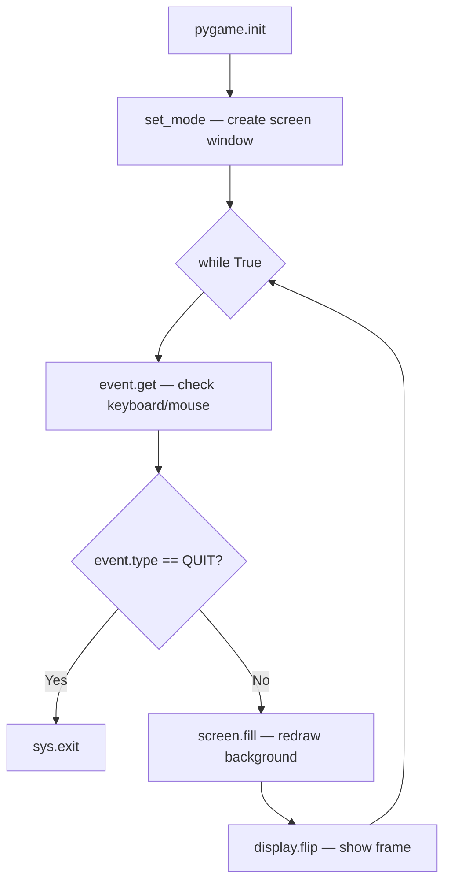
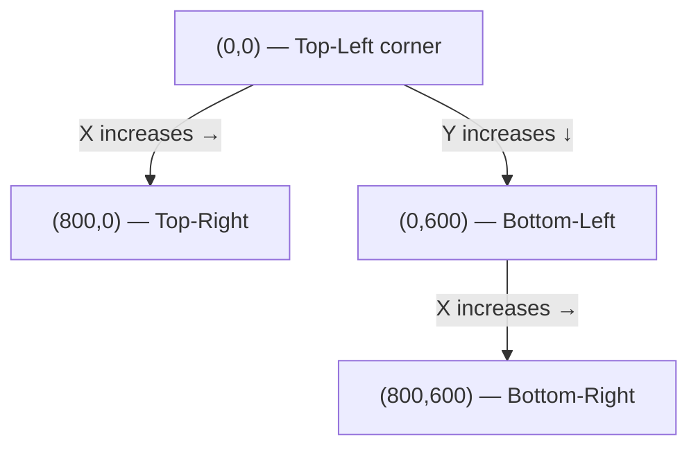
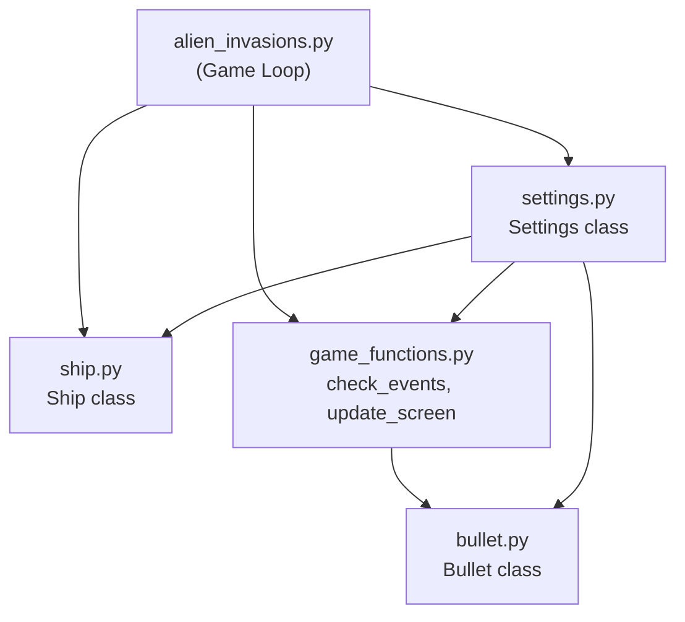

# المحاضرة 13 — Game Project (مشروع اللعبة)
> **المادة:** البرمجة المتقدمة 2 (القسم النظري) | **الموضوع:** بناء لعبة Alien Invasion باستخدام `pygame` — من الصفر إلى الرصاص

---

## الجزء الأول: ملخص منظم (اقرأ قبل المحاضرة!)

### 📍 عن هذه المحاضرة
> هذه المحاضرة تأخذك خطوة بخطوة في بناء لعبة كاملة بـ `Python` و`pygame` — من فتح نافذة فارغة، إلى تحريك سفينة، إلى إطلاق رصاصات.

### 🎯 ستتعلم
- كيف تُنشئ نافذة `pygame` وتستجيب لأحداث المستخدم — الأساس الذي تبنى عليه كل لعبة
- كيف تبني `Settings class` مركزية لتخزين كل إعدادات اللعبة في مكان واحد
- كيف تُحرّك `sprite` بشكل سلس باستخدام `movement flags` بدلاً من تحريكه مباشرة عند الضغط
- كيف تُطلق رصاصات وتديرها كـ `Group` من `sprites` — بما في ذلك حذفها تلقائياً عند خروجها من الشاشة

### 📚 المتطلبات السابقة
- `OOP` بالكامل (Classes, `__init__`, methods, inheritance) — لأن كل عنصر في اللعبة هو class
- مفهوم `while True` loop — قلب اللعبة كله يدور حولها
- أساسيات `pygame` — `import`, `pygame.init()`, `blit()`

### 💡 الأفكار الرئيسية

هذه المحاضرة تبني مشروع **Alien Invasion** — لعبة تصويب كلاسيكية. فكّر فيها كطبقات: في الأسفل عندك `pygame` كمحرك، فوقه عندك كود تنظيمي (`settings`, `game_functions`)، وعلى القمة عندك الكيانات (`Ship`, `Bullet`).

اللعبة كلها تدور في حلقة واحدة لا تنتهي — `while True`. في كل دورة من هذه الحلقة، تحدث ثلاثة أشياء بالترتيب: تفحص الأحداث (ضغطات المفاتيح، إغلاق النافذة)، تحدّث حالة العالم (مواضع السفينة والرصاصات)، ثم تعيد رسم كل شيء على الشاشة. هذا هو **Game Loop** وهو قلب كل لعبة.

الفكرة الذكية في تحريك السفينة هي `movement flags`. بدل ما تحرّك السفينة مباشرة لما تضغط المفتاح، تشعل flag مثل `moving_right = True` عند الضغط، وتطفيه عند الرفع. بعدين في كل دورة من الـ loop تقرأ الـ flag وتحرّك السفينة. النتيجة: حركة سلسة مستمرة بدون توقف.

للرصاصات، تستخدم `pygame.sprite.Group()` — وعاء ذكي يتيح لك تحديث وعرض وحذف عشرات الرصاصات بسطر واحد. كل رصاصة ترث من `Sprite`، وعندما تخرج من الشاشة تُحذف من الـ Group تلقائياً.

### 🔗 كيف تتصل هذه المحاضرة بالمحاضرات الأخرى؟
- **السابقة:** محاضرات OOP علّمتك Classes و Inheritance ← الآن كل عنصر في اللعبة هو class كامل
- **القادمة:** ستضيف الـ Aliens وآليات الاصطدام وعرض النقاط (Score)

### ⚠️ الأخطاء الشائعة الواجب تجنبها

#### الفهم الخاطئ ❌:
"أحرّك السفينة مباشرة عند الضغط على المفتاح بجملة واحدة داخل event handler"

#### الفهم الصحيح ✅:
الضغط يُشعل flag فقط — الحركة الفعلية تحدث في `ship.update()` داخل الـ loop الرئيسي. هذا يعطي حركة سلسة لأن `update()` يُنفَّذ في كل frame.

#### الفهم الخاطئ ❌:
"أحذف الرصاصات من `bullets` مباشرة أثناء التكرار على نفسها"

#### الفهم الصحيح ✅:
دائماً كرّر على نسخة: `for bullet in bullets.copy():` ثم احذف من الأصل. تعديل collection أثناء التكرار عليها يسبب `RuntimeError`.

### لما تحتاج هذا في الامتحان
الأسئلة تركز على: بنية الـ Game Loop الصحيحة (ترتيب check→update→draw)، الفرق بين `KEYDOWN` و`KEYUP`، لماذا نستخدم `float` للسرعة، كيف يعمل `sprite.Group()` وكيف تُطلق رصاصة محدودة، ولماذا `bullets.copy()` في حذف الرصاصات.

---

## الجزء الثاني: الشرح التفصيلي (سطر بسطر / فقرة بفقرة)

### 1. نظرة عامة على اللعبة (Project Overview)

<!-- @render: {type: "prose-first", visualization: "none", coverage: "100%"} -->

#### 💡 الفكرة الأساسية
**Alien Invasion هي لعبة تصويب: سفينة في الأسفل تواجه أسطولاً من الأجانب في الأعلى — الهدف هو إبادتهم قبل أن يصلوا إليك.**

---

#### 📖 الشرح

اللعبة تعمل بهذه القواعد:
- السفينة تظهر في **المنتصف السفلي** من الشاشة
- تتحرك **يميناً ويساراً** بالأسهم وتُطلق رصاصات بـ`Space`
- عند بداية اللعبة، أسطول من الأجانب يملأ الأعلى ويتحرك يميناً ويساراً ثم ينزل
- إذا دمّرت كل الأجانب → أسطول جديد **أسرع** يظهر
- إذا ضرب جنبي سفينتك أو وصل للأسفل → **تخسر سفينة**
- تخسر 3 سفن → **اللعبة تنتهي**

#### 💡 التشبيه:
> تخيّل أنك تلعب Space Invaders على ورق — أنت والخصم تتناوبون الحركة. في pygame، "التناوب" هو الـ Game Loop: في كل دورة يتحرك الجميع خطوة واحدة.
> **وجه الشبه:** كل frame من اللعبة = نوبة واحدة في لعبة الورق

#### 📄 النص الأصلي من المحاضرة
<details>
<summary>عرض النص الأصلي (coverage: 100%)</summary>

**النص الأصلي يقول:**
> In Alien Invasion, the player controls a ship that appears at the bottom center of the screen. The player can move the ship right and left using the arrow keys and shoot bullets using the spacebar. When the game begins, a fleet of aliens fills the sky and moves across and down the screen. The player shoots and destroys the aliens. If the player shoots all the aliens, a new fleet appears that moves faster than the previous fleet. If any alien hits the player's ship or reaches the bottom of the screen, the player loses a ship. If the player loses three ships, the game ends.

**ملاحظة على التغطية:**
- ✓ تم شرح: كل قواعد اللعبة
- ℹ️ إضافة من الدليل: تشبيه Space Invaders لتوضيح الفكرة

</details>

---

### 2. بدء المشروع — إنشاء نافذة `pygame`

<!-- @render: {type: "code-first", visualization: "none", coverage: "100%"} -->
<!-- @connectivity: {prerequisite: "section_1"} -->

#### 💡 الفكرة الأساسية
**أول خطوة في أي لعبة `pygame`: تهيئة المكتبة، إنشاء نافذة، ثم دخول حلقة لا نهاية لها تراقب الأحداث وترسم الشاشة.**

---

#### 📊 المخطط: Game Loop Architecture

#### ما هذا المخطط؟
> يوضّح البنية الأساسية لـ Game Loop — الحلقة اللانهائية التي تشغّل كل لعبة pygame.

#### وصف المراحل:
| # | المرحلة | الدخل | الخرج | الملاحظات |
|---|---------|-------|-------|-----------|
| 1 | `pygame.init()` | — | pygame جاهز | مرة واحدة فقط |
| 2 | `set_mode()` | أبعاد | كائن screen | يُحدد حجم النافذة |
| 3 | `event.get()` | — | قائمة events | QUIT, KEYDOWN, ... |
| 4 | رسم الشاشة | — | صورة معدّلة | `fill()` ثم `blit()` |
| 5 | `display.flip()` | — | تحديث الشاشة | يظهر التغييرات للمستخدم |

#### وصف الروابط:
| من | إلى | الشرط / الحافة | الملاحظات |
|---|---|---|---|
| init | Loop | دائماً | لا تدخل الـ loop قبل init |
| event QUIT | `sys.exit()` | عند إغلاق النافذة | يُنهي البرنامج نهائياً |
| Loop نهاية | Loop بداية | دائماً | تكرار لانهائي |



#### 💻 الكود: `alien_invasions.py` — النسخة الأولى

#### ما هذا الكود؟
> الهيكل الأساسي للعبة: يفتح نافذة فارغة ويبقى مفتوحاً حتى يضغط المستخدم X.

```python
import sys              # needed for sys.exit()
import pygame

def run_game():
    # Initialize pygame, settings, and screen object
    pygame.init()
    screen = pygame.display.set_mode((800, 600))  # width=800, height=600
    pygame.display.set_caption("Alien Invasion")

    # Start the main loop for the game
    while True:
        # Watch for keyboard and mouse events
        for event in pygame.event.get():
            if event.type == pygame.QUIT:
                sys.exit()  # close window cleanly

        # Make the most recently drawn screen visible
        pygame.display.flip()

run_game()
```

#### ملاحظات الأسطر المهمة:
- `pygame.init()` → تُهيئ جميع وحدات pygame قبل استخدامها — **يجب أن تأتي أولاً**
- `set_mode((800, 600))` → tuple من (عرض، ارتفاع) — لاحظ الأقواس المزدوجة
- `pygame.event.get()` → تُعيد قائمة بكل الأحداث التي حدثت منذ آخر استدعاء
- `pygame.display.flip()` → تعرض الـ frame الجديد — بدونها لن ترى أي تغيير

#### 🎯 الملخص السريع
- `pygame.init()` مرة واحدة في البداية
- `while True` هو قلب اللعبة
- `event.get()` يلتقط أحداث المستخدم
- `display.flip()` يُظهر الصورة المرسومة

#### 📄 النص الأصلي من المحاضرة
<details>
<summary>عرض النص الأصلي (coverage: 100%)</summary>

**النص الأصلي يقول:**
> Creating an empty Pygame window to which we can later draw our game elements, such as the ship and the aliens. We'll also have our game respond to user input, set the background color, and load a ship image.

**ملاحظة على التغطية:**
- ✓ تم شرح: النافذة، event loop، `sys.exit()`، `display.flip()`
- ℹ️ إضافة من الدليل: مخطط Game Loop بـ Mermaid

</details>

---

### 3. ضبط لون الخلفية

<!-- @render: {type: "code-first", visualization: "none", coverage: "100%"} -->
<!-- @connectivity: {prerequisite: "section_2"} -->

#### 💡 الفكرة الأساسية
**`screen.fill(color)` يمسح الشاشة بلون ثابت في بداية كل frame — بدون ذلك ستتراكم الرسومات فوق بعضها.**

---

#### 📖 الشرح

في `pygame`، الألوان تُعبَّر كـ `tuple` من ثلاثة أرقام: `(R, G, B)` حيث كل رقم بين 0 و255. لون الخلفية `(230, 230, 230)` هو رمادي فاتح.

`screen.fill(bg_color)` **يجب أن يأتي في بداية رسم كل frame** (قبل رسم السفينة وغيرها) حتى يمسح ما رُسم في الـ frame السابق. إذا نسيته ستبقى صور قديمة على الشاشة.

#### 💻 الكود: إضافة لون الخلفية

```python
def run_game():
    # --snip--
    pygame.display.set_caption("Alien Invasion")
    
    # Set the background color (light gray)
    bg_color = (230, 230, 230)
    
    while True:
        # --snip-- (event handling)
        
        # Redraw the screen during each pass through the loop
        screen.fill(bg_color)  # clear screen with background color each frame
        
        # Make the most recently drawn screen visible
        pygame.display.flip()
```

#### ملاحظات الأسطر المهمة:
- `bg_color = (230, 230, 230)` → RGB tuple — هنا رمادي فاتح. `(0,0,0)` = أسود، `(255,255,255)` = أبيض
- `screen.fill(bg_color)` → **يمسح الشاشة كلها** بالألوان المحددة — يأتي قبل رسم أي شيء

#### 🤔 تفعيل الفهم (اسأل نفسك):
> **سؤال:** ماذا يحدث لو أزلت `screen.fill()` من الكود؟
> **لماذا هذا مهم؟** لأن السفينة في كل frame ستُرسم فوق نفسها في موضعها القديم — ستشاهد "ذيلاً" من الصور خلف السفينة عند تحريكها.

#### 📄 النص الأصلي من المحاضرة
<details>
<summary>عرض النص الأصلي (coverage: 100%)</summary>

**النص الأصلي يقول:**
> bg_color = (230, 230, 230) ... screen.fill(bg_color)

**ملاحظة على التغطية:**
- ✓ تم شرح: RGB، `screen.fill()`، أهمية الترتيب
- ℹ️ إضافة: شرح سبب وضعه في بداية كل frame

</details>

---

### 4. إنشاء `Settings Class`

<!-- @render: {type: "code-first", visualization: "none", coverage: "100%"} -->
<!-- @connectivity: {prerequisite: "section_3"} -->

#### 💡 الفكرة الأساسية
**بدل تشتيت القيم في ملفات مختلفة، نجمع كل إعدادات اللعبة في class واحدة — تغيير إعداد واحد يؤثر على اللعبة كلها.**

---

#### 📖 الشرح

مع نمو اللعبة، ستكون عندك عشرات الإعدادات (سرعة السفينة، حجم الرصاص، عدد الأجانب...). وضعها كـ hardcoded numbers في كل مكان يجعل التعديل كابوساً. الحل: `Settings class` — ملف واحد، class واحدة، كل شيء فيها.

```python
# settings.py
class Settings():
    """A class to store all settings for Alien Invasion."""
    
    def __init__(self):
        """Initialize the game's settings."""
        # Screen settings
        self.screen_width = 800
        self.screen_height = 600
        self.bg_color = (230, 230, 230)
```

ثم في `alien_invasions.py` تستخدمها هكذا:

```python
from settings import Settings

def run_game():
    pygame.init()
    ai_settings = Settings()  # create settings object
    screen = pygame.display.set_mode(
        (ai_settings.screen_width, ai_settings.screen_height)  # use from settings
    )
    # ...
    while True:
        # ...
        screen.fill(ai_settings.bg_color)  # use color from settings
```

#### ملاحظات الأسطر المهمة:
- `ai_settings = Settings()` → نُنشئ كائن إعدادات واحد وتُمرر لكل شيء يحتاجها
- `ai_settings.screen_width` → الوصول للإعداد من أي مكان في الكود
- لاحظ: لا تعديل على `run_game()` إذا أردت تغيير حجم النافذة — فقط غيّر في `settings.py`

#### 💡 التشبيه:
> `Settings class` مثل لوحة التحكم في مصنع — بدلاً من الذهاب لكل آلة وضبطها، تضبط كل شيء من مكان واحد.
> **وجه الشبه:** الإعدادات = اللوحة المركزية | كل class تقرأ منها = آلة في المصنع

#### 🎯 الملخص السريع
- `Settings` class في ملف `settings.py` منفصل
- كل الثوابت كـ `self.attribute` في `__init__`
- تُمرر كـ `ai_settings` لكل class أو function تحتاجها

#### 📄 النص الأصلي من المحاضرة
<details>
<summary>عرض النص الأصلي (coverage: 100%)</summary>

**النص الأصلي يقول:**
> class Settings(): ... self.screen_width = 800, self.screen_height = 600, self.bg_color = (230, 230, 230)

**ملاحظة على التغطية:**
- ✓ تم شرح: هيكل الـ class، الغرض منها، طريقة الاستخدام
- ℹ️ إضافة: تشبيه لوحة التحكم، شرح الفائدة من المركزية

</details>

---

### 5. إضافة صورة السفينة — `Ship Class`

<!-- @render: {type: "code-first", visualization: "none", coverage: "100%"} -->
<!-- @connectivity: {prerequisite: "section_4"} -->

#### 📍 أين نحن الآن؟
الآن عندنا نافذة. الخطوة التالية: نُضيف السفينة — كـ class مستقلة في ملف `ship.py`.

#### 💡 الفكرة الأساسية
**السفينة class مستقلة تحمل صورتها وموضعها ومنطق حركتها — نعزل كل كيان في class خاصة بها.**

---

#### 💻 الكود: `ship.py`

#### ما هذا الكود؟
> يُعرّف class للسفينة: تُحمّل صورتها، تضع نفسها في المنتصف السفلي، ولديها طريقة لرسم نفسها.

```python
import pygame

class Ship():
    def __init__(self, screen):
        """Initialize the ship and set its starting position."""
        self.screen = screen
        
        # Load the ship image and get its rect
        self.image = pygame.image.load('images/ship.bmp')  # load from images folder
        self.rect = self.image.get_rect()                  # bounding rectangle
        self.screen_rect = screen.get_rect()               # screen rectangle
        
        # Start each new ship at the bottom center of the screen
        self.rect.centerx = self.screen_rect.centerx  # align centers horizontally
        self.rect.bottom = self.screen_rect.bottom     # stick to bottom edge
    
    def blitme(self):
        """Draw the ship at its current location."""
        self.screen.blit(self.image, self.rect)  # draw image at rect position
```

ثم في `alien_invasions.py`:

```python
from ship import Ship

def run_game():
    # --snip--
    ship = Ship(screen)  # create ship, pass screen
    
    while True:
        # --snip--
        screen.fill(ai_settings.bg_color)
        ship.blitme()           # draw ship each frame
        pygame.display.flip()
```

#### ملاحظات الأسطر المهمة:
- `pygame.image.load('images/ship.bmp')` → يُحمّل ملف صورة — المسار نسبي من مجلد المشروع
- `self.image.get_rect()` → يُعيد `Rect` object يمثل مستطيل الصورة (width, height, x, y)
- `self.rect.centerx = self.screen_rect.centerx` → تمركز أفقي: centerx السفينة = centerx الشاشة
- `self.rect.bottom = self.screen_rect.bottom` → الحافة السفلية للسفينة = الحافة السفلية للشاشة
- `screen.blit(image, rect)` → يرسم image في الموضع المحدد بـ rect

#### 💡 التشبيه:
> `Rect` في `pygame` مثل بطاقة هوية للصورة — فيها الموضع والحجم. عندما تقول `self.rect.bottom = self.screen_rect.bottom` أنت تقول "ضع أسفل بطاقة هوية السفينة عند أسفل بطاقة هوية الشاشة."
> **وجه الشبه:** Rect = بطاقة هوية | `bottom`, `centerx` = معلومات الموضع فيها

#### 🤔 تفعيل الفهم (اسأل نفسك):
> **سؤال:** لماذا نحفظ `self.screen_rect` داخل الـ `__init__` بدل استدعاء `screen.get_rect()` في كل مرة؟
> **لماذا هذا مهم؟** لأن `get_rect()` تُعيد نفس القيمة دائماً — حفظها يوفر وقت المعالجة في كل frame.

#### 📄 النص الأصلي من المحاضرة
<details>
<summary>عرض النص الأصلي (coverage: 100%)</summary>

**النص الأصلي يقول:**
> self.image = pygame.image.load('images/ship.bmp'), self.rect = self.image.get_rect(), self.screen_rect = screen.get_rect(), self.rect.centerx = self.screen_rect.centerx, self.rect.bottom = self.screen_rect.bottom, def blitme(self): self.screen.blit(self.image, self.rect)

**ملاحظة على التغطية:**
- ✓ تم شرح: `load()`, `get_rect()`, موضع البداية, `blitme()`
- ℹ️ إضافة: تشبيه الـ Rect كبطاقة هوية

</details>

---

### 6. وحدة الدوال `game_functions` Module

<!-- @render: {type: "code-first", visualization: "none", coverage: "100%"} -->
<!-- @connectivity: {prerequisite: "section_5"} -->

#### 💡 الفكرة الأساسية
**نقل الدوال المتكررة من `alien_invasions.py` إلى ملف منفصل `game_functions.py` يُنظّف الكود ويجعله أسهل في الصيانة.**

---

#### 📖 الشرح

الـ Game Loop الرئيسي يتضمن ثلاث عمليات رئيسية: `check_events()` لمعالجة المدخلات، `update_screen()` لإعادة الرسم. نقلهما لـ `game_functions.py` يُبسّط الـ loop الرئيسي لثلاثة أسطر فقط.

#### 💻 الكود: `game_functions.py` — الدوال الأساسية

#### ما هذا الكود؟
> ملف منفصل يحتوي الدوال المساعدة للعبة — يُستورد في `alien_invasions.py`.

```python
# game_functions.py
import sys
import pygame

def check_events():
    """Respond to keypresses and mouse events."""
    for event in pygame.event.get():
        if event.type == pygame.QUIT:
            sys.exit()

def update_screen(ai_settings, screen, ship):
    """Update images on the screen and flip to the new screen."""
    # Redraw the screen during each pass through the loop
    screen.fill(ai_settings.bg_color)
    ship.blitme()
    
    # Make the most recently drawn screen visible
    pygame.display.flip()
```

```python
# alien_invasions.py — after refactoring
import pygame
from settings import Settings
from ship import Ship
import game_functions as gf  # import module with alias

def run_game():
    pygame.init()
    ai_settings = Settings()
    screen = pygame.display.set_mode(
        (ai_settings.screen_width, ai_settings.screen_height))
    pygame.display.set_caption("Alien Invasion")
    ship = Ship(screen)
    
    while True:
        gf.check_events()                              # handle input
        gf.update_screen(ai_settings, screen, ship)   # draw frame

run_game()
```

#### ملاحظات الأسطر المهمة:
- `import game_functions as gf` → نستورد الملف كله بـ alias مختصر — نستدعي دوالها بـ `gf.function_name()`
- الـ loop الرئيسي الآن سطران فقط — أسهل قراءةً وصيانةً

#### 🎯 الملخص السريع
- `check_events()` → تفحص الأحداث وتستجيب لها
- `update_screen()` → تُعيد رسم الشاشة في كل frame
- `import module as alias` → طريقة استيراد الملفات الكاملة

#### 📄 النص الأصلي من المحاضرة
<details>
<summary>عرض النص الأصلي (coverage: 100%)</summary>

**النص الأصلي يقول:**
> def check_events(): ... if event.type == pygame.QUIT: sys.exit() | def update_screen(ai_settings, screen, ship): screen.fill(ai_settings.bg_color), ship.blitme(), pygame.display.flip()

**ملاحظة على التغطية:**
- ✓ تم شرح: `check_events()`, `update_screen()`, `import as`
- ℹ️ إضافة: شرح فائدة الـ refactoring

</details>

---

### 7. تحريك السفينة — `Piloting the Ship`

<!-- @render: {type: "code-first", visualization: "none", coverage: "100%"} -->
<!-- @connectivity: {prerequisite: "section_6"} -->

#### 📍 أين نحن الآن؟
عندنا سفينة مرسومة. الآن نُضيف التحكم فيها.

#### 💡 الفكرة الأساسية
**التحريك بـ flags: اضغط المفتاح → أشعل flag → السفينة تتحرك في كل frame حتى ترفع المفتاح.**

---

#### 7.1. الاستجابة لضغطة المفتاح الواحدة

أبسط طريقة: حرّك السفينة مباشرة عند `KEYDOWN`:

```python
# game_functions.py — simple version (not ideal)
def check_events(ship):
    for event in pygame.event.get():
        if event.type == pygame.QUIT:
            sys.exit()
        elif event.type == pygame.KEYDOWN:
            if event.key == pygame.K_RIGHT:
                ship.rect.centerx += 1  # move one pixel right per keypress
```

**المشكلة:** السفينة تتحرك pixel واحد لكل ضغطة — متقطعة وبطيئة.

---

#### 7.2. الحركة المستمرة بـ `Movement Flags`

الحل الصحيح: استخدام flags في `Ship class`:

```python
# ship.py — updated with movement flags
class Ship():
    def __init__(self, ai_settings, screen):
        """Initialize the ship and set its starting position."""
        self.screen = screen
        self.ai_settings = ai_settings    # store settings reference
        # --snip-- (image loading, position)
        
        # Store decimal center value for smooth movement
        self.center = float(self.rect.centerx)  # float for sub-pixel precision
        
        # Movement flags — start stopped
        self.moving_right = False
        self.moving_left = False
    
    def update(self):
        """Update the ship's position based on movement flags."""
        # Update center value (not rect directly)
        if self.moving_right and self.rect.right < self.screen_rect.right:
            self.center += self.ai_settings.ship_speed_factor  # move right
        if self.moving_left and self.rect.left > 0:
            self.center -= self.ai_settings.ship_speed_factor  # move left
        
        # Update rect from center (rect only holds integers)
        self.rect.centerx = self.center
    
    def blitme(self):
        """Draw the ship at its current location."""
        self.screen.blit(self.image, self.rect)
```

#### 💻 الكود: `game_functions.py` — إدارة المفاتيح

```python
def check_keydown_events(event, ship):
    """Respond to keypresses."""
    if event.key == pygame.K_RIGHT:
        ship.moving_right = True   # set flag on keydown
    elif event.key == pygame.K_LEFT:
        ship.moving_left = True

def check_keyup_events(event, ship):
    """Respond to key releases."""
    if event.key == pygame.K_RIGHT:
        ship.moving_right = False  # clear flag on keyup
    elif event.key == pygame.K_LEFT:
        ship.moving_left = False

def check_events(ship):
    """Respond to keypresses and mouse events."""
    for event in pygame.event.get():
        if event.type == pygame.QUIT:
            sys.exit()
        elif event.type == pygame.KEYDOWN:
            check_keydown_events(event, ship)  # delegate to helper
        elif event.type == pygame.KEYUP:
            check_keyup_events(event, ship)    # delegate to helper
```

```python
# alien_invasions.py — updated loop
while True:
    gf.check_events(ship)   # handle events (set/clear flags)
    ship.update()           # move ship based on flags
    gf.update_screen(ai_settings, screen, ship)  # draw
```

#### ملاحظات الأسطر المهمة:
- `self.center = float(self.rect.centerx)` → نحفظ الموضع كـ `float` لأن `rect` يقبل integers فقط — بدون `float` السرعة الكسرية مثل 1.5 ستُقرَّب وتفقد دقتها
- `self.moving_right = False` → flag مبدئية = متوقفة
- `if self.moving_right and self.rect.right < self.screen_rect.right:` → شرطان: هل تتحرك؟ وهل لم تصل للحافة؟ — هذا **يحدد مدى السفينة**
- `self.rect.centerx = self.center` → بعد تحديث الـ float، نقرّبه ونضعه في الـ rect
- `KEYDOWN` = لما يُضغط المفتاح | `KEYUP` = لما يُرفع

#### 🔍 تتبع التنفيذ: ضغط زر ← ثم رفعه

**المدخل:** المستخدم يضغط ← مع 5 frames ثم يرفع

| Frame | الحدث | Flag | `ship.update()` | موضع X |
|-------|-------|------|-----------------|--------|
| 1 | `KEYDOWN K_LEFT` | `moving_left = True` | تحرك يساراً | 400-1.5=398.5 |
| 2 | — | `True` | تحرك | 397 |
| 3 | — | `True` | تحرك | 395.5 |
| 4 | — | `True` | تحرك | 394 |
| 5 | `KEYUP K_LEFT` | `moving_left = False` | لا حركة | 394 |

**النتيجة:** حركة سلسة مستمرة فقط أثناء الضغط.

#### ⚖️ المقايضة: Direct Move vs Flags

| | Direct Move | Movement Flags |
|---|---|---|
| **المزايا** | بسيطة جداً | حركة سلسة، دقة عالية |
| **العيوب** | حركة متقطعة | كود أطول قليلاً |
| **متى تختاره** | macros/shortcuts | الحركة المستمرة في الألعاب |

#### 📄 النص الأصلي من المحاضرة
<details>
<summary>عرض النص الأصلي (coverage: 100%)</summary>

**النص الأصلي يقول:**
> Moving Both Left and Right: self.moving_right = False, self.moving_left = False, def update(self): if self.moving_right: self.rect.centerx += 1, if self.moving_left: self.rect.centerx -= 1 | Adjusting Speed: self.ship_speed_factor = 1.5 | Limiting Range: if self.moving_right and self.rect.right < self.screen_rect.right | Refactoring check_events: check_keydown_events, check_keyup_events

**ملاحظة على التغطية:**
- ✓ تم شرح: flags، `update()`، السرعة، تحديد المدى، refactoring
- ℹ️ إضافة: جدول تتبع التنفيذ، مقارنة الطريقتين، شرح لماذا `float`

</details>

---

### 8. ضبط سرعة السفينة

<!-- @render: {type: "code-first", visualization: "none", coverage: "100%"} -->
<!-- @connectivity: {prerequisite: "section_7"} -->

#### 💡 الفكرة الأساسية
**بتخزين السرعة في `settings.py` كـ `float`، يمكن ضبطها بدقة عالية دون تعديل كود الحركة نفسه.**

---

```python
# settings.py — add ship speed
class Settings():
    def __init__(self):
        # --snip--
        # Ship settings
        self.ship_speed_factor = 1.5  # pixels per frame — float for precision
```

```python
# ship.py — use speed from settings
def update(self):
    if self.moving_right and self.rect.right < self.screen_rect.right:
        self.center += self.ai_settings.ship_speed_factor   # 1.5 pixels/frame
    if self.moving_left and self.rect.left > 0:
        self.center -= self.ai_settings.ship_speed_factor
    
    self.rect.centerx = self.center  # int truncation here is fine
```

```python
# alien_invasions.py — pass ai_settings to Ship
ship = Ship(ai_settings, screen)  # now Ship needs ai_settings too
```

#### ملاحظات الأسطر المهمة:
- `ship_speed_factor = 1.5` → سرعة كسرية ممكنة بفضل `self.center = float(...)` — بدون float لن تلاحظ الفرق بين 1.0 و1.5 لأن `rect` يقرّب للعدد الصحيح
- `self.rect.centerx = self.center` → في كل frame نقرّب الـ float لأقرب int، لكن التراكم الدقيق يحفظه الـ `self.center`

#### نقطة مهمة ⚠️:
> لماذا `self.center` بدلاً من تحديث `self.rect.centerx` مباشرة؟ لأن `rect` يخزن integers فقط. إذا السرعة 1.5 وحدّثت `rect` مباشرة، كل frame تضيف 1.5 لكن `rect` يخزّنه كـ 1 أو 2 — خطأ تراكمي. بـ `self.center` (float) التراكم دقيق، ونقرّبه فقط عند الرسم.

---

### 9. إطلاق الرصاصات — `Shooting Bullets`

<!-- @render: {type: "code-first", visualization: "none", coverage: "100%"} -->
<!-- @connectivity: {prerequisite: "section_8"} -->

#### 📍 أين نحن الآن؟
السفينة تتحرك. الآن نُضيف قدرتها على إطلاق الرصاص.

#### 💡 الفكرة الأساسية
**الرصاصة `Sprite` تُنشأ عند الضغط على `Space`، تتحرك للأعلى في كل frame، وتُحذف تلقائياً عند خروجها من الشاشة.**

---

#### 9.1. إعدادات الرصاص في `settings.py`

```python
# settings.py
class Settings():
    def __init__(self):
        # --snip--
        # Bullet settings
        self.bullet_speed_factor = 1       # pixels per frame upward
        self.bullet_width = 3              # narrow bullet
        self.bullet_height = 15            # tall bullet
        self.bullet_color = 60, 60, 60     # dark gray
        self.bullets_allowed = 3           # max bullets on screen at once
```

---

#### 9.2. `Bullet Class` في `bullet.py`

#### 💻 الكود: `bullet.py`

#### ما هذا الكود؟
> class تمثل رصاصة واحدة: تُنشأ في موضع السفينة، وترتفع للأعلى بكل frame.

```python
import pygame
from pygame.sprite import Sprite  # inherit from Sprite for group management

class Bullet(Sprite):
    """A class to manage bullets fired from the ship."""
    
    def __init__(self, ai_settings, screen, ship):
        """Create a bullet object at the ship's current position."""
        super(Bullet, self).__init__()  # initialize parent Sprite
        self.screen = screen
        
        # Create a bullet rect at (0,0) then set correct position
        self.rect = pygame.Rect(0, 0, 
                                ai_settings.bullet_width,
                                ai_settings.bullet_height)
        self.rect.centerx = ship.rect.centerx   # align with ship center
        self.rect.top = ship.rect.top            # start at ship's top
        
        # Store bullet's position as decimal for precision
        self.y = float(self.rect.y)
        
        self.color = ai_settings.bullet_color
        self.speed_factor = ai_settings.bullet_speed_factor
    
    def update(self):
        """Move the bullet up the screen."""
        # Update decimal position
        self.y -= self.speed_factor      # move up (y decreases going up)
        # Update rect position
        self.rect.y = self.y
    
    def draw_bullet(self):
        """Draw the bullet to the screen."""
        pygame.draw.rect(self.screen, self.color, self.rect)  # draw filled rect
```

#### ملاحظات الأسطر المهمة:
- `class Bullet(Sprite)` → ترث من `Sprite` لتستفيد من `Group` management
- `super(Bullet, self).__init__()` → تستدعي `__init__` الأب لإعداد الـ Sprite
- `pygame.Rect(0, 0, width, height)` → ننشئ مستطيلاً يدوياً (ليس من صورة)
- `self.rect.top = ship.rect.top` → تبدأ الرصاصة من أعلى السفينة (تخرج من فوق السفينة)
- `self.y -= self.speed_factor` → **ناقص** لأن Y في pygame يزداد للأسفل — للأعلى نُنقص Y

#### 📊 المخطط: محاور الإحداثيات في `pygame`

#### ما هذا المخطط؟
> توضيح اتجاه محاور X وY في pygame — عكس ما تعلمته في الرياضيات.



#### نقطة مهمة ⚠️:
> في `pygame`: (0,0) هو **الزاوية العليا اليسرى** — Y يزداد للأسفل وينقص للأعلى. لذلك للتحرك للأعلى نكتب `self.y -= speed`.

---

#### 9.3. تخزين الرصاصات في `Group` وإدارتها

```python
# alien_invasions.py
import pygame
from pygame.sprite import Group   # Group manages collections of sprites
from settings import Settings
from ship import Ship
import game_functions as gf

def run_game():
    pygame.init()
    ai_settings = Settings()
    screen = pygame.display.set_mode(
        (ai_settings.screen_width, ai_settings.screen_height))
    pygame.display.set_caption("Alien Invasion")
    
    ship = Ship(ai_settings, screen)
    bullets = Group()   # container for all active bullets
    
    while True:
        gf.check_events(ai_settings, screen, ship, bullets)  # may add bullets
        ship.update()
        gf.update_bullets(bullets)    # move + delete off-screen bullets
        gf.update_screen(ai_settings, screen, ship, bullets)
```

```python
# game_functions.py — bullet-related functions

def fire_bullet(ai_settings, screen, ship, bullets):
    """Fire a bullet if limit not reached yet."""
    # Create a new bullet only if below limit
    if len(bullets) < ai_settings.bullets_allowed:
        new_bullet = Bullet(ai_settings, screen, ship)
        bullets.add(new_bullet)      # add to Group

def check_keydown_events(event, ai_settings, screen, ship, bullets):
    """Respond to keypresses."""
    if event.key == pygame.K_RIGHT:
        ship.moving_right = True
    elif event.key == pygame.K_LEFT:
        ship.moving_left = True
    elif event.key == pygame.K_SPACE:
        fire_bullet(ai_settings, screen, ship, bullets)  # fire on spacebar

def update_bullets(bullets):
    """Update position of bullets and get rid of old bullets."""
    # Update bullet positions (calls update() on each sprite)
    bullets.update()
    
    # Get rid of bullets that have disappeared off top
    for bullet in bullets.copy():          # iterate over COPY
        if bullet.rect.bottom <= 0:        # bullet went off top of screen
            bullets.remove(bullet)         # remove from original group

def update_screen(ai_settings, screen, ship, bullets):
    """Update images on the screen and flip to the new screen."""
    screen.fill(ai_settings.bg_color)
    
    # Draw all bullets behind ship
    for bullet in bullets.sprites():
        bullet.draw_bullet()
    
    ship.blitme()         # ship drawn after bullets (appears in front)
    pygame.display.flip()
```

#### ملاحظات الأسطر المهمة:
- `bullets = Group()` → container يدير مجموعة sprites — يوفر `update()`, `sprites()`, `add()`, `remove()`
- `len(bullets) < ai_settings.bullets_allowed` → نُحدد عدد الرصاصات الفعالة في نفس الوقت
- `bullets.update()` → يستدعي `update()` على **كل** bullet في الـ Group دفعة واحدة
- `for bullet in bullets.copy():` → **يجب** التكرار على نسخة — تعديل collection أثناء التكرار خطأ
- `bullet.rect.bottom <= 0` → الحافة السفلية للرصاصة وصلت فوق الشاشة (خرجت تماماً)
- `bullets.sprites()` → يُعيد list من الـ sprites للتكرار عليها في الرسم

#### 🤔 تفعيل الفهم (اسأل نفسك):
> **سؤال:** لماذا `bullets.copy()` في `update_bullets` وليس `bullets.sprites()`؟
> **لماذا هذا مهم؟** لأننا نحذف من `bullets` أثناء التكرار. التكرار على `sprites()` (المرجع الأصلي) ثم الحذف منه في نفس الوقت يُسبب تخطّي عناصر أو `RuntimeError`. `copy()` يُعطينا نسخة ثابتة للتكرار، ونحذف من الأصل بأمان.

#### 🔍 تتبع التنفيذ: إطلاق وحذف رصاصة

**المدخل:** `bullets_allowed = 3`، لا رصاصات حالياً

| الخطوة | العملية | حالة `bullets` |
|--------|---------|----------------|
| 1 | Space مضغوط | `fire_bullet()` يُنشئ رصاصة | `len = 1` |
| 2 | Space مضغوط | `fire_bullet()` ينشئ | `len = 2` |
| 3 | Space مضغوط | `fire_bullet()` ينشئ | `len = 3` |
| 4 | Space مضغوط | `len(3) < 3` خاطئة — لا رصاصة جديدة | `len = 3` |
| 5 | رصاصة تخرج من أعلى | `update_bullets` تحذفها | `len = 2` |
| 6 | Space مضغوط | `len(2) < 3` صحيحة — رصاصة جديدة | `len = 3` |

**النتيجة:** دائماً ≤ 3 رصاصات على الشاشة.

#### 📄 النص الأصلي من المحاضرة
<details>
<summary>عرض النص الأصلي (coverage: 100%)</summary>

**النص الأصلي يقول:**
> Bullet Settings: bullet_speed_factor=1, bullet_width=3, bullet_height=15, bullet_color=60,60,60, bullets_allowed=3 | Bullet class inheriting Sprite | Storing in Group | fire_bullet() | update_bullets() with bullets.copy() | Creating fire_bullet() function

**ملاحظة على التغطية:**
- ✓ تم شرح: كل جوانب الرصاص من الإعدادات إلى الحذف
- ℹ️ إضافة: مخطط المحاور، جدول تتبع التنفيذ، شرح `copy()` vs `sprites()`

</details>

---

### 10. ملخص بنية المشروع (Quick Recap)

<!-- @render: {type: "prose-first", visualization: "none", coverage: "100%"} -->

#### 💡 الفكرة الأساسية
**المشروع مقسّم على ملفات منفصلة، كل ملف له مسؤولية واضحة — هذا مبدأ Single Responsibility.**

---

#### 📊 المخطط: بنية ملفات المشروع

#### ما هذا المخطط؟
> يوضّح العلاقة بين ملفات المشروع الخمسة.

#### وصف العُقد:
| # | الملف | النوع | الدور |
|---|-------|-------|-------|
| 1 | `alien_invasions.py` | Main | نقطة البدء + Game Loop |
| 2 | `settings.py` | Config | كل الإعدادات |
| 3 | `ship.py` | Class | السفينة وحركتها |
| 4 | `bullet.py` | Class | الرصاصة وحركتها |
| 5 | `game_functions.py` | Functions | دوال Event/Screen |

#### وصف الروابط:
| من | إلى | التسمية | نوع السهم |
|---|---|---|---|
| `alien_invasions.py` | `settings.py` | `from settings import Settings` | import |
| `alien_invasions.py` | `ship.py` | `from ship import Ship` | import |
| `alien_invasions.py` | `game_functions.py` | `import game_functions as gf` | import |
| `game_functions.py` | `bullet.py` | `from bullet import Bullet` | import |



#### 🎯 دور كل ملف:
- **`alien_invasions.py`** → نقطة البدء الوحيدة. ينشئ الكائنات ويُشغّل الـ loop
- **`settings.py`** → مخزن الإعدادات. `__init__()` فقط
- **`ship.py`** → السفينة: صورتها، موضعها، حركتها (`update()`)، رسمها (`blitme()`)
- **`bullet.py`** → الرصاصة: موضعها، حركتها للأعلى، رسمها (`draw_bullet()`)
- **`game_functions.py`** → الدوال: فحص الأحداث، تحديث الرصاص، رسم الشاشة

#### 📄 النص الأصلي من المحاضرة
<details>
<summary>عرض النص الأصلي (coverage: 100%)</summary>

**النص الأصلي يقول:**
> alien_invasion.py: creates important objects, stores main loop — while True calls check_events(), ship.update(), update_screen(). settings.py: Settings class, __init__() only. game_functions.py: check_events(), check_keydown/keyup, update_screen(). ship.py: __init__(), update(), blitme(), ship.bmp in images folder.

**ملاحظة على التغطية:**
- ✓ تم شرح: دور كل ملف بالكامل
- ℹ️ إضافة: مخطط Mermaid للعلاقات

</details>

---

## الجزء الثالث: أسئلة اختيار من متعدد (MCQ)

> **16 سؤالاً** — مستوى: medium / hard

### السؤال 1 (medium)

ما الغرض من استدعاء `pygame.display.flip()` في نهاية كل frame؟

أ) حذف كل الكائنات المرسومة  
ب) عرض محتوى الـ frame المُحضَّر للمستخدم  
ج) تحديث إحداثيات الـ sprites  
د) إيقاف الـ game loop مؤقتاً  

**الإجابة الصحيحة: ب**

**التعليل:**
- ✅ **الخيار ب:** `pygame` يستخدم double buffering — ترسم في buffer خفي، ثم `flip()` يُظهره للمستخدم
- ❌ **الخيار أ:** الحذف يحدث بـ `screen.fill()` في بداية الـ frame
- ❌ **الخيار ج:** تحديث الإحداثيات يحدث في `update()` methods
- ❌ **الخيار د:** `flip()` لا تُوقف الـ loop

---

### السؤال 2 (medium)

لماذا نستخدم `self.center = float(self.rect.centerx)` في `Ship.__init__()`؟

أ) لأن `pygame.Rect` يقبل float فقط  
ب) للحصول على دقة sub-pixel عند السرعات الكسرية  
ج) لتحويل الإحداثيات لنظام مختلف  
د) لأن `centerx` يُعيد string  

**الإجابة الصحيحة: ب**

**التعليل:**
- ✅ **الخيار ب:** `Rect` يخزّن integers فقط. سرعة 1.5 pixel/frame تفقد دقتها إذا خزّنتها في `rect` مباشرة. `self.center` float يحفظ الدقة
- ❌ **الخيار أ:** `Rect` يقبل integers، لا float
- ❌ **الخيار ج:** المحاور هي نفسها
- ❌ **الخيار د:** `centerx` يُعيد int

---

### السؤال 3 (hard)

ما الناتج لو كتبنا `for bullet in bullets:` بدل `for bullet in bullets.copy():` في `update_bullets()`؟

أ) كود أسرع لأننا لا ننسخ  
ب) احتمال `RuntimeError` أو تخطّي رصاصات  
ج) لا فرق في النتيجة  
د) سيُحذف ضعف الرصاصات  

**الإجابة الصحيحة: ب**

**التعليل:**
- ✅ **الخيار ب:** تعديل collection أثناء التكرار عليها سلوك غير محدد في Python — قد تُتخطى عناصر أو تُرمى `RuntimeError`
- ❌ **الخيار أ:** السرعة لا تستحق خطر الخطأ
- ❌ **الخيار ج:** النتيجة غير مضمونة وقد تكون خاطئة
- ❌ **الخيار د:** لا علاقة بمضاعفة الحذف

---

### السؤال 4 (medium)

أي شرط يُوقف السفينة عند الحافة اليمنى للشاشة؟

أ) `if self.moving_right and self.rect.right < self.screen_rect.right:`  
ب) `if self.moving_right and self.rect.left < self.screen_rect.right:`  
ج) `if self.moving_right:`  
د) `if self.rect.centerx < self.screen_rect.width:`  

**الإجابة الصحيحة: أ**

**التعليل:**
- ✅ **الخيار أ:** يتحرك يميناً فقط إذا كانت **الحافة اليمنى** للسفينة لم تصل **الحافة اليمنى** للشاشة
- ❌ **الخيار ب:** `rect.left` يُقارن الجانب الخاطئ — السفينة ستختفي جزئياً
- ❌ **الخيار ج:** لا حد للحركة — السفينة تخرج من الشاشة
- ❌ **الخيار د:** منطق غير صحيح — `centerx` لا يحمي الحواف

---

### السؤال 5 (medium)

في `Bullet.update()`، لماذا نكتب `self.y -= self.speed_factor` (ناقص) للحركة للأعلى؟

أ) خطأ — يجب أن يكون `+=`  
ب) لأن محور Y في `pygame` يزداد للأسفل، فللأعلى نُنقص  
ج) لأن الرصاصة تتحرك للأسفل  
د) لأن `speed_factor` قيمة سالبة  

**الإجابة الصحيحة: ب**

**التعليل:**
- ✅ **الخيار ب:** في `pygame` (0,0) هو الزاوية العليا اليسرى — Y يزداد للأسفل. الأعلى = قيمة Y أصغر = ناقص
- ❌ **الخيار أ:** `+=` سيُحرّك الرصاصة للأسفل
- ❌ **الخيار ج:** الرصاصة تتحرك للأعلى نحو الأجانب
- ❌ **الخيار د:** `speed_factor = 1` موجبة

---

### السؤال 6 (hard)

ما الفرق بين `bullets.sprites()` و `bullets.copy()` في السياق التالي: `for b in ___: bullets.remove(b)`؟

أ) `sprites()` يُعيد tuple، `copy()` يُعيد set  
ب) كلاهما آمن للحذف أثناء التكرار  
ج) `copy()` يُنشئ نسخة مستقلة — آمن للحذف. `sprites()` قد يُسبب مشاكل  
د) `sprites()` أسرع دائماً  

**الإجابة الصحيحة: ج**

**التعليل:**
- ✅ **الخيار ج:** `bullets.copy()` يُعيد نسخة مستقلة من قائمة الـ sprites — التكرار عليها آمن أثناء تعديل الأصل. `sprites()` قد يُعيد view مرتبطاً بالأصل
- ❌ **الخيار أ:** `copy()` يُعيد set/list حسب التنفيذ، لكن الأهم هو الاستقلالية
- ❌ **الخيار ب:** `sprites()` ليس آمناً للتعديل المتزامن
- ❌ **الخيار د:** السرعة ليست الاعتبار الرئيسي هنا

---

### السؤال 7 (medium)

في أي ترتيب يجب أن يُستدعى `ship.blitme()` و `bullet.draw_bullet()` و `pygame.display.flip()`؟

أ) `flip()` → `ship.blitme()` → `bullet.draw_bullet()`  
ب) `bullet.draw_bullet()` → `ship.blitme()` → `flip()`  
ج) `ship.blitme()` → `bullet.draw_bullet()` → `flip()`  
د) `flip()` → `bullet.draw_bullet()` → `ship.blitme()`  

**الإجابة الصحيحة: ب**

**التعليل:**
- ✅ **الخيار ب:** ارسم الرصاص أولاً (يظهر خلف السفينة)، ثم السفينة فوقهم، ثم `flip()` يُظهر كل شيء
- ❌ **الخيار أ:** `flip()` يأتي آخراً دائماً — يُظهر ما رُسم، لا يبدأ الرسم
- ❌ **الخيار ج:** السفينة قبل الرصاص — الرصاص سيظهر فوق السفينة بصرياً
- ❌ **الخيار د:** خطأ في ترتيب الـ flip

---

### السؤال 8 (hard)

ما الذي يحدث لو حذفت `screen.fill(ai_settings.bg_color)` من `update_screen()`؟

أ) اللعبة تُغلق تلقائياً  
ب) الشاشة تصبح سوداء  
ج) تتراكم صور الـ frames السابقة — "ghosting"  
د) الرصاصات لن تُرسم  

**الإجابة الصحيحة: ج**

**التعليل:**
- ✅ **الخيار ج:** `fill()` يمسح الـ frame السابق. بدونه كل frame يُرسم **فوق** السابق — السفينة والرصاصات تترك "خطوطاً" خلفها
- ❌ **الخيار أ:** pygame لن يُغلق
- ❌ **الخيار ب:** الخلفية الافتراضية ليست بالضرورة سوداء
- ❌ **الخيار د:** الرصاصات ستُرسم، لكن القديمة لن تُمحى

---

### السؤال 9 (medium)

لماذا نُمرر `screen` لـ `Ship.__init__()` بدلاً من إنشاء `screen` جديد داخلها؟

أ) `pygame` لا يسمح بأكثر من `screen` واحدة  
ب) إنشاء `screen` داخل Class غير ممكن تقنياً  
ج) لضمان أن كل الكائنات ترسم على **نفس** الشاشة — injection pattern  
د) لتوفير الذاكرة  

**الإجابة الصحيحة: ج**

**التعليل:**
- ✅ **الخيار ج:** Dependency Injection — نُمرّر الـ screen من الخارج لضمان أن السفينة والرصاص والأجانب كلهم يرسمون على نفس السطح
- ❌ **الخيار أ:** `pygame` تقنياً تدعم surfaces متعددة
- ❌ **الخيار ب:** ممكن تقنياً لكن سيُنشئ نافذة ثانية
- ❌ **الخيار د:** الذاكرة ليست السبب الأساسي

---

### السؤال 10 (hard)

ماذا يفعل هذا الكود؟
```python
if len(bullets) < ai_settings.bullets_allowed:
    new_bullet = Bullet(ai_settings, screen, ship)
    bullets.add(new_bullet)
```

أ) يُطلق رصاصة في كل frame  
ب) يُطلق رصاصة واحدة فقط طوال اللعبة  
ج) يُطلق رصاصة جديدة فقط إذا كان عدد الرصاصات الحالية أقل من الحد الأقصى  
د) يُحذف الرصاصة الأقدم ويُضيف جديدة  

**الإجابة الصحيحة: ج**

**التعليل:**
- ✅ **الخيار ج:** `len(bullets) < bullets_allowed` يتحقق من العدد الحالي — إذا وصل للحد الأقصى، لا رصاصة جديدة
- ❌ **الخيار أ:** يُستدعى فقط عند `K_SPACE`، وفيه شرط
- ❌ **الخيار ب:** يمكن إطلاق رصاصات جديدة بعد اختفاء القديمة
- ❌ **الخيار د:** لا يُحذف أي شيء هنا

---

### السؤال 11 (medium)

ما الفرق بين `pygame.KEYDOWN` و `pygame.KEYUP`؟

أ) `KEYDOWN` للماوس، `KEYUP` للكيبورد  
ب) `KEYDOWN` يُطلق مرة واحدة عند الضغط، `KEYUP` عند الرفع  
ج) كلاهما نفس الحدث بأسماء مختلفة  
د) `KEYDOWN` يعمل للحروف فقط  

**الإجابة الصحيحة: ب**

**التعليل:**
- ✅ **الخيار ب:** `KEYDOWN` يُولَّد مرة عند لحظة الضغط. `KEYUP` مرة عند لحظة الرفع — هذا الفرق هو أساس نظام الـ flags
- ❌ **الخيار أ:** كلاهما لأحداث الكيبورد
- ❌ **الخيار ج:** أحداث مختلفة تماماً
- ❌ **الخيار د:** يعمل لجميع المفاتيح

---

### السؤال 12 (hard)

لماذا يرث `Bullet` من `Sprite` وليس من class عادية؟

أ) لاستخدام `pygame.Rect` فقط  
ب) للاستفادة من `Group` — الذي يُتيح `update()` و `remove()` الجماعيين  
ج) لأن `pygame.image.load()` تشترط ذلك  
د) للوصول لـ `ai_settings`  

**الإجابة الصحيحة: ب**

**التعليل:**
- ✅ **الخيار ب:** `Sprite` مع `Group` يُتيح `bullets.update()` (يُحدث كل sprite دفعة واحدة)، `bullets.remove()` الذكي، وفحوصات الاصطدام لاحقاً
- ❌ **الخيار أ:** `Rect` مستقل عن `Sprite`
- ❌ **الخيار ج:** `load()` لا تشترط Sprite
- ❌ **الخيار د:** `ai_settings` يُمرَّر في `__init__`

---

### السؤال 13 (medium)

أي قيمة `bg_color` تُعطي شاشة سوداء تماماً؟

أ) `(255, 255, 255)`  
ب) `(0, 0, 0)`  
ج) `(128, 128, 128)`  
د) `(230, 230, 230)`  

**الإجابة الصحيحة: ب**

**التعليل:**
- ✅ **الخيار ب:** RGB (0,0,0) = لا أحمر، لا أخضر، لا أزرق = أسود
- ❌ **الخيار أ:** (255,255,255) = أبيض كامل
- ❌ **الخيار ج:** (128,128,128) = رمادي متوسط
- ❌ **الخيار د:** (230,230,230) = رمادي فاتح — لون الخلفية في المثال

---

### السؤال 14 (hard)

ما الذي يحدد **موضع** الرصاصة عند إنشائها؟

أ) موضع السفينة في لحظة إطلاق الرصاصة  
ب) مركز الشاشة دائماً  
ج) موضع السفينة عند بداية اللعبة  
د) موضع عشوائي  

**الإجابة الصحيحة: أ**

**التعليل:**
- ✅ **الخيار أ:** `self.rect.centerx = ship.rect.centerx` و `self.rect.top = ship.rect.top` في `Bullet.__init__()` — القيم تُقرأ في **لحظة الإنشاء**
- ❌ **الخيار ب:** تظهر من الشاشة بالكامل لو كانت في المركز دائماً
- ❌ **الخيار ج:** السفينة قد تكون تحركت منذ بداية اللعبة
- ❌ **الخيار د:** لا عشوائية في الإنشاء

---

### السؤال 15 (medium)

في الـ Game Loop، ما الترتيب الصحيح للعمليات؟

أ) `update_screen` → `check_events` → `ship.update` → `update_bullets`  
ب) `check_events` → `ship.update` → `update_bullets` → `update_screen`  
ج) `ship.update` → `check_events` → `update_screen` → `update_bullets`  
د) `update_bullets` → `update_screen` → `check_events` → `ship.update`  

**الإجابة الصحيحة: ب**

**التعليل:**
- ✅ **الخيار ب:** 1) اقرأ المدخلات → 2) حدّث الحالة → 3) ارسم. المدخلات أولاً لأنها تُغيّر الحالة، الرسم آخراً لأنه يعكس الحالة النهائية
- ❌ **الخيار أ:** الرسم أولاً سيُظهر الحالة القديمة دائماً
- ❌ **الخيار ج:** التحديث قبل قراءة المدخلات — تأخير frame واحد
- ❌ **الخيار د:** ترتيب عشوائي

---

### السؤال 16 (hard)

ما فائدة `import game_functions as gf` مقارنة بـ `from game_functions import *`؟

أ) `as gf` أسرع في التنفيذ  
ب) `as gf` يُوضح مصدر الدالة — `gf.check_events()` أوضح من `check_events()`  
ج) `from ... import *` يُسبب خطأ في `pygame`  
د) لا فرق بينهما  

**الإجابة الصحيحة: ب**

**التعليل:**
- ✅ **الخيار ب:** `gf.check_events()` يُوضّح أن الدالة من `game_functions` — يمنع تعارض الأسماء ويُسهّل قراءة الكود
- ❌ **الخيار أ:** السرعة متماثلة عملياً
- ❌ **الخيار ج:** `import *` يعمل لكن يُلوّث `namespace`
- ❌ **الخيار د:** الفرق في وضوح المصدر مهم

---

## الجزء الثالث: بطاقات سؤال وجواب (Q&A Cards)

### البطاقة 1
**Q1:** ما هو الـ Game Loop وما ترتيب خطواته الثلاث الرئيسية؟
**A:** حلقة `while True` لا تنتهي تُشغّل اللعبة. الترتيب: (1) `check_events` — قراءة المدخلات، (2) تحديث الحالة (`ship.update`, `update_bullets`)، (3) `update_screen` — رسم الـ frame الجديد.

### البطاقة 2
**Q2:** لماذا نستخدم `movement flags` بدل تحريك السفينة مباشرة في `check_events()`؟
**A:** الـ flags (`moving_right`, `moving_left`) تُشعَل عند `KEYDOWN` وتُطفأ عند `KEYUP`، والحركة الفعلية تحدث في `ship.update()` في كل frame — ينتج عنه حركة سلسة مستمرة بدل حركة متقطعة.

### البطاقة 3
**Q3:** لماذا نحفظ موضع السفينة في `self.center = float(...)` بدل تحديث `self.rect.centerx` مباشرة؟
**A:** لأن `Rect` يخزّن integers فقط. سرعة كسرية كـ 1.5 تفقد دقتها إذا خُزِّنت في `rect`. `self.center` float يحفظ التراكم الدقيق، ويُنقل للـ `rect` عند الرسم.

### البطاقة 4
**Q4:** ما وظيفة `Settings class`؟ لماذا نضعها في ملف منفصل؟
**A:** تخزّن كل إعدادات اللعبة (أبعاد الشاشة، السرعات، ألوان...) في مكان واحد. ملف منفصل يعني تغيير إعداد واحد يؤثر على اللعبة كلها بدون البحث في الكود.

### البطاقة 5
**Q5:** ما فرق `KEYDOWN` عن `KEYUP`؟
**A:** `KEYDOWN` يُولَّد لحظة الضغط على المفتاح (مرة واحدة). `KEYUP` عند رفعه. معاً يُشكّلان أساس نظام الـ movement flags.

### البطاقة 6
**Q6:** لماذا تُنشئ `Bullet` في موضع السفينة الحالي وليس ثابتاً؟
**A:** لأن السفينة تتحرك — عند الضغط على Space، نقرأ `ship.rect.centerx` و`ship.rect.top` في لحظة الإطلاق فتخرج الرصاصة من موضع السفينة الحالي بدقة.

### البطاقة 7
**Q7:** لماذا نكتب `for bullet in bullets.copy():` لا `for bullet in bullets:`؟
**A:** لأننا نحذف من `bullets` داخل نفس الحلقة. التعديل على collection أثناء التكرار عليها يُسبب `RuntimeError` أو تخطّي عناصر. `copy()` يُعطينا نسخة ثابتة آمنة.

### البطاقة 8
**Q8:** كيف يعمل `pygame.sprite.Group()`؟ ما ميزته على list عادية؟
**A:** `Group` وعاء مخصص للـ sprites يُتيح: `bullets.update()` (يُحدّث كل sprite)، `bullets.add/remove()` (إضافة وحذف آمن)، `bullets.sprites()` (الحصول على الـ list)، وفحوصات الاصطدام مستقبلاً.

### البطاقة 9
**Q9:** ما دور `super(Bullet, self).__init__()` في `Bullet class`؟
**A:** يستدعي `__init__` الـ parent class وهي `Sprite` — ضروري لإعداد المتغيرات الداخلية للـ Sprite وضمان أنها تعمل مع `Group` بشكل صحيح.

### البطاقة 10
**Q10:** ما هو RGB وكيف يُعبَّر عنه في `pygame`؟
**A:** Red-Green-Blue — كل قناة بين 0 و255. في `pygame` يُكتب كـ tuple: `(230, 230, 230)` = رمادي فاتح، `(0,0,0)` = أسود، `(255,255,255)` = أبيض.

### البطاقة 11
**Q11:** لماذا يحدث `screen.fill(bg_color)` في بداية كل frame لا نهايته؟
**A:** لأنه يمسح الـ frame السابق قبل رسم الجديد. ترتيب نهاية frame: fill → draw all objects → flip. إذا وضعته بعد الرسم ستمسح ما رسمته للتو.

### البطاقة 12
**Q12:** ما الشرطان اللذان يمنعان السفينة من الخروج من الشاشة؟
**A:** للحركة اليمنى: `self.rect.right < self.screen_rect.right` — الحافة اليمنى للسفينة لم تصل للحافة اليمنى للشاشة. لليسار: `self.rect.left > 0` — الحافة اليسرى للسفينة لم تصل الحد الأيسر (0).

### البطاقة 13
**Q13:** ما فائدة `bullets_allowed = 3` في الإعدادات؟
**A:** تُحدّد أقصى عدد رصاصات على الشاشة في نفس الوقت — تُضيف تحدياً للعبة وتمنع الـ spamming. عند الضغط على Space، ننشئ رصاصة جديدة فقط إذا `len(bullets) < bullets_allowed`.

### البطاقة 14
**Q14:** ما الفرق بين `blit()` و `draw.rect()`؟
**A:** `screen.blit(image, rect)` يرسم **صورة** (ملف .bmp/.png) في موضع محدد — تُستخدم للسفينة. `pygame.draw.rect(screen, color, rect)` يرسم **مستطيلاً** مملوءاً بلون — تُستخدم للرصاصات لأنها مستطيل لا صورة.

---

## الجزء الرابع: ورقة المراجعة السريعة (Cheat Sheet)

### 🔑 التعاريف السريعة
| المصطلح | التعريف القصير |
|---------|---------------|
| `Game Loop` | حلقة `while True` تُكرر: قرأ المدخلات → حدّث الحالة → ارسم |
| `pygame.Rect` | مستطيل يمثل موضع وحجم كائن — يخزّن integers فقط |
| `Sprite` | كائن قابل للرسم في `pygame` — يعمل مع `Group` |
| `Group` | وعاء `pygame` يدير مجموعة sprites بكفاءة |
| `Movement Flag` | boolean يُشعل/يُطفأ للتحكم في الحركة المستمرة |
| `blit()` | رسم صورة على سطح عند موضع محدد |
| `flip()` | عرض الـ frame المُحضَّر على الشاشة |
| `double buffering` | رسم في buffer خفي ثم عرضه دفعة واحدة بـ `flip()` |
| `KEYDOWN` | حدث لحظة الضغط على مفتاح |
| `KEYUP` | حدث لحظة رفع المفتاح |

### 🔑 جداول المقارنة

#### Direct Move vs Movement Flags
| المعيار | Direct Move | Movement Flags |
|---------|-------------|----------------|
| **الحركة** | pixel واحد لكل ضغطة | مستمرة طوال الضغط |
| **السلاسة** | متقطعة | ناعمة |
| **الكود** | سطر في `check_events` | `update()` + flags |
| **متى تستخدم** | أوامر لمرة واحدة | حركة اللاعب |

#### تحديث الموضع: `self.center` vs `self.rect.centerx`
| المعيار | `self.center` (float) | `self.rect.centerx` (int) |
|---------|----------------------|--------------------------|
| **الدقة** | كسرية (1.5, 2.7...) | صحيحة فقط |
| **التراكم** | دقيق | يفقد كسور السرعة |
| **الاستخدام** | للحساب الداخلي | للرسم فقط |

### 🔑 المكتبات والأدوات
| الأداة | الوظيفة | متى تستخدم |
|--------|---------|-----------|
| `pygame.init()` | تهيئة كل وحدات pygame | مرة واحدة في البداية |
| `pygame.display.set_mode((w,h))` | إنشاء نافذة | مرة واحدة |
| `pygame.event.get()` | قراءة الأحداث | في كل frame |
| `pygame.image.load(path)` | تحميل صورة | في `__init__` الكائنات |
| `pygame.Rect(x, y, w, h)` | إنشاء مستطيل يدوياً | للرصاص وغيرها |
| `pygame.draw.rect(surf, color, rect)` | رسم مستطيل | للرصاص |
| `pygame.sprite.Group()` | وعاء sprites | لإدارة رصاصات/أجانب |
| `pygame.display.flip()` | عرض الـ frame | آخر خطوة في كل frame |

### 🔑 قواعد ذهبية لا تُنسى
| # | القاعدة |
|---|---------|
| 1 | ترتيب Game Loop: Events → Update State → Draw Screen |
| 2 | استخدم `float` لحفظ الموضع، `int` (rect) للرسم فقط |
| 3 | `for x in collection.copy(): collection.remove(x)` — لا تُعدّل أثناء التكرار |
| 4 | `screen.fill()` أول ما يحدث في رسم الـ frame |
| 5 | `display.flip()` آخر ما يحدث في رسم الـ frame |
| 6 | Y يزداد للأسفل في pygame — للأعلى = ناقص Y |
| 7 | كل كيان في ملف منفصل (Ship.py, Bullet.py) — Single Responsibility |

### 🔑 قاموس المصطلحات
| المصطلح | المعنى |
|---------|-------|
| `surface` | سطح الرسم في pygame — الشاشة أو صورة |
| `blit` | رسم surface فوق surface أخرى |
| `sprite` | كائن رسومي يحمل صورة ومستطيلاً |
| `frame` | صورة واحدة تُعرض — اللعبة تُنتج عشرات frames/ثانية |
| `fps` | Frames Per Second — عدد التحديثات في الثانية |
| `event` | حدث مستخدم (ضغط مفتاح، تحريك ماوس) |
| `namespace` | مساحة الأسماء — منع تعارض أسماء المتغيرات |

### 🔑 الخطوات السريعة

#### الخطوات لإنشاء كائن لعبة جديد
```algorithm
1 | إنشاء ملف class  | New .py file | مثل weapon.py
2 | import pygame + Sprite  | from pygame.sprite import Sprite | للاستفادة من Group
3 | تعريف __init__ | def __init__(self, ai_settings, screen, ...) | حمّل الصورة/الـ Rect
4 | تعريف update() | def update(self) | منطق الحركة هنا
5 | تعريف draw method | blit() أو draw.rect() | حسب نوع الكائن
6 | استيراد في alien_invasions.py | from weapon import Weapon | وإضافة للـ Group
```

#### الخطوات لإطلاق رصاصة
```algorithm
1 | اكتشاف K_SPACE | elif event.key == pygame.K_SPACE | في check_keydown_events
2 | التحقق من الحد | if len(bullets) < ai_settings.bullets_allowed | لمنع الـ spam
3 | إنشاء رصاصة | new_bullet = Bullet(ai_settings, screen, ship) | موضعها = موضع السفينة
4 | إضافة للـ Group | bullets.add(new_bullet) | تُدار تلقائياً بعدها
5 | تحديث في الـ loop | bullets.update() | يُحرّكها للأعلى
6 | حذف الخارجة | for b in bullets.copy(): if b.rect.bottom <= 0: | تنظيف تلقائي
```
