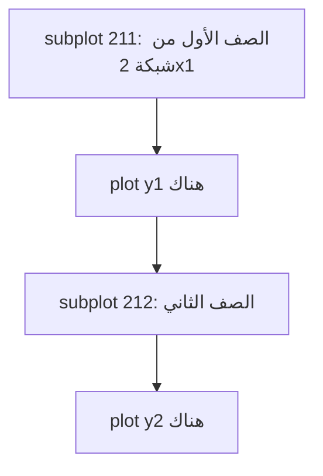
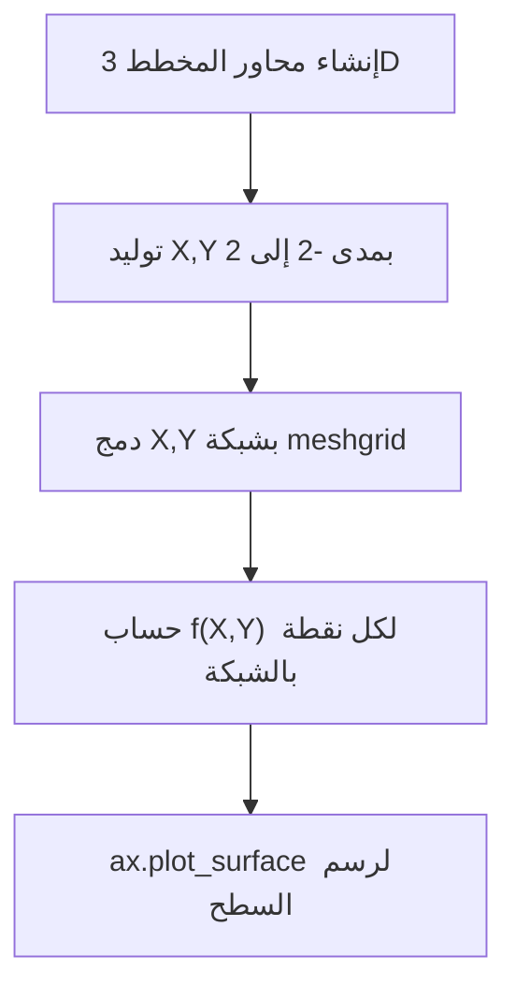

# المحاضرة 4 — Visualizing Data (تصوير البيانات)
> **المادة:** البرمجة المتقدمة 2 (القسم النظري) | **الموضوع:** `matplotlib`, `NumPy`, `pandas`, `seaborn` — رسم البيانات في Python

---

## الجزء الأول: ملخص منظم (اقرأ قبل المحاضرة!)

### 📍 عن هذه المحاضرة
> هذه المحاضرة تشرح كيف نحوّل الأرقام إلى رسومات بصرية باستخدام مكتبة `matplotlib` وما يبنى عليها (`seaborn`), وكيف تتكامل مع `NumPy` و `pandas`.

### 🎯 ستتعلم
- كيف ترسم `line chart` و `scatter plot` وتتحكم بشكلها (ألوان، أحجام، عناوين).
- كيف ترسم `bar chart` (عمودي، أفقي، متعدد السلاسل، مكدّس) وتفهم لماذا محور البداية يغيّر القصة اللي يرويها الرسم.
- كيف ترسم `pie chart` و `polar chart` ورسومات ثلاثية الأبعاد (`3D surfaces` و `3D scatter`).
- كيف تستخدم `seaborn` لرسومات إحصائية جاهزة (`boxplot`, `relplot`, `lmplot`, `jointplot`) بأقل كود.

### 📚 المتطلبات السابقة
- أساسيات Python: قوائم (`list`)، حلقات (`for`)، دوال (`def`).
- فكرة عامة عن `NumPy arrays` و `pandas DataFrame` (تُستخدم كمصدر بيانات للرسم هنا وليست موضوع الشرح).

### 💡 الأفكار الرئيسية
1. **`matplotlib.pyplot` هي الواجهة الأساسية للرسم:** كل الرسومات تقريبًا تمر من خلال `plt.plot`, `plt.bar`, `plt.scatter`, `plt.pie` ثم `plt.show()`. بمجرد ما تفهم هذا النمط (بيانات → دالة رسم → تنسيق → عرض) تقدر تطبقه على أي نوع رسم.
2. **التنسيق مو زخرفة، هو توصيل معنى:** `title`, `xlabel`, `ylabel`, `legend`, `colors` كلها تساعد القارئ يفهم الرسم بدون ما يحتاج يسألك. رسم بدون عناوين هو أرقام بلا سياق.
3. **محور البداية (axis) يغيّر القصة:** نفس البيانات بالضبط ممكن تبان "زيادة هائلة" أو "زيادة بسيطة" حسب حدود المحور y — هذا درس مهم جدًا عن الأمانة في عرض البيانات.
4. **`pandas` و `seaborn` يبنون فوق `matplotlib`:** بدل ما تكتب حلقات لرسم كل سلسلة بيانات لوحدها، `df.plot()` و `sns.relplot()` يعملون هذا تلقائيًا من `DataFrame` واحد.

### 💡 الأفكار الرئيسية (تفصيل سردي)
خلّينا نبدأ من الفكرة الأبسط: عندك قائمة أرقام، وتبي تشوفها كخط. هذا بالضبط اللي تسويه `plt.plot(squares)` — تاخذ القائمة وترسمها، وين محور x يكون تلقائيًا 0, 1, 2, 3... إذا ما حددت قيم x بنفسك. بس هذا يعطيك رسم بلا معنى واضح، فتضيف `plt.title()` و `plt.xlabel()` و `plt.ylabel()` عشان أي شخص ثاني يفهم الرسم بدون ما يشرحه له أحد.

بعدين تجي فكرة `scatter()` — بدل ما ترسم خط متصل، ترسم نقاط منفصلة. هذا مفيد لما البيانات مو متسلسلة بالضرورة (زي علاقة عدد الأصدقاء بالدقائق المصروفة باليوم). ولاحظ كيف المحاضرة ما وقفت عند "ترسم نقطة"، بل قدّمت `s=` للتحكم بحجم النقطة، و`c=` للون، و`cmap=` عشان تلوّن النقاط تدريجيًا حسب قيمتها — وهذا مثال حي على "التدرج من الأبسط للأعقد" اللي تتّبعه معظم دروس البرمجة.

من هنا ننتقل لموضوع حساس: محور الرسم. نفس بيانات "مرات سماع كلمة data science" (500 مقابل 505) لما ترسمها بمحور y يبدأ من 499 تبان قفزة ضخمة، ولما يبدأ من 0 تبان فرق بسيط جدًا. هذا مو خطأ برمجي، هذا اختيار — والمحاضرة تحط إصبعها عليه عمدًا عشان تعلّمك إنك كمبرمج/محلل بيانات مسؤول عن الصدق في التمثيل البصري مو بس عن كتابة كود صحيح.

بعد الرسم الأساسي، تنتقل المحاضرة لـ `bar charts`: عمودي بسيط (`plt.bar`), أفقي (`plt.barh`), متعدد السلاسل (كل فئة عندها أكثر من قيمة تُرسم جنب بعض)، ومكدّس (`stacked`) حيث القيم تُكدّس فوق بعضها بدل ما تكون جنب بعض. الفرق بينهم مو تقني بس — `multiseries` يخليك تقارن بين السلاسل بسهولة، بينما `stacked` يخليك تشوف المجموع الكلي وتوزيعه.

`Pie charts` تجي بعدها كطريقة لعرض النسب المئوية من مجموع كلي — وتضيف المحاضرة `explode` (لإبراز شريحة معينة) و`autopct` (لعرض النسبة المئوية داخل الشريحة).

`Polar charts` توسّع الفكرة: بدل إحداثيات x/y عادية، تستخدم زاوية ونصف قطر — مفيدة لبيانات دورية أو اتجاهية.

`mplot3d` يضيف بعد ثالث (z) — إما كسطح مستمر (`plot_surface`) أو كنقاط مبعثرة بالفضاء (`3D scatter`) — نفس منطق `scatter` العادي بس بمحور إضافي.

وأخيرًا `seaborn`: مكتبة مبنية فوق `matplotlib` بس مصممة للبيانات الإحصائية والـ `DataFrame` مباشرة. بدل ما تفصل كل عمود وترسمه يدويًا، تعطي `sns.relplot(data=df, x=..., y=..., hue=...)` والمكتبة تتكفل بالباقي — بما فيها الألوان حسب فئة، وخطوط الانحدار (`lmplot`), والرسم المشترك بين توزيعين (`jointplot`).

### 🔗 كيف تتصل هذه المحاضرة بالمحاضرات الأخرى؟
- **السابقة:** محاضرات `NumPy` / `pandas` علّمتك كيف تبني وتعالج البيانات (`arrays`, `DataFrames`) ← الآن نستخدم نفس هذه البيانات كمدخل للرسم.
- **القادمة:** هذه المهارات (تصوير البيانات) تُستخدم لاحقًا في تحليل نتائج `Scikit-learn` (مثل رسم منحنى الخطأ، أو توزيع التوقعات في `Machine Learning`).

### ⚠️ الأخطاء الشائعة الواجب تجنبها

#### الفهم الخاطئ ❌:
الاعتقاد إن `plt.show()` لازم يُستدعى بعد كل أمر رسم على حدة.

#### الفهم الصحيح ✅:
`plt.show()` يُستدعى مرة وحدة بعد ما تنتهي من كل أوامر التنسيق والرسم على نفس الشكل (`figure`) — هو اللي يفتح نافذة العرض.

#### الفهم الخاطئ ❌:
الاعتقاد إن تغيير حدود المحور (`plt.axis`) هو مجرد تجميل بصري بدون أثر على المعنى.

#### الفهم الصحيح ✅:
حدود المحور تغيّر انطباع القارئ عن حجم الفرق بين القيم — نفس البيانات ممكن تبان "تغيّر هائل" أو "تغيّر بسيط" حسب اختيار الحدود (شوف مثال 2017/2018 في المحاضرة).

#### الفهم الخاطئ ❌:
الخلط بين `plt.bar()` (رسم مباشر من قوائم) و `df.plot(kind='bar')` (رسم من `DataFrame` عبر `pandas`) كأنهما نفس الشيء تمامًا.

#### الفهم الصحيح ✅:
`df.plot()` هي دالة مساعدة من `pandas` تستدعي `matplotlib` من ورا الكواليس وتُبسّط رسم عدة أعمدة كسلاسل بيانات دفعة وحدة، بينما `plt.bar()` تحتاج تمرّر البيانات يدويًا لكل سلسلة.

### لما تحتاج هذا في الامتحان
غالبًا الأسئلة تركّز على: (1) تكملة كود ناقص لرسم معيّن (`plot`, `bar`, `scatter`, `pie`)، (2) قراءة كود ومعرفة أي دالة تُنتج أي شكل رسم، (3) الفرق بين `bar` و `barh` و `stacked bar`، (4) فهم أثر تغيير حدود المحور على تفسير الرسم، (5) الفرق بين استخدام `matplotlib` مباشرة واستخدام `pandas`/`seaborn` فوقها.

---

## الجزء الثاني: الشرح التفصيلي (سطر بسطر / فقرة بفقرة)

### 1. مقدمة: مكتبات Python لعلم البيانات

<!-- @render: {type: "prose-first", visualization: "none", coverage: "100%"} -->
<!-- @connectivity: {prerequisite: "none"} -->

#### 💡 الفكرة الأساسية
**مجتمع Python يوفّر مجموعة صغيرة من المكتبات (`NumPy`, `SciPy`/`matplotlib`, `pandas`, `Scikit-learn`) تُغطي كل احتياجات عالم البيانات تقريبًا.**

#### 📖 الشرح
المحاضرة تفتتح بالتأكيد إن مجتمع Python من أنشط المجتمعات البرمجية، وهذا انعكس على عدد ضخم من `toolboxes` (مكتبات جاهزة). من بين آلاف المكتبات، أربعة أصبحت شبه معيار قياسي لأي شخص يشتغل بالبيانات:

- **`NumPy`**: دعم للمصفوفات متعددة الأبعاد (`multidimensional arrays`) مع عمليات أساسية عليها ودوال جبر خطي (`linear algebra`).
- **`SciPy`**: مجموعة خوارزميات عددية (`numerical algorithms`) وصناديق أدوات متخصصة (معالجة إشارات، تحسين `optimization`، إحصاء)، وتتضمن مكتبة الرسم **`Matplotlib`** لتصوير البيانات.
- **`Scikit-learn`**: مكتبة تعلّم آلي (`machine learning`) مبنية فوق `NumPy` و`SciPy` و`Matplotlib`, توفّر أدوات لتصنيف (`classification`)، انحدار (`regression`)، تجميع (`clustering`)، تقليل الأبعاد، اختيار النموذج، والمعالجة المسبقة.
- **`Pandas`**: هياكل بيانات عالية الأداء وأدوات تحليل، تشمل تجميع (`aggregating`)، دمج (`merging`) وربط (`joining`) مجموعات البيانات، واستيراد/تصدير بصيغ مختلفة.

#### 💡 التشبيه
> فكّر بهذي المكتبات الأربعة كأنها مطبخ متكامل: `NumPy` هو الأواني والمقاييس الدقيقة (تخزين ومعالجة الأرقام)، `Pandas` هو الثلاجة المنظّمة (تخزين البيانات بشكل جدولي منظم)، `SciPy`/`Matplotlib` هو صحن التقديم (عرض النتيجة بشكل يفهمه أي حد)، و`Scikit-learn` هو الشيف نفسه (يحوّل المكوّنات إلى قرار/توقع).
> **وجه الشبه:** كل مكتبة تسند الثانية، ومحاضرتنا اليوم تركّز على "صحن التقديم" — يعني `Matplotlib`.

#### 🎯 الملخص السريع
- 4 مكتبات أساسية: `NumPy`, `SciPy` (وبداخلها `Matplotlib`), `Pandas`, `Scikit-learn`.
- `Matplotlib` هي أداة التصوير البصري (`data visualization`) داخل `SciPy`.
- بقية المحاضرة تشرح `Matplotlib` وتوسعاتها (`seaborn`).

#### 📚 التطبيق
هذه المكتبات الأربعة ستظهر مجتمعة عمليًا: `pandas` لتحميل البيانات، `NumPy` لتوليدها/معالجتها رياضيًا، و`Matplotlib`/`seaborn` لعرضها — كما سنرى بدءًا من القسم القادم.

#### 📄 النص الأصلي من المحاضرة
<details>
<summary>عرض النص الأصلي (coverage: 100%)</summary>

**النص الأصلي يقول:**
> "The Python community is one of the most active programming communities. Huge number of developed toolboxes. The most popular Python toolboxes for any data scientist are: NumPy, SciPy(matplotlib), Pandas, Scikit-Learn."
> "NumPy support for multidimensional arrays with basic operations on them and useful linear algebra functions. SciPy provides a collection of numerical algorithms and domain-specific toolboxes, including signal processing, optimization, statistics, and the plotting library Matplotlib. for data visualization. Scikit-learn4 is a machine learning library built from NumPy, SciPy, and Matplotlib. Scikit-learn offers simple and efficient tools for common tasks in data analysis such as classification, regression, clustering, dimensionality reduction, model selection ,and preprocessing. Pandas provides high-performance data structures and data analysis tools..."

**ملاحظة على التغطية:**
- ✓ تم شرح بالكامل: المكتبات الأربع ووظيفة كل واحدة.
- ℹ️ إضافة من الدليل: تشبيه المطبخ (ليس في المحاضرة الأصلية).

</details>

---

### 2. Line Charts — الرسم الخطي

<!-- @render: {type: "code-first", visualization: "none", coverage: "100%"} -->
<!-- @connectivity: {prerequisite: "section_1"} -->

#### 📍 أين نحن الآن؟
بعد التعريف بالمكتبات، نبدأ فعليًا برسم أول شكل: الخط البسيط باستخدام `matplotlib.pyplot`.

#### 💡 الفكرة الأساسية
**`plt.plot(values)` ترسم قائمة أرقام كخط، حيث محور x يكون تلقائيًا 0, 1, 2... ما لم تحدد قيم x بنفسك.**

#### 💻 الكود: رسم خطي بسيط
#### ما هذا الكود؟
> يرسم قائمة `squares` كخط بدون أي تحديد لقيم المحور الأفقي — فتُستخدم فهارس القائمة (0 إلى 4) تلقائيًا.

```python
import matplotlib.pyplot as plt
squares = [1, 4, 9, 16, 25]
plt.plot(squares)  # x-axis defaults to indices 0..4
plt.show()          # opens the plot window
```

#### ملاحظات الأسطر المهمة:
- `plt.plot(squares)` → يرسم القيم كخط؛ لاحظ إن محور x صار 0.0 إلى 4.0 وليس 1 إلى 5 — لأنه لم نمرر قيم x.
- `plt.show()` → يُستدعى مرة وحدة في نهاية كل أوامر الرسم/التنسيق لعرض الشكل.

#### 💻 الكود: تنسيق الخط والعناوين
#### ما هذا الكود؟
> نفس الرسم السابق لكن مع إضافة سُمك للخط، عنوان، تسميات للمحاور، وحجم خط للتسميات الرقمية على المحاور.

```python
import matplotlib.pyplot as plt
squares = [1, 4, 9, 16, 25]
plt.plot(squares, linewidth=5)                 # thicker line
plt.title("Square Numbers", fontsize=24)
plt.xlabel("Value", fontsize=14)
plt.ylabel("Square of Value", fontsize=14)
# Set size of tick labels.
plt.tick_params(axis='both', labelsize=14)
plt.show()
```

#### ملاحظات الأسطر المهمة:
- `linewidth=5` → يتحكم بسماكة الخط المرسوم.
- `plt.tick_params(axis='both', labelsize=14)` → يغيّر حجم أرقام كلا المحورين (x و y) معًا.

#### 🎯 الملخص السريع
- `plt.plot(data)` بدون قيم x يستخدم الفهارس (0,1,2...) تلقائيًا.
- `linewidth`, `title`, `xlabel`, `ylabel`, `tick_params` كلها تحسّن وضوح الرسم.

#### 📚 التطبيق
لاحظ الفرق القادم: هذا الرسم يبيّن x من 0 إلى 4 بدل 1 إلى 5 — وهذا بالضبط ما يصححه القسم التالي.

#### ⚠️ أخطاء شائعة

#### الفهم الخاطئ ❌:
الاعتقاد إن `plt.plot(squares)` يرسم القيم مقابل أرقامها الحقيقية (1، 2، 3، 4، 5) تلقائيًا.

#### الفهم الصحيح ✅:
بدون تمرير قيم x، `matplotlib` تستخدم فهارس القائمة بدءًا من 0 — لذلك الرسم يبدأ من 0.0 وليس من 1.

#### 📄 النص الأصلي من المحاضرة
<details>
<summary>عرض النص الأصلي (coverage: 100%)</summary>

**النص الأصلي يقول:**
> "import matplotlib.pyplot as plt / squares = [1, 4, 9, 16, 25] / plt.plot(squares) / plt.show()" ثم نسخة معدّلة بإضافة `linewidth`, `title`, `xlabel`, `ylabel`, `tick_params`.

**ملاحظة على التغطية:**
- ✓ تم شرح بالكامل: كل سطر من الكودين وأثره على الرسم.

</details>

---

### 3. تصحيح الرسم — Correcting the Plot

<!-- @render: {type: "code-first", visualization: "none", coverage: "100%"} -->
<!-- @connectivity: {prerequisite: "section_2"} -->

#### ⬅️ الربط مع السابق
في القسم السابق، الرسم بدأ من 0 بدل 1 لأننا ما مررنا قيم x. هنا نصلح هذا بتمرير قائمة x صريحة.

#### 💡 الفكرة الأساسية
**`plt.plot(x_values, y_values)` يسمح لك تحدّد قيم المحور الأفقي بنفسك بدل الاعتماد على الفهارس التلقائية.**

#### 💻 الكود
```python
import matplotlib.pyplot as plt
input_values = [1, 2, 3, 4, 5]
squares = [1, 4, 9, 16, 25]
plt.plot(input_values, squares, linewidth=5)   # explicit x-values now
plt.title("Square Numbers", fontsize=24)
plt.xlabel("Value", fontsize=14)
plt.ylabel("Square of Value", fontsize=14)
plt.tick_params(axis='both', labelsize=14)
plt.show()
```

#### ملاحظات الأسطر المهمة:
- `plt.plot(input_values, squares, linewidth=5)` → أول باراميتر هو قيم x، والثاني قيم y — الآن المحور الأفقي يبدأ من 1 فعليًا.

#### 🎯 الملخص السريع
- تمرير قيم x صراحةً هو الفرق بين رسم "تقريبي" ورسم "دقيق".

#### 📚 التطبيق
نفس المبدأ (تمرير x و y معًا) سيتكرر في `scatter()` بالقسم القادم.

#### ⚠️ أخطاء شائعة

#### الفهم الخاطئ ❌:
نسيان تمرير قيم x عندما تكون قيم البيانات الحقيقية غير الفهارس الافتراضية.

#### الفهم الصحيح ✅:
دائمًا تحقق: هل قيم x الحقيقية تبدأ من 0 أو من رقم آخر؟ إذا مختلفة، مرّرها صراحة.

#### 📄 النص الأصلي من المحاضرة
<details>
<summary>عرض النص الأصلي (coverage: 100%)</summary>

**النص الأصلي يقول:**
> "input_values = [1, 2, 3, 4, 5] / squares = [1, 4, 9, 16, 25] / plt.plot(input_values, squares, linewidth=5) ..." تحت عنوان "Correcting the Plot".

**ملاحظة على التغطية:**
- ✓ تم شرح بالكامل.

</details>

---

### 4. `scatter()` — رسم نقاط فردية ومتسلسلة

<!-- @render: {type: "code-first", visualization: "none", coverage: "100%"} -->
<!-- @connectivity: {prerequisite: "section_3"} -->

#### ⬅️ الربط مع السابق
بعد إتقان الخطوط المتصلة، ننتقل للنقاط المنفصلة — مفيدة لما ما تبي توصل بين القيم بخط.

#### 💡 الفكرة الأساسية
**`plt.scatter(x, y)` ترسم نقطة أو مجموعة نقاط بدل خط متصل، ويمكن التحكم بحجمها عبر `s=`.**

#### 💻 الكود: نقطة واحدة ثم تكبيرها
```python
import matplotlib.pyplot as plt
plt.scatter(2, 4)      # a single point at (2, 4)
plt.show()
```

```python
import matplotlib.pyplot as plt
plt.scatter(2, 4, s=200)     # s controls point size
plt.title("Square Numbers", fontsize=24)
plt.xlabel("Value", fontsize=14)
plt.ylabel("Square of Value", fontsize=14)
plt.tick_params(axis='both', labelsize=14)
plt.show()
```

#### ملاحظات الأسطر المهمة:
- `s=200` → حجم النقطة بالبكسل تقريبًا؛ كلما زادت القيمة كبرت النقطة.

#### 💻 الكود: سلسلة نقاط
```python
import matplotlib.pyplot as plt
x_values = [1, 2, 3, 4, 5]
y_values = [1, 4, 9, 16, 25]
plt.scatter(x_values, y_values, s=100)   # multiple points at once
plt.title("Square Numbers", fontsize=24)
plt.xlabel("Value", fontsize=14)
plt.ylabel("Square of Value", fontsize=14)
plt.tick_params(axis='both', labelsize=14)
plt.show()
```

#### 🎯 الملخص السريع
- `scatter(2, 4)` نقطة وحدة، `scatter(list_x, list_y)` عدة نقاط.
- `s=` يتحكم بالحجم.

#### 📚 التطبيق
القسم القادم يبني فوق هذا بتوليد آلاف النقاط تلقائيًا بدل كتابتها يدويًا.

#### 💡 التشبيه
> فكّر بـ `scatter` كأنك ترش حبات رمل على طاولة، كل حبة موقعها (x, y) يمثّل قيمة — بعكس `plot` اللي يوصل الحبات بخيط.
> **وجه الشبه:** حبة الرمل = نقطة بيانات مستقلة؛ الخيط = الخط المتصل في `plot()`.

#### ⚠️ أخطاء شائعة

#### الفهم الخاطئ ❌:
الاعتقاد إن `scatter()` يوصل النقاط تلقائيًا بخط مثل `plot()`.

#### الفهم الصحيح ✅:
`scatter()` يرسم نقاط منفصلة فقط بدون أي خط يربط بينها.

#### 📄 النص الأصلي من المحاضرة
<details>
<summary>عرض النص الأصلي (coverage: 100%)</summary>

**النص الأصلي يقول:**
> "Plotting and Styling Individual Points with scatter() ... plt.scatter(2, 4) ... plt.scatter(2, 4, s=200) ..." و"Plotting a Series of Points with scatter() ... plt.scatter(x_values, y_values, s=100) ..."

**ملاحظة على التغطية:**
- ✓ تم شرح بالكامل.

</details>

---

### 5. توليد البيانات تلقائيًا وتحديد حدود المحاور

<!-- @render: {type: "code-first", visualization: "none", coverage: "100%"} -->
<!-- @connectivity: {prerequisite: "section_4"} -->

#### ⬅️ الربط مع السابق
بدل كتابة كل نقطة يدويًا، نولّد 1000 نقطة برمجيًا باستخدام `list comprehension`، ونتحكم بحدود العرض عبر `plt.axis()`.

#### 💡 الفكرة الأساسية
**`plt.axis([xmin, xmax, ymin, ymax])` تحدد حدود المحاور يدويًا بدل الاعتماد على الحدود التلقائية.**

#### 💻 الكود
```python
import matplotlib.pyplot as plt
x_values = list(range(1, 1001))
y_values = [x**2 for x in x_values]           # compute squares automatically
plt.scatter(x_values, y_values, s=40)
plt.title("Square Numbers", fontsize=24)
plt.xlabel("Value", fontsize=14)
plt.ylabel("Square of Value", fontsize=14)
plt.tick_params(axis='both', labelsize=14)
plt.axis([0, 1100, 0, 1100000])               # set custom axis limits
plt.show()
```

#### ملاحظات الأسطر المهمة:
- `y_values = [x**2 for x in x_values]` → `list comprehension` تحسب مربع كل قيمة x مباشرة بدل حلقة `for` تقليدية.
- `plt.axis([0, 1100, 0, 1100000])` → القائمة بترتيب ثابت: [أقل x, أكبر x, أقل y, أكبر y].

#### 🎯 الملخص السريع
- توليد البيانات رياضيًا يوفّر وقت كتابتها يدويًا.
- `plt.axis()` يتحكم بحدود العرض المرئي فقط، لا يغيّر البيانات نفسها.

#### 📚 التطبيق
هذا المبدأ (تحديد حدود المحور) سيصبح حرجًا لاحقًا في قسم "أخطاء تمثيل البيانات" (مثال 2017/2018).

#### 📄 النص الأصلي من المحاضرة
<details>
<summary>عرض النص الأصلي (coverage: 100%)</summary>

**النص الأصلي يقول:**
> "Calculating Data Automatically ... x_values = list(range(1, 1001)) / y_values = [x**2 for x in x_values] / plt.scatter(x_values, y_values, s=40) ... plt.axis([0, 1100, 0, 1100000]) ..."

**ملاحظة على التغطية:**
- ✓ تم شرح بالكامل.

</details>

---

### 6. الألوان المخصّصة، خرائط الألوان، وحفظ الرسم

<!-- @render: {type: "code-first", visualization: "none", coverage: "95%"} -->
<!-- @connectivity: {prerequisite: "section_5"} -->

#### ⬅️ الربط مع السابق
بعد تحديد شكل وحدود الرسم، نضيف طبقة الألوان: لون ثابت، إزالة الحدود الخارجية للنقاط، خريطة ألوان متدرجة، وأخيرًا حفظ الرسم كصورة.

#### 💡 الفكرة الأساسية
**يمكن تخصيص لون النقاط عبر `c=`، وإزالة حدودها عبر `edgecolor='none'`، أو تلوينها تدريجيًا حسب قيمتها عبر `cmap=`.**

#### 💻 الكود: لون مخصص وإزالة الحدود
```python
import matplotlib.pyplot as plt
x_values = list(range(1, 1001))
y_values = [x**2 for x in x_values]
plt.scatter(x_values, y_values, c='blue', edgecolor='blue', s=40)
plt.title("Square Numbers", fontsize=24)
plt.xlabel("Value", fontsize=14)
plt.ylabel("Square of Value", fontsize=14)
plt.tick_params(axis='both', labelsize=14)
plt.axis([0, 1100, 0, 1100000])
plt.show()
```

#### ملاحظات الأسطر المهمة:
- `c='blue'` → لون تعبئة النقاط؛ يمكن أيضًا كتابته كـ `c=(0,0,0.8)` بصيغة RGB (قيم من 0 إلى 1).
- `edgecolor='blue'` أو `edgecolor='none'` → لون حدود النقطة الخارجية؛ `'none'` يزيلها تمامًا فتبدو النقاط أكثر نعومة عند التقارب.

#### 💻 الكود: خريطة ألوان تدريجية (Colormap)
#### ما هذا الكود؟
> يلوّن كل نقطة حسب قيمتها (y_values) باستخدام تدرّج أزرق (`plt.cm.Blues`) — القيم الأكبر تصبح أغمق.

```python
plt.scatter(x_values, y_values, c=y_values, cmap=plt.cm.Blues, edgecolor='none', s=40)
```

#### 🎯 الملخص السريع
- `c=` لون ثابت أو قائمة قيم للتلوين المتدرج.
- `cmap=` يحدد خريطة الألوان المستخدمة مع `c=` عندما تكون قيمًا رقمية.
- `edgecolor='none'` يزيل الحدود الخارجية لمظهر أنعم.

#### 📚 التطبيق
حفظ الرسم للاستخدام خارج بيئة العرض المباشر:
```python
plt.savefig('squares_plot.png', bbox_inches='tight')
```
`bbox_inches='tight'` يقصّ الهوامش البيضاء الزائدة حول الرسم عند الحفظ.

#### ⚠️ أخطاء شائعة

#### الفهم الخاطئ ❌:
الاعتقاد إن `cmap` يعمل بمفرده بدون تمرير قيم رقمية إلى `c=`.

#### الفهم الصحيح ✅:
`cmap` يحدد فقط *مجموعة الألوان*؛ يحتاج `c=` أن يحتوي قيمًا رقمية (مثل `y_values`) ليعرف أي لون من الخريطة يُستخدم لكل نقطة.

#### 📄 النص الأصلي من المحاضرة
<details>
<summary>عرض النص الأصلي (coverage: 95% — صيغة RGB بديلة (0,0,0.8) ذُكرت بشكل مختصر جدًا في شريحة منفصلة)</summary>

**النص الأصلي يقول:**
> "plt.scatter(x_values, y_values, c='blue', edgecolor='blue', s=40) ... Defining Custom Colors ... ............., c=(0,0,0.8), edgecolor = 'blue', s=40) ... Removing Outlines from Data Points: edgecolor='none' ... Using a Colormap: plt.scatter(x_values, y_values, c=y_values, cmap=plt.cm.Blues, edgecolor='none', s=40) ... Saving Your Plots Automatically: plt.savefig('squares_plot.png', bbox_inches='tight')"

**ملاحظة على التغطية:**
- ✓ تم شرح: الألوان الثابتة، إزالة الحدود، الـ colormap، والحفظ.
- ⚠️ غير مشروح بالكامل: صيغة RGB الدقيقة `(0,0,0.8)` كانت مجرد سطر مقتطع في الشريحة الأصلية بدون شرح موسّع، فأُشير لها بإيجاز فقط (شرح زيادة للفهم).

</details>

---

### 7. رسم بيانات حقيقية بخط ملوّن ومحدد (GDP مثالًا)

<!-- @render: {type: "code-first", visualization: "none", coverage: "100%"} -->
<!-- @connectivity: {prerequisite: "section_6"} -->

#### ⬅️ الربط مع السابق
بعد رسومات تجريبية بأرقام مربّعة، هذا مثال بمعنى حقيقي: تطور الناتج المحلي الإجمالي عبر السنين.

#### 💡 الفكرة الأساسية
**`plt.plot()` يقبل باراميترات `color`, `marker`, `linestyle` معًا للتحكم الكامل بشكل الخط والنقاط عليه.**

#### 💻 الكود
```python
import matplotlib.pyplot as plt
years = [1950, 1960, 1970, 1980, 1990, 2000, 2010]
gdp = [300.2, 543.3, 1075.9, 2862.5, 5979.6, 10289.7, 14958.3]
# create a line chart, years on x-axis, gross domestic product on y-axis
plt.plot(years, gdp, color='green', marker='o', linestyle='solid')
plt.title("Nominal GDP")
plt.ylabel("Billions of $")
plt.show()
```

#### ملاحظات الأسطر المهمة:
- `color='green', marker='o', linestyle='solid'` → لون الخط، شكل نقطة كل قيمة (دائرة `'o'`)، ونوع الخط (متصل `'solid'`) معًا في استدعاء واحد.

#### 🎯 الملخص السريع
- يمكن دمج عدة خصائص تنسيق (لون، رمز، نوع خط) بباراميترات منفصلة بدل رمز مختصر واحد.

#### 📚 التطبيق
هذا النمط (`color`, `marker`, `linestyle`) يظهر أيضًا بصيغة مختصرة في القسم القادم (مثل `'g-'`).

#### 📄 النص الأصلي من المحاضرة
<details>
<summary>عرض النص الأصلي (coverage: 100%)</summary>

**النص الأصلي يقول:**
> "years = [1950, 1960, 1970, 1980, 1990, 2000, 2010] / gdp = [300.2, 543.3, ...] / plt.plot(years, gdp, color='green', marker='o', linestyle='solid') / plt.title(\"Nominal GDP\") / plt.ylabel(\"Billions of $\")"

**ملاحظة على التغطية:**
- ✓ تم شرح بالكامل.

</details>

---

### 8. عدة خطوط في رسم واحد + Legend (مثال Bias-Variance)

<!-- @render: {type: "code-first", visualization: "none", coverage: "95%"} -->
<!-- @connectivity: {prerequisite: "section_7"} -->

#### ⬅️ الربط مع السابق
بعد رسم خط واحد، هذا المثال يرسم 3 خطوط معًا على نفس المحاور مع مفتاح (`legend`) يميّز بينها — وهو مفهوم شائع الاستخدام في تحليل نماذج التعلم الآلي (`bias-variance tradeoff`).

#### 💡 الفكرة الأساسية
**استدعاء `plt.plot()` أكثر من مرة قبل `plt.show()` يرسم كل الخطوط على نفس المحاور، و`plt.legend()` يعرض مفتاحًا يربط كل خط باسمه.**

#### 💻 الكود
```python
from matplotlib import pyplot as plt
variance = [1, 2, 4, 8, 16, 32, 64, 128, 256]
bias_squared = [256, 128, 64, 32, 16, 8, 4, 2, 1]
total_error = [x + y for x, y in zip(variance, bias_squared)]   # element-wise sum
xs = [0, 1, 2, 3, 4, 5, 6, 7, 8]

plt.plot(xs, variance, 'g-', label='variance')        # green solid line
plt.plot(xs, bias_squared, 'r-.', label='bias^2')     # red dash-dot line
plt.plot(xs, total_error, 'b:', label='total error')  # blue dotted line
# (loc=9 means "top center")
plt.legend(loc=9)
plt.xlabel("model complexity")
plt.title("The Bias-Variance Tradeoff")
plt.show()
```

#### ملاحظات الأسطر المهمة:
- `total_error = [x + y for x, y in zip(variance, bias_squared)]` → `zip()` يجمع القائمتين عنصرًا بعنصر، ونجمعهم معًا.
- `'g-'`, `'r-.'`, `'b:'` → رموز مختصرة (لون + نوع خط): أخضر متصل، أحمر متقطع-نقطي، أزرق منقّط.
- `plt.legend(loc=9)` → يعرض المفتاح، و`loc=9` يعني "أعلى الوسط" (`top center`) حسب ترقيم مواقع `matplotlib`.

#### 🎯 الملخص السريع
- استدعاءات `plot()` متعددة على نفس الشكل تُرسم معًا.
- `label=` في كل استدعاء يُستخدم لاحقًا من `plt.legend()`.
- الرموز المختصرة (`'g-'`, `'r-.'`, `'b:'`) تجمع اللون ونوع الخط بحرف/رمز واحد.

#### 📚 التطبيق
هذا الرسم (`bias-variance tradeoff`) مفهوم أساسي في `Machine Learning` — راح يظهر لاحقًا في محاضرات `Scikit-learn`.

#### ⚠️ أخطاء شائعة

#### الفهم الخاطئ ❌:
الاعتقاد إن `loc=9` يشير لموقع عشوائي أو رقم بلا معنى.

#### الفهم الصحيح ✅:
كل رقم في `loc` يقابل موقعًا ثابتًا معرّفًا مسبقًا في `matplotlib` (مثل 9 = أعلى الوسط)، بدل كتابة `'upper center'` نصيًا.

#### 📄 النص الأصلي من المحاضرة
<details>
<summary>عرض النص الأصلي (coverage: 95% — سطر `#xs = [i for i, _ in enumerate(variance)]` معلّق (commented out) بدون شرح مباشر لماذا تُرك كبديل)</summary>

**النص الأصلي يقول:**
> "variance = [1, 2, 4, 8, 16, 32, 64, 128, 256] / bias_squared = [256, 128, 64, 32, 16, 8, 4, 2, 1] / total_error = [x + y for x, y in zip(variance, bias_squared)] / xs = [0,1,2,3,4,5,6,7,8] / #xs = [i for i, _ in enumerate(variance)] / plt.plot(xs, variance, 'g-', label='variance') ..."

**ملاحظة على التغطية:**
- ✓ تم شرح: كل الأسطر الفعّالة في الكود.
- ⚠️ غير مشروح بالكامل: السطر المعلّق `#xs = [i for i, _ in enumerate(variance)]` هو طريقة بديلة لتوليد نفس قائمة `xs` باستخدام `enumerate` بدل كتابتها يدويًا — لم تُشرح صراحة في المحاضرة (شرح زيادة للفهم: `enumerate` يعيد زوج (index, value) لكل عنصر، ونأخذ الـ index فقط).

</details>

---

### 9. `matplotlib` مع `NumPy` — دوال رياضية وتنسيق متقدم

<!-- @render: {type: "code-first", visualization: "none", coverage: "90%"} -->
<!-- @connectivity: {prerequisite: "section_8"} -->

#### ⬅️ الربط مع السابق
هنا تتكامل `matplotlib` مباشرة مع `NumPy` لتوليد قيم رياضية (مثل `sin`) ورسم عدة رسومات فرعية (`subplot`) بدل رسم واحد.

#### 💡 الفكرة الأساسية
**`np.arange()` تولّد متتالية أرقام كمصفوفة `NumPy`، ثم يمكن تمريرها مباشرة لدوال `matplotlib` مع رموز تنسيق مختلفة لكل خط.**

#### 💻 الكود: دوال جيبية بأشكال نقاط مختلفة
```python
import math
import numpy as np
t = np.arange(0, 2.5, 0.1)
y1 = np.sin(math.pi * t)
y2 = np.sin(math.pi * t + math.pi / 2)
y3 = np.sin(math.pi * t - math.pi / 2)
plt.plot(t, y1, 'b*', t, y2, 'g^', t, y3, 'ys')   # markers instead of lines
```
ونفس البيانات لكن بخطوط بدل رموز نقطية:
```python
plt.plot(t, y1, 'b--', t, y2, 'g', t, y3, 'r-.')
```

#### ملاحظات الأسطر المهمة:
- `t = np.arange(0, 2.5, 0.1)` → مصفوفة قيم من 0 حتى أقل من 2.5 بخطوة 0.1.
- `'b*'`, `'g^'`, `'ys'` → رمز (نجمة، مثلث، مربع) بدل خط متصل — مفيد لتمييز نقاط منفصلة رياضيًا.
- تمرير 3 أزواج (x, y, format) في نفس استدعاء `plot()` واحد يرسم 3 خطوط دفعة وحدة.

#### 💻 الكود: `subplot` — رسومات فرعية متعددة
#### ما هذا الكود؟
> يقسّم نافذة الرسم إلى شبكة، ويرسم كل دالة في خانة منفصلة بدل تراكبها على نفس المحاور.



```python
t = np.arange(0, 5, 0.1)
y1 = np.sin(2 * np.pi * t)
y2 = np.sin(2 * np.pi * t)
plt.subplot(211)          # grid: 2 rows, 1 col, select cell 1
plt.plot(t, y1, 'b-.')
plt.subplot(212)          # grid: 2 rows, 1 col, select cell 2
plt.plot(t, y2, 'r--')
```

وبنفس المبدأ بصفّ واحد وعمودين (جنب بعض بدل فوق بعض):
```python
t = np.arange(0., 1., 0.05)
y1 = np.sin(2 * np.pi * t)
y2 = np.cos(2 * np.pi * t)
plt.subplot(121)          # grid: 1 row, 2 cols, select cell 1
plt.plot(t, y1, 'b-.')
plt.subplot(122)          # grid: 1 row, 2 cols, select cell 2
plt.plot(t, y2, 'r--')
```

#### ملاحظات الأسطر المهمة:
- `plt.subplot(211)` → الأرقام الثلاثة تُقرأ كـ (عدد الصفوف، عدد الأعمدة، رقم الخانة الحالية)؛ هنا 2 صف، 1 عمود، الخانة رقم 1.
- `plt.subplot(121)` → هنا 1 صف، 2 عمود، الخانة رقم 1 (يعني الرسم الفرعي على اليسار).

#### 🎯 الملخص السريع
- `NumPy` تولّد البيانات الرياضية، و`matplotlib` ترسمها مباشرة.
- رموز التنسيق المختصرة تجمع لون + شكل/نوع خط بحرف أو حرفين.
- `plt.subplot(rows, cols, index)` (مكتوبة كرقم واحد من 3 خانات) يقسّم نافذة الرسم لعدة رسومات فرعية.

#### 📚 التطبيق
مثال متقدم يجمع كل هذا: دالة `sin(x)/x` مع محاور مخصصة وتعليقات نصية (`annotate`) — بالقسم القادم.

#### ⚠️ تنبيه بصري (إن وُجد رسمة أو صورة في المحاضرة)
⚠️ **مهم:** الشكل الناتج من رسومات `subplot` (الرسمين فوق بعض والرسمين جنب بعض) موضّح بصريًا في الصفحة 18 من ملف المحاضرة — اذهب وشوفه هناك لفهم الفرق بين `211/212` و`121/122`.

#### 📄 النص الأصلي من المحاضرة
<details>
<summary>عرض النص الأصلي (coverage: 90% — بعض القيم الرقمية الدقيقة في المثال الأخير (0.,1.,0.05) لم تُناقش لماذا اختيرت تحديدًا)</summary>

**النص الأصلي يقول:**
> "import math / import numpy as np / t = np.arange(0,2.5,0.1) / y1 = np.sin(math.pi*t) ... plt.plot(t,y1,'b*',t,y2,'g^',t,y3,'ys')" ثم "plt.plot(t,y1,'b--',t,y2,'g',t,y3,'r-.')" ثم أمثلة `subplot(211)/(212)` و `subplot(121)/(122)`.

**ملاحظة على التغطية:**
- ✓ تم شرح: كل الأسطر ومعنى أرقام `subplot`.
- ⚠️ غير مشروح بالكامل: سبب اختيار خطوة `0.05` تحديدًا في المثال الثاني لم يُذكر (تفصيل تجميلي بسيط، غير جوهري).

</details>

---

### 10. رسم دالة `sin(x)/x` مع محاور مخصصة وتعليق نصي

<!-- @render: {type: "code-first", visualization: "none", coverage: "85%"} -->
<!-- @connectivity: {prerequisite: "section_9"} -->

#### ⬅️ الربط مع السابق
مثال متقدم يجمع كل أدوات التنسيق السابقة: تخصيص علامات المحاور، تحريك المحاور نفسها لتتقاطع عند الصفر، وإضافة تعليق نصي بسهم (`annotate`) لشرح نقطة معينة.

#### 💡 الفكرة الأساسية
**يمكن التحكم الكامل بمظهر المحاور (مواقعها، علاماتها، ألوانها) عبر كائن `Axes` الذي يُستخرج بـ `plt.gca()` (get current axes)، ويمكن وضع تعليق نصي بسهم يشير لنقطة محددة عبر `plt.annotate()`.**

#### 💻 الكود
```python
import matplotlib.pyplot as plt
import numpy as np
x = np.arange(-2*np.pi, 2*np.pi, 0.01)
y = np.sin(3*x)/x
y2 = np.sin(2*x)/x
y3 = np.sin(x)/x
plt.plot(x, y, color='b')
plt.plot(x, y2, color='r')
plt.plot(x, y3, color='g')
plt.xticks([-2*np.pi, -np.pi, 0, np.pi, 2*np.pi],
           [r'$-2\pi$', r'$-\pi$', r'$0$', r'$+\pi$', r'$+2\pi$'])  # LaTeX tick labels
plt.yticks([-1, 0, +1, +2, +3], [r'$-1$', r'$0$', r'$+1$', r'$+2$', r'$+3$'])
plt.annotate(r'$\lim_{x\to 0}\frac{\sin(x)}{x}= 1$', xy=[0, 1], xycoords='data',
             xytext=[30, 30], fontsize=16, textcoords='offset points',
             arrowprops=dict(arrowstyle="->", connectionstyle="arc3,rad=.2"))
ax = plt.gca()                                   # get current axes object
ax.spines['right'].set_color('none')             # hide right border
ax.spines['top'].set_color('none')               # hide top border
ax.xaxis.set_ticks_position('bottom')
ax.spines['bottom'].set_position(('data', 0))    # move x-axis to y=0
ax.yaxis.set_ticks_position('left')
ax.spines['left'].set_position(('data', 0))      # move y-axis to x=0
```

#### ملاحظات الأسطر المهمة:
- `plt.xticks([...], [...])` → القائمة الأولى مواقع العلامات، الثانية النصوص المعروضة (هنا بصيغة LaTeX مثل `$-2\pi$`).
- `plt.annotate(...)` → يضع نصًا (`$\lim...$`) عند إحداثيات `xy` مع سهم يشير إليها، والنص نفسه يظهر عند `xytext` (بإزاحة بالبكسل لأن `textcoords='offset points'`).
- `ax = plt.gca()` → "get current axes" — يعطيك الكائن اللي يمثّل محاور الرسم الحالي عشان تعدّل عليه مباشرة.
- `ax.spines['right'].set_color('none')` → `spines` هي الحدود الأربعة حول منطقة الرسم (يمين، يسار، فوق، تحت)؛ هنا نخفي حد اليمين والأعلى.
- `ax.spines['bottom'].set_position(('data', 0))` → ينقل محور x ليمر من نقطة y=0 بدل أسفل الرسم — هذا يعطي شكل "محاور رياضية" تقليدية تتقاطع عند الصفر.

#### 🎯 الملخص السريع
- `xticks`/`yticks` تتحكم بمواقع ونصوص علامات المحاور، وتدعم LaTeX عبر `r'$...$'`.
- `annotate()` يضيف تعليقًا نصيًا مع سهم لنقطة محددة.
- `plt.gca()` و `ax.spines` يتيحان التحكم الكامل بشكل وموقع حدود المحاور.

#### 📚 التطبيق
هذا النمط (محاور تتقاطع عند الصفر) شائع في الرسوم الرياضية والعلمية حيث نريد إظهار السلوك حول نقطة الأصل (0,0).

#### ⚠️ تنبيه بصري (إن وُجد رسمة أو صورة في المحاضرة)
⚠️ **مهم:** الشكل النهائي (3 منحنيات متموجة تتلاقى عند القيمة 1 عند x=0 مع السهم والنص التوضيحي) موضّح بصريًا في الصفحة 14 من ملف المحاضرة — اذهب وشوفه هناك لفهم أثر كل سطر تنسيق.

#### 📄 النص الأصلي من المحاضرة
<details>
<summary>عرض النص الأصلي (coverage: 85% — تفاصيل باراميترات `annotate` المتقدمة مثل `connectionstyle` لم تُشرح بعمق في المصدر)</summary>

**النص الأصلي يقول:**
> "x = np.arange(-2*np.pi,2*np.pi,0.01) / y = np.sin(3*x)/x ... plt.annotate(r'$\lim_{x\to 0}\frac{\sin(x)}{x}= 1$',xy=[0,1],xycoords='data',xytext=[30,30], ... arrowprops=dict(arrowstyle=\"->\",connectionstyle=\"arc3,rad=.2\")) / ax = plt.gca() / ax.spines['right'].set_color('none') ..."

**ملاحظة على التغطية:**
- ✓ تم شرح: الفكرة العامة لكل سطر ووظيفته.
- ⚠️ غير مشروح بالكامل: تفاصيل `connectionstyle="arc3,rad=.2"` (شكل انحناء السهم بالضبط) هي تفصيل بصري دقيق لم تشرحه المحاضرة نصيًا — مذكورة هنا كـ "غير مشروحة في المحاضرة".

</details>

---

### 11. تعليق أسماء بجانب نقاط `scatter` (Annotate + zip)

<!-- @render: {type: "code-first", visualization: "none", coverage: "100%"} -->
<!-- @connectivity: {prerequisite: "section_10"} -->

#### ⬅️ الربط مع السابق
توسيع لفكرة `annotate` من القسم السابق: بدل تعليق واحد يدوي، نضع تسمية صغيرة (حرف) بجانب كل نقطة تلقائيًا عبر حلقة.

#### 💡 الفكرة الأساسية
**دمج `zip()` مع حلقة `for` يتيح المرور على عدة قوائم متوازية معًا (تسميات، إحداثيات x، إحداثيات y) وتعليق كل نقطة باسمها.**

#### 💻 الكود
```python
from matplotlib import pyplot as plt
friends = [70, 65, 72, 63, 71, 64, 60, 64, 67]
minutes = [175, 170, 205, 120, 220, 130, 105, 145, 190]
labels = ['a', 'b', 'c', 'd', 'e', 'f', 'g', 'h', 'i']
plt.scatter(friends, minutes)
for label, friend_count, minute_count in zip(labels, friends, minutes):
    plt.annotate(label, xy=(friend_count, minute_count),
                 xytext=(5, -5), textcoords='offset points')
plt.title("Daily Minutes vs. Number of Friends")
plt.xlabel("# of friends")
plt.ylabel("daily minutes spent on the site")
plt.show()
```

#### ملاحظات الأسطر المهمة:
- `for label, friend_count, minute_count in zip(labels, friends, minutes):` → `zip` يربط العنصر رقم i من كل قائمة معًا في كل دورة (label[i], friends[i], minutes[i]).
- `xytext=(5, -5)` → إزاحة بسيطة (5 بكسل يمينًا، 5 لأسفل) عشان التسمية ما تتراكب فوق النقطة نفسها.

#### 🎯 الملخص السريع
- `zip()` + `for` = طريقة قياسية للمرور على عدة قوائم متوازية معًا.
- `annotate` داخل حلقة يعلّم كل نقطة على حدة تلقائيًا.

#### 📚 التطبيق
هذا مفيد جدًا لما يكون عندك `DataFrame` صغير وتبي تعرض اسم كل صف بجانب نقطته في رسم استكشافي.

#### 📄 النص الأصلي من المحاضرة
<details>
<summary>عرض النص الأصلي (coverage: 100%)</summary>

**النص الأصلي يقول:**
> "friends = [ 70, 65, 72, 63, 71, 64, 60, 64, 67] / minutes = [175, 170, ...] / labels = ['a', 'b', ...] / plt.scatter(friends, minutes) / for label, friend_count, minute_count in zip(labels, friends, minutes): plt.annotate(label, xy=(friend_count, minute_count), xytext=(5, -5), textcoords='offset points') ..."

**ملاحظة على التغطية:**
- ✓ تم شرح بالكامل.

</details>

---

### 12. مشكلة المحاور غير المتناسبة — `plt.axis("equal")`

<!-- @render: {type: "prose-first", visualization: "none", coverage: "100%"} -->
<!-- @connectivity: {prerequisite: "section_11"} -->

#### ⬅️ الربط مع السابق
مثال حي على أهمية حدود ونِسَب المحاور (المذكورة كفكرة رئيسية في الملخص): لما يكون مدى محور x مختلف تمامًا عن مدى محور y، المقارنة البصرية بين درجتي اختبارين تصير مضلِّلة.

#### 💡 الفكرة الأساسية
**`plt.axis("equal")` يجعل وحدة القياس على المحورين متساوية بصريًا، فتصير المقارنة بين قيمتين بنفس المقياس عادلة.**

#### 📖 الشرح
في المثال، درجات اختبار أول (`test_1_grades`) ودرجات اختبار ثاني (`test_2_grades`) لهما نفس النطاق تقريبًا (60-100)، لكن لو رسمناهم بدون `plt.axis("equal")`, كل محور ياخذ مقياسه الخاص تلقائيًا (`matplotlib` توسّع/تصغّر كل محور بشكل مستقل ليملأ مساحة الرسم). هذا يخلي شكل توزيع النقاط يبان "غريب الشكل" وغير قابل للمقارنة المباشرة، مع إن الفروق الفعلية بين الدرجتين متكافئة. باستخدام `plt.axis("equal")`, تصير الوحدة على كلا المحورين متساوية، فيصير ممكن تحكم بصريًا: هل نقطة معينة أقرب للمحور القطري (يعني الطالب حصل نفس الدرجة تقريبًا بالاختبارين) أو بعيدة عنه (فرق كبير بين الاختبارين).

#### 💻 الكود
```python
from matplotlib import pyplot as plt
test_1_grades = [99, 90, 85, 97, 80]
test_2_grades = [100, 85, 60, 90, 70]
plt.scatter(test_1_grades, test_2_grades)
plt.title("Axes Aren't Comparable")
plt.xlabel("test 1 grade")
plt.ylabel("test 2 grade")
plt.show()

plt.axis("equal")   # forces equal scaling on both axes
```

#### 🎯 الملخص السريع
- بدون `axis("equal")`: كل محور يُقيَّس تلقائيًا ليملأ مساحة الرسم، فقد يضلّل المقارنة.
- مع `axis("equal")`: نفس الوحدة على المحورين، فتصير المقارنة البصرية عادلة.

#### 📚 التطبيق
استخدم `axis("equal")` كلما كانت القيمتان المقارنتان بنفس الوحدة والنطاق (مثل درجتي اختبار، أو إحداثيات جغرافية).

#### ⚠️ أخطاء شائعة

#### الفهم الخاطئ ❌:
افتراض إن أي رسم `scatter` بين متغيرين قابل للمقارنة البصرية المباشرة دون تدقيق.

#### الفهم الصحيح ✅:
تحقق دائمًا من مقياس كل محور — إذا كانت الوحدات قابلة للمقارنة (نفس الطبيعة والنطاق)، استخدم `axis("equal")` لتفادي انطباع مضلِّل.

#### 📄 النص الأصلي من المحاضرة
<details>
<summary>عرض النص الأصلي (coverage: 100%)</summary>

**النص الأصلي يقول:**
> "test_1_grades = [ 99, 90, 85, 97, 80] / test_2_grades = [100, 85, 60, 90, 70] / plt.scatter(test_1_grades, test_2_grades) / plt.title(\"Axes Aren't Comparable\") ... plt.axis(\"equal\")" مع عنوانين للرسمين: "Axes Aren't Comparable" و"Axes Are Comparable".

**ملاحظة على التغطية:**
- ✓ تم شرح بالكامل.

</details>

---

### 13. Bar Charts — الرسم العمودي الأساسي

<!-- @render: {type: "code-first", visualization: "none", coverage: "100%"} -->
<!-- @connectivity: {prerequisite: "section_12"} -->

#### ⬅️ الربط مع السابق
بعد إتقان الخطوط والنقاط، ننتقل لنوع رسم مختلف تمامًا: الأعمدة (`bars`) — مناسبة لمقارنة فئات منفصلة (مثل أفلام) بدل بيانات مستمرة.

#### 💡 الفكرة الأساسية
**`plt.bar(positions, heights)` يرسم عمودًا لكل قيمة عند موقع محدد، و`plt.xticks()` يستبدل أرقام المواقع بتسميات نصية مفهومة.**

#### 💻 الكود
```python
from matplotlib import pyplot as plt
movies = ["Annie Hall", "Ben-Hur", "Casablanca", "Gandhi", "West Side Story"]
num_oscars = [5, 11, 3, 8, 10]
# plot bars with left x-coordinates [0, 1, 2, 3, 4], heights [num_oscars]
plt.bar(range(len(movies)), num_oscars)
plt.title("My Favorite Movies")
plt.ylabel("# of Academy Awards")
# label x-axis with movie names
plt.xticks(range(len(movies)), movies)
plt.show()
```

#### ملاحظات الأسطر المهمة:
- `plt.bar(range(len(movies)), num_oscars)` → المواقع 0،1،2،3،4 (مواقع مؤقتة رقمية)، والارتفاعات هي عدد الجوائز.
- `plt.xticks(range(len(movies)), movies)` → يستبدل الأرقام 0-4 بأسماء الأفلام الفعلية على المحور.

#### 🎯 الملخص السريع
- `bar()` يحتاج مواقع (عادة `range(n)`) وارتفاعات.
- `xticks()` يربط المواقع الرقمية بتسميات نصية مقروءة.

#### 📚 التطبيق
هذا النمط الأساسي (`bar` + `xticks`) سيُستخدم بكل الأمثلة القادمة (Histogram، مقارنة سنوية، أعمدة أفقية).

#### 📄 النص الأصلي من المحاضرة
<details>
<summary>عرض النص الأصلي (coverage: 100%)</summary>

**النص الأصلي يقول:**
> "movies = [\"Annie Hall\", \"Ben-Hur\", \"Casablanca\", \"Gandhi\", \"West Side Story\"] / num_oscars = [5, 11, 3, 8, 10] / plt.bar(range(len(movies)), num_oscars) ... plt.xticks(range(len(movies)), movies)"

**ملاحظة على التغطية:**
- ✓ تم شرح بالكامل.

</details>

---

### 14. Histogram باستخدام `Counter` مع `bar()`

<!-- @render: {type: "code-first", visualization: "none", coverage: "90%"} -->
<!-- @connectivity: {prerequisite: "section_13"} -->

#### ⬅️ الربط مع السابق
هنا نبني `histogram` (توزيع تكراري) يدويًا فوق `plt.bar()` بدل استخدام دالة جاهزة، باستخدام `Counter` من مكتبة `collections` لتجميع الدرجات في فئات (`deciles`).

#### 💡 الفكرة الأساسية
**`Counter` يحسب تكرار كل قيمة، ويمكن دمجه مع تعبير توليدي (`generator expression`) لتجميع القيم في فئات قبل تمريرها لـ `plt.bar()`.**

#### 💻 الكود
```python
from matplotlib import pyplot as plt
from collections import Counter
grades = [83, 95, 91, 87, 70, 0, 85, 82, 100, 67, 73, 77, 0]
histogram = Counter(min(grade // 10 * 10, 90) for grade in grades)  # bucket into deciles
plt.bar([x + 5 for x in histogram.keys()],   # shift bars to center over decile
        histogram.values(),
        10,                                  # bar width
        edgecolor=(0, 0, 0))
plt.axis([-5, 105, 0, 5])
plt.xticks([10 * i for i in range(11)])
plt.xlabel("Decile")
plt.ylabel("# of Students")
plt.title("Distribution Grades")
plt.show()
```

#### ملاحظات الأسطر المهمة:
- `grade // 10 * 10` → القسمة الصحيحة (`//`) تحذف الكسور، فالضرب في 10 يرجع الرقم لأقرب عشرة أصغر (مثلاً 83 → 80).
- `min(..., 90)` → يمنع الدرجة 100 من تكوين فئة عاشرة منفصلة، فتُحسب مع فئة 90.
- `Counter(...)` → تحسب كم طالب في كل فئة (عشرة)، فتنتج شيء مثل `Counter({80: 4, 90: 3, 70: 3, 0: 2, 60: 1})`.
- `[x + 5 for x in histogram.keys()]` → يزيح كل عمود 5 وحدات لليمين حتى يتمركز فوق الفئة (بدل أن يبدأ من حافتها).
- العامل الثالث `10` في `plt.bar(...)` → عرض كل عمود (10 وحدات، بعرض الفئة نفسها).

#### 🎯 الملخص السريع
- `Counter` + `generator expression` = طريقة سريعة لبناء `histogram` يدويًا.
- `grade // 10 * 10` نمط شائع لتقريب رقم لأقرب عشرة أصغر.
- إزاحة الأعمدة (`x + 5`) ضرورية لتمركزها بصريًا فوق فئتها.

#### 📚 التطبيق
هذا النمط اليدوي (`Counter` + `bar`) بديل عن دالة `plt.hist()` الجاهزة في `matplotlib` — المحاضرة اختارت الطريقة اليدوية لتوضيح المنطق من الداخل.

#### 🤔 تفعيل الفهم (اسأل نفسك):
> **سؤال:** لماذا استُخدم `min(grade // 10 * 10, 90)` بدل `grade // 10 * 10` مباشرة؟
> **لماذا هذا مهم؟** لأن الدرجة 100 لو تركت بدون `min`, ستكوّن فئة "100" منفصلة بعمود لوحدها بدل الانضمام لفئة "90-99"، مما يكسر تناسق عدد الفئات (deciles) المتوقع من 0 إلى 90.

#### ⚠️ أخطاء شائعة

#### الفهم الخاطئ ❌:
الاعتقاد إن `Counter(...)` هنا يُنشئ قاموسًا بترتيب المفاتيح تصاعديًا دائمًا.

#### الفهم الصحيح ✅:
`Counter` يحافظ على ترتيب أول ظهور للقيم (أو غير مضمون الترتيب حسب الإصدار)، ولذلك لا يجب الاعتماد على ترتيبه لعرض الأعمدة بترتيب صحيح — لكن هنا نجحت لأن `plt.bar` تستخدم القيم كمواقع رقمية فعلية على المحور بغض النظر عن ترتيب القاموس.

#### 📄 النص الأصلي من المحاضرة
<details>
<summary>عرض النص الأصلي (coverage: 90% — لم تُشرح صراحة آلية عمل `Counter` الداخلية أو لماذا يظهر الناتج بالترتيب الموضح في الشريحة)</summary>

**النص الأصلي يقول:**
> "grades = [83, 95, 91, 87, 70, 0, 85, 82, 100, 67, 73, 77, 0] / histogram = Counter(min(grade // 10 * 10, 90) for grade in grades) / plt.bar([x + 5 for x in histogram.keys()], histogram.values(), 10, edgecolor=(0, 0, 0)) ..." مع ناتج توضيحي: "Counter({80: 4, 90: 3, 70: 3, 0: 2, 60: 1})" و"[85, 95, 75, 5, 65]".

**ملاحظة على التغطية:**
- ✓ تم شرح: منطق التجميع بالفئات، الإزاحة، وعرض الأعمدة.
- ⚠️ غير مشروح بالكامل: الترتيب الداخلي لـ `Counter` وسبب ظهور الفئات بالترتيب المعروض تحديدًا (تفصيل تنفيذي داخلي، غير جوهري للفهم العام).

</details>

---

### 15. خطر تضليل الرسم البياني عبر حدود المحور

<!-- @render: {type: "prose-first", visualization: "none", coverage: "100%"} -->
<!-- @connectivity: {prerequisite: "section_14"} -->

#### ⬅️ الربط مع السابق
هذا القسم يربط مباشرة بفكرة رئيسية ذُكرت في الملخص: نفس البيانات، رسمتان مختلفتان تمامًا في الانطباع، فقط بتغيير حدود محور y.

#### 💡 الفكرة الأساسية
**اختيار حدود ضيقة لمحور y (`plt.axis`) يجعل فرقًا صغيرًا يبدو ضخمًا، بينما حدود تبدأ من صفر تعطي صورة واقعية عن حجم التغيّر.**

#### 📖 الشرح
المثال بسيط لكنه قوي تربويًا: عدد مرات سماع عبارة "data science" كان 500 عام 2017 و505 عام 2018 — فرق 5 فقط من أصل 500، أي أقل من 1%. لكن لو رسمنا محور y بحدود ضيقة جدًا (من 499 إلى 506)، فإن الفارق الصغير يظهر بصريًا وكأنه قفزة هائلة (العمود الثاني يبدو ضِعف الأول تقريبًا). هذا ليس خطأً في الكود؛ الكود يعمل تمامًا كما يُطلب منه. المشكلة أخلاقية/تواصلية: العنوان نفسه "Look at the 'Huge' Increase!" يسخر من هذا الأسلوب المضلِّل عمدًا. لما نغيّر الحدود لتبدأ من 0 وتنتهي عند 550 (نطاق واقعي يعكس حجم القيم الفعلي)، يظهر الفرق كما هو فعلاً: بسيط جدًا وغير ملحوظ تقريبًا — والعنوان يتغيّر تبعًا لذلك إلى "Not So Huge Anymore".

#### 💻 الكود: النسخة المضلِّلة
```python
import matplotlib.pyplot as plt
mentions = [500, 505]
years = [2017, 2018]
plt.bar(years, mentions, 0.8)
plt.xticks(years)
plt.ylabel("# of times I heard someone say 'data science'")
plt.axis([2016.5, 2018.5, 499, 506])   # narrow y-range exaggerates the difference
plt.title("Look at the 'Huge' Increase!")
plt.show()
```

#### 💻 الكود: النسخة الصادقة
```python
from matplotlib import pyplot as plt
mentions = [500, 505]
years = [2017, 2018]
plt.bar(years, mentions, 0.8)
plt.xticks(years)
plt.ylabel("# of times I heard someone say 'data science'")
plt.axis([2016.5, 2018.5, 0, 550])     # realistic y-range starting at 0
plt.title("Not So Huge Anymore")
plt.show()
```

#### 🎯 الملخص السريع
- نفس البيانات + حدود محور مختلفة = انطباع مختلف تمامًا عن حجم التغيّر.
- ابدأ محور y من 0 عادةً عند رسم أعمدة (`bar charts`) لتفادي التضليل، إلا إذا كان هناك سبب منهجي واضح لعدم ذلك.

#### ⚠️ مهم للامتحان ⚠️:
> هذا المثال (2017/2018 مع "Huge Increase" مقابل "Not So Huge Anymore") مثال كلاسيكي يتكرر في أسئلة "لماذا هذا الرسم مضلِّل؟" — احفظ الفكرة العامة مو الأرقام بالضبط.

#### ⚠️ أخطاء شائعة

#### الفهم الخاطئ ❌:
الاعتقاد إن أي رسم بياني "صحيح تقنيًا" هو بالضرورة "صادق بصريًا".

#### الفهم الصحيح ✅:
رسم يعمل بدون أخطاء برمجية قد يكون مع ذلك مضلِّلًا بصريًا إذا اختيرت حدود المحاور بشكل يضخّم أو يصغّر الفروقات الفعلية.

#### 📄 النص الأصلي من المحاضرة
<details>
<summary>عرض النص الأصلي (coverage: 100%)</summary>

**النص الأصلي يقول:**
> "mentions = [500, 505] / years = [2017, 2018] / plt.bar(years, mentions, 0.8) ... plt.axis([2016.5, 2018.5, 499, 506]) / plt.title(\"Look at the 'Huge' Increase!\")" ثم نفس الكود بـ "plt.axis([2016.5, 2018.5, 0, 550])" و"plt.title(\"Not So Huge Anymore\")".

**ملاحظة على التغطية:**
- ✓ تم شرح بالكامل.

</details>

---

### 16. `bar()` مع `NumPy`، الأعمدة الأفقية، وأشرطة الخطأ

<!-- @render: {type: "code-first", visualization: "none", coverage: "95%"} -->
<!-- @connectivity: {prerequisite: "section_15"} -->

#### ⬅️ الربط مع السابق
بعد فهم خطورة حدود المحاور، نعود لتوسيع أدوات `bar()`: استخدام `np.arange` كمواقع، إضافة أشرطة خطأ (`error bars`) لعرض التذبذب الإحصائي، والتحويل لأعمدة أفقية (`barh`).

#### 💡 الفكرة الأساسية
**`yerr=` يضيف شريط خطأ فوق كل عمود لعرض الانحراف المعياري، و`plt.barh()` هو نفس `plt.bar()` لكن بأعمدة أفقية بدل عمودية.**

#### 💻 الكود: أعمدة بسيطة من `NumPy`
```python
import matplotlib.pyplot as plt
import numpy as np
index = [0, 1, 2, 3, 4]
values = [5, 7, 3, 4, 6]
plt.bar(index, values)
```

#### 💻 الكود: أعمدة مع أشرطة خطأ
```python
import matplotlib.pyplot as plt
import numpy as np
index = np.arange(5)
values1 = [5, 7, 3, 4, 6]
std1 = [0.8, 1, 0.4, 0.9, 1.3]
plt.title('A Horizontal Bar Chart')
plt.bar(index, values1, yerr=std1,
        error_kw={'ecolor': '0.1', 'capsize': 6}, alpha=0.7, label='First')
plt.xticks(index, ['A', 'B', 'C', 'D', 'E'])
plt.legend(loc=2)
```

#### ملاحظات الأسطر المهمة:
- `yerr=std1` → يرسم خط عمودي صغير فوق كل عمود بطول الانحراف المعياري `std1` — يعبّر عن عدم اليقين أو التذبذب حول القيمة.
- `error_kw={'ecolor': '0.1', 'capsize': 6}` → قاموس إعدادات إضافية لشريط الخطأ: لون شبه أسود (`'0.1'` = تدرج رمادي)، وحجم "أغطية" نهاية الشريط (`capsize`).
- `alpha=0.7` → درجة الشفافية (1 = معتم تمامًا، 0 = شفاف تمامًا).

#### 💻 الكود: نفس الرسم لكن أفقي
```python
plt.title('A Horizontal Bar Chart')
plt.barh(index, values1, xerr=std1,
         error_kw={'ecolor': '0.1', 'capsize': 6}, alpha=0.7, label='First')
plt.yticks(index, ['A', 'B', 'C', 'D', 'E'])
plt.legend(loc=5)
```

#### ملاحظات الأسطر المهمة:
- `plt.barh(...)` → نفس الباراميترات تقريبًا لكن الأعمدة تصبح أفقية، ولذلك `xerr` (بدل `yerr`) و`yticks` (بدل `xticks`) هي التي تحمل التسميات الآن لأن الفئات أصبحت على المحور y.

#### 🎯 الملخص السريع
- `yerr`/`xerr` تضيف أشرطة خطأ تعكس التذبذب الإحصائي.
- `barh()` = نسخة أفقية من `bar()`، مع تبديل أدوار المحورين في `xticks`/`yticks` و`xerr`/`yerr`.

#### 📚 التطبيق
أشرطة الخطأ مهمة جدًا في العرض العلمي للنتائج (مثلاً متوسط نتيجة تجربة مع انحرافها المعياري).

#### 📄 النص الأصلي من المحاضرة
<details>
<summary>عرض النص الأصلي (coverage: 95% — قيمة `loc=5` و`loc=2` لم يُشرح معناها الدقيق كموقع، فقط استُخدمت)</summary>

**النص الأصلي يقول:**
> "index = np.arange(5) / values1 = [5,7,3,4,6] / std1 = [0.8,1,0.4,0.9,1.3] / plt.bar(index,values1,yerr=std1,error_kw={'ecolor':'0.1','capsize':6},alpha=0.7,label='First') ..." ونسخة `barh` مطابقة.

**ملاحظة على التغطية:**
- ✓ تم شرح: منطق أشرطة الخطأ والتحويل لأفقي.
- ⚠️ غير مشروح بالكامل: القيم الدقيقة لمواقع `loc=2` و`loc=5` (كأرقام لمواقع `legend`) لم تُفصَّل هنا لتجنب التكرار مع القسم 8 (تم شرح فكرة `loc` هناك).

</details>

---

### 17. الأعمدة متعددة السلاسل (Multiseries) عمودي وأفقي

<!-- @render: {type: "code-first", visualization: "none", coverage: "100%"} -->
<!-- @connectivity: {prerequisite: "section_16"} -->

#### ⬅️ الربط مع السابق
بعد سلسلة واحدة من الأعمدة، هنا نرسم 3 سلاسل جنب بعض لكل فئة — عبر إزاحة موقع كل سلسلة بمقدار عرض العمود.

#### 💡 الفكرة الأساسية
**لرسم عدة سلاسل جنب بعض لكل فئة، نستدعي `bar()` عدة مرات مع إزاحة بسيطة (`index + bw`, `index + 2*bw`) لكل سلسلة، بحيث لا تتراكب الأعمدة فوق بعضها.**

#### 💻 الكود
```python
import matplotlib.pyplot as plt
import numpy as np
index = np.arange(5) + 0.5
values1 = [5, 7, 3, 4, 6]
values2 = [6, 6, 4, 5, 7]
values3 = [5, 6, 5, 4, 6]
bw = 0.3   # bar width
plt.axis([0, 5.5, 0, 8])
plt.title('A Multiseries Bar Chart', fontsize=20)
plt.bar(index, values1, bw, color='b')
plt.bar(index + bw, values2, bw, color='g')       # shift right by one bar-width
plt.bar(index + 2*bw, values3, bw, color='r')     # shift right by two bar-widths
plt.xticks(index + bw, ['A', 'B', 'C', 'D', 'E'])
```

#### ملاحظات الأسطر المهمة:
- `bw = 0.3` → عرض كل عمود فردي؛ يُستخدم أيضًا كمقدار الإزاحة بين السلاسل.
- `index + bw`, `index + 2*bw` → كل سلسلة تُزاح بمقدار عرض عمود واحد (أو اثنين) عن السلسلة السابقة، فتصطف الأعمدة الثلاثة جنب بعضها دون تراكب.
- `plt.xticks(index + bw, [...])` → التسمية تُوضع عند *وسط* المجموعة الثلاثية (الإزاحة `bw` وليس 0 أو `2*bw`) لتتمركز التسمية تحت وسط الثلاثة أعمدة.

#### 📚 التطبيق
نفس فكرة الإزاحة تُطبَّق أفقيًا (`barh` بدل `bar`, و`yticks` بدل `xticks`) لعمل نسخة أفقية من نفس الرسم (مذكورة في المحاضرة كأسماء دوال فقط: `barh()`, `yticks()`, و`plt.axis([0,8,0,5.5])` بمحاور معكوسة).

#### 🎯 الملخص السريع
- الإزاحة المتدرجة (`index`, `index+bw`, `index+2*bw`) هي أسلوب `matplotlib` القياسي لرسم أعمدة متعددة جنب بعض.
- النسخة الأفقية تستبدل `bar↔barh` و`xticks↔yticks` وتعكس ترتيب حدود `axis`.

#### ⚠️ أخطاء شائعة

#### الفهم الخاطئ ❌:
رسم عدة سلاسل بنفس موقع `index` بدون إزاحة، ظنًا إن `matplotlib` ستفصلها تلقائيًا.

#### الفهم الصحيح ✅:
بدون إزاحة يدوية (`+bw`, `+2*bw`)، الأعمدة الثلاثة سترسم فوق بعضها تمامًا (تراكب)، وليس جنب بعضها.

#### 📄 النص الأصلي من المحاضرة
<details>
<summary>عرض النص الأصلي (coverage: 100%)</summary>

**النص الأصلي يقول:**
> "index = np.arange(5)+0.5 / values1 = [5,7,3,4,6] / values2 = [6,6,4,5,7] / values3 = [5,6,5,4,6] / bw = 0.3 / plt.axis([0,5.5,0,8]) ... plt.bar(index,values1,bw,color='b') / plt.bar(index+bw,values2,bw,color='g') / plt.bar(index+2*bw,values3,bw,color='r') / plt.xticks(index+bw,['A','B','C','D','E'])" مع إشارة مختصرة إلى `barh()`, `yticks()`, و`plt.axis([0,8,0,5.5])` للنسخة الأفقية.

**ملاحظة على التغطية:**
- ✓ تم شرح بالكامل.

</details>

---

### 18. رسم الأعمدة مباشرة من `pandas DataFrame`

<!-- @render: {type: "code-first", visualization: "none", coverage: "100%"} -->
<!-- @connectivity: {prerequisite: "section_17"} -->

#### ⬅️ الربط مع السابق
بدل كتابة `bar()` يدويًا لكل سلسلة مع إزاحات حسابية، `pandas` توفّر دالة `.plot()` تقرأ أعمدة الـ `DataFrame` كسلاسل بيانات تلقائيًا.

#### 💡 الفكرة الأساسية
**`df.plot(kind='bar')` تنشئ تلقائيًا رسم أعمدة متعدد السلاسل من كل عمود في الـ `DataFrame`، مع `legend` تلقائي بأسماء الأعمدة — بدون أي حساب إزاحة يدوي.**

#### 💻 الكود
```python
import matplotlib.pyplot as plt
import numpy as np
import pandas as pd
data = {'series1': [1, 3, 4, 3, 5],
        'series2': [2, 4, 5, 2, 4],
        'series3': [3, 2, 3, 1, 3]}
df = pd.DataFrame(data, index=['A', 'B', 'C', 'D', 'E'])
df.plot(kind='bar', xlabel='Class', rot=0, ylabel='Value')
```
ونسخة أفقية:
```python
df.plot(kind='barh', ylabel='Class', xlabel='Value')
```

#### ملاحظات الأسطر المهمة:
- `df = pd.DataFrame(data, index=['A','B','C','D','E'])` → كل مفتاح في `data` (`series1`, `series2`, `series3`) يصبح عمودًا، و`index` يحدد تسميات الصفوف (الفئات).
- `df.plot(kind='bar', rot=0, ...)` → `pandas` تستدعي `matplotlib` تلقائيًا وترسم كل الأعمدة الثلاثة جنب بعض لكل فئة دون أي حساب إزاحة يدوي؛ `rot=0` يمنع تدوير تسميات المحور الأفقي.

#### 🎯 الملخص السريع
- `df.plot(kind='bar')` يغني عن استدعاءات `bar()` المتعددة اليدوية في القسم السابق.
- كل عمود في الـ `DataFrame` = سلسلة بيانات منفصلة تلقائيًا في الرسم.

#### 📚 التطبيق
هذا يوضّح عمليًا فكرة "الملخص": `pandas` تبني فوق `matplotlib` لتبسيط الرسم من بيانات جدولية.

#### 📄 النص الأصلي من المحاضرة
<details>
<summary>عرض النص الأصلي (coverage: 100%)</summary>

**النص الأصلي يقول:**
> "data = {'series1':[1,3,4,3,5], 'series2':[2,4,5,2,4], 'series3':[3,2,3,1,3]} / df = pd.DataFrame(data, index=['A','B','C','D','E']) / df.plot(kind='bar', xlabel='Class',rot=0, ylabel='Value')" و"df.plot(kind='barh',ylabel='Class', xlabel='Value')"

**ملاحظة على التغطية:**
- ✓ تم شرح بالكامل.

</details>

---

### 19. الأعمدة المكدّسة (Stacked Bar Charts)

<!-- @render: {type: "code-first", visualization: "none", coverage: "100%"} -->
<!-- @connectivity: {prerequisite: "section_18"} -->

#### ⬅️ الربط مع السابق
بدل عرض السلاسل جنب بعض (كما في القسمين السابقين)، هنا نكدّسها فوق بعضها البعض — مفيد لرؤية المجموع الكلي وتوزيعه معًا.

#### 💡 الفكرة الأساسية
**باراميتر `bottom=` في `plt.bar()` يحدد من أين يبدأ العمود ارتفاعه، فتُستخدم لتكديس سلسلة فوق أخرى بدل رسمها جنبها.**

#### 💻 الكود (طريقة `matplotlib` المباشرة)
```python
import matplotlib.pyplot as plt
import numpy as np
series1 = np.array([3, 4, 5, 3])
series2 = np.array([1, 2, 2, 5])
series3 = np.array([2, 3, 3, 4])
index = np.arange(4)
plt.axis([-0.5, 3.5, 0, 15])
plt.title('A Multiseries Stacked Bar Chart')
plt.bar(index, series1, color='r')
plt.bar(index, series2, color='b', bottom=series1)                  # stacked on top of series1
plt.bar(index, series3, color='g', bottom=(series2 + series1))      # stacked on top of series1+series2
plt.xticks(index, ['Jan23', 'Feb23', 'Mar23', 'Apr23'])
plt.legend(['series1', 'series2', 'series3'], loc='upper left')
```

#### ملاحظات الأسطر المهمة:
- `bottom=series1` → عمود `series2` يبدأ ارتفاعه من حيث انتهى `series1`، فيتكدّس فوقه بدل أن يبدأ من الصفر.
- `bottom=(series2 + series1)` → عمود `series3` يبدأ من مجموع الاثنين قبله — كل طبقة تبني فوق التي قبلها.
- `series1`, `series2`, `series3` هنا مصفوفات `NumPy` (`np.array`) لا قوائم عادية، لأن الجمع `series2 + series1` يتم عنصرًا بعنصر تلقائيًا فقط مع مصفوفات `NumPy` (بعكس قوائم Python العادية التي تُلحق `+` بدل ما تجمع).

#### 💻 الكود (طريقة `pandas` المختصرة)
```python
import matplotlib.pyplot as plt
import pandas as pd
data = {'series1': [1, 3, 4, 3, 5],
        'series2': [2, 4, 5, 2, 4],
        'series3': [3, 2, 3, 1, 3]}
df = pd.DataFrame(data, index=['A', 'B', 'C', 'D', 'E'])
df.plot(kind='bar', stacked=True, rot=0, xlabel='Class', ylabel='Value')
```

#### ملاحظات الأسطر المهمة:
- `stacked=True` → باراميتر واحد فقط يكفي لتحويل الرسم متعدد السلاسل من "جنب بعض" إلى "مكدّس فوق بعض" — دون أي حساب `bottom=` يدوي.

#### 🎯 الملخص السريع
- التكديس اليدوي في `matplotlib`: `bottom=` تراكمي (مجموع كل ما قبله).
- التكديس عبر `pandas`: `stacked=True` فقط.
- استخدم مصفوفات `NumPy` (وليس قوائم) عند الحاجة لعمليات جمع رياضية بين السلاسل.

#### 📚 التطبيق
الأعمدة المكدّسة مفيدة لعرض تركيبة إجمالي مركّب (مثل: مبيعات كل شهر مقسّمة حسب 3 منتجات).

#### ⚠️ أخطاء شائعة

#### الفهم الخاطئ ❌:
استخدام قوائم Python عادية (`list`) بدل `np.array` عند الحاجة لجمع `series2 + series1` عنصرًا بعنصر.

#### الفهم الصحيح ✅:
جمع قائمتين عاديتين بـ `+` في Python يُلحق (`concatenate`) إحداهما بالأخرى بدل جمع عناصرهما، لذلك لازم تكون `NumPy arrays` ليعمل الجمع الرياضي المطلوب هنا.

#### 📄 النص الأصلي من المحاضرة
<details>
<summary>عرض النص الأصلي (coverage: 100%)</summary>

**النص الأصلي يقول:**
> "series1 = np.array([3,4,5,3]) ... plt.bar(index,series1,color='r') / plt.bar(index,series2,color='b',bottom=series1) / plt.bar(index,series3,color='g',bottom=(series2+series1)) ..." و"df.plot(kind='bar', stacked=True, rot=0, xlabel='Class', ylabel='Value')"

**ملاحظة على التغطية:**
- ✓ تم شرح بالكامل.

</details>

---

### 20. Pie Charts — الرسم الدائري

<!-- @render: {type: "code-first", visualization: "none", coverage: "100%"} -->
<!-- @connectivity: {prerequisite: "section_19"} -->

#### ⬅️ الربط مع السابق
بعد الأعمدة، ننتقل لنوع رسم مختلف يركّز على النِّسَب من مجموع كلي بدل المقارنة المطلقة: الدائرة (`pie`).

#### 💡 الفكرة الأساسية
**`plt.pie(values, labels=..., colors=...)` يرسم دائرة مقسّمة لشرائح تتناسب مساحتها مع قيمة كل عنصر من المجموع الكلي، و`plt.axis('equal')` يضمن أن الدائرة تبدو دائرة حقيقية لا بيضاوية.**

#### 💻 الكود: دائرة أساسية
```python
import matplotlib.pyplot as plt
labels = ['Nokia', 'Samsung', 'Apple', 'Lumia']
values = [10, 30, 45, 15]
colors = ['yellow', 'green', 'red', 'blue']
plt.pie(values, labels=labels, colors=colors)
plt.axis('equal')   # keep the pie circular, not oval
```

#### ملاحظات الأسطر المهمة:
- `plt.axis('equal')` → بدونها، الدائرة قد تُرسم بيضاوية الشكل إذا كانت أبعاد نافذة الرسم غير مربعة.

#### 💻 الكود: تفجير شريحة (`explode`) وتدوير البداية
```python
explode = [0.3, 0, 0, 0]                 # pull out only the first slice
plt.title('A Pie Chart')
plt.pie(values, labels=labels, colors=colors, explode=explode, startangle=180)
plt.axis('equal')
```

#### ملاحظات الأسطر المهمة:
- `explode = [0.3, 0, 0, 0]` → قائمة بنفس طول `values`؛ كل رقم يحدد كم "تبتعد" الشريحة المقابلة عن مركز الدائرة (0 = ملتصقة، 0.3 = بعيدة قليلًا) — هنا فقط أول شريحة (Nokia) مُبعدة.
- `startangle=180` → يبدأ رسم أول شريحة من زاوية 180 درجة بدل الزاوية الافتراضية (0 درجة، أي من اليمين).

#### 💻 الكود: نسب مئوية وظل
```python
plt.pie(values,
        labels=labels,
        colors=colors,
        explode=explode,
        shadow=True,
        autopct='%1.1f%%',     # show percentage with 1 decimal place
        startangle=180)
plt.axis('equal')
```

#### ملاحظات الأسطر المهمة:
- `autopct='%1.1f%%'` → صيغة نصية (بنمط تنسيق Python التقليدي) تعرض النسبة المئوية لكل شريحة برقم عشري واحد، مثل `45.0%`.
- `shadow=True` → يضيف ظلًا خفيفًا أسفل الدائرة لإعطاء عمق بصري بسيط.

#### 🎯 الملخص السريع
- `pie()` يحوّل قيم مطلقة لنسب من المجموع الكلي تلقائيًا.
- `explode` يُبرز شرائح معينة، `startangle` يدوّر نقطة البداية، `autopct` يعرض النسب المئوية، `shadow` يضيف عمقًا بصريًا.
- `axis('equal')` ضروري دائمًا مع `pie()` للحفاظ على الشكل الدائري.

#### 📚 التطبيق
الرسم الدائري مناسب فقط عندما يكون المجموع الكلي ذا معنى (100% من شيء واحد) — وليس مناسبًا لمقارنة قيم مستقلة عن بعضها.

#### ⚠️ أخطاء شائعة

#### الفهم الخاطئ ❌:
استخدام `pie chart` لعرض مقارنة بين قيم لا تشكّل معًا مجموعًا كليًا ذا معنى (مثل درجات حرارة مدن مختلفة).

#### الفهم الصحيح ✅:
`pie chart` مناسب فقط عندما تمثّل الشرائح أجزاءً من كل واحد (100%)؛ لغير ذلك، `bar chart` عادة أوضح وأصدق.

#### 📄 النص الأصلي من المحاضرة
<details>
<summary>عرض النص الأصلي (coverage: 100%)</summary>

**النص الأصلي يقول:**
> "labels = ['Nokia','Samsung','Apple','Lumia'] / values = [10,30,45,15] / colors = ['yellow','green','red','blue'] / plt.pie(values,labels=labels,colors=colors) / plt.axis('equal')" ثم "explode = [0.3,0,0,0] ... plt.pie(values,labels=labels,colors=colors,explode=explode,startangle=180)" ثم "plt.pie(values, labels=labels, colors=colors, explode=explode, shadow=True, autopct='%1.1f%%', startangle=180)plt.axis('equal')"

**ملاحظة على التغطية:**
- ✓ تم شرح بالكامل.

</details>

---

### 21. Polar Charts — الرسم القطبي

<!-- @render: {type: "code-first", visualization: "none", coverage: "90%"} -->
<!-- @connectivity: {prerequisite: "section_20"} -->

#### ⬅️ الربط مع السابق
بدل إحداثيات x/y الديكارتية المعتادة، هذا القسم يقدّم نظام إحداثيات مختلف: زاوية (`theta`) ونصف قطر (`radius`) — مناسب للبيانات الدورية أو الاتجاهية.

#### 💡 الفكرة الأساسية
**`plt.axes([...], polar=True)` يحوّل نظام الرسم إلى إحداثيات قطبية، حيث `plt.bar(theta, radii)` يرسم كل قيمة كقطاع دائري بزاوية ونصف قطر بدل عمود مستقيم.**

#### 💻 الكود
```python
import matplotlib.pyplot as plt
import numpy as np
N = 8
theta = np.arange(0., 2 * np.pi, 2 * np.pi / N)   # N equally spaced angles
radii = np.array([4, 7, 5, 3, 1, 5, 6, 7])
plt.axes([0.025, 0.025, 0.95, 0.95], polar=True)  # switch to polar coordinate system
colors = np.array(['#4bb2c5', '#c5b47f', '#EAA228', '#579575', '#839557',
                    '#958c12', '#953579', '#4b5de4'])
bars = plt.bar(theta, radii, width=(2 * np.pi / N), color=colors)
```

#### ملاحظات الأسطر المهمة:
- `theta = np.arange(0., 2*np.pi, 2*np.pi/N)` → يقسّم الدائرة الكاملة (2π راديان) إلى N زوايا متساوية (هنا 8 قطاعات).
- `plt.axes([0.025, 0.025, 0.95, 0.95], polar=True)` → القائمة الأولى تحدد موقع وحجم منطقة الرسم داخل النافذة (تقريبًا تملأ كامل المساحة)، و`polar=True` هو ما يفعّل الإحداثيات القطبية فعليًا.
- `width=(2*np.pi/N)` → عرض كل قطاع بالراديان يساوي حصته من الدائرة الكاملة، فتغطي القطاعات الثمانية الدائرة بالكامل دون فراغات أو تراكب.

#### 🎯 الملخص السريع
- الرسم القطبي يستبدل (x, y) بـ (زاوية, نصف قطر).
- `polar=True` هو المفتاح الذي يحوّل `plt.axes()` من ديكارتي إلى قطبي.
- نفس دالة `plt.bar()` تُستخدم، لكنها تُفسَّر بشكل مختلف تمامًا في السياق القطبي.

#### 📚 التطبيق
مناسب لعرض بيانات اتجاهية (مثل سرعة واتجاه الرياح) أو دورية (مثل توزيع مبيعات على ساعات اليوم الـ 24).

#### 📄 النص الأصلي من المحاضرة
<details>
<summary>عرض النص الأصلي (coverage: 90% — لم تُشرح دلالة الألوان السداسية عشرية (hex colors) المحددة أو سبب اختيارها)</summary>

**النص الأصلي يقول:**
> "N = 8 / theta = np.arange(0.,2 * np.pi, 2 * np.pi / N) / radii = np.array([4,7,5,3,1,5,6,7]) / plt.axes([0.025, 0.025, 0.95, 0.95], polar=True) / colors = np.array(['#4bb2c5', ...]) / bars = plt.bar(theta, radii, width=(2*np.pi/N), color=colors)"

**ملاحظة على التغطية:**
- ✓ تم شرح: النظام الإحداثي القطبي وكل سطر وظيفيًا.
- ⚠️ غير مشروح بالكامل: القيم السداسية العشرية المحددة للألوان (`'#4bb2c5'` إلخ) هي مجرد اختيار جمالي غير موضّح في المحاضرة (تفصيل تجميلي، غير جوهري).

</details>

---

### 22. The mplot3d Toolkit — الأسطح ثلاثية الأبعاد

<!-- @render: {type: "code-first", visualization: "none", coverage: "90%"} -->
<!-- @connectivity: {prerequisite: "section_21"} -->

#### ⬅️ الربط مع السابق
توسيع آخر لنظام الإحداثيات: بدل بعدين (x, y) نضيف بعدًا ثالثًا (z)، عبر أداة `mplot3d` المدمجة في `matplotlib`.

#### 💡 الفكرة الأساسية
**`fig.add_subplot(111, projection="3d")` ينشئ محاور ثلاثية الأبعاد، و`ax.plot_surface(X, Y, Z)` يرسم سطحًا مستمرًا فوق شبكة نقاط ثنائية الأبعاد (`meshgrid`).**

#### 💻 الكود
#### ما هذا الكود؟
> يبني شبكة نقاط X,Y ثنائية الأبعاد، يحسب قيمة الدالة f(x,y) عند كل نقطة، ويرسم النتيجة كسطح متموج ثلاثي الأبعاد.



```python
from mpl_toolkits.mplot3d import Axes3D
import matplotlib.pyplot as plt
import numpy as np
fig = plt.figure()
ax = fig.add_subplot(111, projection="3d")   # create 3D axes
X = np.arange(-2, 2, 0.1)
Y = np.arange(-2, 2, 0.1)
X, Y = np.meshgrid(X, Y)                     # build 2D coordinate grid

def f(x, y):
    return (1 - y**5 + x**5) * np.exp(-x**2 - y**2)

ax.plot_surface(X, Y, f(X, Y), rstride=1, cstride=1)
```

#### ملاحظات الأسطر المهمة:
- `fig.add_subplot(111, projection="3d")` → `111` تعني شبكة رسم فرعي واحدة (1 صف، 1 عمود، الخانة 1)، و`projection="3d"` هو ما يفعّل البعد الثالث.
- `X, Y = np.meshgrid(X, Y)` → يحوّل مصفوفتين أحاديتي البعد إلى شبكة إحداثيات ثنائية الأبعاد، بحيث كل نقطة (i, j) في الشبكة تمثل زوج (x, y) فريد.
- `f(x, y)` → دالة رياضية مخصصة تُحسب لكل نقطة في الشبكة لتعطي ارتفاع السطح (z) عند تلك النقطة.
- `rstride=1, cstride=1` → مدى التباعد بين خطوط الشبكة المرسومة على السطح (كل صف/عمود يُرسم، بدون تخطي).

#### 🎯 الملخص السريع
- `projection="3d"` يحوّل المحاور لثلاثية الأبعاد.
- `meshgrid` ضروري لبناء شبكة إحداثيات (x, y) قبل حساب z=f(x, y).
- `plot_surface` يرسم السطح المتصل الناتج.

#### 📚 التطبيق
رسومات الأسطح ثلاثية الأبعاد تُستخدم لاحقًا لتصوّر دوال الخطأ أو دوال التكلفة (`cost/loss functions`) في التعلم الآلي كسطح ثلاثي الأبعاد.

#### ⚠️ تنبيه بصري (إن وُجد رسمة أو صورة في المحاضرة)
⚠️ **مهم:** الشكل الناتج (سطح متموج بألوان متدرجة زرقاء) موضّح بصريًا في الصفحة 35 من ملف المحاضرة.

#### 📄 النص الأصلي من المحاضرة
<details>
<summary>عرض النص الأصلي (coverage: 90% — لم تُشرح صيغة الدالة الرياضية `(1 - y**5 + x**5)*exp(...)` نفسها أو سبب اختيارها تحديدًا)</summary>

**النص الأصلي يقول:**
> "fig = plt.figure() / ax = fig.add_subplot(111, projection=\"3d\") / X = np.arange(-2,2,0.1) / Y = np.arange(-2,2,0.1) / X,Y = np.meshgrid(X,Y) / def f(x,y): return (1 - y**5 + x**5)*np.exp(-x**2-y**2) / ax.plot_surface(X,Y,f(X,Y), rstride=1, cstride=1)"

**ملاحظة على التغطية:**
- ✓ تم شرح: كل سطر ومنطق بناء السطح.
- ⚠️ غير مشروح بالكامل: صيغة الدالة الرياضية بالذات هي مثال توضيحي عشوائي في المحاضرة، لم يُشرح لماذا اختيرت هذه الصيغة بالتحديد (شرح زيادة للفهم: هي فقط دالة تعطي شكلًا متموجًا مثيرًا بصريًا).

</details>

---

### 23. `scatter` ثلاثي الأبعاد

<!-- @render: {type: "code-first", visualization: "none", coverage: "95%"} -->
<!-- @connectivity: {prerequisite: "section_22"} -->

#### ⬅️ الربط مع السابق
نفس فكرة `scatter()` ثنائي الأبعاد من بداية المحاضرة، لكن بإضافة محور z — مفيد لعرض مجموعات بيانات (`clusters`) منفصلة في فضاء ثلاثي الأبعاد.

#### 💡 الفكرة الأساسية
**`ax.scatter(xs, ys, zs)` على محاور ثلاثية الأبعاد يرسم نقاطًا مبعثرة في الفضاء، ويمكن تكرار الاستدعاء عدة مرات بألوان ورموز مختلفة لتمييز مجموعات بيانات متعددة على نفس الرسم.**

#### 💻 الكود
```python
import matplotlib.pyplot as plt
import numpy as np
from mpl_toolkits.mplot3d import Axes3D
xs = np.random.randint(30, 40, 100)
ys = np.random.randint(20, 30, 100)
zs = np.random.randint(10, 20, 100)
xs2 = np.random.randint(50, 60, 100)
ys2 = np.random.randint(30, 40, 100)
zs2 = np.random.randint(50, 70, 100)
xs3 = np.random.randint(10, 30, 100)
ys3 = np.random.randint(40, 50, 100)
zs3 = np.random.randint(40, 50, 100)
fig = plt.figure()
ax = fig.add_subplot(111, projection="3d")
ax.scatter(xs, ys, zs)                              # first cluster, default style
ax.scatter(xs2, ys2, zs2, c='r', marker='^')         # second cluster, red triangles
ax.scatter(xs3, ys3, zs3, c='g', marker='*')         # third cluster, green stars
ax.set_xlabel('X Label')
ax.set_ylabel('Y Label')
ax.set_zlabel('Z Label')
```

#### ملاحظات الأسطر المهمة:
- `np.random.randint(30, 40, 100)` → 100 عدد صحيح عشوائي بين 30 و40 — يُستخدم لتوليد "مجموعة" (`cluster`) بيانات مركّزة حول نطاق معيّن.
- 3 استدعاءات منفصلة لـ `ax.scatter(...)` بألوان (`c='r'`, `c='g'`) ورموز (`marker='^'`, `marker='*'`) مختلفة → تُظهر 3 مجموعات بيانات متمايزة بصريًا على نفس الرسم.
- `ax.set_xlabel/ylabel/zlabel` → تسمية كل محور من المحاور الثلاثة (بعكس الرسم ثنائي الأبعاد الذي يحتاج تسميتين فقط).

#### 🎯 الملخص السريع
- `scatter` ثلاثي الأبعاد يعمم نفس منطق `scatter` ثنائي الأبعاد بإضافة إحداثي z.
- تكرار `ax.scatter()` بألوان/رموز مختلفة يفصل مجموعات بيانات بصريًا.

#### 📚 التطبيق
هذا النوع من الرسم يُستخدم كثيرًا لتصوّر نتائج خوارزميات `clustering` (مثل `K-Means`) حيث كل مجموعة لون مختلف.

#### 📄 النص الأصلي من المحاضرة
<details>
<summary>عرض النص الأصلي (coverage: 95% — لم يُشرح لماذا استُخدمت نطاقات عشوائية متباعدة (30-40 مقابل 50-60 مقابل 10-30) تحديدًا)</summary>

**النص الأصلي يقول:**
> "xs = np.random.randint(30,40,100) ... fig = plt.figure() / ax = fig.add_subplot(111, projection=\"3d\") / ax.scatter(xs,ys,zs) / ax.scatter(xs2,ys2,zs2,c='r',marker='^') / ax.scatter(xs3,ys3,zs3,c='g',marker='*') / ax.set_xlabel('X Label') ..."

**ملاحظة على التغطية:**
- ✓ تم شرح: كل الأسطر والمنطق العام (فصل مجموعات بألوان مختلفة).
- ⚠️ غير مشروح بالكامل: اختيار نطاقات عشوائية متباعدة كان فقط لضمان ظهور 3 مجموعات منفصلة بصريًا وليس له دلالة رياضية أعمق.

</details>

---

### 24. مقدمة `seaborn`

<!-- @render: {type: "code-first", visualization: "none", coverage: "85%"} -->
<!-- @connectivity: {prerequisite: "section_23"} -->

#### ⬅️ الربط مع السابق
بعد إتقان `matplotlib` الأساسية، ننتقل لمكتبة مبنية فوقها ومخصصة للرسومات الإحصائية من `DataFrame` مباشرة: `seaborn`.

#### 💡 الفكرة الأساسية
**`seaborn` تعمل مباشرة فوق بيانات `pandas DataFrame`، وتوفّر رسومات إحصائية جاهزة (مثل `boxplot`) بأقل كود ممكن مقارنة بـ `matplotlib` الخام.**

#### 💻 الكود
```python
import seaborn as sns
sns.set_theme(style='darkgrid', palette='Set2')   # global style settings
tips = sns.load_dataset("d:/datasets/tips")        # load a sample dataset
print(tips)
sns.boxplot(data=tips, x='day', y='total_bill')
```

#### ملاحظات الأسطر المهمة:
- `sns.set_theme(style='darkgrid', palette='Set2')` → يضبط الشكل العام لكل الرسومات القادمة (خلفية داكنة مع شبكة، ومجموعة ألوان `Set2`) دفعة واحدة لكل المحاضرة.
- `sns.load_dataset(...)` → تحمّل مجموعة بيانات (هنا `tips`: فواتير مطعم مع إكراميات) كـ `DataFrame` جاهز.
- `sns.boxplot(data=tips, x='day', y='total_bill')` → ترسم `boxplot` (صندوق يوضح الوسيط والربيعيات والقيم الشاذة) لعمود `total_bill` مقسّمًا حسب عمود `day` — بدون أي حلقة تكرار يدوية لكل يوم.

#### 🎯 الملخص السريع
- `sns.set_theme()` يضبط المظهر العام مرة وحدة.
- `sns.load_dataset()` طريقة سريعة لتحميل بيانات تجريبية.
- `sns.boxplot(data=df, x=..., y=...)` يرسم توزيع عمود رقمي مقسّمًا حسب عمود فئوي تلقائيًا.

#### 📚 التطبيق
`tips` (بياناتها: `total_bill`, `tip`, `sex`, `smoker`, `day`, `time`, `size`) ستُستخدم في كل أمثلة `seaborn` القادمة.

#### 📄 النص الأصلي من المحاضرة
<details>
<summary>عرض النص الأصلي (coverage: 85% — لم تُشرح دلالة `boxplot` نفسها (الوسيط، الربيعيات، القيم الشاذة) بالتفصيل في المصدر)</summary>

**النص الأصلي يقول:**
> "import seaborn as sns / sns.set_theme(style='darkgrid',palette='Set2') / tips = sns.load_dataset(\"d:/datasets/tips\") / print(tips ) / sns.boxplot(data=tips, x= 'day' , y='total_bill' )" مع عرض جدول بيانات `tips` (244 صف × 7 أعمدة) وناتج `boxplot` بصريًا.

**ملاحظة على التغطية:**
- ✓ تم شرح: أوامر `seaborn` الأساسية وتحميل البيانات.
- ⚠️ غير مشروح بالكامل: تفسير عناصر `boxplot` نفسها (الخط الأوسط = الوسيط، حدود الصندوق = الربيع الأول والثالث، النقاط المنفردة = قيم شاذة) لم يُذكر نصيًا في المحاضرة، وهذا (شرح زيادة للفهم) أساسي لفهم الرسم الناتج.

</details>

---

### 25. `seaborn` — `relplot` للعلاقة بين متغيرين

<!-- @render: {type: "code-first", visualization: "none", coverage: "100%"} -->
<!-- @connectivity: {prerequisite: "section_24"} -->

#### ⬅️ الربط مع السابق
بعد `boxplot` (توزيع)، ننتقل لـ `relplot` (علاقة/`relationship`) بين متغيرين رقميين مستمرين، مع إمكانية تمييز فئة ثالثة بالألوان والأشكال.

#### 💡 الفكرة الأساسية
**`sns.relplot(data=df, x=..., y=..., hue=..., style=...)` يرسم علاقة بين عمودين رقميين، مع `hue` لتلوين النقاط حسب فئة، و`style` لتغيير شكل النقطة حسب نفس الفئة أو فئة أخرى.**

#### 💻 الكود
```python
import seaborn as sns
sns.relplot(data=tips, x='total_bill', y='tip')
```
ثم بإضافة تمييز حسب الجنس:
```python
sns.relplot(data=tips, x='total_bill', y='tip', hue='sex', style='sex')
```

#### ملاحظات الأسطر المهمة:
- `hue='sex'` → يلوّن كل نقطة حسب قيمة عمود `sex` (Male/Female) تلقائيًا مع إضافة `legend` يوضح أي لون لأي فئة.
- `style='sex'` → بالإضافة للون، يغيّر شكل رمز النقطة (دائرة مقابل X مثلًا) حسب نفس الفئة — طبقة تمييز إضافية مفيدة عند الطباعة بالأبيض والأسود.

#### 🎯 الملخص السريع
- `relplot` = `scatter plot` إحصائي جاهز من `DataFrame` مباشرة.
- `hue` و`style` طبقتا تمييز بصري إضافيتان (لون وشكل) لفئة ثالثة دون رسم يدوي منفصل لكل فئة.

#### 📚 التطبيق
هذا يوفّر بديلًا مختصرًا جدًا لما فعلناه يدويًا في القسم 23 (رسم كل مجموعة `scatter` منفصلة بلون مختلف) — هنا سطر واحد يكفي.

#### 📄 النص الأصلي من المحاضرة
<details>
<summary>عرض النص الأصلي (coverage: 100%)</summary>

**النص الأصلي يقول:**
> "sns.relplot(data=tips, x='total_bill', y='tip',)" ثم "sns.relplot(data=tips,x='total_bill', y='tip',hue='sex', style='sex',)"

**ملاحظة على التغطية:**
- ✓ تم شرح بالكامل.

</details>

---

### 26. `seaborn` — `lmplot` (خط الانحدار) و`jointplot` (التوزيع المشترك)

<!-- @render: {type: "code-first", visualization: "none", coverage: "90%"} -->
<!-- @connectivity: {prerequisite: "section_25"} -->

#### ⬅️ الربط مع السابق
توسيع لـ `relplot`: `lmplot` يضيف خط انحدار خطي (`linear regression`) فوق نقاط التشتت، و`jointplot` يجمع رسم التشتت مع توزيع كل متغير على حدة في نفس الشكل.

#### 💡 الفكرة الأساسية
**`sns.lmplot()` يرسم `scatter plot` مع خط انحدار وحدود ثقة حوله تلقائيًا، بينما `sns.jointplot()` يجمع `scatter plot` مركزي مع رسم توزيع (`histogram`/`density`) لكل محور على حدة.**

#### 💻 الكود: `lmplot`
```python
sns.lmplot(data=tips, x='total_bill', y='tip')
```
مع تمييز حسب الجنس:
```python
sns.lmplot(data=tips, x='total_bill', y='tip', hue='sex')
```

#### ملاحظات الأسطر المهمة:
- `sns.lmplot(...)` بدون `hue` → خط انحدار واحد يمثّل كل البيانات معًا.
- `hue='sex'` → يرسم خط انحدار منفصل لكل فئة (Male/Female) بلون مختلف، فتقارن ميل واتجاه العلاقة بين الفئتين مباشرة.

#### 💻 الكود: إضافة معادلة الانحدار كنص على الرسم
```python
import seaborn as sns
import matplotlib.pyplot as plt
from scipy import stats
g = sns.lmplot(data=tips, x='total_bill', y='tip')

def annotate(data, **kws):
    slope, intercept, r, p, std_err = stats.linregress(data['total_bill'], data['tip'])
    ax = plt.gca()
    ax.text(.05, .8,
            'y={0:.1f}x+{1:.1f}, r={2:.2f}, \np={3:.2g}, std_err={4:.3f}'.format(
                slope, intercept, r, p, std_err),
            transform=ax.transAxes)

g.map_dataframe(annotate)   # apply annotate() to the plot's underlying data
plt.show()
```

#### ملاحظات الأسطر المهمة:
- `stats.linregress(x, y)` → دالة من `SciPy` تحسب انحدارًا خطيًا وتعيد الميل (`slope`)، التقاطع (`intercept`)، معامل الارتباط (`r`)، القيمة الاحتمالية (`p`)، والخطأ المعياري (`std_err`) دفعة واحدة.
- `ax.text(.05, .8, ..., transform=ax.transAxes)` → يكتب نصًا عند إحداثيات نسبية من الرسم (0.05 من العرض، 0.8 من الارتفاع) وليس إحداثيات بيانات فعلية، بفضل `transform=ax.transAxes`.
- `g.map_dataframe(annotate)` → تطبّق دالة `annotate` المعرّفة على البيانات المستخدمة في رسم `seaborn` — أسلوب `seaborn` القياسي لإضافة منطق مخصص فوق رسم جاهز.

#### 💻 الكود: `jointplot`
```python
sns.jointplot(data=tips, x='total_bill', y='tip')
```
مع تمييز حسب الجنس:
```python
sns.jointplot(data=tips, x='total_bill', y='tip', hue='sex')
```

#### ملاحظات الأسطر المهمة:
- `sns.jointplot(...)` → يعرض `scatter plot` في المنتصف، مع رسم توزيع (`histogram`) لعمود `total_bill` أعلى الرسم، ولعمود `tip` على يمينه — رؤية شاملة للعلاقة والتوزيعين الفرديين معًا.
- مع `hue='sex'`، تتحول التوزيعات الجانبية من أعمدة (`histogram`) إلى منحنيات كثافة متراكبة (`density curves`) لتمييز الفئتين بوضوح.

#### 🎯 الملخص السريع
- `lmplot` = `scatter` + خط انحدار (وبإمكانه إظهار معادلة الانحدار كنص عبر `stats.linregress` و`map_dataframe`).
- `jointplot` = `scatter` مركزي + توزيع كل محور على حدة حوله.
- كلاهما يدعم `hue=` لتقسيم النتيجة حسب فئة.

#### 📚 التطبيق
`lmplot` مفيد لفحص وجود علاقة خطية بين متغيرين بسرعة (خطوة استكشافية شائعة قبل بناء نموذج `regression` في `Scikit-learn`).

#### 🤔 تفعيل الفهم (اسأل نفسك):
> **سؤال:** لماذا نحتاج `ax.transAxes` بدل الإحداثيات العادية عند كتابة نص معادلة الانحدار؟
> **لماذا هذا مهم؟** لأن `ax.transAxes` يجعل موقع النص ثابتًا نسبيًا (مثلًا "5% من العرض، 80% من الارتفاع") بغض النظر عن نطاق قيم البيانات الفعلية على المحاور، فلا يحتاج الكود تعديلًا لو تغيّرت بيانات `total_bill`/`tip`.

#### 📄 النص الأصلي من المحاضرة
<details>
<summary>عرض النص الأصلي (coverage: 90% — تفاصيل صيغة التنسيق النصي الدقيقة `{0:.1f}x+{1:.1f}` لم تُشرح حرفًا بحرف في المصدر)</summary>

**النص الأصلي يقول:**
> "sns.lmplot(data=tips, x='total_bill', y='tip')" و"sns.lmplot(data=tips, x='total_bill', y='tip', hue='sex')" ثم "g = sns.lmplot(data=tips, x='total_bill', y='tip') / def annotate(data, **kws): slope, intercept, r, p, std_err = stats.linregress(...) ... g.map_dataframe(annotate)" و"sns.jointplot(data=tips, x='total_bill', y='tip')" و"sns.jointplot(data=tips, x='total_bill', y='tip', hue='sex')"

**ملاحظة على التغطية:**
- ✓ تم شرح: منطق كل الأسطر ووظيفتها.
- ⚠️ غير مشروح بالكامل: بنية صيغة التنسيق `'{0:.1f}x+{1:.1f}...'` بالتفصيل الدقيق (كيف تُرقّم placeholders) لم تُشرح في المحاضرة الأصلية — تفصيل تنسيقي في Python العام وليس خاصًا بـ `seaborn`.

</details>

---

### 27. `seaborn` مع بيانات حقيقية من ملف CSV

<!-- @render: {type: "code-first", visualization: "none", coverage: "100%"} -->
<!-- @connectivity: {prerequisite: "section_26"} -->

#### ⬅️ الربط مع السابق
ختامًا، مثال يجمع كل شيء: تحميل بيانات حقيقية (حوادث مرورية في برشلونة) من ملف CSV عبر `pandas`، ثم رسمها مباشرة بـ `seaborn`.

#### 💡 الفكرة الأساسية
**`pd.read_csv()` يحمّل بيانات من ملف خارجي كـ `DataFrame`, ويمكن تمرير هذا الـ `DataFrame` مباشرة لأي دالة رسم في `seaborn` بدون أي تحويل إضافي.**

#### 💻 الكود
```python
import seaborn as sns
import pandas as pd
import matplotlib.pyplot as plt
edu = pd.read_csv('d:\\datasets\\ACCIDENTS_GU_BCN_2013.csv')   # load real-world CSV data
edu
sns.boxplot(data=edu, x='Nom mes', y='Dia de mes')             # boxplot per month
plt.show()
```

#### ملاحظات الأسطر المهمة:
- `pd.read_csv('d:\\datasets\\ACCIDENTS_GU_BCN_2013.csv')` → يقرأ ملف CSV مباشرة كـ `DataFrame`؛ الأعمدة هنا بأسماء غير إنجليزية (`Nom mes` = اسم الشهر، `Dia de mes` = يوم الشهر، بلغة كتالونية) لأن البيانات حقيقية من برشلونة.
- `sns.boxplot(data=edu, x='Nom mes', y='Dia de mes')` → نفس نمط `boxplot` من القسم 24، لكن الآن على بيانات حقيقية بدل بيانات تجريبية (`tips`).

#### 🎯 الملخص السريع
- سير العمل الكامل: `pd.read_csv()` (تحميل) → `sns.boxplot()`/`relplot()`/... (رسم) → `plt.show()` (عرض).
- أسماء الأعمدة تُستخدم كما هي في ملف المصدر، بغض النظر عن لغتها.

#### 📚 التطبيق
هذا يلخّص عمليًا سلسلة التكامل الكاملة المذكورة في مقدمة المحاضرة: `pandas` (تحميل/تنظيم) + `seaborn`/`matplotlib` (عرض).

#### 📄 النص الأصلي من المحاضرة
<details>
<summary>عرض النص الأصلي (coverage: 100%)</summary>

**النص الأصلي يقول:**
> "edu = pd.read_csv('d:\\datasets\\ACCIDENTS_GU_BCN_2013.csv') / edu / sns.boxplot(data=edu,x='Nom mes', y='Dia de mes') / plt.show()"

**ملاحظة على التغطية:**
- ✓ تم شرح بالكامل.

</details>

---

## الجزء الثالث: أسئلة اختيار من متعدد (MCQ)

> **16 سؤالاً** — مستوى: medium / hard

### السؤال 1 (medium)

ما الفرق الأساسي بين `plt.plot(squares)` و `plt.plot(input_values, squares)` عندما تكون `input_values = [1,2,3,4,5]`؟

أ) لا فرق، الاثنان يرسمان نفس الشكل تمامًا
ب) الأول يستخدم فهارس القائمة (0،1،2...) كمحور x، والثاني يستخدم القيم الفعلية في `input_values`
ج) الأول يرسم خطًا، والثاني يرسم نقاطًا فقط
د) الثاني فقط يقبل باراميتر `linewidth`

**الإجابة الصحيحة: ب**

**التعليل:**
- ✅ **الخيار ب:** بدون تمرير x، `matplotlib` تستخدم الفهارس تلقائيًا (0 إلى 4)؛ مع تمرير `input_values`، يبدأ المحور من 1 فعليًا.
- ❌ **الخيار أ:** هناك فرق فعلي في موقع بداية المحور الأفقي كما رأينا في قسم "تصحيح الرسم".
- ❌ **الخيار ج:** كلاهما يستخدم `plt.plot()` فيرسمان خطًا افتراضيًا.
- ❌ **الخيار د:** `linewidth` باراميتر مستقل يُضاف لأي استدعاء `plot()` بغض النظر عن تمرير x أم لا.

---

### السؤال 2 (medium)

في الكود `plt.scatter(x_values, y_values, c=y_values, cmap=plt.cm.Blues, edgecolor='none', s=40)`, ما وظيفة `cmap=plt.cm.Blues`؟

أ) يحدد حجم كل نقطة حسب قيمتها
ب) يحدد خريطة الألوان المستخدمة لتلوين النقاط تدريجيًا حسب القيم في `c=`
ج) يحدد لون حدود النقاط فقط
د) يجعل كل النقاط زرقاء بنفس الدرجة تمامًا

**الإجابة الصحيحة: ب**

**التعليل:**
- ✅ **الخيار ب:** `cmap` يعمل مع `c=` (هنا `y_values`) لتحديد كيف تُترجم القيم الرقمية إلى تدرجات لونية.
- ❌ **الخيار أ:** الحجم يُحدَّد عبر `s=` وليس `cmap`.
- ❌ **الخيار ج:** لون الحدود يُحدَّد عبر `edgecolor` وهنا مضبوط على `'none'` (بلا حدود).
- ❌ **الخيار د:** التلوين هنا تدريجي (`gradient`) وليس لونًا موحدًا، لأن `c=y_values` قيم متفاوتة.

---

### السؤال 3 (hard)

ما الذي يحدده الرقم `211` في `plt.subplot(211)`؟

أ) رقم الرسم الفرعي الحادي عشر في شبكة كبيرة
ب) شبكة من صفين وعمود واحد، ونحن نرسم في الخانة الأولى
ج) شبكة من عمودين وصف واحد، ونحن نرسم في الخانة الأولى
د) عرض الرسم الفرعي بالبكسل

**الإجابة الصحيحة: ب**

**التعليل:**
- ✅ **الخيار ب:** الأرقام الثلاثة تُقرأ كـ (عدد الصفوف=2، عدد الأعمدة=1، رقم الخانة=1).
- ❌ **الخيار أ:** ليست رقمًا تسلسليًا واحدًا بل ثلاثة أرقام منفصلة مدمجة.
- ❌ **الخيار ج:** هذا وصف `plt.subplot(121)` وليس `211`.
- ❌ **الخيار د:** لا علاقة لـ `subplot` بالعرض بالبكسل.

---

### السؤال 4 (medium)

لماذا استُخدمت `min(grade // 10 * 10, 90)` بدل `grade // 10 * 10` مباشرة في مثال الـ `histogram`؟

أ) لتحويل الدرجات إلى نسب مئوية
ب) لمنع الدرجة 100 من تكوين فئة عاشرة منفصلة، فتُدمج مع فئة 90
ج) لتقريب الدرجات لأقرب رقم صحيح
د) لحذف الدرجات الصفرية من الحساب

**الإجابة الصحيحة: ب**

**التعليل:**
- ✅ **الخيار ب:** بدون `min(...,90)`, الدرجة 100 // 10 * 10 = 100 وتكوّن فئة منفصلة، بينما `min` تحصرها ضمن فئة 90.
- ❌ **الخيار أ:** لا علاقة للتعبير بالنسب المئوية.
- ❌ **الخيار ج:** `// 10 * 10` أصلًا يقرّب لأقرب عشرة أصغر، و`min` وظيفتها مختلفة (حصر الحد الأعلى).
- ❌ **الخيار د:** الدرجات الصفرية تبقى في الحساب ضمن فئة "0".

---

### السؤال 5 (easy-medium)

ما الفرق بين `plt.bar()` و `plt.barh()`؟

أ) `barh()` ترسم أعمدة بألوان عشوائية فقط
ب) `barh()` نسخة أفقية من `bar()` مع تبديل أدوار `xerr`/`yerr` و`xticks`/`yticks`
ج) `barh()` لا تدعم أشرطة الخطأ (`error bars`)
د) لا يوجد فرق، هما اسمان لنفس الدالة

**الإجابة الصحيحة: ب**

**التعليل:**
- ✅ **الخيار ب:** كما رأينا في مثال الأعمدة الأفقية، `barh` تستخدم `xerr` (بدل `yerr`) و`yticks` (بدل `xticks`) لأن الفئات أصبحت على المحور y.
- ❌ **الخيار أ:** الألوان تُحدَّد صراحة، وليست عشوائية.
- ❌ **الخيار ج:** المحاضرة أظهرت `barh` مع `xerr` بنجاح، فهي تدعم أشرطة الخطأ.
- ❌ **الخيار د:** الدالتان مختلفتان تمامًا في الاتجاه (عمودي مقابل أفقي).

---

### السؤال 6 (hard)

في مثال الأعمدة المكدّسة (`stacked bar`)، لماذا استُخدمت `np.array` بدل قوائم Python العادية لتمثيل `series1`, `series2`, `series3`؟

أ) لأن `plt.bar()` لا تقبل قوائم عادية إطلاقًا
ب) لأن الجمع `series2 + series1` يحتاج جمعًا عنصريًا (`element-wise`) لا يتوفر تلقائيًا إلا في مصفوفات NumPy
ج) لأن `np.array` أسرع في الرسم بشكل عام دائمًا
د) لا سبب حقيقي، كان يمكن استخدام قوائم عادية بنفس النتيجة

**الإجابة الصحيحة: ب**

**التعليل:**
- ✅ **الخيار ب:** جمع قائمتين عاديتين بـ `+` يُلحق إحداهما بالأخرى بدل جمع العناصر المقابلة، بينما `NumPy arrays` تجمع عنصرًا بعنصر تلقائيًا — وهذا ضروري لحساب `bottom=(series2+series1)`.
- ❌ **الخيار أ:** `plt.bar()` تقبل قوائم عادية كارتفاعات، لكن المشكلة في عملية الجمع بينها لا في تمريرها.
- ❌ **الخيار ج:** السرعة ليست السبب المذكور أو المقصود هنا؛ السبب هو صحة العملية الحسابية.
- ❌ **الخيار د:** لو استُخدمت قوائم عادية، `series2 + series1` كانت ستُنتج قائمة ملحقة (12 عنصرًا) بدل مجموع (4 عناصر)، فتفشل `bottom=`.

---

### السؤال 7 (medium)

ما الذي يفعله `explode = [0.3, 0, 0, 0]` في `plt.pie()`؟

أ) يجعل الشريحة الأولى فقط تبتعد عن مركز الدائرة بمقدار 0.3
ب) يجعل كل الشرائح تتفجر بنسبة 30%
ج) يحذف الشريحة الأولى من الرسم
د) يغيّر لون الشريحة الأولى إلى اللون رقم 0.3 في التدرج

**الإجابة الصحيحة: أ**

**التعليل:**
- ✅ **الخيار أ:** كل رقم في `explode` يقابل شريحة بنفس الترتيب في `values`؛ 0.3 تعني إبعاد تلك الشريحة عن المركز، بينما البقية (0) تبقى ملتصقة.
- ❌ **الخيار ب:** فقط الشريحة المقابلة للقيمة غير الصفرية (هنا الأولى) تتأثر.
- ❌ **الخيار ج:** الشريحة تبقى مرسومة، فقط تُبعَد بصريًا عن المركز.
- ❌ **الخيار د:** `explode` لا علاقة له بالألوان إطلاقًا؛ الألوان تُحدَّد عبر `colors=`.

---

### السؤال 8 (medium)

ما وظيفة `plt.axis("equal")` في مثال مقارنة درجتي اختبار؟

أ) يجعل الرسم مربعًا بالضبط بغض النظر عن البيانات
ب) يجعل وحدة القياس متساوية على المحورين، فتصبح المقارنة البصرية عادلة
ج) يحذف كل التسميات من المحاور
د) يقلب اتجاه محور y

**الإجابة الصحيحة: ب**

**التعليل:**
- ✅ **الخيار ب:** بدونها، كل محور يُقيَّس تلقائيًا ليملأ مساحة الرسم بشكل مستقل، مما قد يضلّل المقارنة بين قيمتين من نفس الطبيعة.
- ❌ **الخيار أ:** لا تضمن شكلًا مربعًا بالضرورة، بل تساوي وحدة القياس على المحورين.
- ❌ **الخيار ج:** لا علاقة لها بالتسميات.
- ❌ **الخيار د:** لا تقلب اتجاه أي محور.

---

### السؤال 9 (easy-medium)

ما الفرق بين `sns.relplot()` و `sns.lmplot()`؟

أ) `relplot` يرسم فقط أعمدة، و`lmplot` يرسم فقط دوائر
ب) `lmplot` يضيف خط انحدار (`regression line`) فوق نقاط التشتت، بينما `relplot` يعرض النقاط فقط
ج) `relplot` لا يدعم `hue`، بينما `lmplot` يدعمه فقط
د) لا فرق، الاثنان مترادفان تمامًا

**الإجابة الصحيحة: ب**

**التعليل:**
- ✅ **الخيار ب:** كما رأينا، `lmplot` يضيف خط انحدار خطي وحدود ثقة تلقائيًا، بينما `relplot` يعرض علاقة النقاط فقط دون خط انحدار.
- ❌ **الخيار أ:** كلاهما يستخدمان أساسًا `scatter` (نقاط)، لا أعمدة.
- ❌ **الخيار ج:** كلاهما يدعم `hue=` كما وضّحت الأمثلة.
- ❌ **الخيار د:** الفرق الجوهري هو خط الانحدار.

---

### السؤال 10 (hard)

ما الغرض من `transform=ax.transAxes` في `ax.text(.05, .8, ..., transform=ax.transAxes)`؟

أ) لتحويل النص إلى صيغة LaTeX
ب) لجعل موقع النص نسبيًا (مثل 5% من العرض، 80% من الارتفاع) بدل إحداثيات بيانات فعلية
ج) لتدوير النص بزاوية معينة
د) لتغيير لون خلفية النص فقط

**الإجابة الصحيحة: ب**

**التعليل:**
- ✅ **الخيار ب:** هذا هو بالضبط دور `ax.transAxes` — موقع ثابت نسبيًا لا يعتمد على نطاق قيم البيانات.
- ❌ **الخيار أ:** لا علاقة له بصيغة LaTeX.
- ❌ **الخيار ج:** لا يتحكم بالدوران.
- ❌ **الخيار د:** لا يتحكم بلون الخلفية.

---

### السؤال 11 (medium)

في مثال "Look at the 'Huge' Increase!"، ما السبب الحقيقي لظهور فرق 500 مقابل 505 وكأنه ضخم؟

أ) خطأ برمجي في حساب القيم
ب) اختيار حدود ضيقة لمحور y (من 499 إلى 506) بدل البدء من 0
ج) استخدام لون خاطئ للأعمدة
د) عدم استخدام `plt.legend()`

**الإجابة الصحيحة: ب**

**التعليل:**
- ✅ **الخيار ب:** `plt.axis([2016.5, 2018.5, 499, 506])` يضيّق نطاق y جدًا فيضخّم الفرق البسيط بصريًا.
- ❌ **الخيار أ:** لا يوجد خطأ حسابي؛ القيم صحيحة، المشكلة في العرض البصري فقط.
- ❌ **الخيار ج:** اللون لا علاقة له بهذا التضليل.
- ❌ **الخيار د:** غياب `legend` غير ذي صلة هنا (رسم بعمود واحد لكل سنة، لا يحتاج مفتاحًا للتمييز بين سلاسل).

---

### السؤال 12 (medium)

أي دالة تُستخدم لإنشاء محاور ثلاثية الأبعاد داخل `matplotlib`؟

أ) `plt.axis('3d')`
ب) `fig.add_subplot(111, projection="3d")`
ج) `plt.subplot3d()`
د) `ax = plt.gca(dim=3)`

**الإجابة الصحيحة: ب**

**التعليل:**
- ✅ **الخيار ب:** هذا هو الاستدعاء الصحيح الذي ظهر في كل من مثال السطح ثلاثي الأبعاد ومثال `scatter` ثلاثي الأبعاد.
- ❌ **الخيار أ:** `plt.axis()` تتحكم بحدود المحاور الديكارتية، لا بالإسقاط ثلاثي الأبعاد.
- ❌ **الخيار ج:** لا توجد دالة بهذا الاسم.
- ❌ **الخيار د:** `plt.gca()` تُستخدم لاستخراج المحاور الحالية، لكن بدون باراميتر `dim`.

---

### السؤال 13 (hard)

ما وظيفة `np.meshgrid(X, Y)` في مثال السطح ثلاثي الأبعاد؟

أ) يرسم السطح مباشرة على الشاشة
ب) يحوّل مصفوفتين أحاديتي البعد إلى شبكة إحداثيات ثنائية الأبعاد لحساب z=f(x,y) عند كل نقطة
ج) يحذف القيم السالبة من X وY
د) يحسب متوسط X وY

**الإجابة الصحيحة: ب**

**التعليل:**
- ✅ **الخيار ب:** بدون `meshgrid`, لا يمكن حساب `f(x,y)` لكل زوج ممكن من (x,y) بشكل مصفوفي.
- ❌ **الخيار أ:** الرسم الفعلي يتم لاحقًا عبر `ax.plot_surface()`.
- ❌ **الخيار ج:** لا يحذف أي قيم؛ يبني شبكة فقط.
- ❌ **الخيار د:** لا يحسب متوسطات؛ ينشئ تركيبة شبكية كاملة من الإحداثيات.

---

### السؤال 14 (medium)

بالنظر لهذا الكود:
```python
plt.bar(index, values1, bw, color='b')
plt.bar(index + bw, values2, bw, color='g')
plt.bar(index + 2*bw, values3, bw, color='r')
```
ماذا سيحدث لو حذفنا `+ bw` و `+ 2*bw` من السطرين الثاني والثالث؟

أ) لن يتغير شيء، الرسم سيبقى مطابقًا
ب) الأعمدة الثلاثة سترسم فوق بعضها بالكامل (تراكب) بدل أن تكون جنب بعض
ج) سيظهر خطأ برمجي (Exception) عند التنفيذ
د) الألوان فقط ستتغير

**الإجابة الصحيحة: ب**

**التعليل:**
- ✅ **الخيار ب:** الإزاحة (`+bw`, `+2*bw`) هي ما يفصل الأعمدة الثلاثة بصريًا جنب بعض؛ بدونها، كلها ستُرسم عند نفس المواقع (`index`) فتتراكب.
- ❌ **الخيار أ:** الرسم سيتغير جذريًا (تراكب بدل تجاور).
- ❌ **الخيار ج:** الكود صالح نحويًا (`syntactically`) ولن يسبب خطأ تنفيذ.
- ❌ **الخيار د:** الألوان تبقى كما هي؛ المتأثر هو الموقع فقط.

---

### السؤال 15 (medium)

أي دالة في `pandas` تحوّل عمليًا استدعاءات `plt.bar()` المتعددة اليدوية (لكل سلسلة بيانات) إلى سطر واحد؟

أ) `df.describe()`
ب) `df.plot(kind='bar')`
ج) `df.groupby()`
د) `df.merge()`

**الإجابة الصحيحة: ب**

**التعليل:**
- ✅ **الخيار ب:** `df.plot(kind='bar')` ترسم كل أعمدة الـ `DataFrame` كسلاسل بيانات جنب بعض تلقائيًا، بديلًا عن استدعاءات `bar()` اليدوية المتعددة.
- ❌ **الخيار أ:** `describe()` تعطي إحصائيات وصفية، لا رسمًا.
- ❌ **الخيار ج:** `groupby()` تُستخدم للتجميع، لا للرسم مباشرة.
- ❌ **الخيار د:** `merge()` تُستخدم لدمج جداول بيانات، لا علاقة لها بالرسم.

---

### السؤال 16 (hard)

في `Counter(min(grade // 10 * 10, 90) for grade in grades)`، ما نوع هذا التعبير الممرَّر لـ `Counter`؟

أ) `list comprehension`
ب) `generator expression`
ج) `dictionary comprehension`
د) `lambda function`

**الإجابة الصحيحة: ب**

**التعليل:**
- ✅ **الخيار ب:** غياب الأقواس المربعة `[]` حول التعبير (بعكس `list comprehension`) يجعله `generator expression` يُنتج القيم واحدة تلو الأخرى دون بناء قائمة كاملة في الذاكرة أولًا.
- ❌ **الخيار أ:** `list comprehension` تكون محاطة بـ `[]`، وهذا غير موجود هنا.
- ❌ **الخيار ج:** `dictionary comprehension` تكون بصيغة `{key: value for ...}`، وهذا مختلف تمامًا.
- ❌ **الخيار د:** لا توجد `lambda` في هذا التعبير إطلاقًا.

---

## الجزء الثالث: بطاقات سؤال وجواب (Q&A Cards)

### البطاقة 1
**Q1:** ما الدالة التي تعرض نافذة الرسم فعليًا بعد كل أوامر الرسم والتنسيق؟
**A:** `plt.show()`.

### البطاقة 2
**Q2:** ما الفرق بين `plt.plot()` و `plt.scatter()`؟
**A:** `plot()` يرسم خطًا متصلًا بين النقاط، بينما `scatter()` يرسم نقاطًا منفصلة بدون خط رابط.

### البطاقة 3
**Q3:** ما الذي يتحكم بحجم نقطة في `plt.scatter()`؟
**A:** الباراميتر `s=`.

### البطاقة 4
**Q4:** ما وظيفة `plt.axis([xmin, xmax, ymin, ymax])`؟
**A:** تحديد حدود المحاور الأفقي والعمودي يدويًا بدل الاعتماد على التحديد التلقائي.

### البطاقة 5
**Q5:** ما الفرق بين `plt.bar()` العادي و`plt.bar()` مع `bottom=`؟
**A:** بدون `bottom=` تبدأ كل الأعمدة من الصفر؛ مع `bottom=قيمة سابقة` يتكدّس العمود فوق السلسلة التي قبله (Stacked Bar Chart).

### البطاقة 6
**Q6:** ما الباراميتر الذي يجعل الرسم الدائري (`pie chart`) يعرض النسبة المئوية داخل كل شريحة؟
**A:** `autopct='%1.1f%%'`.

### البطاقة 7
**Q7:** ما الفرق بين `plt.pie()` بدون `plt.axis('equal')` ومعه؟
**A:** بدون `axis('equal')` قد تظهر الدائرة بيضاوية الشكل؛ معها تبقى دائرية تمامًا.

### البطاقة 8
**Q8:** ما وظيفة `plt.subplot(121)` مقارنة بـ `plt.subplot(211)`؟
**A:** `121` = شبكة صف واحد وعمودين (رسمان جنب بعض)، بينما `211` = شبكة صفين وعمود واحد (رسمان فوق بعض) — كلاهما يحدد الخانة رقم 1.

### البطاقة 9
**Q9:** ما الدالة اللازمة لبناء شبكة إحداثيات (x, y) قبل رسم سطح ثلاثي الأبعاد؟
**A:** `np.meshgrid(X, Y)`.

### البطاقة 10
**Q10:** ما الفرق بين `sns.relplot()` و`sns.lmplot()`؟
**A:** `lmplot` يضيف خط انحدار خطي فوق نقاط التشتت، بينما `relplot` يعرض العلاقة كنقاط فقط دون خط انحدار.

### البطاقة 11
**Q11:** ما وظيفة `sns.jointplot()` بالتحديد؟
**A:** يعرض `scatter plot` مركزي بين متغيرين مع رسم توزيع (`histogram`/`density`) لكل متغير على حدة حول الرسم المركزي.

### البطاقة 12
**Q12:** لماذا نستخدم `np.array` بدل قوائم Python عادية عند جمع سلاسل بيانات لبناء `stacked bar chart`؟
**A:** لأن `NumPy arrays` تدعم الجمع العنصري (`element-wise addition`) تلقائيًا، بينما القوائم العادية تُلحق عناصرها بدل جمعها.

### البطاقة 13
**Q13:** ما الغرض من `edgecolor='none'` في `plt.scatter()`؟
**A:** إزالة الحدود الخارجية للنقاط تمامًا، لمظهر أنعم خصوصًا عند تقارب النقاط.

### البطاقة 14
**Q14:** ما الذي يحدده `hue=` في دوال `seaborn` مثل `relplot` و`lmplot` و`jointplot`؟
**A:** يلوّن (ويميّز) البيانات تلقائيًا حسب فئات عمود معين في الـ `DataFrame`.

---

## الجزء الرابع: ورقة المراجعة السريعة (Cheat Sheet)

### 🔑 التعاريف السريعة
| المصطلح | التعريف القصير |
| --- | --- |
| `matplotlib.pyplot` | الوحدة الأساسية للرسم في Python، تُستدعى عادة كـ `plt` |
| `line chart` | رسم خطي يصل بين نقاط بيانات متتالية (`plt.plot`) |
| `scatter plot` | رسم نقاط منفصلة بدون خط رابط (`plt.scatter`) |
| `bar chart` | رسم أعمدة لمقارنة فئات منفصلة (`plt.bar` / `plt.barh`) |
| `stacked bar chart` | أعمدة مكدّسة فوق بعضها عبر `bottom=` أو `stacked=True` |
| `pie chart` | رسم دائري يعرض نسب أجزاء من مجموع كلي (`plt.pie`) |
| `polar chart` | رسم بإحداثيات زاوية/نصف قطر بدل x/y (`polar=True`) |
| `mplot3d` | أداة `matplotlib` لرسومات ثلاثية الأبعاد (`projection="3d"`) |
| `meshgrid` | شبكة إحداثيات ثنائية الأبعاد لحساب دالة على كل نقطة |
| `seaborn` | مكتبة رسم إحصائي مبنية فوق `matplotlib`, تعمل مباشرة على `DataFrame` |
| `boxplot` | رسم يوضح الوسيط والربيعيات والقيم الشاذة لتوزيع بيانات |
| `relplot` | رسم علاقة (`scatter`) بين متغيرين في `seaborn` |
| `lmplot` | `relplot` + خط انحدار خطي تلقائي |
| `jointplot` | `scatter` مركزي + توزيع كل متغير على حدة حوله |

### 🔑 جداول المقارنة
| المعيار | `plt.bar()` (matplotlib مباشر) | `df.plot(kind='bar')` (pandas) | `sns.relplot()` (seaborn) |
| --- | --- | --- | --- |
| **مصدر البيانات** | قوائم/مصفوفات منفصلة | أعمدة `DataFrame` | `DataFrame` كامل |
| **عدد السلاسل** | استدعاء منفصل لكل سلسلة + إزاحة يدوية | كل الأعمدة تلقائيًا | كل الفئات عبر `hue`/`style` تلقائيًا |
| **الجهد البرمجي** | أعلى (حساب إزاحات، ألوان يدويًا) | متوسط (سطر واحد) | منخفض (سطر واحد + إحصاء جاهز) |
| **متى تستخدمه** | تحكم دقيق جدًا بكل تفصيل | بيانات جدولية جاهزة، رسم سريع | تحليل إحصائي استكشافي سريع |

### 🔑 المكتبات والأدوات
| الأداة | الوظيفة | متى تستخدم |
| --- | --- | --- |
| `matplotlib.pyplot` | الرسم الأساسي (خطوط، نقاط، أعمدة، دوائر) | أي رسم يحتاج تحكمًا تفصيليًا |
| `NumPy` | توليد/معالجة بيانات رياضية (`arange`, `meshgrid`, `random.randint`) | حساب قيم للرسم أو بناء شبكات إحداثيات |
| `pandas` | تحميل بيانات جدولية ورسمها عبر `.plot()` | بيانات بصيغة `DataFrame`/CSV |
| `seaborn` | رسومات إحصائية جاهزة من `DataFrame` | تحليل استكشافي سريع، توزيعات وعلاقات |
| `mpl_toolkits.mplot3d` | رسومات ثلاثية الأبعاد (`Axes3D`) | أسطح أو نقاط في فضاء ثلاثي الأبعاد |
| `scipy.stats` | حسابات إحصائية (مثل `linregress`) | حساب معادلة انحدار لعرضها كنص على الرسم |

### 🔑 قواعد ذهبية لا تُنسى
| # | القاعدة |
| --- | --- |
| 1 | استدعِ `plt.show()` مرة وحدة في نهاية كل أوامر الرسم/التنسيق على نفس الشكل |
| 2 | إذا لم تمرّر قيم x صراحة، `matplotlib` تستخدم فهارس القائمة (0،1،2...) تلقائيًا |
| 3 | تحقق دائمًا من حدود محور y — يمكن أن تضخّم أو تصغّر الفروقات الفعلية بصريًا |
| 4 | استخدم `plt.axis('equal')` عند مقارنة قيمتين بنفس الوحدة والنطاق |
| 5 | استخدم `NumPy arrays` (لا قوائم عادية) عند الحاجة لعمليات جمع/طرح عنصرية بين سلاسل بيانات |
| 6 | الرسم الدائري (`pie`) مناسب فقط عندما تمثل الشرائح أجزاءً من كل واحد (100%) |
| 7 | `df.plot()` و`seaborn` يبنيان فوق `matplotlib` — يبسّطان الرسم من بيانات جدولية دون حذف إمكانية التخصيص الكامل عند الحاجة |

### 🔑 قاموس المصطلحات
| المصطلح | المعنى |
| --- | --- |
| `linewidth` | سُمك الخط المرسوم |
| `label` | اسم السلسلة يُستخدم لاحقًا في `plt.legend()` |
| `loc` | موقع مفتاح الرسم (`legend`)، يُمثَّل برقم أو نص (مثل 9 = أعلى الوسط) |
| `edgecolor` | لون الحدود الخارجية للنقطة/الشكل |
| `cmap` | خريطة الألوان المستخدمة مع قيم رقمية في `c=` |
| `explode` | مقدار إبعاد شريحة عن مركز الرسم الدائري |
| `autopct` | صيغة عرض النسبة المئوية داخل شرائح الرسم الدائري |
| `bottom` | نقطة بداية ارتفاع العمود (تُستخدم للتكديس) |
| `rstride` / `cstride` | تباعد خطوط الشبكة المرسومة على سطح ثلاثي الأبعاد |
| `hue` | عمود فئوي يُستخدم لتلوين البيانات تلقائيًا في `seaborn` |

### 🔑 الخطوات السريعة
#### [رسم أساسي بأي دالة رسم في matplotlib]
```algorithm
1 | استيراد المكتبة | import matplotlib.pyplot as plt | جاهزية استخدام plt.*
2 | تحضير البيانات | قوائم / NumPy arrays / DataFrame | مصدر القيم للرسم
3 | استدعاء دالة الرسم | plt.plot / bar / scatter / pie | إنشاء الشكل في الذاكرة
4 | إضافة التنسيق | title / xlabel / ylabel / legend | توضيح معنى الرسم
5 | العرض | plt.show() | فتح نافذة الرسم للمستخدم
```

#### [بناء رسم seaborn من DataFrame]
```algorithm
1 | تحميل البيانات | pd.read_csv / sns.load_dataset | الحصول على DataFrame
2 | ضبط المظهر العام (اختياري) | sns.set_theme(style=..., palette=...) | توحيد شكل كل الرسومات
3 | استدعاء دالة seaborn | sns.boxplot / relplot / lmplot / jointplot | رسم إحصائي جاهز
4 | العرض | plt.show() | فتح نافذة الرسم
```
