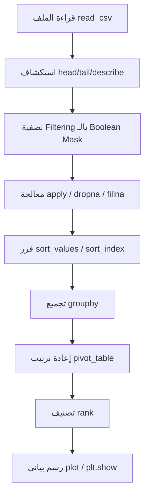

# المحاضرة 5 — Get Started for Data Scientists: Pandas Basics (أساسيات مكتبة Pandas)
> **المادة:** البرمجة المتقدمة 2 (القسم النظري) | **الموضوع:** التعامل مع البيانات باستخدام `pandas` — إنشاء، قراءة، تصفية، معالجة، فرز، تجميع، إعادة ترتيب، وتصنيف البيانات، ثم عرضها بيانياً باستخدام `matplotlib`.

---

## الجزء الأول: ملخص منظم (اقرأ قبل المحاضرة!)

### 📍 عن هذه المحاضرة
> هذه المحاضرة تُعلّمك كيف تتعامل مع البيانات الجدولية (Tabular Data) في بايثون باستخدام مكتبة `pandas`، من إنشاء الجدول وحتى رسمه بيانياً.

### 🎯 ستتعلم
- `DataFrame` — كيف تبني جدول بيانات من الصفر باستخدام `dict`.
- قراءة ملفات `CSV` والتعامل مع القيم المفقودة أثناء القراءة.
- طرق اختيار وتصفية أجزاء معينة من الجدول (`loc`, boolean masks).
- دوال التجميع (`mean`, `sum`, `max`...) ودالتي `apply` و `lambda` لمعالجة الأعمدة.
- الفرز (`sort_values`, `sort_index`)، التجميع (`groupby`)، إعادة الترتيب (`pivot_table`)، والتصنيف (`rank`).
- رسم النتائج بيانياً باستخدام `matplotlib` (bar chart, stacked bar chart).

### 📚 المتطلبات السابقة
- أساسيات بايثون (المتغيرات، الدوال، الحلقات، القواميس `dict` والقوائم `list`) — لأن `DataFrame` يُبنى غالباً من `dict` تحتوي `lists`.
- فكرة عامة عن الجداول (صفوف وأعمدة) — مثل جداول Excel.

### 💡 الأفكار الرئيسية

فكّر بمكتبة `pandas` كأنها "Excel داخل بايثون". بدل ما تفتح برنامج جداول بيانات وتتعامل بالماوس، أنت تكتب أسطر كود قصيرة تسوي نفس الشي: تفتح ملف، تشوف أول 5 صفوف، تصفّي البيانات اللي تبيها، وتحسب المتوسط. الفرق إن الكود قابل لإعادة الاستخدام والتكرار على آلاف الصفوف بثانية وحدة.

كل شي يبدأ من **DataFrame**، وهو الهيكل الأساسي اللي يمثّل الجدول: صفوف (rows) وأعمدة (columns) وindex يرقّم كل صف. أبسط طريقة تبنيه هي من `dict` — كل مفتاح في القاموس يصير اسم عمود، والقيمة (لازم تكون `list`) تصير محتوى العمود. بس الحاجة اللي لازم تنتبه لها: كل القوائم يجب أن تكون بنفس الطول، وإلا بايثون يرمي خطأ.

بعدين تجي خطوة القراءة (`read_csv`). في الواقع، نادراً ما تبني DataFrame يدوياً بهالطريقة — الأغلب إنك تقرأ بيانات جاهزة من ملف `.csv` أو قاعدة بيانات. هنا تحتاج تنتبه لمشكلة شائعة جداً: القيم المفقودة. في المحاضرة، ملف `European_1.csv` كان يستخدم الرمز `':'` للدلالة على قيمة غير موجودة. لو ما أخبرت `pandas` عن هذا الرمز، بايثون بيتعامل معه كـ `string` عادي، وبالتالي عمود `Value` كامل بيصير من نوع `object` بدل `float`، وهذا يمنعك من عمل حسابات رياضية عليه. الحل: بارامتر `na_values = ':'` يخبر `pandas` "أي مكان تشوف فيه هذا الرمز، حوّله لـ `NaN`". وفي نفس الوقت تقدر تستخدم `usecols` عشان تقرأ بس الأعمدة اللي تحتاجها وتتجاهل الباقي — وهذا يوفر ذاكرة ووقت.

بعد ما يصير عندك DataFrame نظيف، أول شي تسويه دايماً هو "استكشاف سريع": `head()` تعطيك أول 5 صفوف، `tail()` آخر 5، و`describe()` تعطيك ملخص إحصائي (متوسط، انحراف معياري، أقل وأعلى قيمة...) لكل عمود رقمي. هذي الخطوة الثلاثية هي أول شي يسويه أي data scientist لما يفتح ملف بيانات جديد — قبل أي تحليل، لازم تعرف شكل بياناتك.

من هنا نروح لموضوع **الاختيار والتصفية**. `edu.loc[90:94, ['TIME','GEO']]` تختار صفوف وأعمدة معينة بالاسم، بينما `edu['Value']` يرجع لك عمود واحد كـ`Series` (وهو نوع بيانات أبسط من DataFrame، عبارة عن عمود واحد بس). أما التصفية (Filtering) فتعتمد على "القناع المنطقي" (boolean mask): `edu[edu["Value"] > 6.5]` — هذا السطر أولاً يحسب `edu["Value"] > 6.5` فيرجع لك عمود من `True/False`، وبعدين يستخدم هذا العمود كفلتر يختار بس الصفوف اللي قيمتها `True`. نفس الفكرة تُستخدم لإيجاد القيم المفقودة: `edu[edu["Value"].isnull()]`.

بعد التصفية تجي **دوال التجميع (Aggregation Functions)** زي `count()`, `sum()`, `mean()`, `median()`, `min()`, `max()`, `std()`, `var()`. نقطة مهمة جداً هنا: دالة `max()` من بايثون العادية (built-in) والفنكشن `.max()` بتاعة `pandas` مو نفس الشي! دالة بايثون `max()` إذا لقت `NaN` واحدة بين القيم، بترجع `nan` كناتج نهائي (لأنها ما تعرف تتجاهل القيم المفقودة). أما `.max()` بتاعة pandas فهي ذكية وتتجاهل `NaN` تلقائياً وترجع أكبر قيمة حقيقية. هذا فرق دقيق لكن يسبب أخطاء كثيرة للمبتدئين.

لما تبي تطبّق عملية رياضية على عمود كامل، عندك خيارين: إما دالة جاهزة زي `np.sqrt` مع `.apply()`، أو دالة مؤقتة (`lambda`) لو العملية بسيطة ومو محتاجة اسم. مثلاً `edu["Value"].apply(lambda d: d**2)` تربّع كل قيمة في العمود بسطر وحد.

تقدر كمان تضيف عمود جديد للجدول بمجرد تعريفه: `edu['ValueNorm'] = edu['Value'] / edu['Value'].max()` — هذا يسوي "تطبيع" (Normalization) للبيانات بحيث تصير كل القيم بين 0 و1. ولو حبيت تحذفه أو تحذف صف، تستخدم `.drop()` مع تحديد `axis` (0 للصفوف، 1 للأعمدة) و `inplace = True` عشان التعديل يصير على نفس الجدول مباشرة بدل ما يرجع لك نسخة جديدة. وللتعامل مع القيم المفقودة عندك خياران متعاكسان: `dropna()` تحذف الصفوف اللي فيها `NaN`، أو `fillna()` تعبّي مكانها بقيمة معينة (زي صفر).

**الفرز (Sorting)** له طريقتان: `sort_values(by='Value')` يرتب حسب قيم عمود معين، و`sort_index()` يرجع الترتيب حسب index الأصلي (يعني يلغي أي فرز سابق).

**التجميع (Grouping)** عبر `groupby('GEO').mean()` هو من أقوى أدوات pandas — يجمع كل الصفوف اللي تشترك بنفس قيمة عمود معين (هنا اسم الدولة) ويحسب لها المتوسط دفعة وحدة، بدل ما تسوي حلقة `for` يدوية.

**إعادة الترتيب (`pivot_table`)** تحوّل الجدول من شكل "طويل" (كل سنة صف منفصل) لشكل "عريض" (كل سنة عمود منفصل، والدول صفوف) — وهذا يسهّل المقارنة بين الدول عبر السنوات بنظرة وحدة.

وأخيراً، **التصنيف (`rank`)** يعطي كل قيمة رتبتها (الأول، الثاني...) مقارنة بالباقي، وممكن نجمع كل السنوات بـ `.sum(axis=1)` ونرتبها لنعرف مين أعلى دولة إنفاقاً على التعليم عبر كل الفترة. وفي الختام، `matplotlib` يحوّل هذي الأرقام لرسم بياني (Bar Chart أو Stacked Bar Chart) يسهل قراءته بنظرة.

### 🔗 كيف تتصل هذه المحاضرة بالمحاضرات الأخرى؟
- **السابقة:** أساسيات بايثون (المتغيرات، القوائم، القواميس، الحلقات) علّمتك تبني هياكل بيانات بسيطة ← الآن نبني عليها لنكوّن `DataFrame` من `dict` يحوي `lists`.
- **القادمة:** ستُستخدم مهارات `pandas` هذه (خصوصاً `groupby`, `pivot_table`, و`apply`) في تحضير البيانات (Data Preprocessing) قبل تدريب أي نموذج `Machine Learning`، وستحتاجها أيضاً في تحليل نتائج الألعاب (`Games`) وتصورها بيانياً.

### ⚠️ الأخطاء الشائعة الواجب تجنبها

#### الفهم الخاطئ ❌:
الاعتقاد أن دالة `max()` العادية في بايثون تعطي نفس نتيجة `.max()` في `pandas` دائماً.

#### الفهم الصحيح ✅:
دالة بايثون `max()` ترجع `nan` إذا وُجدت أي قيمة `NaN` ضمن البيانات (لأنها لا تتجاهلها)، بينما `.max()` في `pandas` تتجاهل `NaN` تلقائياً وتعطي القيمة الحقيقية القصوى. لهذا السبب دائماً استخدم دوال `pandas` المدمجة (`.max()`, `.mean()`...) عند التعامل مع أعمدة قد تحوي قيماً مفقودة.

#### الفهم الخاطئ ❌:
الاعتقاد أن `edu.drop(...)` أو `edu.sort_values(...)` بدون `inplace = True` يُعدّل الجدول الأصلي مباشرة.

#### الفهم الصحيح ✅:
افتراضياً، أغلب دوال `pandas` (`drop`, `sort_values`, `sort_index`, `rename`...) **ترجع نسخة جديدة** من الجدول ولا تُعدّل الأصلي، إلا إذا مررت `inplace = True` صراحة، أو أعدت إسناد النتيجة لنفس المتغير (`edu = edu.dropna()`).

#### الفهم الخاطئ ❌:
الخلط بين قراءة عمود واحد `edu['Value']` (يرجع `Series`) وقراءة صفوف بالترتيب `edu[10:14]` (يرجع `DataFrame`).

#### الفهم الصحيح ✅:
لما تحط اسم عمود بين قوسين مربعين، `pandas` تفهمها "اختيار عمود" وترجع `Series`. أما لما تحط أرقام (slice)، تفهمها `pandas` "اختيار صفوف بالترتيب" وترجع `DataFrame` كامل بكل أعمدته.

### لما تحتاج هذا في الامتحان
غالباً الأسئلة تتمحور حول: (1) الفرق بين `pandas` max/mean ودوال بايثون العادية عند وجود `NaN`. (2) قراءة كود فيه `na_values` و`usecols` وتوقع شكل الناتج. (3) تتبع boolean mask في التصفية ومعرفة أي الصفوف ستُختار. (4) الفرق بين `axis=0` و`axis=1` في `drop` و`sum`. (5) نتيجة `groupby` أو `pivot_table` على بيانات معطاة. ركّز خصوصاً على القراءة الدقيقة للكود وتتبع تنفيذه سطراً بسطر (Trace).

---

## الجزء الثاني: الشرح التفصيلي (سطر بسطر / فقرة بفقرة)

### 1. إنشاء DataFrame (Creating a DataFrame)

<!-- @render: {type: "code-first", visualization: "none", coverage: "100%"} -->
<!-- @connectivity: {prerequisite: "none"} -->

#### 💡 الفكرة الأساسية
**`DataFrame` هو الهيكل الأساسي في `pandas` لتمثيل جدول بيانات ثنائي الأبعاد (صفوف وأعمدة)، ويمكن بناؤه مباشرة من `dict` تحتوي قوائم.**

#### 💻 الكود

```python
import pandas as pd
data = {'year': [
            2010, 2011, 2012,
            2010, 2011, 2012,
            2010, 2011, 2012
            ],
        'team': [
            'FCBarcelona', 'FCBarcelona', 'FCBarcelona',
            'RMadrid', 'RMadrid', 'RMadrid',
            'ValenciaCF', 'ValenciaCF', 'ValenciaCF'
            ],
        'wins': [30, 28, 32, 29, 32, 26, 21, 17, 19],
        'draws': [6, 7, 4, 5, 4, 7, 8, 10, 8],
        'losses': [2, 3, 2, 4, 2, 5, 9, 11, 11]
        }
football = pd.DataFrame(data, columns =
            ['year', 'team', 'wins', 'draws', 'losses'])
print(football)
```

#### شرح كل سطر:
1. `import pandas as pd` → استيراد المكتبة واختصار اسمها إلى `pd` (اتفاق شائع بين كل مبرمجي بايثون).
2. `data = {...}` → قاموس (`dict`) كل مفتاح فيه هو اسم عمود مستقبلي، وقيمته `list` تمثّل محتوى ذلك العمود — لاحظ أن كل القوائم طولها 9 عناصر بالضبط.
3. `football = pd.DataFrame(data, columns=[...])` → تحويل القاموس إلى جدول `DataFrame` فعلي، مع تحديد ترتيب الأعمدة صراحة عبر `columns`.
4. `print(football)` → طباعة الجدول الناتج، ويظهر معه `index` رقمي تلقائي يبدأ من 0.

#### 📖 الشرح: ماذا يفعل هذا الكود؟ لماذا؟
هذا الكود يبني جدول بيانات يمثّل نتائج ثلاثة فرق كرة قدم عبر ثلاث سنوات. الفكرة الأساسية: `pandas` تتوقع أن تكون بنية بياناتك "عمودية" — أي كل عمود هو قائمة متجانسة من القيم. لما تعطيها `dict` بهذا الشكل، تفهم `pandas` تلقائياً أن كل مفتاح = اسم عمود، وتقوم بمحاذاة القيم صفاً بصف حسب ترتيبها في القوائم.

بارامتر `columns` هنا اختياري من ناحية البيانات نفسها، لكنه مهم للتحكم بترتيب ظهور الأعمدة في الجدول النهائي — لأن ترتيب المفاتيح داخل `dict` قد لا يكون مضموناً في كل الحالات القديمة من بايثون.

#### 🎯 الملخص السريع
- `DataFrame` يُبنى من `dict` بحيث كل مفتاح = عمود.
- كل القوائم (values) يجب أن تكون بنفس الطول.
- `columns` يحدد ترتيب الأعمدة الظاهر.
- `index` رقمي تلقائي (0, 1, 2...) يُنشأ افتراضياً.

#### 📚 التطبيق
يُستخدم هذا الأسلوب لبناء جداول تجريبية صغيرة سريعاً لاختبار الكود، قبل الانتقال للتعامل مع ملفات بيانات حقيقية كبيرة عبر `read_csv` في القسم التالي.

#### ⚠️ أخطاء شائعة

#### الفهم الخاطئ ❌:
الاعتقاد أنه يمكن استخدام قوائم بأطوال مختلفة لأعمدة مختلفة.

#### الفهم الصحيح ✅:
`pandas` تتطلب أن تكون كل القوائم داخل الـ `dict` بنفس الطول تماماً؛ وإلا سيحدث خطأ (`ValueError`) عند بناء `DataFrame`.

#### 📄 النص الأصلي من المحاضرة
<details>
<summary>عرض النص الأصلي (coverage: 100%)</summary>

**النص الأصلي يقول:**
> الكود يبني قاموس `data` يحتوي أعمدة `year`, `team`, `wins`, `draws`, `losses`، ثم يبنى منه `football = pd.DataFrame(data, columns=[...])` ويُطبع بـ `print(football)`، والناتج جدول من 9 صفوف مرقّمة من 0 إلى 8 يعرض نتائج FCBarcelona وRMadrid وValenciaCF لسنوات 2010-2012، مع مرجع لموقع `http://ec.europa.eu/eurostat/data/database` كمصدر بيانات حقيقي بديل.

**ملاحظة على التغطية:**
- ✓ تم شرح بالكامل: بناء DataFrame من dict، دور بارامتر columns، الـ index التلقائي.
- ℹ️ إضافة من الدليل: تشبيه Excel، وتوضيح شرط تساوي أطوال القوائم.

</details>

---

### 2. قراءة البيانات (Reading Data) — `read_csv`

<!-- @render: {type: "code-first", visualization: "none", coverage: "95%"} -->
<!-- @connectivity: {prerequisite: "section_1"} -->

#### 📍 أين نحن الآن؟
بعد أن تعلمنا بناء `DataFrame` يدوياً، ننتقل الآن لأكثر عملية شائعة في الواقع: قراءة بيانات جاهزة من ملف خارجي.

#### ⬅️ الربط مع السابق
في القسم السابق بنينا الجدول يدوياً من `dict`؛ هنا سنحصل على نفس نوع الجدول (`DataFrame`) لكن مصدره ملف `.csv` حقيقي بدل الكتابة اليدوية.

#### 💡 الفكرة الأساسية
**`pd.read_csv()` تقرأ ملف نصي مفصول بفواصل وتحوّله مباشرة إلى `DataFrame`، مع إمكانية التحكم بالقيم المفقودة والأعمدة المطلوبة أثناء القراءة نفسها.**

#### 💻 الكود

```python
import pandas as pd
edu = pd.read_csv('d:\datasets\db_1.csv')
edu.info()
```

```python
edu = pd.read_csv('d:\datasets\db_1.csv', na_values=':',
                   usecols=["TIME", "GEO", "Value"])
edu
```

#### شرح كل سطر:
1. `pd.read_csv('d:\datasets\db_1.csv')` → قراءة الملف كما هو، بدون أي معالجة للقيم المفقودة أو اختيار أعمدة.
2. `edu.info()` → تعرض ملخصاً تقنياً: عدد الصفوف، أسماء الأعمدة، عدد القيم غير الفارغة (`Non-Null Count`) في كل عمود، ونوع البيانات (`Dtype`) لكل عمود.
3. `na_values=':'` → تخبر `pandas`: "أي خلية قيمتها النصية `':'` اعتبرها قيمة مفقودة (`NaN`) وليست نصاً عادياً".
4. `usecols=["TIME","GEO","Value"]` → اقرأ فقط هذه الأعمدة الثلاثة من الملف، وتجاهل بقية الأعمدة (مثل `INDIC_ED` و`Flag and Footnotes`) لتوفير الذاكرة والوضوح.

#### 📖 الشرح: ماذا يفعل هذا الكود؟ لماذا؟
عند قراءة الملف بدون `na_values`، تلاحظ من `edu.info()` أن عمود `Value` نوعه `object` (نص) وليس `int64` أو `float64` رغم أنه يفترض أن يكون أرقاماً — والسبب أن الملف يحتوي على الرمز `':'` بدل الأرقام المفقودة، فتعامله `pandas` كسلسلة نصية، مما يجعل العمود بأكمله من نوع نصي مختلط. هذا يمنعك من عمل أي عملية حسابية (مثل `.mean()`) على العمود مباشرة بشكل صحيح.

بإضافة `na_values=':'`، تتحول كل هذه الخلايا تلقائياً إلى `NaN` (قيمة عددية خاصة تعني "مفقود")، فيصبح عمود `Value` من نوع `float64` صالح للحسابات. أما `usecols` فهي تحسين اختياري: بدل قراءة كل الأعمدة الخمسة، تحدد فقط الأعمدة التي تحتاجها فعلياً.

#### 🎯 الملخص السريع
- `read_csv` هي الطريقة القياسية لقراءة ملفات CSV في `pandas`.
- `na_values` يحدد أي رمز نصي يُفسَّر كقيمة مفقودة `NaN`.
- `usecols` يحدد أعمدة معينة فقط للقراءة.
- `.info()` أداة تشخيصية أولى لمعرفة أنواع البيانات وعدد القيم المفقودة.

#### 📚 التطبيق
هذه الخطوة (تنظيف القيم المفقودة أثناء القراءة) هي أول خطوة عملية في أي مشروع Data Science حقيقي، وتُستخدم لاحقاً في `dropna()` و`fillna()` في القسم 5.

#### ⚠️ أخطاء شائعة

#### الفهم الخاطئ ❌:
افتراض أن كل الأعمدة الرقمية في ملف CSV ستكون تلقائياً من نوع `int` أو `float` بمجرد قراءتها.

#### الفهم الصحيح ✅:
إذا احتوى العمود على أي رمز غير رقمي (مثل `':'` أو نص فارغ بصيغة غريبة) ولم يتم إخبار `pandas` عنه عبر `na_values`، فسيتحول العمود بأكمله إلى نوع `object` (نصي)، حتى لو كانت أغلب قيمه أرقاماً.

#### 📄 النص الأصلي من المحاضرة
<details>
<summary>عرض النص الأصلي (coverage: 95% — تفاصيل مسار الملف على Windows لم تُشرح بعمق)</summary>

**النص الأصلي يقول:**
> يُعرض ملف بيانات مثال بعنوان `European_1.csv` من مصدر Eurostat يحوي أعمدة `TIME`, `GEO`, `INDIC_ED`, `Value`, `Flag and Footnotes`، حيث القيم المفقودة تظهر برمز `':'`. ثم يُستخدم `edu = pd.read_csv('d:\datasets\db_1.csv')` مع `edu.info()` لعرض 384 صفاً وخمسة أعمدة، ثم تُعاد القراءة مع `na_values = ':'` و`usecols = ["TIME","GEO","Value"]` لتنظيف البيانات وتضييق الأعمدة، متبوعة بعرض `edu.head()` و`edu.tail()` و`edu.describe()`.

**ملاحظة على التغطية:**
- ✓ تم شرح بالكامل: دور `na_values`, `usecols`, والفرق في نوع العمود قبل/بعد.
- ⚠️ لم يُشرح بالكامل: أن مسار الملف يستخدم صيغة Windows (`d:\datasets\...`) وهي تفصيلة بيئة تشغيل وليست مفهوماً برمجياً جوهرياً.
- ℹ️ إضافة من الدليل: تشبيه "لماذا يتحول العمود كامل لنص" بشكل مبسّط.

</details>

---

### 3. الاستكشاف الأولي: `head`, `tail`, `describe`

<!-- @render: {type: "code-first", visualization: "none", coverage: "100%"} -->
<!-- @connectivity: {prerequisite: "section_2"} -->

#### ⬅️ الربط مع السابق
بعد قراءة الملف وتنظيف القيم المفقودة في القسم السابق، أول خطوة منطقية هي "التعرف السريع" على شكل البيانات قبل أي تحليل.

#### 💡 الفكرة الأساسية
**`head()`, `tail()`, و`describe()` هي ثلاث دوال استكشاف سريعة تعطيك فكرة عامة عن شكل بياناتك وقيمها الإحصائية خلال ثوانٍ.**

#### 💻 الكود

```python
edu.head()          # first 5 rows
edu.tail()          # last 5 rows
edu.describe()      # statistical summary of numeric columns
```

#### شرح كل سطر:
1. `edu.head()` → تعرض افتراضياً أول 5 صفوف من الجدول (يمكن تمرير رقم مثل `head(10)` لعرض عدد مختلف).
2. `edu.tail()` → نفس الفكرة لكن لآخر 5 صفوف.
3. `edu.describe()` → تحسب لكل عمود رقمي: `count`, `mean`, `std`, `min`, الأرباع (`25%`, `50%`, `75%`), و`max`.

#### 📖 الشرح: ماذا يفعل هذا الكود؟ لماذا؟
هذه الدوال الثلاث لا تُغيّر البيانات إطلاقاً — هي فقط أدوات "نظرة سريعة" (Quick Look). في مثال المحاضرة، `edu.describe()` أظهرت أن عمود `Value` فيه 361 قيمة فقط من أصل 384 (أي 23 قيمة `NaN`)، بينما عمود `TIME` فيه 384 قيمة كاملة (لأنه لا يحتوي على أي قيم مفقودة). هذا الفرق في `count` بين الأعمدة هو أول إشارة تخبرك أن هناك بيانات ناقصة تحتاج معالجة.

#### 🎯 الملخص السريع
- `head()` / `tail()`: نظرة على البداية / النهاية.
- `describe()`: ملخص إحصائي فوري (يشمل `count` الذي يكشف القيم المفقودة).
- هذه الخطوة تُسبق دائماً أي عملية تحليل أو تصفية.

#### 📚 التطبيق
النتيجة من `describe()` (خصوصاً فرق `count` بين الأعمدة) توجّهك مباشرة لاستخدام `isnull()` والتصفية في القسم التالي.

#### ⚠️ أخطاء شائعة

#### الفهم الخاطئ ❌:
الاعتقاد أن `describe()` تحسب إحصائيات لكل الأعمدة بما فيها النصية.

#### الفهم الصحيح ✅:
`describe()` افتراضياً تحسب فقط للأعمدة الرقمية (`int`, `float`)؛ الأعمدة النصية مثل `GEO` لا تظهر في الملخص الافتراضي.

#### 📄 النص الأصلي من المحاضرة
<details>
<summary>عرض النص الأصلي (coverage: 100%)</summary>

**النص الأصلي يقول:**
> `#print(edu.head()) / edu.head()` تعرض أول 5 صفوف، `#print(edu.tail()) / edu.tail()` تعرض آخر 5 صفوف، و`#print(edu.describe()) / edu.describe()` تعرض `count, mean, std, min, 25%, 50%, 75%, max` لعمودي `TIME` و`Value`، مع الإشارة إلى وجود 23 قيمة `NaN` في عمود `Value` (361 مقابل 384 في `TIME`).

**ملاحظة على التغطية:**
- ✓ تم شرح بالكامل جميع النقاط الواردة.
- ℹ️ إضافة من الدليل: توضيح أن describe تقتصر على الأعمدة الرقمية افتراضياً.

</details>

---

### 4. اختيار البيانات (Selecting Data)

<!-- @render: {type: "code-first", visualization: "none", coverage: "100%"} -->
<!-- @connectivity: {prerequisite: "section_3"} -->

#### ⬅️ الربط مع السابق
بعد أن تعرّفنا على شكل الجدول عموماً، نحتاج الآن نتعلم كيف نختار أجزاء محددة منه (صفوف/أعمدة معينة).

#### 💡 الفكرة الأساسية
**`.loc[]` تختار بيانات بالاسم (label-based)، بينما `[]` وحدها تختار إما عموداً بالاسم أو صفوفاً بالترتيب الرقمي (slice).**

#### 💻 الكود

```python
print(edu.loc[90:94, ['TIME', 'GEO']])

print(edu['Value'])
print(edu[10:14])
```

#### شرح كل سطر:
1. `edu.loc[90:94, ['TIME','GEO']]` → يختار الصفوف من `index` رقم 90 إلى 94 (شاملة النهاية)، وفقط عمودي `TIME` و`GEO`.
2. `edu['Value']` → يختار عموداً واحداً باسمه، ويُرجع النتيجة كـ `Series` (عمود واحد فقط، ليس جدولاً كاملاً).
3. `edu[10:14]` → استخدام slice رقمي مباشرة بدون `.loc`، يختار الصفوف من الترتيب 10 إلى 13 (النهاية غير شاملة هنا لأنه slicing عادي وليس `.loc`)، ويُرجع `DataFrame` كامل بكل أعمدته.

#### 📖 الشرح: ماذا يفعل هذا الكود؟ لماذا؟
النقطة الدقيقة هنا: `.loc[90:94]` شاملة للنهاية (تتضمن 94)، بينما `edu[10:14]` سلوكها كسلوك القوائم العادية في بايثون (النهاية غير شاملة، فتشمل 10, 11, 12, 13 فقط). هذا الاختلاف مصدر شائع للأخطاء لأن كلاهما يبدو متشابهاً في الشكل.

كذلك، الفرق بين إرجاع `Series` (عند اختيار عمود واحد) و`DataFrame` (عند اختيار أكثر من عمود أو صفوف) مهم — لأن بعض الدوال متاحة فقط على أحد النوعين.

#### 🎯 الملخص السريع
- `.loc[start:end, [cols]]`: اختيار بالاسم، والنهاية شاملة.
- `df['col']`: يرجع `Series` (عمود واحد).
- `df[start:end]`: slice رقمي، النهاية غير شاملة، يرجع `DataFrame`.

#### 📚 التطبيق
هذا الأساس يُبنى عليه مباشرة مفهوم "التصفية بالشرط" (Filtering) في القسم التالي، حيث نستبدل الأرقام الثابتة بشرط منطقي.

#### ⚠️ أخطاء شائعة

#### الفهم الخاطئ ❌:
الاعتقاد أن `.loc[90:94]` و `edu[90:94]` يعطيان نفس النتيجة بالضبط.

#### الفهم الصحيح ✅:
`.loc` تعتمد على تسميات الـ`index` وتكون شاملة للنهاية، بينما الـ slicing المباشر `[]` على DataFrame يتبع منطق بايثون العادي (النهاية غير شاملة) ويعمل على الترتيب الموضعي.

#### 📄 النص الأصلي من المحاضرة
<details>
<summary>عرض النص الأصلي (coverage: 100%)</summary>

**النص الأصلي يقول:**
> `print(edu.loc[90:94, ['TIME','GEO']])` يعرض صفوف بلجيكا من 2006 إلى 2010. `print(edu['Value'])` يعرض عمود القيم كـ `Series` من نوع `float64` مع ملاحظة "Index started in 0". `print(edu[10:14])` يعرض 4 صفوف كاملة (index 10 إلى 13) من الاتحاد الأوروبي.

**ملاحظة على التغطية:**
- ✓ تم شرح بالكامل جميع الأمثلة والفروقات.
- ℹ️ إضافة من الدليل: توضيح صريح للفرق بين شمول/عدم شمول النهاية بين `.loc` والـ slicing العادي.

</details>

---

### 5. تصفية البيانات (Filtering Data)

<!-- @render: {type: "code-first", visualization: "none", coverage: "100%"} -->
<!-- @connectivity: {prerequisite: "section_4"} -->

#### ⬅️ الربط مع السابق
بدل اختيار صفوف بأرقام index ثابتة كما في القسم السابق، هنا نختار الصفوف بناءً على **شرط منطقي** يتغير حسب قيم البيانات نفسها.

#### 💡 الفكرة الأساسية
**التصفية في `pandas` تعتمد على "قناع منطقي" (Boolean Mask): تعبير شرطي يُرجع `True/False` لكل صف، ثم يُستخدم هذا القناع لاختيار الصفوف المطابقة فقط.**

#### 💻 الكود

```python
# Rows where Value is greater than 6.5
edu[edu["Value"] > 6.5].tail()

# Rows where Value is missing (NaN)
edu[edu["Value"].isnull()].head()
```

#### شرح كل سطر:
1. `edu["Value"] > 6.5` → يُنتج عمود من `True`/`False` بنفس طول الجدول، حيث `True` تعني أن القيمة في ذلك الصف أكبر من 6.5.
2. `edu[ ... ]` → استخدام هذا العمود المنطقي كفلتر: يُعيد فقط الصفوف التي قيمتها `True`.
3. `edu["Value"].isnull()` → يُنتج قناعاً منطقياً آخر: `True` لكل صف قيمته `NaN` (مفقودة)، و`False` لباقي الصفوف.

#### 📖 الشرح: ماذا يفعل هذا الكود؟ لماذا؟
هذا هو النمط الأكثر استخداماً في `pandas` لتصفية البيانات — تكتب الشرط داخل قوسين مربعين مباشرة على الجدول نفسه. في المثال الأول، النتيجة أظهرت دولاً مثل مالطا وفنلندا التي إنفاقها على التعليم تجاوز 6.5% من الناتج المحلي. في المثال الثاني، `isnull()` كانت مفيدة جداً لإيجاد كل الصفوف التي تحتاج معالجة لاحقة (سواء بالحذف أو التعبئة).

#### 🎯 الملخص السريع
- الفلترة = بناء قناع منطقي (`True`/`False`) ثم تمريره داخل `[]`.
- `isnull()` تحديداً تُستخدم لإيجاد القيم المفقودة.
- يمكن دمج أكثر من شرط باستخدام `&` (و) أو `|` (أو).

#### 📚 التطبيق
نتائج `isnull()` هنا تمهّد مباشرة لعمليتي `dropna()` و`fillna()` في القسم القادم، حيث نقرر ماذا نفعل بهذه الصفوف الناقصة.

#### ⚠️ أخطاء شائعة

#### الفهم الخاطئ ❌:
استخدام `and` / `or` العادية في بايثون لدمج شرطين على DataFrame.

#### الفهم الصحيح ✅:
في `pandas`، يجب استخدام `&` بدل `and` و`|` بدل `or` عند دمج شروط منطقية على أعمدة كاملة، مع وضع كل شرط بين قوسين، مثل: `edu[(edu["Value"] > 5) & (edu["TIME"] > 2005)]`.

#### 📄 النص الأصلي من المحاضرة
<details>
<summary>عرض النص الأصلي (coverage: 100%)</summary>

**النص الأصلي يقول:**
> `edu[edu["Value"] > 6.5]. tail()` يعرض صفوف مالطا وفنلندا حيث القيمة أكبر من 6.5، و `edu[edu["Value"]. isnull()]. head()` يعرض صفوفاً من الاتحاد الأوروبي ومنطقة اليورو حيث القيمة `NaN`.

**ملاحظة على التغطية:**
- ✓ تم شرح بالكامل مفهوم القناع المنطقي والمثالين.
- ℹ️ إضافة من الدليل: توضيح دمج الشروط بـ `&` و `|` كنقطة يحتاجها الطالب عملياً رغم عدم ذكرها صراحة في الشريحة.

</details>

---

### 6. معالجة البيانات (Manipulating Data)

<!-- @render: {type: "code-first", visualization: "none", coverage: "95%"} -->
<!-- @connectivity: {prerequisite: "section_5"} -->

#### ⬅️ الربط مع السابق
بعد أن تعلمنا كيف نختار ونصفّي البيانات، الخطوة التالية هي "المعالجة" — أي تطبيق عمليات حسابية عليها، أو تعديل هيكل الجدول نفسه (إضافة/حذف أعمدة وصفوف، معالجة القيم المفقودة).

#### 💡 الفكرة الأساسية
**دوال التجميع (`mean`, `max`...)، والدوال المُطبّقة (`apply`, `lambda`)، وعمليات إضافة/حذف الأعمدة والصفوف، هي الأدوات الأساسية لتحويل بيانات خام إلى بيانات جاهزة للتحليل.**

#### 💻 الكود

```python
# Aggregation & the pandas vs. python max difference
print(edu.max(axis=0))
print("Pandas max function:", edu['Value'].max())
print("Python max function:", max(edu['Value']))   # returns nan!

# Applying a function to a whole column
import numpy as np
s = edu["Value"].apply(np.sqrt)

# Applying a custom (lambda) function
s = edu["Value"].apply(lambda d: d**2)

# Adding and removing a column
edu['ValueNorm'] = edu['Value'] / edu['Value'].max()
edu.drop('ValueNorm', axis=1, inplace=True)

# Adding and removing a row
edu = edu.append({"TIME": 2000, "Value": 5.00, "GEO": 'a'},
                  ignore_index=True)
edu.drop(max(edu.index), axis=0, inplace=True)

# Handling missing values
eduDrop = edu.dropna(how='any', subset=["Value"])
eduFilled = edu.fillna(value={"Value": 0})
```

#### شرح كل سطر:
1. `edu.max(axis=0)` → يحسب أقصى قيمة لكل عمود (`axis=0` = عمودياً، أي عبر الصفوف).
2. `max(edu['Value'])` → دالة بايثون العادية؛ لأنها لا تتجاهل `NaN` تلقائياً، النتيجة `nan` (لأن أول عنصر NaN "يلوّث" المقارنة).
3. `edu["Value"].apply(np.sqrt)` → يُطبّق الجذر التربيعي (دالة NumPy جاهزة) على كل قيمة في العمود.
4. `edu["Value"].apply(lambda d: d**2)` → يُطبّق دالة مجهولة الاسم (`lambda`) تُربّع كل قيمة — مفيدة للعمليات القصيرة التي لا تستحق تعريف دالة منفصلة.
5. `edu['ValueNorm'] = edu['Value'] / edu['Value'].max()` → إنشاء عمود جديد بمجرد إسناد قيمة له؛ هنا نقسم كل قيمة على أعلى قيمة في العمود (تطبيع Normalization).
6. `edu.drop('ValueNorm', axis=1, inplace=True)` → حذف العمود؛ `axis=1` يعني "عمود"، و`inplace=True` يعدّل الجدول نفسه بدل إرجاع نسخة.
7. `edu.append({...}, ignore_index=True)` → إضافة صف جديد كـ `dict`؛ `ignore_index=True` يعيد ترقيم index تلقائياً بدل إعطاء الصف الجديد رقماً غير متسلسل.
8. `edu.drop(max(edu.index), axis=0, inplace=True)` → حذف الصف الأخير (أعلى رقم index) الذي أضفناه للتو؛ `axis=0` يعني "صف".
9. `edu.dropna(how='any', subset=["Value"])` → حذف أي صف يحتوي `NaN` في عمود `Value` تحديداً (`how='any'` تعني "يكفي وجود قيمة مفقودة واحدة").
10. `edu.fillna(value={"Value": 0})` → تعبئة كل القيم المفقودة في عمود `Value` بالرقم صفر بدل حذف الصف كاملاً.

#### 📖 الشرح: ماذا يفعل هذا الكود؟ لماذا؟
أهم نقطة في هذا القسم كاملة هي الفرق بين `max()` بايثون و`.max()` بانداز، وهذا موضّح تفصيلياً في "الأفكار الرئيسية" أعلاه — تذكّر: استخدم دائماً دوال `pandas` عند التعامل مع أعمدة قد تحوي `NaN`.

بخصوص `apply` و`lambda`: كلاهما يؤديان نفس الغرض (تطبيق عملية على كل عنصر)، لكن `apply(np.sqrt)` تستخدم دالة جاهزة من NumPy، بينما `lambda` تسمح لك تكتب عملية مخصصة صغيرة في مكانها مباشرة بدون تعريفها كدالة منفصلة باسم.

بخصوص `dropna` مقابل `fillna`: هذان نهجان متعاكسان للتعامل مع القيم المفقودة — الأول يحذف البيانات الناقصة (وقد يفقدك معلومات مفيدة في الأعمدة الأخرى من نفس الصف)، والثاني يعوّض عنها بقيمة افتراضية (وقد يُدخل تحيزاً في التحليل إذا لم تُختر القيمة البديلة بعناية). القرار بينهما يعتمد على طبيعة التحليل المطلوب.

#### 🎯 الملخص السريع
- `.max()`/`.mean()` في pandas تتجاهل `NaN`؛ الدوال المدمجة في بايثون لا تتجاهلها.
- `apply()` تطبّق دالة (جاهزة أو `lambda`) على كل عنصر في عمود.
- `drop(axis=1)` لحذف عمود، `drop(axis=0)` لحذف صف.
- `dropna()` تحذف صفوف ناقصة، `fillna()` تعوّضها بقيمة.

#### 📚 التطبيق
هذه العمليات (خصوصاً `apply` و`fillna`) هي جوهر "تحضير البيانات" (Preprocessing) قبل أي تحليل إحصائي أو نموذج تعلّم آلي.

#### ⚠️ أخطاء شائعة

#### الفهم الخاطئ ❌:
استخدام `max(column)` من بايثون بدل `column.max()` من pandas عند وجود قيم مفقودة، متوقعاً نفس النتيجة.

#### الفهم الصحيح ✅:
كما رأينا في الكود، `max(edu['Value'])` أعطت `nan` بينما `edu['Value'].max()` أعطت `8.81` — الفرق حاسم ويجب دائماً تفضيل دوال `pandas` المدمجة على دوال بايثون العامة عند التعامل مع `Series`.

#### 📄 النص الأصلي من المحاضرة
<details>
<summary>عرض النص الأصلي (coverage: 95% — دالة prod غير مشروحة بمثال مستقل)</summary>

**النص الأصلي يقول:**
> جدول لدوال التجميع الشائعة: `count, sum, mean, median, min, max, prod, std, var`. ثم أمثلة: `edu.max(axis=0)` تعطي TIME=2011, GEO=Spain, Value=8.81؛ `edu['Value'].max()` تعطي 8.81 بينما `max(edu['Value'])` تعطي `nan`. ثم `s = edu["Value"]/100`، و`s = edu["Value"].apply(np.sqrt)`، و`s = edu["Value"].apply(lambda d: d**2)`. ثم إضافة عمود `ValueNorm` وحذفه بـ `edu.drop('ValueNorm', axis=1, inplace=True)`. ثم إضافة صف بـ `edu.append({...}, ignore_index=True)` وحذفه بـ `edu.drop(max(edu.index), axis=0, inplace=True)`. وأخيراً `eduDrop = edu.dropna(how='any', subset=["Value"])` و `eduFilled = edu.fillna(value={"Value": 0})`.

**ملاحظة على التغطية:**
- ✓ تم شرح بالكامل: الفرق بين max بايثون وpandas، apply، lambda، إضافة/حذف الأعمدة والصفوف، dropna، fillna.
- ⚠️ غير مشروح بالكامل: دالتا `prod()` و`var()` من الجدول لم تُستخدم في مثال كودي مستقل بالمحاضرة، فقط ذُكرتا في الجدول التعريفي.
- ℹ️ إضافة من الدليل: شرح المفاضلة (trade-off) بين dropna وfillna.

</details>

---

### 7. الفرز (Sorting)

<!-- @render: {type: "code-first", visualization: "none", coverage: "100%"} -->
<!-- @connectivity: {prerequisite: "section_6"} -->

#### ⬅️ الربط مع السابق
بعد تنظيف البيانات في القسم السابق، نحتاج غالباً نرتبها لنسهّل قراءتها — سواء حسب قيمة عمود معين أو حسب index الأصلي.

#### 💡 الفكرة الأساسية
**`sort_values()` تفرز حسب قيم عمود محدد، بينما `sort_index()` تعيد الترتيب حسب index الأصلي (تصاعدياً افتراضياً).**

#### 💻 الكود

```python
edu.sort_values(by='Value', ascending=False, inplace=True)
print(edu.head())

edu.sort_index(axis=0, ascending=True, inplace=True)
print(edu.head())
```

#### شرح كل سطر:
1. `edu.sort_values(by='Value', ascending=False, inplace=True)` → يرتب الجدول تنازلياً (`ascending=False`) حسب عمود `Value`، ويعدّل الجدول نفسه مباشرة.
2. `edu.sort_index(axis=0, ascending=True, inplace=True)` → يعيد ترتيب الصفوف تصاعدياً حسب رقم `index` الأصلي، ملغياً بذلك أثر الفرز السابق.

#### 📖 الشرح: ماذا يفعل هذا الكود؟ لماذا؟
بعد تنفيذ `sort_values`، أعلى الدول إنفاقاً (مثل الدنمارك) تظهر في الأعلى. لاحظ أن ترقيم `index` لم يتغير — يعني الصف رقم 130 (الدنمارك 2010) بقي رقمه 130، بس تغير مكانه في العرض. لما نستخدم `sort_index` بعدها، نرجّع الجدول لترتيبه الأصلي (حسب رقم index تصاعدياً) وكأننا "ألغينا" الفرز.

#### 🎯 الملخص السريع
- `sort_values(by='col', ascending=False)`: فرز حسب قيم عمود، تنازلي أو تصاعدي.
- `sort_index()`: إعادة الترتيب حسب رقم index الأصلي.
- `inplace=True`: يعدّل الجدول مباشرة بدل إرجاع نسخة.

#### 📚 التطبيق
الفرز خطوة تمهيدية أساسية قبل التصنيف (`rank`) في القسم 9، وقبل عرض النتائج بيانياً مرتّبة تنازلياً في قسم الرسم البياني.

#### ⚠️ أخطاء شائعة

#### الفهم الخاطئ ❌:
الاعتقاد أن `sort_values` تغيّر أرقام الـ`index` نفسها لتصبح متسلسلة من جديد.

#### الفهم الصحيح ✅:
`sort_values` تعيد ترتيب **مواقع عرض** الصفوف فقط؛ أرقام index الأصلية تبقى ملتصقة بصفوفها كما هي، ما لم تستخدم `reset_index()` صراحة.

#### 📄 النص الأصلي من المحاضرة
<details>
<summary>عرض النص الأصلي (coverage: 100%)</summary>

**النص الأصلي يقول:**
> `edu.sort_values(by = 'Value', ascending = False, inplace = True)` تعرض الدنمارك في القمة بقيمة 8.81 (index=130)، ثم `edu.sort_index(axis = 0, ascending = True, inplace = True)` تعيد الترتيب الأصلي بحيث يظهر الاتحاد الأوروبي في الأعلى مجدداً (index=0).

**ملاحظة على التغطية:**
- ✓ تم شرح بالكامل.
- ℹ️ إضافة من الدليل: توضيح أن رقم index لا يتغير أثناء sort_values.

</details>

---

### 8. تجميع البيانات (Grouping Data)

<!-- @render: {type: "code-first", visualization: "none", coverage: "100%"} -->
<!-- @connectivity: {prerequisite: "section_7"} -->

#### ⬅️ الربط مع السابق
بدل الفرز البسيط، أحياناً نحتاج نلخّص البيانات حسب فئة معينة (مثل: متوسط الإنفاق لكل دولة عبر كل السنوات مجتمعة) — وهنا يأتي دور `groupby`.

#### 💡 الفكرة الأساسية
**`groupby('column')` تجمع كل الصفوف التي تشترك بنفس قيمة عمود معين، وتسمح بتطبيق دالة تجميع (مثل `mean()`) على كل مجموعة دفعة واحدة.**

#### 💻 الكود

```python
group = edu[["GEO", "Value"]].groupby('GEO').mean()
print(group.head())
```

#### شرح كل سطر:
1. `edu[["GEO", "Value"]]` → اختيار عمودين فقط (اسم الدولة والقيمة) قبل التجميع، لتفادي أخطاء محاولة حساب متوسط لأعمدة نصية أخرى مثل `TIME` بشكل غير مقصود.
2. `.groupby('GEO')` → يقسّم الجدول إلى مجموعات فرعية، كل مجموعة تحتوي كل الصفوف الخاصة بدولة واحدة.
3. `.mean()` → يحسب متوسط عمود `Value` لكل مجموعة (دولة) على حدة.

#### 📖 الشرح: ماذا يفعل هذا الكود؟ لماذا؟
فكّر بـ `groupby` مثل ترتيب أوراق امتحان الطلاب حسب الصف الدراسي أولاً، ثم حساب المعدل لكل صف على حدة. بدل ما تكتب حلقة `for` تمر على كل دولة وتحسب متوسطها يدوياً، سطر واحد يقوم بالعملية كاملة. النتيجة جدول جديد فيه اسم كل دولة كـ index، وعمود واحد يمثّل متوسط قيمة الإنفاق عبر كل السنوات المتوفرة لتلك الدولة.

#### 🎯 الملخص السريع
- `groupby(col)` تقسّم البيانات حسب فئات عمود معين.
- تُستخدم دائماً مع دالة تجميع بعدها (`.mean()`, `.sum()`, `.count()`...).
- النتيجة جدول جديد يستخدم قيم عمود التجميع كـ index.

#### 📚 التطبيق
`groupby` أداة أساسية جداً في أي تحليل بيانات حقيقي — تُستخدم لاحقاً لتلخيص بيانات ضخمة (مثل ملايين سجلات مبيعات) حسب فئة (منتج، منطقة، شهر...) بسطر واحد.

#### ⚠️ أخطاء شائعة

#### الفهم الخاطئ ❌:
تطبيق `.mean()` مباشرة على `groupby` لجدول يحوي أعمدة نصية أخرى غير مرتبطة، متوقعاً تجاهلها تلقائياً بلا مشاكل دائماً.

#### الفهم الصحيح ✅:
من الأفضل والأوضح اختيار الأعمدة المطلوبة فقط قبل `groupby` (كما في الكود: `edu[["GEO","Value"]]`)، لتفادي أي سلوك غير متوقع أو أخطاء عند التعامل مع أعمدة غير رقمية.

#### 📄 النص الأصلي من المحاضرة
<details>
<summary>عرض النص الأصلي (coverage: 100%)</summary>

**النص الأصلي يقول:**
> `group = edu[["GEO", "Value"]]. groupby('GEO').mean()` ثم `print(group.head())` تعرض متوسط الإنفاق لكل دولة: Austria 5.618333، Belgium 6.189091، Bulgaria 4.093333، Cyprus 7.023333، Czech Republic 4.168333.

**ملاحظة على التغطية:**
- ✓ تم شرح بالكامل.
- ℹ️ إضافة من الدليل: تشبيه ترتيب أوراق الامتحان حسب الصف الدراسي.

</details>

---

### 9. إعادة ترتيب البيانات (Rearranging Data) — `pivot_table`

<!-- @render: {type: "code-first", visualization: "none", coverage: "100%"} -->
<!-- @connectivity: {prerequisite: "section_8"} -->

#### ⬅️ الربط مع السابق
بعد أن رأينا كيف نلخص البيانات بـ `groupby`، الآن نتعلم كيف "نعيد تشكيل" الجدول بالكامل لتسهيل المقارنة — من شكل طويل (كل سنة صف) إلى شكل عريض (كل سنة عمود).

#### 💡 الفكرة الأساسية
**`pivot_table` تحوّل جدولاً "طويلاً" إلى جدول "عريض" بجعل قيم عمود معين (مثل السنوات) أعمدة جديدة، وقيم عمود آخر (مثل الدول) صفوفاً.**

#### 💻 الكود

```python
filtered_data = edu[edu["TIME"] > 2005]
pivedu = pd.pivot_table(filtered_data, values='Value',
                         index=['GEO'], columns=['TIME'])
print(pivedu.head())
print(pivedu.loc[['Spain', 'Portugal'], [2006, 2011]])
```

#### شرح كل سطر:
1. `edu[edu["TIME"] > 2005]` → فلترة أولية: نأخذ فقط السنوات بعد 2005 (تقليل حجم البيانات قبل إعادة التشكيل).
2. `pd.pivot_table(filtered_data, values='Value', index=['GEO'], columns=['TIME'])` → يبني جدولاً جديداً: `GEO` (اسم الدولة) يصبح index (الصفوف)، و`TIME` (السنة) تصبح أعمدة، وقيمة كل خلية هي `Value` المطابقة.
3. `pivedu.loc[['Spain','Portugal'], [2006, 2011]]` → بعد إعادة التشكيل، نستطيع الآن اختيار دولتين محددتين وسنتين محددتين بسهولة عبر `.loc` كأنها إحداثيات (صف، عمود).

#### 📖 الشرح: ماذا يفعل هذا الكود؟ لماذا؟
قبل `pivot_table`، مقارنة إنفاق إسبانيا والبرتغال عبر السنوات كانت تتطلب فلترة متكررة. بعد إعادة التشكيل، الجدول الجديد يعرض كل دولة في صف واحد وكل سنة في عمود واحد، فتصبح المقارنة مباشرة بنظرة واحدة على الجدول — وهذا بالضبط سبب استخدام `pivot_table` في تحليل البيانات: تسهيل المقارنات متعددة الأبعاد.

#### 🎯 الملخص السريع
- `pivot_table` تحوّل بيانات طويلة إلى عريضة.
- `index` يحدد ما يصبح صفوفاً، `columns` يحدد ما يصبح أعمدة، `values` يحدد محتوى الخلايا.
- بعد إعادة التشكيل، الوصول بـ `.loc` يصبح أبسط للمقارنة المباشرة.

#### 📚 التطبيق
هذا الشكل الجديد (عريض) هو ما يُستخدم مباشرة كمُدخل للتصنيف (`rank`) وللرسم البياني (Stacked Bar Chart) في الأقسام القادمة.

#### ⚠️ أخطاء شائعة

#### الفهم الخاطئ ❌:
الاعتقاد أن `pivot_table` تعمل بشكل صحيح تلقائياً حتى لو كان هناك أكثر من قيمة `Value` لنفس تركيبة (دولة، سنة).

#### الفهم الصحيح ✅:
في حال وجود أكثر من قيمة لنفس الخلية (GEO, TIME)، ستقوم `pivot_table` بتجميعها تلقائياً (بمتوسط `mean` افتراضياً) ما لم تُحدَّد دالة تجميع أخرى صراحة عبر بارامتر `aggfunc`.

#### 📄 النص الأصلي من المحاضرة
<details>
<summary>عرض النص الأصلي (coverage: 100%)</summary>

**النص الأصلي يقول:**
> `filtered_data = edu[edu["TIME"] > 2005]` ثم `pivedu = pd.pivot_table(filtered_data, values='Value', index=['GEO'], columns=['TIME'])`، وعرض `pivedu.head()` يُظهر أعمدة السنوات 2006-2011 لدول مثل Austria وBelgium، وعرض `pivedu.loc[['Spain','Portugal'], [2006, 2011]]` يظهر إسبانيا 4.26 و4.82، والبرتغال 5.07 و5.27.

**ملاحظة على التغطية:**
- ✓ تم شرح بالكامل.
- ℹ️ إضافة من الدليل: توضيح سلوك aggfunc الافتراضي عند تكرار القيم.

</details>

---

### 10. تصنيف البيانات (Ranking Data)

<!-- @render: {type: "code-first", visualization: "none", coverage: "90%"} -->
<!-- @connectivity: {prerequisite: "section_9"} -->

#### ⬅️ الربط مع السابق
بعد أن أصبح لدينا جدول عريض ونظيف من القسم السابق، نحتاج الآن نرتّب الدول حسب أدائها (رتبتها) بدل قيمها الخام فقط.

#### 💡 الفكرة الأساسية
**`.rank()` تعطي كل قيمة رتبتها النسبية مقارنة بباقي القيم، وتُستخدم غالباً بعد تنظيف الجدول من صفوف التجميعات الإقليمية غير المرغوبة (مثل "الاتحاد الأوروبي" ككل).**

#### 💻 الكود

```python
# Clean up aggregate/duplicate region rows first
pivedu = pivedu.drop([
    'Euro area (13 countries)', 'Euro area (15 countries)',
    'Euro area (17 countries)', 'Euro area (18 countries)',
    'European Union (25 countries)', 'European Union (27 countries)',
    'European Union (28 countries)'], axis=0)
pivedu = pivedu.rename(index={
    'Germany (until 1990 former territory of the FRG)': 'Germany'})
pivedu = pivedu.dropna()
print(pivedu.rank(ascending=False, method='first').head())

# Ranking countries by total spending across all years
totalSum = pivedu.sum(axis=1)
tt = totalSum.rank(ascending=True, method='dense').sort_values()
print(tt)
```

#### شرح كل سطر:
1. `pivedu.drop([...], axis=0)` → حذف الصفوف التي تمثّل تجميعات إقليمية (مثل "الاتحاد الأوروبي بـ 28 دولة") وليست دولاً مفردة، لأنها تُشوّه ترتيب الدول الفردية.
2. `pivedu.rename(index={...})` → إعادة تسمية اسم دولة طويل وغير موحّد (`Germany (until 1990...)`) إلى اسم موحّد `Germany`.
3. `pivedu.dropna()` → حذف أي دولة ليس لها بيانات كاملة عبر كل السنوات (لضمان مقارنة عادلة).
4. `pivedu.rank(ascending=False, method='first')` → يعطي رتبة 1 لأعلى قيمة (`ascending=False` يعني الترتيب تنازلي، فالأول = الأعلى)، و`method='first'` يحل تعادل القيم المتساوية حسب ترتيب ظهورها.
5. `totalSum = pivedu.sum(axis=1)` → يجمع قيم كل الأعمدة (السنوات) لكل صف (دولة)؛ `axis=1` يعني "أفقياً عبر الأعمدة".
6. `totalSum.rank(ascending=True, method='dense').sort_values()` → يعطي الدولة الأقل إنفاقاً رتبة 1 (تصاعدي)، مع `method='dense'` الذي لا يترك "فجوات" في الترقيم عند وجود تعادل، ثم يفرز النتيجة.

#### 📖 الشرح: ماذا يفعل هذا الكود؟ لماذا؟
قبل التصنيف، لازم "تنظّف" بياناتك من صفوف التجميعات الإقليمية (زي "الاتحاد الأوروبي" أو "منطقة اليورو")، لأنها مش دول حقيقية بل مجاميع لعدة دول، ولو تركتها ستُحسب كأنها "دولة" منافسة وتشوّه الترتيب. كذلك، أسماء الدول أحياناً تُكتب بصيغ مختلفة عبر السنوات (زي ألمانيا) فتحتاج توحيدها بـ `rename`.

الفرق بين `method='first'` و`method='dense'`: الأول يحل التعادل بترتيب الظهور (لا تعادل نهائياً بين أي قيمتين)، بينما `dense` يعطي نفس الرتبة للقيم المتساوية ولا يترك فجوة في الأرقام التالية (مثلاً لو دولتين تعادلتا في الرتبة 2، فالدولة التالية تأخذ رتبة 3 وليس 4).

#### 🎯 الملخص السريع
- نظّف صفوف "التجميعات الإقليمية" قبل التصنيف بين الدول.
- `rank(ascending=False)`: الأعلى قيمة يأخذ رتبة 1.
- `method='first'` مقابل `method='dense'`: طريقتان مختلفتان لحل التعادل.
- `sum(axis=1)` يجمع أفقياً (كل الأعمدة لكل صف) — مفيد لحساب "الإجمالي عبر السنوات".

#### 📚 التطبيق
نتيجة `totalSum` المرتبة هي بالضبط ما نستخدمه في القسم القادم لرسم Bar Chart يوضّح ترتيب الدول من الأعلى للأقل إنفاقاً.

#### ⚠️ أخطاء شائعة

#### الفهم الخاطئ ❌:
تجاهل تنظيف صفوف "الاتحاد الأوروبي" و"منطقة اليورو" قبل تصنيف الدول.

#### الفهم الصحيح ✅:
هذه الصفوف تمثّل مجاميع إحصائية وليست دولاً حقيقية، فإذا تُركت ضمن البيانات ستظهر ضمن الترتيب وكأنها منافس حقيقي، مما يعطي نتيجة تصنيف مضلّلة.

#### 📄 النص الأصلي من المحاضرة
<details>
<summary>عرض النص الأصلي (coverage: 90% — تفصيل خيارات method الأخرى في rank لم يُغطَّ بالكامل)</summary>

**النص الأصلي يقول:**
> حذف صفوف Euro area وEuropean Union بمختلف الأعداد، وإعادة تسمية "Germany (until 1990 former territory of the FRG)" إلى "Germany"، ثم `pivedu.dropna()` و`pivedu.rank(ascending=False, method='first').head()` تعرض رتب مثل Austria، Belgium، Bulgaria... ثم `totalSum = pivedu.sum(axis=1)` و`totalSum.rank(ascending=True, method='dense').sort_values()` تعرض ترتيب الدول من الأقل (Slovakia رتبة 1) إلى الأعلى (Denmark رتبة 22)، مع ملاحظة True=تصاعدي وFalse=تنازلي على شريحة منفصلة.

**ملاحظة على التغطية:**
- ✓ تم شرح بالكامل: التنظيف، rename، rank، sum(axis=1).
- ⚠️ غير مشروح بالكامل: باقي خيارات `method` في `.rank()` (مثل `average`, `min`, `max`) لم تُذكر في المحاضرة، فقط `first` و`dense`.
- ℹ️ إضافة من الدليل: توضيح الفرق العملي بين method='first' وmethod='dense'.

</details>

---

### 11. عرض النتائج بيانياً (Visualization) — `matplotlib`

<!-- @render: {type: "code-first", visualization: "mermaid", coverage: "100%"} -->
<!-- @connectivity: {prerequisite: "section_10"} -->

#### ⬅️ الربط مع السابق
بعد أن رتّبنا الدول حسب إجمالي إنفاقها في القسم السابق، آخر خطوة طبيعية هي تحويل هذه الأرقام إلى رسم بياني يسهل قراءته بنظرة واحدة.

#### 💡 الفكرة الأساسية
**دالة `.plot()` المدمجة في `pandas` (المبنية فوق `matplotlib`) تحوّل أي `Series` أو `DataFrame` إلى رسم بياني بسطر واحد تقريباً — بما فيها الأعمدة البسيطة (bar) والأعمدة المكدّسة (stacked bar).**

#### 💻 الكود

```python
import matplotlib.pyplot as plt

# Simple bar chart of total spending per country
totalSum = pivedu.sum(axis=1).sort_values(ascending=False)
totalSum.plot(kind='bar', style='b', alpha=0.4,
              title="Total Values for Country")
plt.show()

# Stacked bar chart: one color per year
my_colors = ['b', 'r', 'g', 'y', 'm', 'c']
ax = pivedu.plot(kind='barh', stacked=True, color=my_colors)
ax.legend(loc='center left', bbox_to_anchor=(1, .5))
```

#### شرح كل سطر:
1. `pivedu.sum(axis=1).sort_values(ascending=False)` → إجمالي كل دولة عبر كل السنوات، مرتّباً تنازلياً من الأعلى للأقل.
2. `totalSum.plot(kind='bar', ...)` → رسم بياني عمودي بسيط، كل عمود يمثّل دولة واحدة بإجماليها.
3. `plt.show()` → أمر `matplotlib` لعرض الرسم فعلياً على الشاشة.
4. `pivedu.plot(kind='barh', stacked=True, color=my_colors)` → رسم بياني أفقي (`barh`) مكدّس (`stacked=True`)، حيث كل دولة (صف) تُمثَّل بشريط أفقي واحد مقسّم لعدة ألوان، كل لون يمثّل سنة مختلفة.
5. `ax.legend(loc='center left', bbox_to_anchor=(1, .5))` → وضع "مفتاح الألوان" (Legend) خارج الرسم على اليمين، حتى لا يتداخل مع الأشرطة.

#### 📖 الشرح: ماذا يفعل هذا الكود؟ لماذا؟
`.plot()` هي طريقة مختصرة جداً — بدل استدعاء `matplotlib` بشكل مباشر ومطوّل، `pandas` توفر واجهة تلقائياً تأخذ بياناتك (Series أو DataFrame) وتحوّلها لرسم مناسب حسب `kind` المحدد. الرسم البسيط (`bar`) يجيب سؤال "من الأعلى إنفاقاً إجمالاً؟" بنظرة واحدة (الدنمارك في القمة). أما الرسم المكدّس (`stacked barh`) فيجيب سؤالاً أعمق: "كيف توزّع هذا الإجمالي عبر السنوات المختلفة لكل دولة؟" — فتشوف مثلاً هل الإنفاق كان مستقراً أم متزايداً عبر السنوات.

#### 🎯 الملخص السريع
- `.plot(kind='bar')`: رسم أعمدة عمودية بسيطة.
- `.plot(kind='barh', stacked=True)`: رسم أعمدة أفقية مكدّسة (فئات فرعية داخل كل شريط).
- `plt.show()` ضرورية لعرض الرسم فعلياً.
- `ax.legend(bbox_to_anchor=...)` للتحكم بموقع مفتاح الألوان خارج منطقة الرسم.

#### 📚 التطبيق
هذا النمط من الرسم البياني هو الخطوة الأخيرة والمعتادة في أي تحليل بيانات: بعد التنظيف والتجميع والتصنيف، تُعرض النتيجة النهائية بصرياً لتسهيل اتخاذ القرار أو كتابة التقرير.

#### ⚠️ أخطاء شائعة

#### الفهم الخاطئ ❌:
نسيان استدعاء `plt.show()` بعد `.plot()` والاعتقاد أن الرسم سيظهر تلقائياً في كل البيئات.

#### الفهم الصحيح ✅:
في أغلب بيئات التشغيل التقليدية (سكربتات بايثون العادية)، يجب استدعاء `plt.show()` صراحة بعد `.plot()` لعرض النافذة الرسومية؛ بعض بيئات مثل Jupyter Notebook قد تعرضها تلقائياً لكن الأفضل دائماً كتابتها للتأكد.

#### ⚠️ تنبيه بصري (إن وُجد رسمة أو صورة في المحاضرة)
⚠️ **مهم:** هذا الموضوع موضح أفضل بالرسمة البيانية الفعلية في الصفحتين 28 و29 من ملف المحاضرة (الرسم العمودي البسيط والرسم الأفقي المكدّس) — اذهب وشوفها هناك لترى شكل الألوان والتوزيع الفعلي.

#### 📄 النص الأصلي من المحاضرة
<details>
<summary>عرض النص الأصلي (coverage: 100%)</summary>

**النص الأصلي يقول:**
> `totalSum = pivedu.sum(axis=1).sort_values(ascending=False)` ثم `totalSum.plot(kind='bar', style='b', alpha=0.4, title="Total Values for Country")` و`plt.show()` تنتج رسماً عمودياً تتصدره الدنمارك (~50) ثم قبرص (~45). ثم `my_colors = ['b','r','g','y','m','c']` و`ax = pivedu.plot(kind='barh', stacked=True, color=my_colors)` و`ax.legend(loc='center left', bbox_to_anchor=(1, .5))` تنتج رسماً أفقياً مكدّساً بالسنوات من 2006 إلى 2011 لكل دولة.

**ملاحظة على التغطية:**
- ✓ تم شرح بالكامل.
- ℹ️ إضافة من الدليل: تنبيه بصري يوجّه للصفحات الفعلية، وتوضيح الفرق العملي بين هدف كل رسم.

</details>

---

## الجزء الثالث: أسئلة اختيار من متعدد (MCQ)

> **16 سؤالاً** — مستوى: medium / hard

### السؤال 1 (medium)

ما نوع البيانات الذي سيرجعه التعبير `edu['Value']`؟

أ) `DataFrame` بعمود واحد
ب) `Series`
ج) `list` من بايثون
د) `dict`

**الإجابة الصحيحة: ب**

**التعليل:**
- ✅ **الخيار ب:** اختيار عمود واحد بالاسم من `DataFrame` يُرجع دائماً كائن `Series` (عمود بيانات واحد مع index).
- ❌ **الخيار أ:** `DataFrame` يُرجع فقط عند اختيار أكثر من عمود واحد (مثل `edu[['Value','TIME']]`).
- ❌ **الخيار ج:** `list` بايثون العادية لا تحمل index أو dtype كما يفعل `Series`.
- ❌ **الخيار د:** `dict` لا علاقة له بهذا السياق إطلاقاً.

---

### السؤال 2 (hard)

بفرض أن عمود `Value` يحتوي على قيمة `NaN` واحدة على الأقل، ما ناتج `max(edu['Value'])` (دالة بايثون العادية) مقارنة بـ `edu['Value'].max()`؟

أ) كلاهما يرجعان نفس القيمة العددية القصوى
ب) `max()` بايثون ترجع `nan`، و`.max()` بانداز ترجع القيمة العددية القصوى الحقيقية
ج) كلاهما يرجعان `nan`
د) `.max()` بانداز ترجع خطأ (Error) دائماً عند وجود NaN

**الإجابة الصحيحة: ب**

**التعليل:**
- ✅ **الخيار ب:** كما ورد في المحاضرة تماماً، `max(edu['Value'])` أعطت `nan` بينما `edu['Value'].max()` أعطت 8.81، لأن `pandas` تتجاهل القيم المفقودة تلقائياً في دوالها بينما دوال بايثون العامة لا تفعل ذلك.
- ❌ **الخيار أ:** غير صحيح؛ النتيجتان مختلفتان كما رأينا فعلياً في المحاضرة.
- ❌ **الخيار ج:** فقط دالة بايثون ترجع `nan`، ليس كلاهما.
- ❌ **الخيار د:** `.max()` في pandas لا تسبب خطأ؛ تتعامل مع NaN بسلاسة.

---

### السؤال 3 (medium)

ما الفرق بين `edu.loc[10:14]` و `edu[10:14]` من ناحية شمول النهاية؟

أ) كلاهما شاملان للنهاية (يشملان الصف رقم 14)
ب) كلاهما غير شاملين للنهاية
ج) `.loc[10:14]` شامل للنهاية، بينما `edu[10:14]` غير شامل (يتوقف عند 13)
د) `.loc[10:14]` غير شامل، بينما `edu[10:14]` شامل

**الإجابة الصحيحة: ج**

**التعليل:**
- ✅ **الخيار ج:** `.loc` تعتمد على تسميات index وتكون شاملة للنهاية المذكورة، بينما slicing المباشر `[]` يتبع منطق بايثون العادي (النهاية غير شاملة).
- ❌ **الخيار أ:** غير صحيح لأن slicing العادي غير شامل.
- ❌ **الخيار ب:** غير صحيح لأن `.loc` شاملة.
- ❌ **الخيار د:** عكس الحقيقة تماماً.

---

### السؤال 4 (medium)

عند قراءة ملف CSV يحتوي رمز `':'` كإشارة لقيمة مفقودة، ما البارامتر الصحيح لإخبار `read_csv` بذلك؟

أ) `missing_values=':'`
ب) `na_values=':'`
ج) `dropna=':'`
د) `fillna=':'`

**الإجابة الصحيحة: ب**

**التعليل:**
- ✅ **الخيار ب:** `na_values` هو البارامتر الصحيح في `pd.read_csv()` لتحديد أي رمز نصي يُعامَل كـ `NaN` أثناء القراءة.
- ❌ **الخيار أ:** `missing_values` ليس اسم بارامتر صحيح في `read_csv`.
- ❌ **الخيار ج:** `dropna` هي دالة منفصلة تُستخدم بعد القراءة لحذف الصفوف، وليست بارامتراً في `read_csv`.
- ❌ **الخيار د:** `fillna` أيضاً دالة منفصلة تُستخدم بعد القراءة لتعبئة القيم، وليست بارامتراً في `read_csv`.

---

### السؤال 5 (easy-medium)

ما وظيفة بارامتر `usecols` في `pd.read_csv()`؟

أ) تحديد عدد الصفوف المراد قراءتها
ب) تحديد الأعمدة المراد قراءتها فقط من الملف
ج) تحديد نوع البيانات لكل عمود
د) تحديد فاصل الأعمدة (delimiter) في الملف

**الإجابة الصحيحة: ب**

**التعليل:**
- ✅ **الخيار ب:** `usecols` يحدد قائمة أسماء (أو أرقام) الأعمدة التي تريد قراءتها فقط، وتتجاهل الباقي.
- ❌ **الخيار أ:** هذا دور بارامتر `nrows` وليس `usecols`.
- ❌ **الخيار ج:** هذا دور بارامتر `dtype`.
- ❌ **الخيار د:** هذا دور بارامتر `sep` أو `delimiter`.

---

### السؤال 6 (medium)

بفرض `edu["Value"] > 6.5` ينتج قناعاً منطقياً (Boolean Mask)، ماذا يفعل `edu[edu["Value"] > 6.5]`؟

أ) يعدّل قيم عمود Value مباشرة لتصبح أكبر من 6.5
ب) يرجع فقط الصفوف التي كانت قيمة Value فيها أكبر من 6.5
ج) يرجع True أو False فقط بدون بيانات
د) يحذف كل الصفوف الأخرى نهائياً من الذاكرة ويُعدّل الجدول الأصلي دائماً

**الإجابة الصحيحة: ب**

**التعليل:**
- ✅ **الخيار ب:** استخدام القناع المنطقي داخل `[]` يُرجع فقط الصفوف المطابقة كجدول (أو نسخة) جديد، دون التأثير على الجدول الأصلي.
- ❌ **الخيار أ:** التصفية لا تُعدّل القيم، فقط تختار الصفوف.
- ❌ **الخيار ج:** الناتج جدول بيانات فعلي وليس مجرد True/False.
- ❌ **الخيار د:** الجدول الأصلي `edu` يبقى كما هو تماماً؛ الناتج هو نسخة مُصفّاة فقط ما لم يُعاد إسنادها لـ `edu`.

---

### السؤال 7 (hard)

في الكود التالي:
```python
edu['ValueNorm'] = edu['Value'] / edu['Value'].max()
edu.drop('ValueNorm', axis=1, inplace=True)
```
ماذا يمثّل `axis=1` هنا؟

أ) حذف صف بالكامل
ب) حذف عمود بالكامل
ج) حذف قيمة واحدة فقط من الجدول
د) حذف كل القيم المفقودة في الجدول

**الإجابة الصحيحة: ب**

**التعليل:**
- ✅ **الخيار ب:** في `.drop()`، `axis=1` يعني "اتجاه الأعمدة"، أي أن العنصر الممرر (`'ValueNorm'`) هو اسم عمود سيتم حذفه بالكامل.
- ❌ **الخيار أ:** حذف الصف يتطلب `axis=0`.
- ❌ **الخيار ج:** `.drop()` تحذف عموداً أو صفاً كاملاً، وليس قيمة مفردة.
- ❌ **الخيار د:** هذه وظيفة `dropna()` وليست `.drop()`.

---

### السؤال 8 (medium)

ما الفرق الأساسي بين `edu.dropna(how='any', subset=["Value"])` و `edu.fillna(value={"Value": 0})`؟

أ) الأولى تحذف صفوف NaN، الثانية تعوّض NaN بقيمة محددة
ب) كلاهما يحذفان الصفوف الناقصة بنفس الطريقة
ج) كلاهما يعوّضان القيم الناقصة بصفر
د) الأولى تعوّض القيم، الثانية تحذف الصفوف

**الإجابة الصحيحة: أ**

**التعليل:**
- ✅ **الخيار أ:** `dropna` تحذف الصفوف التي فيها قيمة مفقودة في العمود المحدد، بينما `fillna` تُبقي الصف وتستبدل القيمة المفقودة بقيمة معطاة (هنا صفر).
- ❌ **الخيار ب:** غير صحيح؛ الدالتان تنفّذان عمليتين مختلفتين تماماً.
- ❌ **الخيار ج:** `dropna` لا تعوّض بأي قيمة، هي تحذف الصف بأكمله.
- ❌ **الخيار د:** الوصف معكوس تماماً.

---

### السؤال 9 (medium)

ما ناتج `edu.sort_values(by='Value', ascending=False, inplace=True)` ثم مباشرة `edu.sort_index(axis=0, ascending=True, inplace=True)`؟

أ) الجدول يبقى مرتباً تنازلياً حسب Value
ب) الجدول يعود لترتيبه الأصلي حسب رقم index تصاعدياً
ج) يحدث خطأ لأنه لا يمكن استخدام sort_index بعد sort_values
د) الجدول يُحذف بالكامل

**الإجابة الصحيحة: ب**

**التعليل:**
- ✅ **الخيار ب:** `sort_index` تتجاهل الفرز السابق حسب القيم وتعيد ترتيب الصفوف حسب رقم index الأصلي تصاعدياً، فيبدو الجدول وكأنه "عاد لحالته الأصلية".
- ❌ **الخيار أ:** الفرز التنازلي بحسب Value أُلغي بواسطة `sort_index` اللاحقة.
- ❌ **الخيار ج:** لا يوجد أي خطأ؛ يمكن تسلسل عمليات الفرز المختلفة بلا مشاكل.
- ❌ **الخيار د:** لا يحدث أي حذف؛ فقط إعادة ترتيب.

---

### السؤال 10 (medium)

ماذا تعني عبارة `edu[["GEO", "Value"]].groupby('GEO').mean()`؟

أ) حساب متوسط عمود Value لكل قيمة فريدة من GEO
ب) حذف عمود GEO تماماً من الجدول
ج) حساب متوسط عمود GEO فقط
د) دمج عمودي GEO و Value في عمود واحد نصي

**الإجابة الصحيحة: أ**

**التعليل:**
- ✅ **الخيار أ:** `groupby('GEO')` تجمع الصفوف حسب كل دولة فريدة، و`.mean()` تحسب متوسط `Value` لكل مجموعة (دولة) على حدة.
- ❌ **الخيار ب:** `GEO` لا يُحذف؛ يصبح index للنتيجة.
- ❌ **الخيار ج:** `GEO` عمود نصي (اسم دولة)، لا يمكن حساب متوسط له، ولا هذا المقصود من الكود.
- ❌ **الخيار د:** لا يحدث أي دمج نصي؛ العملية إحصائية بحتة.

---

### السؤال 11 (hard)

عند استخدام `pd.pivot_table(filtered_data, values='Value', index=['GEO'], columns=['TIME'])`، ماذا يمثّل بارامتر `columns=['TIME']`؟

أ) أعمدة الجدول الجديد ستكون قيم عمود TIME (أي السنوات المختلفة)
ب) عمود TIME سيُحذف من النتيجة النهائية
ج) عمود TIME سيصبح index للنتيجة
د) لا تأثير له على شكل الجدول الناتج

**الإجابة الصحيحة: أ**

**التعليل:**
- ✅ **الخيار أ:** في `pivot_table`، بارامتر `columns` يحدد أي عمود من البيانات الأصلية ستصبح قيمه الفريدة أعمدة جديدة في الجدول الناتج — هنا كل سنة (2006, 2007...) تصبح عموداً مستقلاً.
- ❌ **الخيار ب:** عمود TIME لا يُحذف؛ قيمه تُستخدم كأسماء أعمدة جديدة.
- ❌ **الخيار ج:** الدور الذي يصبح index محدد ببارامتر `index=['GEO']` وليس `columns`.
- ❌ **الخيار د:** له تأثير جوهري ومباشر على شكل الجدول الناتج بالكامل.

---

### السؤال 12 (medium)

قبل تصنيف الدول عبر `.rank()`، ورد في المحاضرة حذف صفوف مثل `'European Union (28 countries)'` من `pivedu`. ما السبب المنطقي لهذا الحذف؟

أ) لأن هذه الصفوف تحتوي بيانات خاطئة تقنياً
ب) لأنها تمثّل تجميعات إقليمية (مجموعة دول) وليست دولة مفردة، فتشوّه ترتيب الدول الفردية
ج) لأن pandas لا تسمح بوجود مسافات في أسماء الصفوف
د) لأن هذه الصفوف تحتوي قيم NaN فقط

**الإجابة الصحيحة: ب**

**التعليل:**
- ✅ **الخيار ب:** كما وضّح الدليل، هذه الصفوف تمثّل مجاميع إحصائية لعدة دول معاً (مثل الاتحاد الأوروبي كاملاً)، وليست دولة حقيقية واحدة تنافس باقي الدول في الترتيب.
- ❌ **الخيار أ:** البيانات ليست خاطئة تقنياً، فقط غير مناسبة لسياق مقارنة الدول الفردية.
- ❌ **الخيار ج:** لا علاقة لهذا بالمسافات في الأسماء إطلاقاً.
- ❌ **الخيار د:** الحذف كان بسبب طبيعة الصف (تجميع إقليمي) وليس بسبب وجود NaN فقط (رغم أن `dropna()` طُبّقت لاحقاً لسبب مختلف).

---

### السؤال 13 (medium)

في `totalSum.rank(ascending=True, method='dense')`، ماذا يعني `ascending=True`؟

أ) أعلى قيمة إجمالي تحصل على أعلى رتبة رقمياً
ب) أقل قيمة إجمالي تحصل على الرتبة 1 (الأصغر رقمياً)
ج) لا فرق بين True و False في هذه الدالة
د) يُرتب الجدول حسب index وليس القيم

**الإجابة الصحيحة: ب**

**التعليل:**
- ✅ **الخيار ب:** `ascending=True` تعني أن الترتيب تصاعدي، فالقيمة الأصغر (أقل دولة إنفاقاً، مثل Slovakia) تحصل على الرتبة رقم 1.
- ❌ **الخيار أ:** هذا وصف لحالة `ascending=False`.
- ❌ **الخيار ج:** يوجد فرق جوهري بين الحالتين كما هو موضّح.
- ❌ **الخيار د:** `.rank()` تعمل دائماً على القيم وليس على index.

---

### السؤال 14 (medium)

ما الفرق العملي بين `method='first'` و`method='dense'` عند استخدام `.rank()` في حال تساوي قيمتين؟

أ) `first` يعطي نفس الرتبة للقيم المتساوية دون فجوة، `dense` يفرّق بينها حسب الظهور
ب) `dense` يعطي نفس الرتبة للقيم المتساوية دون ترك فجوة في الترقيم التالي، بينما `first` يحل التعادل حسب ترتيب الظهور
ج) كلاهما يعطيان نفس النتيجة دائماً
د) `first` يرفض التعامل مع القيم المتكررة ويعطي خطأ

**الإجابة الصحيحة: ب**

**التعليل:**
- ✅ **الخيار ب:** هذا هو الوصف الدقيق: `dense` "يكثّف" الترقيم فلا يترك فجوة بعد التعادل، بينما `first` يكسر التعادل بترتيب ظهور الصفوف في الجدول.
- ❌ **الخيار أ:** الوصف معكوس بين الطريقتين.
- ❌ **الخيار ج:** النتيجتان تختلفان تحديداً عند وجود قيم متساوية.
- ❌ **الخيار د:** لا يحدث أي خطأ؛ كلتا الطريقتين مصممتان للتعامل مع التعادل.

---

### السؤال 15 (medium)

أي سطر كود يعرض رسماً بيانياً عمودياً بسيطاً (Simple Bar Chart) لإجمالي الإنفاق حسب الدولة؟

أ) `pivedu.plot(kind='barh', stacked=True)`
ب) `totalSum.plot(kind='bar', style='b', alpha=0.4)`
ج) `edu.describe()`
د) `edu.groupby('GEO').mean()`

**الإجابة الصحيحة: ب**

**التعليل:**
- ✅ **الخيار ب:** `kind='bar'` (بدون `stacked=True`) هو تحديداً الرسم العمودي البسيط، حيث كل دولة تمثّلها عمود واحد يمثل إجماليها الكلي.
- ❌ **الخيار أ:** هذا الكود ينتج رسماً أفقياً مكدساً (stacked)، وليس بسيطاً.
- ❌ **الخيار ج:** `describe()` تعطي ملخصاً إحصائياً نصياً وليس رسماً بيانياً.
- ❌ **الخيار د:** هذا كود تجميع بيانات وليس رسماً بيانياً مباشرة.

---

### السؤال 16 (hard)

في الرسم البياني المكدّس `pivedu.plot(kind='barh', stacked=True, color=my_colors)`، ما الفائدة التحليلية الإضافية لهذا الرسم مقارنة بالرسم البسيط `totalSum.plot(kind='bar')`؟

أ) لا فائدة إضافية؛ كلاهما يعرضان نفس المعلومة بالضبط
ب) الرسم المكدّس يوضّح توزيع الإجمالي عبر السنوات المختلفة لكل دولة، وليس فقط الرقم الإجمالي
ج) الرسم المكدّس أسرع في التنفيذ من الرسم البسيط
د) الرسم المكدّس لا يدعم أكثر من لون واحد

**الإجابة الصحيحة: ب**

**التعليل:**
- ✅ **الخيار ب:** الرسم البسيط يجيب فقط "كم الإجمالي؟"، بينما الرسم المكدّس (كل سنة بلون مختلف داخل نفس الشريط) يجيب أيضاً "كيف توزّع هذا الإجمالي عبر السنوات؟" — معلومة أعمق وأكثر تفصيلاً.
- ❌ **الخيار أ:** المعلومة المعروضة مختلفة جوهرياً؛ الرسم المكدّس أكثر تفصيلاً.
- ❌ **الخيار ج:** لا علاقة لسرعة التنفيذ بهذا؛ الفرق في المحتوى المعروض، وليس في الأداء.
- ❌ **الخيار د:** بالعكس، الرسم المكدّس يستخدم قائمة ألوان متعددة (`my_colors`) بالضبط لتمييز كل سنة.

---

## الجزء الثالث: بطاقات سؤال وجواب (Q&A Cards)

### البطاقة 1
**Q1:** كيف تُبنى `DataFrame` من `dict`؟
**A:** كل مفتاح في القاموس يصبح اسم عمود، وقيمته (يجب أن تكون `list`) تصبح محتوى العمود، بشرط أن تكون كل القوائم بنفس الطول.

### البطاقة 2
**Q2:** ما وظيفة بارامتر `na_values` في `read_csv`؟
**A:** يحدد أي رمز نصي (مثل `':'`) يجب أن تفسّره `pandas` كقيمة مفقودة `NaN` بدل نص عادي.

### البطاقة 3
**Q3:** ما الفرق بين `.head()` و `.tail()`؟
**A:** `.head()` تعرض أول 5 صفوف افتراضياً، و`.tail()` تعرض آخر 5 صفوف.

### البطاقة 4
**Q4:** ما الذي يكشفه الفرق بين قيم `count` لعمودين مختلفين في `describe()`؟
**A:** يكشف وجود قيم مفقودة (`NaN`) في العمود الذي عدد قيمه `count` أقل من إجمالي عدد الصفوف.

### البطاقة 5
**Q5:** ما الفرق بين `.loc[90:94]` و `edu[10:14]` من ناحية شمول النهاية؟
**A:** `.loc` شاملة للنهاية (تتضمن آخر رقم مذكور)، بينما slicing العادي `[]` غير شامل للنهاية (يتبع منطق بايثون).

### البطاقة 6
**Q6:** كيف تُصفّى الصفوف التي قيمتها أكبر من رقم معين؟
**A:** ببناء قناع منطقي بالشرط داخل `[]`، مثل: `edu[edu["Value"] > 6.5]`.

### البطاقة 7
**Q7:** لماذا `max(edu['Value'])` (بايثون) قد ترجع `nan` بينما `edu['Value'].max()` (بانداز) لا؟
**A:** لأن دوال `pandas` المدمجة تتجاهل القيم المفقودة `NaN` تلقائياً عند الحساب، بينما دوال بايثون العامة لا تفعل ذلك.

### البطاقة 8
**Q8:** ما الفرق بين `apply(np.sqrt)` و `apply(lambda d: d**2)`؟
**A:** كلاهما يطبّقان دالة على كل عنصر في العمود؛ الأول يستخدم دالة جاهزة من NumPy، والثاني يستخدم دالة مؤقتة مخصصة معرّفة في مكانها.

### البطاقة 9
**Q9:** ما الفرق بين `dropna()` و `fillna()`؟
**A:** `dropna()` تحذف الصفوف التي بها قيم مفقودة، بينما `fillna()` تُبقي الصفوف وتستبدل القيم المفقودة بقيمة محددة.

### البطاقة 10
**Q10:** ما الفرق بين `sort_values()` و `sort_index()`؟
**A:** `sort_values()` تفرز حسب قيم عمود معين، بينما `sort_index()` تعيد الترتيب حسب رقم index الأصلي.

### البطاقة 11
**Q11:** ما وظيفة `groupby('GEO').mean()`؟
**A:** تجمع كل الصفوف التي تشترك بنفس قيمة GEO (اسم الدولة) وتحسب متوسط الأعمدة الرقمية لكل مجموعة على حدة.

### البطاقة 12
**Q12:** ما وظيفة `pivot_table` بشكل عام؟
**A:** تحوّل جدولاً "طويلاً" إلى جدول "عريض" بجعل قيم عمود ما (مثل السنوات) أعمدة جديدة، وقيم عمود آخر (مثل الدول) صفوفاً.

### البطاقة 13
**Q13:** لماذا نحذف صفوف مثل "European Union (28 countries)" قبل تصنيف الدول؟
**A:** لأنها تمثّل تجميعات إقليمية (مجموعة دول) وليست دولة مفردة، وتركها يشوّه ترتيب الدول الفردية.

### البطاقة 14
**Q14:** ما الفرق بين `method='first'` و `method='dense'` في `.rank()`؟
**A:** `first` تحل التعادل حسب ترتيب ظهور الصفوف، بينما `dense` تعطي نفس الرتبة للقيم المتعادلة دون ترك فجوة في الأرقام التالية.

### البطاقة 15
**Q15:** ما الفرق بين رسم `kind='bar'` بسيط ورسم `kind='barh', stacked=True`؟
**A:** البسيط يعرض إجمالي كل دولة فقط، بينما المكدّس يعرض أيضاً توزيع هذا الإجمالي عبر السنوات المختلفة داخل نفس الشريط.

---

## الجزء الرابع: ورقة المراجعة السريعة (Cheat Sheet)

### 🔑 التعاريف السريعة
| المصطلح | التعريف القصير |
| --- | --- |
| `DataFrame` | هيكل بيانات جدولي ثنائي الأبعاد (صفوف وأعمدة) في `pandas` |
| `Series` | عمود بيانات واحد مع index، ناتج عن اختيار عمود واحد من DataFrame |
| `index` | الترقيم المرجعي لكل صف في الجدول |
| `NaN` | رمز يمثّل قيمة مفقودة أو غير معروفة |
| `Boolean Mask` | تعبير شرطي يُنتج `True`/`False` لكل صف، يُستخدم للتصفية |
| `groupby` | تجميع الصفوف حسب فئات عمود معين لتطبيق دالة تجميع عليها |
| `pivot_table` | إعادة تشكيل جدول من صيغة طويلة إلى عريضة |
| `rank` | إعطاء كل قيمة رتبتها النسبية مقارنة بالباقي |

### 🔑 جداول المقارنة
| المعيار | `dropna()` | `fillna()` |
| --- | --- | --- |
| ماذا يفعل؟ | يحذف الصف الذي فيه NaN | يستبدل NaN بقيمة محددة |
| هل يفقد بيانات؟ | نعم (الصف كاملاً) | لا |
| متى يُفضّل؟ | عندما تكون النسبة المفقودة صغيرة جداً | عندما تريد الحفاظ على حجم البيانات |

| المعيار | `max()` بايثون | `.max()` بانداز |
| --- | --- | --- |
| يتجاهل NaN؟ | لا | نعم |
| النتيجة عند وجود NaN | `nan` | القيمة القصوى الحقيقية |

### 🔑 المكتبات والأدوات
| الأداة | الوظيفة | متى تستخدم |
| --- | --- | --- |
| `pandas` (`pd`) | التعامل مع البيانات الجدولية | قراءة/تصفية/معالجة/تجميع أي بيانات جدولية |
| `numpy` (`np`) | عمليات رياضية عددية (مثل `sqrt`) | تطبيق دوال رياضية جاهزة على أعمدة كاملة |
| `matplotlib.pyplot` (`plt`) | الرسم البياني | عرض النتائج بصرياً في النهاية |

### 🔑 قواعد ذهبية لا تُنسى
| # | القاعدة |
| --- | --- |
| 1 | استخدم دوال `pandas` (`.max()`, `.mean()`...) بدل دوال بايثون العامة عند وجود قيم مفقودة |
| 2 | `.loc[]` شاملة للنهاية، أما slicing العادي `[]` فغير شامل |
| 3 | أغلب دوال `pandas` ترجع نسخة جديدة ما لم تستخدم `inplace=True` |
| 4 | `axis=0` يعني "صف" (عمودياً عبر الصفوف)، `axis=1` يعني "عمود" (أفقياً عبر الأعمدة) |
| 5 | نظّف صفوف "التجميعات الإقليمية" قبل أي تصنيف أو مقارنة بين كيانات فردية |

### 🔑 قاموس المصطلحات
| المصطلح | المعنى |
| --- | --- |
| `na_values` | بارامتر في `read_csv` لتحديد رمز يُعامَل كـ NaN |
| `usecols` | بارامتر في `read_csv` لتحديد الأعمدة المطلوبة فقط |
| `inplace` | بارامتر يجعل التعديل يطبَّق على الجدول نفسه بدل إرجاع نسخة |
| `ascending` | يحدد اتجاه الفرز أو الترتيب (تصاعدي/تنازلي) |
| `stacked` | بارامتر في `.plot()` يجعل الرسم البياني مكدّساً (فئات فرعية داخل الشريط) |

### 🔑 الخطوات السريعة

#### دورة حياة تحضير بيانات نموذجية (Pandas Data Prep Cycle)
```algorithm
1 | القراءة | pd.read_csv(path, na_values=..., usecols=...) | تحميل الملف ومعالجة القيم المفقودة أثناء القراءة
2 | الاستكشاف | .head(), .tail(), .describe() | فهم شكل البيانات وحجم القيم المفقودة
3 | التصفية | df[condition] | اختيار الصفوف المطلوبة فقط
4 | المعالجة | .apply(), dropna(), fillna() | تنظيف وتحويل القيم
5 | التجميع/الفرز | groupby(), sort_values() | تلخيص وترتيب البيانات
6 | إعادة الترتيب | pivot_table() | تسهيل المقارنات متعددة الأبعاد
7 | العرض | .plot(), plt.show() | تصور النتائج بيانياً
```

---

**الرسم البياني العام لتدفق العمل مع pandas:**


