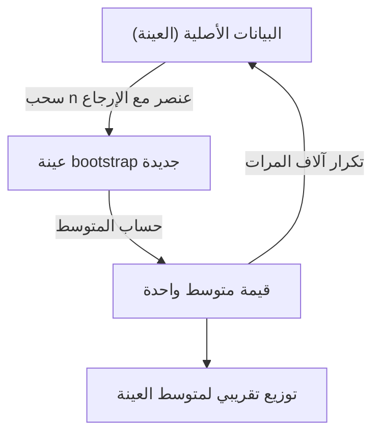
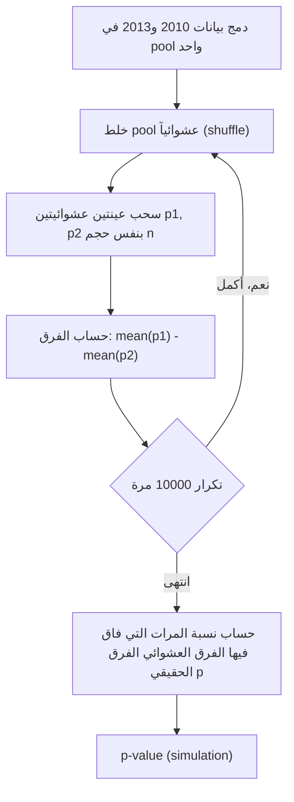

# المحاضرة 8 — Statistical Inference (الاستدلال الإحصائي)
> **المادة:** البرمجة المتقدمة 2 (القسم النظري) | **الموضوع:** الاستدلال الإحصائي — التقدير النقطي، فترات الثقة، اختبار الفرضيات (Laura Igual · Santi Seguí, ch4)

---

## الجزء الأول: ملخص منظم (اقرأ قبل المحاضرة!)

### 📍 عن هذه المحاضرة
> هذه المحاضرة تشرح كيف نستنتج معلومات عن مجتمع كامل (population) بالاعتماد فقط على عينة (sample) منه، وذلك عبر ثلاث أدوات: `point estimate`، `confidence interval`، و`hypothesis testing`.

### 🎯 ستتعلم
- الفرق بين المنهج `Frequentist` والمنهج `Bayesian` في الاستدلال الإحصائي.
- كيف نحسب `point estimate` لمتوسط المجتمع من عينة، وكيف نقيس مدى دقّته باستخدام `Standard Error (SE)`.
- كيف تُبنى `Confidence Interval (CI)` باستخدام `Central Limit Theorem (CLT)`، وكيف تُبنى بديلاً باستخدام تقنية `bootstrap`.
- كيف نختبر فرضية إحصائية (`hypothesis testing`) بطريقتين: عبر `confidence interval`، وعبر `p-value` (بالحساب التحليلي وبالمحاكاة `simulation/permutation test`).

### 📚 المتطلبات السابقة
- أساسيات `pandas` (`read_csv`, `groupby`, `mean`, `std`) — تحتاجها لفهم كل أكواد هذه المحاضرة.
- مفهوم `mean` و`standard deviation` من الإحصاء الوصفي — هذه المحاضرة تبني عليها مباشرة لتنتقل من "وصف البيانات" إلى "الاستدلال منها".
- حلقات `for` والدوال `def` في بايثون — تُستخدم في تطبيق `bootstrap` و`permutation test`.

### 💡 الأفكار الرئيسية

في أغلب المسائل الواقعية، لا نملك بيانات المجتمع (population) بأكمله — يستحيل عملياً أن نسأل كل سكان مدينة، أو نُحصي كل حادث مروري وقع فعلاً في كل الظروف الممكنة. اللي نملكه عادة هو عيّنة (sample): جزء صغير مأخوذ من المجتمع. والسؤال المحوري لهذه المحاضرة هو: كيف نأخذ استنتاجات موثوقة عن المجتمع كامل، بس من خلال النظر لهذه العينة الصغيرة؟

هنا يظهر منهجان أساسيان. المنهج التكراري (`Frequentist approach`) يتعامل مع بارامترات المجتمع (زي المتوسط أو الانحراف المعياري) على إنها قيم ثابتة لكنها مجهولة بالنسبة لنا كمراقبين؛ إحنا ما نقدر نشوفها مباشرة، فنأخذ عينة، نحسب بارامترات هذه العينة، ثم نستخدم تقنيات الاستدلال لصياغة افتراضات احتمالية عن بارامترات المجتمع الحقيقية. أما المنهج البايزي (`Bayesian approach`) فيقلب الصورة: يعتبر إن البيانات نفسها ثابتة (already observed)، لكن البارامترات هي اللي توصف احتمالياً — يعني بدل ما نبحث عن "رقم واحد" هو المتوسط الحقيقي، نبني توزيع احتمالي كامل يمثّل كل المعرفة الممكنة عن البارامتر، مبني من العينة ومن معلومات مسبقة (`prior`) عن المشكلة. هذه المحاضرة تركّز بالكامل على المنهج التكراري.

بافتراض إننا نمشي بالمنهج التكراري، فإن الهدف النهائي للاستدلال الإحصائي هو استخلاص افتراضات محتملة عن بارامترات المجتمع من خلال تحليل عينة، وذلك بثلاث طرق: أولاً، اقتراح `point estimate` — قيمة محددة واحدة تُقارب على أفضل وجه أحد بارامترات المجتمع (مثل المتوسط). ثانياً، اقتراح `confidence interval` — نطاق من القيم (بدل رقم واحد) نتوقع إنه يحوي القيمة الحقيقية للبارامتر بدرجة ثقة معينة. ثالثاً، اقتراح قبول أو رفض فرضية معينة عن البارامتر — وهذا ما يُسمى `hypothesis testing`.

المحاضرة تشرح هذه الأفكار الثلاثة عملياً باستخدام مثال واقعي: بيانات الحوادث المرورية اليومية في مدينة برشلونة لعام 2013 (ملف `ACCIDENTS_GU_BCN_2013.csv`)، اللي يحتوي أعمدة زي رقم المنطقة، اسم الحي، تاريخ الحادث، عدد الوفايا والمصابين... إلخ. لو افترضنا إننا نملك بيانات السنة كاملة (365 يوم)، يقدر أي حد يحسب المتوسط الحقيقي مباشرة بجمع عدد الحوادث اليومية وقسمتها على 365 — وطلع 25.91 حادث/يوم. لكن الفكرة التعليمية هنا: تخيل إننا ما نملك إلا عينة صغيرة (200 يوم مثلاً)، مش السنة كاملة — هنا يصير متوسط العينة هو `point estimate` لمتوسط المجتمع الحقيقي (`The sample mean is a point estimate of the population mean`).

المشكلة إن أي `point estimate` نادراً ما يكون مثالياً بالضبط — دايماً فيه خطأ ما بين تقدير العينة والقيمة الحقيقية. لهذا نحتاج مقياس لتباين هذا التقدير اسمه `Standard Error (SE)`، وصيغته `SE = σx/√n` حيث σx هو الانحراف المعياري للمجتمع (وإذا مو معروف، نستبدله بانحراف العينة، وهذا تقدير جيد إذا كان حجم العينة `n > 30`). كلما زاد حجم العينة `n`، صغر الخطأ المعياري، وزادت دقة التقدير.

من هنا ننتقل لفكرة أعمق: بما إن أغلب مجموعات البيانات اللي نملكها هي بحد ذاتها عيّنة واحدة فقط، فكيف نعرف كيف يتوزع متوسط العينة (`sampling distribution of the mean`) لو كررنا أخذ العينة مرات عديدة؟ هنا تدخل تقنية `bootstrap`: نسحب `n` نقطة بيانات من العينة الأصلية **مع السماح بالتكرار** (`with replacement`)، نحسب متوسط هذه العينة الجديدة، ونكرر هذه العملية آلاف المرات (مثلاً 1000 أو 10000 مرة). النتيجة: توزيع تقريبي جيد جداً لمتوسط العينة، بدون الحاجة لأي افتراضات نظرية عن شكل توزيع المجتمع الأصلي.

الأداة الثانية بعد `point estimate` هي `Confidence Interval (CI)` — تحديد نطاق معقول من القيم للبارامتر بدل رقم واحد. الأساس النظري وراء بناء الـ CI هو `Central Limit Theorem (CLT)`: بغض النظر عن شكل توزيع المجتمع الأصلي (طبيعي أو منحرف)، لو أخذنا عينات عشوائية مستقلة كبيرة الحجم (عادة `n > 30`) من هذا المجتمع، فإن توزيع متوسطات هذه العينات يقترب من التوزيع الطبيعي كلما زاد حجم العينة. وبفضل هذه النتيجة، نقدر نستخدم خصائص التوزيع الطبيعي المعروفة لنقول: تقريباً 95% من الحالات سيكون تقديرنا للمتوسط ضمن مسافة `1.96 × SE` من المتوسط الحقيقي. وبالعكس، إذا بنينا مجالاً ممتداً بمقدار `1.96 × SE` حول تقديرنا النقطي، فإننا على ثقة بنسبة 95% تقريباً بأننا احتوينا القيمة الحقيقية للبارامتر: `CI = [Θ − 1.96×SE, Θ + 1.96×SE]`. وقيمة `1.96` هنا (المسماة `z value`) تتغير حسب مستوى الثقة المطلوب (68%, 90%, 95%, 99%...). ويمكن أيضاً بناء `CI` بطريقة بديلة (بدون افتراض التوزيع الطبيعي) عبر أخذ `percentile 2.5` و`percentile 97.5` من توزيع `bootstrap` مباشرة.

أخيراً، `hypothesis testing`: لو أردنا معرفة هل فيه فرق حقيقي (إحصائياً) بين متوسط حوادث 2010 ومتوسط حوادث 2013، نصوغ فرضيتين: `H0` (الفرضية الصفرية) تقول إن المتوسطين متساويان فعلياً (لا يوجد فرق حقيقي — يمكن اعتبار المجموعتين عينتين من نفس المجتمع)، و`HA` (الفرضية البديلة) تقول إنهما مختلفان فعلاً (عينتان من مجتمعين مختلفين). توجد طريقتان لاختبار هذا: الأولى، عبر `Confidence Interval` — إذا لم تقع قيمة تقدير 2010 ضمن الـ CI الخاص بـ 2013، فهذا يعني إننا لا نستطيع استبعاد `HA` (أي لا يمكن استبعاد وجود فرق حقيقي). الثانية، عبر `p-value` — نحسب `SE` للفرق بين متوسطين مستقلين بالصيغة `SE = √(σ1²/n1 + σ2²/n2)`، ثم نحسب إحصائية `t = الفرق / SE`، ونحولها لـ `p-value`. القاعدة الشائعة: إذا كان `p-value < 0.05` نرفض `H0` (الفرق دالّ إحصائياً)، وإذا كان `p-value > 0.05` لا نستطيع رفض `H0`. ويمكن أيضاً حساب `p-value` بطريقة عملية بحتة عبر `permutation test`/`simulation`: نجمع بيانات المجموعتين في `pool` واحد، نخلطه عشوائياً (`shuffle`)، نسحب منه عينتين عشوائيتين بنفس الأحجام الأصلية آلاف المرات، ونحسب في كل مرة الفرق بين متوسطيهما؛ فنسبة المرات التي كان فيها هذا الفرق العشوائي أكبر من الفرق الحقيقي المُلاحظ هي تقدير عملي لـ `p-value`.

### 🔗 كيف تتصل هذه المحاضرة بالمحاضرات الأخرى؟
- **السابقة:** الإحصاء الوصفي (`descriptive statistics` — `mean`, `std`, `histogram`) علّمك كيف تصف بيانات العينة نفسها؛ الآن نبني عليها للانتقال من "وصف العينة" إلى "الاستدلال عن المجتمع".
- **القادمة:** هذه المفاهيم (`CI`, `p-value`, `hypothesis testing`) ستُستخدم لاحقاً في تقييم نتائج نماذج `Machine Learning` (مثل مقارنة دقة نموذجين، أو بناء فترات ثقة حول مقاييس الأداء).

### ⚠️ الأخطاء الشائعة الواجب تجنبها

#### الفهم الخاطئ ❌:
الاعتقاد بأن `point estimate` (مثل متوسط العينة) هو دائماً القيمة الحقيقية الدقيقة لمتوسط المجتمع.

#### الفهم الصحيح ✅:
`point estimate` هو أفضل تخمين متاح لنا، لكنه شبه دائماً يحمل خطأً ما مقارنة بالقيمة الحقيقية — ولهذا نحتاج `Standard Error` و`Confidence Interval` لقياس مدى هذا الخطأ المحتمل، بدل الاكتفاء برقم واحد والثقة به بشكل مطلق.

#### الفهم الخاطئ ❌:
الاعتقاد بأن `p-value > 0.05` يعني إثبات أن `H0` (لا يوجد فرق) صحيحة بشكل قاطع.

#### الفهم الصحيح ✅:
`p-value > 0.05` يعني فقط أننا **لا نملك دليلاً كافياً لرفض** `H0` — وهذا لا يعادل إثبات صحتها. بالمثل، `p-value < 0.05` يعني رفض `H0` لصالح `HA`، لا "إثبات" `HA` بشكل مطلق.

### لما تحتاج هذا في الامتحان
غالباً الأسئلة تدور حول: (1) حساب `SE` وربطه بحجم العينة `n` وتأثيره على دقة `CI`، (2) تفسير هل قيمة معينة تقع داخل أو خارج `CI` وماذا يعني ذلك بالنسبة لرفض/قبول فرضية، (3) قراءة كود بايثون لـ `bootstrap` أو `groupby` وتتبع ماذا يحسب، (4) التفريق الصحيح بين `H0` و`HA`، وبين تفسير `p-value` الصحيح والخاطئ.

---

## الجزء الثاني: الشرح التفصيلي (سطر بسطر / فقرة بفقرة)

### 1. Introduction (مقدمة: المنهجان الرئيسيان للاستدلال الإحصائي)

<!-- @render: {type: "prose-first", visualization: "none", coverage: "100%"} -->
<!-- @connectivity: {prerequisite: "none"} -->

#### 💡 الفكرة الأساسية
**هناك منهجان رئيسيان للإحصاء الاستدلالي: `Frequentist approach` (يعتبر بارامترات المجتمع ثابتة ومجهولة) و`Bayesian approach` (يعتبر البيانات ثابتة والبارامترات هي التي تُوصف احتمالياً).**

---

#### 📖 الشرح
`المنهج التكراري (Frequentist approach)`: يعتبر بارامترات المجتمع (صفات، خصائص، ميزات) ثابتة لكنها غير متاحة للمراقب مباشرة. الطريقة الوحيدة لاستخلاص معلومات عن هذه البارامترات هي أخذ عينة من المجتمع، حساب بارامترات العينة، ثم استخدام تقنيات الإحصاء الاستدلالي لصياغة افتراضات احتمالية بشأن بارامترات المجتمع.

`المنهج البايزي (Bayesian approach)`: يعتمد على اعتبار أن البيانات ثابتة، وليست نتاج عملية أخذ عينات متكررة، لكن يمكن وصف البارامترات التي تصف البيانات احتمالياً. لتحقيق هذه الغاية، تركز أساليب الاستدلال البايزي على إنتاج توزيعات البارامترات التي تمثل كل المعرفة التي يمكننا استخلاصها من العينة ومن المعلومات المسبقة حول المشكلة.

الفرق الجوهري: في `Frequentist`، السؤال هو "ما احتمال أن تُنتج بيانات كهذه لو كانت القيمة الحقيقية للبارامتر كذا؟" (البارامتر ثابت مجهول). في `Bayesian`، السؤال هو "بالنظر لهذه البيانات الثابتة ومعرفتنا المسبقة، ما توزيع احتمالات البارامتر؟" (البارامتر نفسه متغير عشوائي احتمالي). هذه المحاضرة تتناول المنهج التكراري فقط بالتفصيل.

#### 💡 التشبيه:
> تخيل إنك بتحاول تخمن وزن حجر مدفون تحت الرمل. المنهج التكراري يقول: الحجر له وزن حقيقي ثابت (مجهول لك)، وأنت بس تاخذ قياسات (عينات) متكررة عشان تقرب من هذا الوزن الثابت. المنهج البايزي يقول: خلك عندك معلومة مسبقة عن نوع الحجر (مثلاً "غالباً أحجار المنطقة وزنها بين 2-5 كيلو")، وبعد ما تشوف قياس واحد بس، تحدّث معرفتك عن احتمالية كل وزن ممكن.
> **وجه الشبه:** الحجر الثابت المجهول = بارامتر المجتمع في `Frequentist`؛ التوزيع الاحتمالي المُحدَّث بالمعلومة المسبقة = البارامتر في `Bayesian`.

#### 🎯 الملخص السريع
- `Frequentist`: البارامتر ثابت مجهول، نقدّره من عينات.
- `Bayesian`: البيانات ثابتة، البارامتر يُوصف بتوزيع احتمالي مبني من العينة + معرفة مسبقة (`prior`).
- هذه المحاضرة تركّز على `Frequentist approach`.

#### 📚 التطبيق
كل باقي المحاضرة (`point estimate`, `confidence interval`, `hypothesis testing`) مبنية على المنهج التكراري.

#### ⚠️ أخطاء شائعة

#### الفهم الخاطئ ❌:
الاعتقاد أن المنهج البايزي "يتجاهل" العينة ويعتمد فقط على الرأي المسبق.

#### الفهم الصحيح ✅:
المنهج البايزي يدمج المعلومة المسبقة (`prior`) **مع** المعلومة المستخلصة من العينة لينتج توزيعاً نهائياً للبارامتر — لا يتجاهل العينة إطلاقاً.

#### 📄 النص الأصلي من المحاضرة
<details>
<summary>عرض النص الأصلي (coverage: 100%)</summary>

**النص الأصلي يقول:**
> هناك منهجان رئيسيان للإحصاء الاستدلالي: المنهج التكراري (تُعتبر بارامترات "صفات - خصائص – ميزات" المجتمع ثابتة، لكنها غير متاحة للمراقب. والطريقة الوحيدة لاستخلاص معلومات حول هذه البارامترات هي أخذ عينة من المجتمع، وحساب بارامترات العينة، واستخدام تقنيات الإحصاء الاستدلالي لصياغة افتراضات احتمالية بشأن بارامترات المجتمع) والمنهج البايزي (يعتمد على اعتبار أن البيانات ثابتة، وليست نتاج عملية أخذ عينات متكررة، ولكن يمكن وصف البارامترات التي تصف البيانات احتمالياً. ولتحقيق هذه الغاية، تركز أساليب الاستدلال البايزي على إنتاج توزيعات البارامترات التي تمثل كل المعرفة التي يمكننا استخلاصها من العينة ومن المعلومات المسبقة حول المشكلة).

**ملاحظة على التغطية:**
- ✓ تم شرح بالكامل: تعريف كل منهج والفرق الجوهري بينهما.
- ℹ️ إضافة من الدليل: تشبيه الحجر المدفون تحت الرمل (ليس في المحاضرة الأصلية).

</details>

---

### 2. Statistical Inference (الهدف النهائي للاستدلال الإحصائي)

<!-- @render: {type: "prose-first", visualization: "none", coverage: "100%"} -->
<!-- @connectivity: {prerequisite: "section_1"} -->

#### 📍 أين نحن الآن؟
بعد ما عرفنا المنهجين، نحدد الآن ما هو **الهدف العملي** الذي نسعى له عند اتباع المنهج التكراري تحديداً.

#### ⬅️ الربط مع السابق
في القسم السابق قلنا إن المنهج التكراري يهدف لصياغة "افتراضات احتمالية" عن بارامترات المجتمع — هذا القسم يفصّل هذه الافتراضات إلى ثلاثة أشكال محددة.

#### 💡 الفكرة الأساسية
**الهدف النهائي للاستدلال الإحصائي (بالمنهج التكراري) هو استخلاص افتراضات محتملة عن بارامترات المجتمع من تحليل عينة، بثلاث طرق: تقدير نقطي، مجال ثقة، أو قبول/رفض فرضية.**

---

#### 📖 الشرح
حددت المحاضرة ثلاثة أشكال أساسية للنتيجة التي يقدمها الاستدلال الإحصائي:

1. **اقتراح `التقدير النقطي` (`point estimate`):** قيمة محددة تُقارب على أفضل وجه أحد البارامترات محل الاهتمام في المجتمع، والتي تم حسابها من عينة أو أكثر.
2. **اقتراح `مجال الثقة` (`confidence interval`):** نطاق من القيم (ضمن مجال محدد) يمثل على أفضل وجه أحد المعايير ذات الأهمية للمجتمع.
3. **اقتراح قبول أو رفض فرضية معينة (`hypothesis testing`):** بدل تقدير رقم أو مجال، نطرح سؤالاً محدداً ("هل الفرق بين مجموعتين دالّ إحصائياً؟") ونحدد الإجابة بناءً على البيانات.

هذه الأشكال الثلاثة ليست منفصلة — هي مترابطة، وسنرى في باقي المحاضرة أن `التقدير النقطي` هو أساس بناء `مجال الثقة`، وأن `مجال الثقة` نفسه يمكن استخدامه كطريقة لاختبار الفرضيات.

#### 🎯 الملخص السريع
- `Point estimate` → رقم واحد.
- `Confidence interval` → نطاق من القيم.
- `Hypothesis testing` → قرار قبول/رفض.

#### 📚 التطبيق
باقي المحاضرة (الأقسام 3 و4) هي شرح تفصيلي وعملي (بكود بايثون) لكل واحدة من هذه الطرق الثلاث.

#### ⚠️ أخطاء شائعة

#### الفهم الخاطئ ❌:
الاعتقاد بأن هذه الطرق الثلاث بدائل متنافسة نختار واحدة منها فقط.

#### الفهم الصحيح ✅:
هي أدوات متكاملة تُستخدم معاً عادة — نحسب `point estimate` أولاً، ثم نبني حوله `confidence interval` لقياس عدم اليقين، وقد نستخدم نفس الـ `CI` لاحقاً لاتخاذ قرار `hypothesis testing`.

#### 📄 النص الأصلي من المحاضرة
<details>
<summary>عرض النص الأصلي (coverage: 100%)</summary>

**النص الأصلي يقول:**
> الهدف النهائي للإحصاء الاستدلالي، إذا اعتمدنا المنهج التكراري، هو استخلاص افتراضات محتملة تتعلق بالبارامترات (بمزايا وخصائص وصفات) المجتمع من تحليل عينة: اقتراح التقدير النقطي (هو قيمة محددة تقارب على أفضل وجه أحد البارامترات محل الاهتمام في المجتمع والتي تم حسابها من عينة أو أكثر)، اقتراح مجال الثقة (نطاق من القيم ضمن مجال محدد التي تمثل على أفضل وجه أحد المعايير ذات الأهمية للمجتمع)، اقتراح قبول او رفض فرضية معينة.

**ملاحظة على التغطية:**
- ✓ تم شرح بالكامل: الأشكال الثلاثة ومعنى كل واحد منها.

</details>

---

### 3. Measuring the Variability in Estimates (قياس التباين في التقديرات)

<!-- @render: {type: "prose-first", visualization: "none", coverage: "100%"} -->
<!-- @connectivity: {prerequisite: "section_2"} -->

#### 📍 أين نحن الآن؟
هذا القسم يقدّم مثال البيانات الأساسي للمحاضرة (حوادث برشلونة) قبل ما ندخل في تفاصيل `point estimate` و`confidence interval`.

#### ⬅️ الربط مع السابق
القسم السابق عرّف `point estimate` نظرياً؛ هنا نطبّقه فعلياً على بيانات حقيقية.

#### 💡 الفكرة الأساسية
**نستخدم بيانات الحوادث المرورية اليومية في برشلونة لعام 2013 كمثال عملي لحساب `point estimate` لمتوسط عدد الحوادث اليومية.**

---

#### 📖 الشرح
البيانات المستخدمة هي ملف `ACCIDENTS_GU_BCN_2013.csv`، ويحتوي أعمدة متعددة تصف كل حادث: رقم الملف، رمز واسم المنطقة/الحي الإداري، رمز واسم الحي السكني، رمز واسم الشارع، الرقم البريدي، يوم الأسبوع ونوعه، السنة والشهر واليوم والساعة، وصف الفترة (صباح/مساء)، سبب تعلق الأمر بالمشاة، عدد الوفيات والمصابين (بجروح طفيفة أو خطيرة)، عدد الضحايا الكلي، عدد المركبات المتورطة، والإحداثيات الجغرافية `UTM (X,Y)`.

بما أننا نملك بيانات السنة كاملة (365 يوم)، فيمكننا حساب المتوسط الحسابي الحقيقي لعدد الحوادث اليومية ببساطة عبر جمعها كافة وتقسيمها على عدد أيام السنة (365). لكن لاحظ الفكرة التعليمية: نتعامل مع هذا كأنه "المجتمع" (population) الكامل، ونتخيل لاحقاً سيناريوهات أخذ عيّنات منه.

#### 💻 الكود: حساب متوسط عدد الحوادث اليومية

#### ما هذا الكود؟
> يقرأ الكود ملف الحوادث، يبني عمود تاريخ موحّد من أعمدة السنة/الشهر/اليوم، يُجمّع (`groupby`) عدد الحوادث لكل يوم، ثم يحسب متوسط هذا العدد اليومي عبر كل أيام السنة.

```python
import pandas as pd
import numpy as np
import matplotlib.pyplot as plt

data = pd.read_csv("d:\\datasets\\ACCIDENTS_GU_BCN_2013.csv", encoding='latin-1')  # read the CSV file
data['Date'] = '2013-' + data['Mes de any'].apply(lambda x: str(x)) + '-' + data['Dia de mes'].apply(lambda x: str(x))
data['Date'] = pd.to_datetime(data['Date'])          # convert text to real datetime
accidents = data.groupby(['Date']).size()            # count accidents per day
print("Mean:", accidents.mean())
```

#### ملاحظات الأسطر المهمة:
> فقط الأسطر التي فيها شيء جديد أو مهم:

- `data['Date'] = '2013-' + ...` → يبني نص التاريخ يدوياً بدمج عمود الشهر وعمود اليوم مع سنة ثابتة `2013`.
- `pd.to_datetime(data['Date'])` → يحوّل النص إلى نوع بيانات `datetime` حقيقي، وهذا ضروري عشان `groupby` يجمّع الصفوف الصحيحة لكل يوم.
- `data.groupby(['Date']).size()` → لكل تاريخ فريد، يحسب `size()` أي عدد الصفوف (= عدد الحوادث) في ذلك اليوم، فينتج `Series` قيمته عدد الحوادث لكل يوم من أيام السنة.
- `accidents.mean()` → يحسب متوسط هذا الـ `Series` (أي متوسط عدد الحوادث اليومية على مدار السنة).

**المكتبات المطلوبة (Imports):**
> `pandas`, `numpy`, `matplotlib.pyplot`

**الناتج المتوقع:**
> `Mean: 25.90958904109589` — أي أن متوسط عدد الحوادث اليومية في برشلونة لعام 2013 هو تقريباً 25.91 حادثاً/يوم.

#### 🎯 الملخص السريع
- بيانات المثال: حوادث مرورية يومية في برشلونة 2013.
- `groupby(['Date']).size()` هي الطريقة القياسية لتحويل بيانات حوادث فردية إلى "عدد حوادث لكل يوم".
- المتوسط الحقيقي المحسوب من كامل بيانات السنة = `25.91`.

#### 📚 التطبيق
هذا المتوسط (25.91) سيُستخدم كمرجع لاحقاً لمقارنة تقديرات مبنية على عينات أصغر (200 يوم فقط)، وأيضاً كأساس لمقارنة بيانات 2013 مع 2010 في قسم اختبار الفرضيات.

#### ⚠️ أخطاء شائعة

#### الفهم الخاطئ ❌:
الاعتقاد أن `accidents.mean()` يحسب متوسط عمود "عدد المصابين" أو أي عمود آخر في الملف الأصلي.

#### الفهم الصحيح ✅:
`accidents` هنا هو `Series` جديد ناتج عن `groupby(...).size()`، قيمته هي **عدد صفوف الحوادث لكل يوم** — وليس أي عمود من الأعمدة الأصلية. لذلك `mean()` يحسب متوسط "عدد الحوادث في اليوم" مباشرة.

#### 📄 النص الأصلي من المحاضرة
<details>
<summary>عرض النص الأصلي (coverage: 100%)</summary>

**النص الأصلي يقول:**
> بفرض لدينا مجموعة البيانات المتعلقة بالحوادث المرورية اليومية خلال العام 2013 في مدينة برشلونة... فعندها يمكننا حساب المتوسط الحسابي لعدد الحوادث اليومية ببساطة من خلال عملية جمعها كافة وتقسيمها على عدد أيام السنة 365. [مع جدول كامل لأسماء الأعمدة بالكتالانية والعربية، والكود المذكور أعلاه، والناتج `Mean: 25.90958904109589`]

**ملاحظة على التغطية:**
- ✓ تم شرح بالكامل: بنية البيانات، الكود، والناتج.
- ℹ️ إضافة من الدليل: توضيح تفصيلي لكل سطر كود لم يكن مشروحاً صراحة في الشريحة.

</details>

---

### 3.1. Point Estimates (التقدير النقطي والتوزيعات)

<!-- @render: {type: "equation-first", visualization: "none", coverage: "100%"} -->
<!-- @connectivity: {prerequisite: "section_3"} -->

#### 📍 أين نحن الآن؟
هنا ننتقل من "نملك كل بيانات السنة" إلى السيناريو الواقعي: "نملك عينة صغيرة فقط"، ونتعلم كيف نقيس دقة تقديرنا عبر `Standard Error`.

#### ⬅️ الربط مع السابق
في القسم 3 حسبنا المتوسط **الحقيقي** (من 365 يوم كاملة). الآن نتخيل أننا لا نملك إلا 200 يوم فقط، فنحتاج مفهوم `point estimate` رسمياً.

#### 💡 الفكرة الأساسية
**متوسط العينة هو تقدير نقطي (`point estimate`) لمتوسط المجتمع، ودقة هذا التقدير تُقاس بـ `Standard Error: SE = σx/√n`.**

#### 📐 المعادلة: الخطأ المعياري (Standard Error)

$$
SE = \frac{\sigma_x}{\sqrt{n}}
$$

**الشرح:**
> σx = الانحراف المعياري للمجتمع الإحصائي (`population standard deviation`) — وهو غالباً غير معروف فعلياً.
> n = حجم العينة (`sample size`).
> SE = الخطأ المعياري — يقيس مدى تشتت إحصاء العينة (مثل المتوسط) حول القيمة الحقيقية للبارامتر في المجتمع.

#### 📖 الشرح اللفظي
بفرض أننا مهتمون بمعرفة متوسط عدد الحوادث المرورية بشوارع برشلونة يومياً خلال 2013، ولم تتوفر البيانات المطلوبة لأيام العام كله، وإنما لمئتي يوم فقط (عينة)، فعندها يمكن القول: **متوسط العينة هو تقدير نقطي لمتوسط المجتمع** (`The sample mean is a point estimate of the population mean`).

بما أن σx (انحراف المجتمع الحقيقي) غير معلوم عادة في حال عدم توفر بيانات المجتمع كاملة، يمكن إثبات أنه إذا استُبدل بتقديره من العينة (أي انحراف العينة نفسها)، فإن التقدير الناتج لـ `SE` يكون جيداً بما فيه الكفاية بشرطين: أن يكون حجم العينة `n > 30`، وأن يكون توزيع المجتمع الإحصائي غير ملتوٍ (غير منحرف بشدة) بشكل كبير. وعندها، الخطأ المعياري يقيس تشتت إحصاء العينة (مثل المتوسط) حول قيمة البارامتر الحقيقي للمجتمع — وكلما كان `SE` أصغر، زادت دقة التقدير.

#### 💻 الكود: محاكاة سحب عينات متكررة وحساب متوسطاتها

#### ما هذا الكود؟
> يسحب 200 عنصر عشوائياً من بيانات الحوادث 10000 مرة، يحسب متوسط كل عينة، ثم يرسم توزيع (`histogram`) هذه المتوسطات لإظهار شكل `sampling distribution of the mean` عملياً.

```python
from collections import Counter
import seaborn as sns

df = accidents.to_frame()
N_test = 10000
elements = 200
means = [0] * N_test
for i in range(N_test):
    rows = np.random.choice(df.index.values, elements)   # pick 200 random days (with repetition)
    sampled_df = df.loc[rows]
    means[i] = sampled_df.mean()

mss = pd.DataFrame(means)
s = 0
for i in range(N_test):
    s = s + means[i]
print(s / 10000)                                          # average of all 10000 sample means

mss.hist(density=0, histtype='stepfilled', bins=200)
plt.show()
```

#### ملاحظات الأسطر المهمة:
- `np.random.choice(df.index.values, elements)` → يسحب 200 قيمة (فهارس أيام) عشوائياً — هذا يحاكي أخذ عينة من 200 يوم من أصل 365.
- `sampled_df.mean()` → يحسب متوسط هذه العينة المسحوبة (200 يوم) — تكرار هذه الخطوة 10000 مرة يعطينا توزيعاً كاملاً للمتوسطات الممكنة.
- `mss.hist(...)` → يرسم `histogram` لكل الـ 10000 متوسط؛ الشكل الناتج تقريباً جرسي (`bell-shaped` / طبيعي)، وهذا يوضح عملياً فكرة `Central Limit Theorem` التي ستُشرح لاحقاً.

**الناتج المتوقع:**
> `25.914967` — متوسط كل الـ 10000 متوسط عينة، قريب جداً من المتوسط الحقيقي `25.91`. والرسم البياني يُظهر توزيعاً جرسياً متمركزاً حول 25.9 تقريباً، ممتداً تقريباً بين 24 و28.

#### ⚙️ الخطوات / الخوارزمية: التقدير النقطي للخطأ المعياري

#### ما هدف هذه العملية؟
> التحقق عملياً من صيغة `SE = σx/√n` عبر مقارنتها بالتشتت الفعلي لمتوسطات العينات المتكررة.

```algorithm
1 | حساب متوسط كل عينة (200 عنصر) | sampled_df.mean() | نحصل على قيمة متوسط واحدة لكل تكرار
2 | تكرار 10000 مرة | for loop | نحصل على توزيع كامل لمتوسط العينة
3 | حساب SE نظرياً | accidents.std()/sqrt(200) | يُقارن بالانحراف المعياري الفعلي لمتوسطات الخطوة 1
```

#### 💻 الكود: مقارنة SE النظري بالتشتت الفعلي

```python
from collections import Counter
import seaborn as sns
import math

df = accidents.to_frame()
N_test = 10000
elements = 200
mm = [0] * N_test
ms = [0] * N_test
for i in range(N_test):
    rows = np.random.choice(df.index.values, elements)
    sampled_df = df.loc[rows]
    mm[i] = sampled_df.mean()
    ms[i] = sampled_df.std()

stt = 0
for i in range(N_test):
    stt = stt + ms[i]
print(stt / 10000 / math.sqrt(200))     # theoretical SE estimate
print(np.array(mm).std())               # actual std of the 10000 sample means
```

#### ملاحظات الأسطر المهمة:
- `stt / 10000 / math.sqrt(200)` → يطبّق صيغة `SE = σx/√n` مباشرة باستخدام متوسط انحرافات العينات، فيعطي `0.642883`.
- `np.array(mm).std()` → يحسب الانحراف المعياري الفعلي لكل الـ 10000 متوسط عينة المحسوبة سابقاً، فيعطي `0.6483772...` — قريب جداً من القيمة النظرية، ما يؤكد صحة الصيغة عملياً.

**الناتج المتوقع:**
> `0.642883` مقابل `0.6483772699833023` — قيمتان متقاربتان جداً، تؤكدان أن `SE` يقيس فعلاً تشتت متوسط العينة حول القيمة الحقيقية.

#### 📊 المخطط: bootstrap — إعادة التوزيع

#### ما هذا المخطط؟
> استراتيجية `bootstrap` هي بديل حديث للأسلوب التقليدي للاستدلال الإحصائي، تُستخدم عندما نعتبر أن مجموعة البيانات التي لدينا هي بحد ذاتها عينة واحدة فقط (وليس لدينا إمكانية لسحب عينات جديدة من المجتمع الحقيقي).

#### وصف المراحل:
| # | المرحلة | الدخل | الخرج | الملاحظات |
| --- | --- | --- | --- | --- |
| 1 | سحب n نقطة بيانات مع السماح بالتكرار | البيانات الأصلية (العينة) | عينة `bootstrap` جديدة بنفس الحجم n | يسمح بوجود نقاط بيانات متكررة لأن السحب "مع الإرجاع" (`with replacement`) |
| 2 | حساب المتوسط لهذه العينة الجديدة | عينة bootstrap | قيمة متوسط واحدة | تُخزَّن لتشكيل التوزيع لاحقاً |
| 3 | تكرار العملية عدة مرات | تكرار المرحلتين 1 و2 | تقريب جيد لتوزيع متوسط العينة (`sampling distribution`) | كلما زاد عدد التكرارات، زادت دقة التقريب |



#### 💻 الكود: دالة meanBootstrap

#### ما هذا الكود؟
> دالة عامة تنفّذ فكرة `bootstrap` بشكل قابل لإعادة الاستخدام: تأخذ بيانات `X` وعدد تكرارات `numberb`، وتُرجع قائمة بمتوسطات عينات bootstrap.

```python
def meanBootstrap(X, numberb):
    x = [0] * numberb
    for i in range(numberb):
        sample = [X[_] for _ in np.random.randint(len(X), size=200)]   # sample WITH replacement
        x[i] = np.mean(sample)
    return x

m = meanBootstrap(accidents, 1000)
print("Mean estimate:", np.mean(m))
```

#### ملاحظات الأسطر المهمة:
- `np.random.randint(len(X), size=200)` → يولّد 200 فهرس عشوائي (يمكن أن يتكرر الفهرس نفسه أكثر من مرة) — هذا هو جوهر "السحب مع الإرجاع".
- `x[i] = np.mean(sample)` → متوسط عينة bootstrap واحدة، يُخزَّن في القائمة لتشكيل التوزيع الكامل بعد 1000 تكرار.

**الناتج المتوقع:**
> `Mean estimate: 25.921355000000002` — قريب جداً من المتوسط الحقيقي `25.91`.

#### 📊 المخطط: توزيع متوسطات bootstrap
لو رسمنا `histogram` لكل الـ 1000 قيمة الناتجة من `meanBootstrap`، نحصل على شكل جرسي مشابه تماماً لتوزيع المتوسطات الذي حصلنا عليه بالسحب المباشر من البيانات الأصلية سابقاً — ممتد تقريباً بين 24 و28، ومتمركز حول 25.9~26.

#### 🎯 الملخص السريع
- `Point estimate` (مثل متوسط العينة) يعطي قيمة واحدة معقولة، لكنها نادراً ما تكون مثالية بالضبط.
- `SE = σx/√n` يقيس مدى تشتت هذا التقدير.
- `Bootstrap` = سحب عينات جديدة **من نفس العينة الأصلية مع الإرجاع** لتقريب توزيع الإحصاء (مثل المتوسط) دون الحاجة لافتراضات نظرية.

#### 📚 التطبيق
هذا المفهوم (`SE` و`bootstrap`) هو الأساس المباشر لبناء `Confidence Interval` في القسم التالي 3.2.

#### ⚠️ أخطاء شائعة

#### الفهم الخاطئ ❌:
الاعتقاد بأن `bootstrap` يسحب عينات جديدة **من المجتمع الحقيقي**.

#### الفهم الصحيح ✅:
`bootstrap` يسحب عينات جديدة **من العينة الأصلية نفسها** (التي بحوزتنا فقط) مع السماح بتكرار نفس نقطة البيانات أكثر من مرة — لا نحتاج أي وصول للمجتمع الحقيقي إطلاقاً.

#### الفهم الخاطئ ❌:
الاعتقاد أن `Standard Error` هو نفسه `Standard Deviation` للبيانات الأصلية.

#### الفهم الصحيح ✅:
`Standard Deviation (σx)` يقيس تشتت البيانات الفردية نفسها. أما `Standard Error (SE = σx/√n)` فيقيس تشتت **إحصاء مُشتق** (مثل المتوسط) عبر عينات متكررة — وهو دائماً أصغر من `σx` (يصغر كلما كبر `n`).

#### 📄 النص الأصلي من المحاضرة
<details>
<summary>عرض النص الأصلي (coverage: 100%)</summary>

**النص الأصلي يقول:**
> بفرض أننا مهتمون لمعرفة متوسط عدد الحوادث المرورية بشوارع برشلونة يومياً خلال 2013 ولم تتوفر البيانات المطلوبة لأيام العام كله، وإنما لمئتي يوم فقط (عينة)، وعندها يمكن القول: متوسط العينة هو تقدير نقطي لمتوسط المجتمع... تستخدم هذه الصيغة الانحراف المعياري للمجتمع الإحصائي σx، وهو غير معلوم في حال عدم توفر بيانات المجتمع الإحصائي، ولكن يمكن إثبات أنه إذا استُبدل بتقديره لعينة σx فإن التقدير يكون جيداً بما فيه الكفاية إذا كان n > 30 وكان توزيع المجتمع الإحصائي غير ملتوٍ. وعندها الخطأ المعياري يقيس تشتت إحصاء العينة (مثل المتوسط) حول قيمة البارامتر للمجتمع، وكلما كان صغيراً زادت دقة التقدير... الآن فيما لو اعتبرنا معظم مجموعات البيانات لدينا هي بحد ذاتها عينة، عندها نعتمد استراتيجية bootstrap وتتلخص في أسلوب إعادة التوزيع كبديل حديث للأسلوب التقليدي للاستدلال الإحصائي. في هذا الأسلوب: نسحب n نقطة بيانات أو مشاهدة أو ملاحظة أو سجل أو صف مع السماح بالتكرار لوجود نقاط بيانات متكررة أثناء السحب من البيانات الأصلية لإنشاء عينة، نحسب المتوسط لهذه العينة، نكرر هذه العملية عدة مرات، نحصل على تقريب جيد لتوزيع متوسط العينة. ملاحظة: التقدير النقطي، مثل متوسط العينة، يُعطي قيمة واحدة معقولة للخاصية أو الميزة أو البارامتر. مع ذلك، وكما رأينا، نادراً ما يكون التقدير النقطي مثالياً؛ عادةً يوجد خطأ ما في التقدير. لهذا السبب تم اقتراح استخدام الخطأ المعياري كمقياس لتباينه.

**ملاحظة على التغطية:**
- ✓ تم شرح بالكامل: صيغة SE، شروط صحتها، فكرة bootstrap، كل أكواد الشريحة، والملاحظة الختامية عن عدم مثالية التقدير النقطي.

</details>

---

### 3.2. Confidence Intervals (فترات الثقة)

<!-- @render: {type: "equation-first", visualization: "none", coverage: "100%"} -->
<!-- @connectivity: {prerequisite: "section_3-1"} -->

#### 📍 أين نحن الآن؟
بعد ما تعلمنا `point estimate` و`SE`، نبني الآن نطاقاً كاملاً من القيم المحتملة للبارامتر — هذا هو `confidence interval`.

#### ⬅️ الربط مع السابق
`SE` المحسوب في القسم 3.1 هو المكوّن الأساسي في صيغة `Confidence Interval` هنا.

#### 💡 الفكرة الأساسية
**بالاستناد إلى `Central Limit Theorem`، يمكن بناء مجال ثقة 95% حول `point estimate` بالصيغة `CI = [Θ − 1.96×SE, Θ + 1.96×SE]`.**

#### 📐 المعادلة: فترة الثقة العامة

$$
\Theta \pm z \times SE
$$

$$
CI = [\Theta - 1.96 \times SE,\ \Theta + 1.96 \times SE]
$$

**الشرح:**
> Θ = التقدير النقطي (مثل متوسط العينة).
> z = قيمة معيارية تعتمد على مستوى الثقة المطلوب (`z value` — انظر الجدول أدناه؛ عند 95% تكون `z = 1.96`).
> SE = الخطأ المعياري المحسوب سابقاً.

#### 📖 الشرح اللفظي

**نظرية النهاية المركزية (`Central Limit Theorem — CLT`):** بغض النظر عن شكل توزيع المجتمع الأصلي (سواء كان طبيعياً أو غير طبيعي، متماثلاً أو منحرفاً)، فإنه إذا تم أخذ عينات عشوائية مستقلة كبيرة الحجم (`n` أكبر من 30 عادةً) من هذا المجتمع، فإن توزيع متوسطات هذه العينات يقترب من التوزيع الطبيعي، مع زيادة حجم العينة `n`. وفي هذه الحالة، لتحديد فترة أو مجال ثقة، يمكننا الاستعانة بنتيجة معروفة من الاحتمالات تنطبق على التوزيعات الطبيعية.

تحديداً: فإذا كانت Θ هو متوسط مجموعة متوسطات العينات، فيمكننا القول إنه حوالي 95% من الحالات سيكون تقديرنا ضمن القيمة 1.96 للخطأ المعياري من المتوسط الحقيقي لتوزيع المتوسطات. إذا عرفنا المجال الممتد بمقدار 1.96 للخطأ المعياري من تقدير نقطي موزّع توزيعاً طبيعياً، فيمكننا القول بديهياً أننا على ثقة بنسبة 95% تقريباً بأننا قدّرنا القيمة الحقيقية للبارامتر.

قيمة `z` (المضروبة في `SE`) تتغير حسب مستوى الثقة المرغوب فيه:

| Confidence Level | 68% | 90% | 95% | 97.5% | 99% | 99.9% |
| --- | --- | --- | --- | --- | --- | --- |
| **z Value** | 1 | 1.65 | 1.96 | 2.5 | 2.58 | 3.291 |

#### 💻 الكود: بناء CI بالطريقة النظرية (اعتماداً على CLT)

#### ما هذا الكود؟
> يحسب متوسط بيانات الحوادث الحقيقية (365 يوم)، ثم `SE` باستخدام الانحراف المعياري مقسوماً على جذر حجم العينة، ثم يبني `CI` بمستوى ثقة 95% باستخدام `z=1.96`.

```python
import math

m = accidents.mean()
se = accidents.std() / math.sqrt(len(accidents))
print(m, " ", se)
ci = [m - se * 1.96, m + se * 1.96]
print("Confidence interval:", ci)
```

#### ملاحظات الأسطر المهمة:
- `accidents.std() / math.sqrt(len(accidents))` → تطبيق مباشر لصيغة `SE = σx/√n`، مع `n = 365` (طول `Series` الحوادث).
- `[m - se*1.96, m + se*1.96]` → تطبيق مباشر لصيغة `CI = [Θ − 1.96×SE, Θ + 1.96×SE]` عند مستوى ثقة 95%.

**الناتج المتوقع:**
> `25.90958904109589   0.4767515180079637` ثم `Confidence interval: [24.975156065800284, 26.8440220163915]` — أي أننا واثقون بنسبة 95% تقريباً أن المتوسط الحقيقي لعدد الحوادث اليومية يقع بين 24.98 و26.84.

#### 💻 الكود: بناء CI بديل باستخدام bootstrap والمئينات (percentiles)

#### ما هذا الكود؟
> بدل الاعتماد على `CLT` وافتراض التوزيع الطبيعي، نبني `CI` مباشرة من توزيع `bootstrap` عبر أخذ `percentile 2.5` و`percentile 97.5` منه — وهذه طريقة لا تحتاج أي افتراض عن شكل توزيع المجتمع.

```python
m = meanBootstrap(accidents, 10000)
sample_mean = np.mean(m)
sample_se = np.std(m)
print("Mean estimate:", sample_mean)
print("SE of the estimate:", sample_se)
ci2 = [np.percentile(m, 2.5), np.percentile(m, 97.5)]
print("percentile 2.5 and 97.5 :", ci2)
```

#### ملاحظات الأسطر المهمة:
- `np.percentile(m, 2.5)` و`np.percentile(m, 97.5)` → يأخذان القيمتين اللتين تحصران 95% الوسطى من كل قيم متوسطات bootstrap (تاركين 2.5% من كل طرف)، وهذا يُعطي `CI` بطريقة تجريبية بحتة بدون صيغة `z × SE`.

**الناتج المتوقع:**
> `Mean estimate: 25.903806849315067`, `SE of the estimate: 0.47690613671560683`, `percentile 2.5 and 97.5 : [24.953424657534246, 26.84109589041096]` — نتيجة قريبة جداً من الطريقة النظرية بـ `CLT` أعلاه، ما يؤكد أن الطريقتين متكافئتان عملياً عند حجم عينة كافٍ.

#### 🎯 الملخص السريع
- `CLT` يضمن أن توزيع المتوسطات يقترب من الطبيعي عند `n > 30`، بغض النظر عن شكل توزيع المجتمع الأصلي.
- `CI = [Θ − z×SE, Θ + z×SE]`؛ عند ثقة 95% تكون `z = 1.96`.
- يمكن بناء `CI` بطريقتين متكافئتين: (1) نظرياً عبر `CLT` و`z×SE`، أو (2) تجريبياً عبر `percentiles` من توزيع `bootstrap`.

#### 📚 التطبيق
`Confidence Interval` سيُستخدم مباشرة في القسم 4.1 كأداة أولى لاختبار الفرضيات (`hypothesis testing`).

#### ⚠️ أخطاء شائعة

#### الفهم الخاطئ ❌:
الاعتقاد بأن `CI` بنسبة 95% يعني أن "هناك احتمال 95% أن المتوسط الحقيقي يقع داخل هذا المجال المحدد".

#### الفهم الصحيح ✅:
التفسير الدقيق (بالمنهج التكراري): لو كررنا عملية أخذ العينة وبناء `CI` مرات عديدة جداً، فإن حوالي 95% من هذه المجالات المبنية ستحتوي فعلاً على القيمة الحقيقية للبارامتر. المجال الواحد الذي بنيناه إما يحتوي القيمة الحقيقية أو لا يحتويها — لا يوجد "احتمال" لمجال واحد بذاته بهذا المنهج.

#### 📄 النص الأصلي من المحاضرة
<details>
<summary>عرض النص الأصلي (coverage: 100%)</summary>

**النص الأصلي يقول:**
> تمثل الخطوة المنطقية التالية في تحديد نطاق أو مجال معقول من القيم للخاصية أو الصفة أو المعلمة. يُطلق على نطاق القيم المعقول لبارامتر العينة اسم فترة أو مجال الثقة. تعريف فترة الثقة على فكرتين: 1) تقديرنا النقطي هو القيمة الأكثر ترجيحاً للبارامتر، لذا من المنطق بناء فترة الثقة حول التقدير النقطي. 2) يمكن تحديد مدى معقولية نطاق القيم من توزيع المعاينة للتقدير. نظرية النهاية المركزية: بغض النظر عن شكل توزيع المجتمع الأصلي (سواء كان طبيعياً أو غير طبيعي، متماثلاً أو منحرفاً)، فإنه إذا تم أخذ عينات عشوائية مستقلة كبيرة الحجم (n أكبر من 30 عادةً) من هذا المجتمع، فإن توزيع متوسطات هذه العينات يقترب من التوزيع الطبيعي، مع زيادة حجم العينة n. في هذه الحالة: ولتحديد فترة أو مجال ثقة، يمكننا الاستعانة بنتيجة معروفة من الاحتمالات تنطبق على التوزيعات الطبيعية. فإذا كانت Θ هو متوسط مجموعة متوسطات العينات فيمكننا القول أنه حوالي 95% من الحالات سيكون تقديرنا ضمن القيمة 1.96 للخطأ المعياري من المتوسط الحقيقي لتوزيع المتوسطات. إذا عرفنا المجال الممتد بمقدار 1.96 للخطأ المعياري من تقدير نقطي موزع توزيعاً طبيعياً فيمكننا القول بديهياً أننا على ثقة بنسبة 95% تقريباً بأننا قدّرنا القيمة الحقيقية للبارامتر. [مع جدول z-values والأكواد المذكورة أعلاه ونتائجها]

**ملاحظة على التغطية:**
- ✓ تم شرح بالكامل: تعريف CI، شرح CLT، الصيغة، جدول z-values، وكلا الكودين (النظري والـ bootstrap) بنتائجهما.

</details>

---

### 4. Hypothesis Testing (اختبار الفرضيات)

<!-- @render: {type: "prose-first", visualization: "none", coverage: "100%"} -->
<!-- @connectivity: {prerequisite: "section_3-2"} -->

#### 📍 أين نحن الآن؟
ننتقل الآن من "تقدير قيمة بارامتر واحد" إلى سؤال مختلف: هل هناك فرق حقيقي (دالّ إحصائياً) بين مجموعتين من البيانات؟

#### ⬅️ الربط مع السابق
سنستخدم كلاً من `point estimate` و`Confidence Interval` (من الأقسام السابقة) كأدوات لصياغة والإجابة على سؤال اختبار الفرضيات.

#### 💡 الفكرة الأساسية
**اختبار الفرضيات يصوغ السؤال كفرضية صفرية `H0` (لا فرق) وفرضية بديلة `HA` (يوجد فرق)، ثم يستخدم البيانات لتحديد أيهما أكثر معقولية.**

---

#### 📖 الشرح
لنفترض أن تحليلاً أعمق للحوادث المرورية في برشلونة يظهر فرقاً بين عامي 2010 و2013. السؤال: هل هنالك من دلالة إحصائية لهذا الفرق (`Is there a statistically significant difference?`)؟

#### 💻 الكود: حساب متوسط الحوادث لكل من عامي 2010 و2013

```python
data = pd.read_csv("d:\\datasets\\ACCIDENTS_GU_BCN_2010.csv")
data['Date'] = data['Dia de mes'].apply(lambda x: str(x)) + '-' + data['Mes de any'].apply(lambda x: str(x))
data2 = data['Date']
counts2010 = data['Date'].value_counts()
print('2010: Mean', counts2010.mean())

data = pd.read_csv("d:\\datasets\\ACCIDENTS_GU_BCN_2013.csv")
data['Date'] = data['Dia de mes'].apply(lambda x: str(x)) + '-' + data['Mes de any'].apply(lambda x: str(x))
data2 = data['Date']
counts2013 = data['Date'].value_counts()
print('2013: Mean', counts2013.mean())
```

#### ملاحظات الأسطر المهمة:
- `data['Date'].value_counts()` → طريقة بديلة عن `groupby(...).size()` تعطي نفس الفكرة: عدد الحوادث لكل تاريخ فريد.

**الناتج المتوقع:**
> `2010: Mean 24.81095890410959` و`2013: Mean 25.90958904109589` — فرق ظاهري مقداره حوالي `1.1` حادث/يوم بين العامين.

الفكرة الآن: كيف نناقش هل هذا الفرق (1.1) حقيقي إحصائياً، أم مجرد تذبذب عشوائي طبيعي بين عينتين؟ يمكن مناقشة هذا الأمر من خلال ما يُعرف باختبار الفرضيات:

- **الفرضية الصفرية `H0`:** تقول بأن المتوسط لعدد الحوادث متساوٍ (لا يوجد فرق) في كلا مجموعتي البيانات — حيث في النهاية يمكن اعتبارهما عينتين من مجتمع واحد.
- **الفرضية البديلة `HA`:** تقول بأن المتوسط لعدد الحوادث مختلف في كلا مجموعتي البيانات — حيث يمكن اعتبارهما عينتين من مجتمعين مختلفين.

#### 🎯 الملخص السريع
- `H0`: لا فرق حقيقي — المجموعتان من نفس المجتمع.
- `HA`: يوجد فرق حقيقي — المجموعتان من مجتمعين مختلفين.
- الفرق الظاهري في المتوسطات (1.1) لا يكفي وحده لإثبات `HA` — نحتاج أداة اختبار إحصائي.

#### 📚 التطبيق
القسمان 4.1 و4.2 التاليان يشرحان طريقتين عمليتين للفصل بين `H0` و`HA`: عبر `Confidence Interval`، وعبر `p-value`.

#### ⚠️ أخطاء شائعة

#### الفهم الخاطئ ❌:
الاعتقاد بأن وجود فرق ظاهري بين متوسطي عينتين (مثل 24.81 مقابل 25.91) يعني تلقائياً وجود فرق حقيقي دالّ إحصائياً.

#### الفهم الصحيح ✅:
أي فرق ظاهري بين عينتين قد يكون ناتجاً عن التذبذب العشوائي الطبيعي في أخذ العينات، لا عن فرق حقيقي في المجتمع. لهذا نحتاج اختبار الفرضيات (عبر `CI` أو `p-value`) للحكم بموضوعية.

#### 📄 النص الأصلي من المحاضرة
<details>
<summary>عرض النص الأصلي (coverage: 100%)</summary>

**النص الأصلي يقول:**
> Let us suppose that a deeper analysis of traffic accidents in Barcelona results in a difference between 2010 and 2013. هل هنالك من دلالة إحصائية؟ [مع كود قراءة الملفين وحساب المتوسطين: 2010: Mean 24.81095890410959 / 2013: Mean 25.90958904109589] يمكن مناقشة الأمر من خلال ما يعرف باختبار الفرضيات: الفرضية الصفرية وتقول بأن المتوسط لعدد الحوادث متساوٍ (لا يوجد فرق) في كل مجموعتي البيانات حيث في النهاية يمكن اعتبارهما عينتين من مجتمع واحد H0. الفرضية البديلة وتقول بأن المتوسط لعدد الحوادث مختلفين في كل مجموعتي البيانات حيث يمكن اعتبارهما عينتين من مجتمعين مختلفين HA.

**ملاحظة على التغطية:**
- ✓ تم شرح بالكامل: السياق، الكود، والفرضيتان H0 و HA.

</details>

---

### 4.1. Testing Hypotheses Using Confidence Intervals (اختبار الفرضيات باستخدام فترات الثقة)

<!-- @render: {type: "prose-first", visualization: "none", coverage: "100%"} -->
<!-- @connectivity: {prerequisite: "section_4"} -->

#### 📍 أين نحن الآن؟
أول طريقة عملية لاختبار `H0` مقابل `HA`: نبني `CI` لأحد العامين، ونتحقق هل متوسط العام الآخر يقع داخله أو خارجه.

#### ⬅️ الربط مع السابق
نُعيد استخدام صيغة `CI` من القسم 3.2 (نفس `z × SE`)، لكن هذه المرة نطبقها على بيانات 2013 فقط، ونقارنها بتقدير 2010.

#### 💡 الفكرة الأساسية
**إذا لم يقع تقدير 2010 ضمن `Confidence Interval` الخاص بـ 2013، فإننا لا نستطيع رفض/استبعاد الفرضية البديلة `HA`.**

---

#### 📖 الشرح
هذا التقدير (الفرق بين 25.91 و24.81) يوحي بأن متوسط معدل الحوادث المرورية في برشلونة كان أعلى في 2013 مقارنة بـ 2010. لكن هل هذا التأثير دالّ إحصائياً (`statistically significant`)؟

#### 💻 الكود: بناء CI لعام 2013 ومقارنته بتقدير 2010

```python
n = len(counts2013)
mean = counts2013.mean()
s = counts2013.std()
ci = [mean - s * 1.96 / np.sqrt(n), mean + s * 1.96 / np.sqrt(n)]
print('2010 accident rate estimate:', counts2010.mean())
print('2013 accident rate estimate:', counts2013.mean())
print('CI for 2013:', ci)
```

#### ملاحظات الأسطر المهمة:
- `s * 1.96 / np.sqrt(n)` → هذا هو حد الخطأ (`margin of error`) نفسه من صيغة `CI` في القسم 3.2، مطبّقاً هذه المرة على بيانات 2013 فقط.

**الناتج المتوقع:**
> `2010 accident rate estimate: 24.81095890410959`, `2013 accident rate estimate: 25.90958904109589`, `CI for 2013: [24.975156065800284, 26.8440220163915]`

لأن تقدير معدل الحوادث لعام 2010 (24.81) **لا يقع** ضمن نطاق القيم المعقولة (`CI`) لعام 2013 ([24.975, 26.844])، نقول إنه لا يمكن رفض الفرضية البديلة `HA`. أي أنه لا يمكن استبعاد أن يكون متوسط معدل حوادث المرور في برشلونة عام 2013 أعلى منه فعلاً عام 2010.

#### 🎯 الملخص السريع
- نبني `CI` لعام 2013 بنفس صيغة القسم 3.2.
- نتحقق: هل قيمة 2010 (24.81) داخل هذا الـ `CI` أم خارجه؟
- النتيجة: خارجه → لا يمكن رفض `HA` (أي الفرق قد يكون حقيقياً).

#### 📚 التطبيق
هذه الطريقة (`CI-based test`) بسيطة وبصرية، لكن القسم التالي 4.2 يقدم طريقة أدق وأكثر شيوعاً في الأبحاث: `p-value`.

#### ⚠️ أخطاء شائعة

#### الفهم الخاطئ ❌:
الاعتقاد بأن "لا يمكن رفض `HA`" تعني "تم إثبات `HA` بشكل قاطع".

#### الفهم الصحيح ✅:
معنى النتيجة هو أننا **لا نملك دليلاً كافياً لاستبعاد** إمكانية وجود فرق حقيقي — وهذا أضعف من "الإثبات القاطع". القرار الإحصائي هنا احتمالي دائماً، لا يقيني مطلق.

#### 📄 النص الأصلي من المحاضرة
<details>
<summary>عرض النص الأصلي (coverage: 100%)</summary>

**النص الأصلي يقول:**
> This estimate suggests that in 2013 the mean rate of traffic accidents in Barcelona was higher than it was in 2010. But is this effect statistically significant? [كود بناء CI لعام 2013، ونتائجه: 2010 accident rate estimate: 24.81095890410959 / 2013 accident rate estimate: 25.90958904109589 / CI for 2013: [24.975156065800284, 26.8440220163915]] لأن تقدير معدل الحوادث لعام 2010 لا يقع ضمن نطاق القيم المعقولة لعام 2013، نقول إنه لا يمكن رفض الفرضية البديلة. أي أنه لا يمكن استبعاد أن يكون متوسط معدل حوادث المرور في برشلونة عام 2013 أعلى منه عام 2010.

**ملاحظة على التغطية:**
- ✓ تم شرح بالكامل: الكود، النتائج، والاستنتاج النهائي.

</details>

---

### 4.2. Testing Hypotheses Using p-Values (اختبار الفرضيات باستخدام قيمة p)

<!-- @render: {type: "equation-first", visualization: "none", coverage: "100%"} -->
<!-- @connectivity: {prerequisite: "section_4-1"} -->

#### 📍 أين نحن الآن؟
طريقة ثانية، أدق وأشيع في الأبحاث الإحصائية، للفصل بين `H0` و`HA`: حساب `p-value` — إما تحليلياً (عبر `t-statistic`) أو عملياً (عبر `simulation`/`permutation test`).

#### ⬅️ الربط مع السابق
`p-value` يُحسب من نفس المكونات: الفرق بين المتوسطين و`SE` الخاص بهذا الفرق — لكن يُترجم إلى احتمال مباشر بدل مجرد "داخل/خارج المجال".

#### 💡 الفكرة الأساسية
**`p-value` هو احتمال ملاحظة فرق بحجم الفرق المُشاهَد (أو أكبر) لو كانت `H0` صحيحة فعلاً؛ فإذا كان أصغر من 0.05 نرفض `H0`.**

#### 📐 المعادلة: الخطأ المعياري للفرق بين متوسطين

$$
SE_{\bar{x}_1 - \bar{x}_2} = \sqrt{\frac{\sigma_1^2}{n_1} + \frac{\sigma_2^2}{n_2}}
$$

**الشرح:**
> σ1², σ2² = تباين (`variance`) كل مجموعة على حدة (2010 و2013).
> n1, n2 = حجم كل عينة.
> SE(x̄1 − x̄2) = الخطأ المعياري للفرق بين المتوسطين — يُستخدم لحساب إحصائية `t` ثم `p-value`.

#### 📖 الشرح اللفظي
أولاً نحسب الفرق الفعلي بين متوسطي 2013 و2010:

#### 💻 الكود: حساب الفرق بين المتوسطين

```python
m = len(counts2010)
n = len(counts2013)
p = (counts2013.mean() - counts2010.mean())
print('m:', m, 'n:', n)
print('mean difference: ', p)
```

**الناتج المتوقع:**
> `m: 365 n: 365`, `mean difference: 1.0986301369863014`

ثم نحسب `SE` الخاص بالفرق بين متوسطين مستقلين بالصيغة أعلاه، ونحول الفرق إلى إحصائية `t`، ثم إلى `p-value`:

```python
data = pd.read_csv("d:\\datasets\\ACCIDENTS_GU_BCN_2010.csv")
data['Date'] = data['Dia de mes'].apply(lambda x: str(x)) + '-' + data['Mes de any'].apply(lambda x: str(x))
data1 = data['Date']
counts2010 = data['Date'].value_counts()
print('2010: Mean', counts2010.mean())
print('2010: std', counts2010.std())
print('2010: std', counts2010.std() / math.sqrt(365))

data = pd.read_csv("d:\\datasets\\ACCIDENTS_GU_BCN_2013.csv")
data['Date'] = data['Dia de mes'].apply(lambda x: str(x)) + '-' + data['Mes de any'].apply(lambda x: str(x))
data2 = data['Date']
counts2013 = data['Date'].value_counts()
print('2013: Mean', counts2013.mean())
print('2013: std', counts2013.std())
print('2013: std', counts2013.std() / math.sqrt(365))
```

**الناتج المتوقع:**
> `2010: Mean 24.81095890410959`, `2010: std 8.559095824368626`, `2010: std 0.4480035510216545`
> `2013: Mean 25.90958904109589`, `2013: std 9.108324962464701`, `2013: std 0.4767515180079635`

ومن هذه القيم: `t = 1.09 / 0.654 = 1.68` و`P-value = 0.093`، وبما أن `P-value > 0.05`، فإن هذا يعني — بحسب هذا الاختبار التحليلي — أننا **لا نستطيع رفض** `H0` عند مستوى الدلالة المعتاد 0.05.

#### 💻 الكود: حساب p-value عملياً بطريقة المحاكاة (permutation test)

#### ما هذا الكود؟
> بدل الاعتماد على صيغة `t` التحليلية، نبني `p-value` تجريبياً: نجمع بيانات 2010 و2013 في `pool` واحد (بافتراض عدم وجود فرق حقيقي، أي بافتراض `H0`)، نخلطه عشوائياً، ثم نسحب منه عينتين عشوائيتين بنفس الأحجام الأصلية آلاف المرات ونحسب الفرق بين متوسطيهما في كل مرة — فنرى كم مرة يكون هذا الفرق العشوائي أكبر من الفرق الحقيقي المُلاحظ (1.0986).



```python
import random

x = counts2010   # size 365
y = counts2013    # size 365
pool = np.concatenate([x, y])
np.random.shuffle(pool)
N = 10000
diff = np.arange(N)
for i in np.arange(N):
    p1 = [random.choice(pool) for _ in np.arange(n)]
    p2 = [random.choice(pool) for _ in np.arange(n)]
    diff[i] = (np.mean(p1) - np.mean(p2))

diff2 = np.array(diff)
w1 = np.where(diff2 > p)[0]
print(p)
print(w1)
print('p-value (Simulation)=', len(w1)/float(N), '(', len(w1)/float(N)*100, '%)', 'Difference =', p)
if len(w1)/float(N) < 0.05:
    print('The effect is likely')
else:
    print('The effect is not likely')
```

#### ملاحظات الأسطر المهمة:
- `pool = np.concatenate([x, y])` → دمج بيانات العامين معاً — هذا يفترض عملياً `H0` (أنهما من نفس المجتمع، فيمكن خلطهما بحرية).
- `random.choice(pool) for _ in np.arange(n)` → سحب عينة عشوائية بحجم `n` من الـ `pool` المُختلط، بدون اعتبار للتسمية الأصلية (2010 أو 2013).
- `diff[i] = np.mean(p1) - np.mean(p2)` → الفرق بين متوسطي عينتين عشوائيتين مسحوبتين من نفس الـ `pool` (أي فرق ناتج بالصدفة البحتة تحت افتراض `H0`).
- `np.where(diff2 > p)[0]` → يحدد كل التكرارات التي كان فيها الفرق العشوائي **أكبر** من الفرق الحقيقي المُلاحظ `p = 1.0986`.
- `len(w1)/float(N)` → نسبة هذه التكرارات من إجمالي 10000 — وهذه هي `p-value` المحسوبة بالمحاكاة.

**الناتج المتوقع:**
> `1.0986301369863014` (قيمة p الفرق الحقيقي)، قائمة أرقام التكرارات التي تجاوزت هذا الفرق، ثم `p-value (Simulation)= 0.0014 ( 0.13999999999999999 %) Difference = 1.0986301369863014` وأخيراً `The effect is likely`.

#### 🎯 الملخص السريع
- `p-value` التحليلي (عبر `t-statistic`) = `0.093` → أكبر من `0.05` → لا يمكن رفض `H0` بهذه الطريقة.
- `p-value` بالمحاكاة (`permutation test`) = `0.0014` → أصغر بكثير من `0.05` → التأثير محتمل (`The effect is likely`)، أي نرفض `H0` لصالح `HA`.
- القاعدة العامة: `p-value < 0.05` → رفض `H0`؛ `p-value > 0.05` → عدم القدرة على رفض `H0`.

#### 📚 التطبيق
`permutation test` تقنية عملية شائعة جداً في تحليل بيانات `Machine Learning` لمقارنة أداء نموذجين أو مجموعتين، خصوصاً عندما لا نرغب بافتراض شكل توزيع معين للبيانات.

#### ⚠️ أخطاء شائعة

#### الفهم الخاطئ ❌:
الاعتقاد بأن `p-value` هو "احتمال أن تكون `H0` صحيحة".

#### الفهم الصحيح ✅:
`p-value` هو احتمال ملاحظة فرق بهذا الحجم (أو أكبر) **على افتراض أن `H0` صحيحة أصلاً** — وليس احتمال صحة `H0` نفسها. هذا فرق دقيق لكنه جوهري في التفسير الإحصائي الصحيح.

#### مهم للامتحان ⚠️:
> لاحظ أن نتيجتي الطريقتين في هذه الشريحة (التحليلية بـ `p=0.093` والمحاكاة بـ `p=0.0014`) جاءتا متعارضتين ظاهرياً حول قرار رفض `H0`. هذا تذكير عملي بأن اختيار طريقة الاختبار (وشروط صحتها، مثل استقلالية العينات وحجمها) يؤثر فعلياً على القرار النهائي — نقطة يحب المدرسون التركيز عليها في الأسئلة.

#### 📄 النص الأصلي من المحاضرة
<details>
<summary>عرض النص الأصلي (coverage: 100%)</summary>

**النص الأصلي يقول:**
> [كود حساب الفرق بين المتوسطين: mean difference: 1.0986301369863014] [كود حساب std لكل عام مع SE] t=1.09/0.654=1.68 / P-value=0.093 / P-value>0.05 [كود المحاكاة الكامل بـ permutation test] p-value (Simulation)= 0.0014 ( 0.13999999999999999 %) Difference = 1.0986301369863014 / The effect is likely

**ملاحظة على التغطية:**
- ✓ تم شرح بالكامل: كلا الكودين (التحليلي والمحاكاة)، الصيغة، والنتائج.
- ℹ️ إضافة من الدليل: توضيح دلالة التعارض الظاهري بين نتيجتي الطريقتين (ليس تعليقاً صريحاً في المحاضرة الأصلية، لكنه ملاحظة تحليلية مفيدة).

</details>

---

## الجزء الثالث: أسئلة اختيار من متعدد (MCQ)

> **16 سؤالاً** — مستوى: medium / hard

### السؤال 1 (medium)
ما الفرق الجوهري بين المنهج التكراري (`Frequentist`) والمنهج البايزي (`Bayesian`) في الاستدلال الإحصائي؟

أ) `Frequentist` يعتبر البيانات ثابتة، و`Bayesian` يعتبر البارامترات ثابتة
ب) `Frequentist` يعتبر بارامترات المجتمع ثابتة مجهولة، و`Bayesian` يعتبر البيانات ثابتة والبارامترات توصف احتمالياً
ج) لا يوجد فرق حقيقي، وهما نفس الأسلوب بأسماء مختلفة
د) `Bayesian` لا يستخدم العينات إطلاقاً، ويعتمد فقط على الرأي الشخصي

**الإجابة الصحيحة: ب**

**التعليل:**
- ✅ **الخيار ب:** هذا بالضبط تعريف المحاضرة — `Frequentist` بارامتراته ثابتة ومجهولة تُقدَّر من عينات، `Bayesian` بياناته ثابتة (already observed) وبارامتراته توزيع احتمالي.
- ❌ **الخيار أ:** عكس التعريف الصحيح تماماً.
- ❌ **الخيار ج:** المنهجان مختلفان فلسفياً في التعامل مع البارامترات والبيانات.
- ❌ **الخيار د:** `Bayesian` يدمج العينة مع `prior`، لا يتجاهل العينة.

---

### السؤال 2 (medium)
حسب المحاضرة، ما هي الأشكال الثلاثة التي يمكن أن يتخذها ناتج الاستدلال الإحصائي بالمنهج التكراري؟

أ) `histogram`, `boxplot`, `scatter plot`
ب) `mean`, `median`, `mode`
ج) `point estimate`, `confidence interval`, `hypothesis testing (accept/reject)`
د) `training`, `validation`, `testing`

**الإجابة الصحيحة: ج**

**التعليل:**
- ✅ **الخيار ج:** هذه بالضبط الأشكال الثلاثة المذكورة في القسم 2 من المحاضرة.
- ❌ **الخيار أ:** هذه أدوات رسم بياني للإحصاء الوصفي، لا نواتج استدلال.
- ❌ **الخيار ب:** هذه مقاييس نزعة مركزية، لا نواتج استدلال إحصائي.
- ❌ **الخيار د:** هذه مراحل تدريب نماذج `Machine Learning`، غير متعلقة مباشرة بهذا الموضوع.

---

### السؤال 3 (hard)
في كود حساب متوسط الحوادث اليومية، ماذا تحسب `data.groupby(['Date']).size()`؟

أ) عدد الأعمدة في كل صف من صفوف تاريخ معين
ب) عدد الحوادث المسجّلة (عدد الصفوف) لكل تاريخ فريد
ج) مجموع أعمدة "عدد الضحايا" لكل تاريخ
د) قيمة عشوائية لا معنى لها إحصائياً

**الإجابة الصحيحة: ب**

**التعليل:**
- ✅ **الخيار ب:** `groupby(['Date'])` يجمع الصفوف حسب التاريخ، و`size()` يحسب عدد الصفوف (= عدد الحوادث) داخل كل مجموعة.
- ❌ **الخيار أ:** `size()` على `groupby` لا يحسب عدد الأعمدة بل عدد الصفوف.
- ❌ **الخيار ج:** لحساب مجموع عمود معين نستخدم `.sum()` على ذلك العمود تحديداً، لا `.size()`.
- ❌ **الخيار د:** هذا الناتج بالضبط هو ما يُستخدم لاحقاً كـ `Series` لحساب `mean()`.

---

### السؤال 4 (medium)
ما الشرطان اللازمان لكي يكون تقدير `SE` (باستخدام انحراف العينة بدل انحراف المجتمع) جيداً بما فيه الكفاية؟

أ) أن يكون حجم العينة صغيراً جداً (`n < 10`) وتوزيع المجتمع طبيعياً تماماً
ب) أن يكون `n > 30` وتوزيع المجتمع الإحصائي غير ملتوٍ بشدة
ج) ألا يكون للمجتمع أي انحراف معياري إطلاقاً
د) أن تكون كل قيم العينة متساوية تماماً

**الإجابة الصحيحة: ب**

**التعليل:**
- ✅ **الخيار ب:** هذا بالنص من القسم 3.1 — `n > 30` وتوزيع غير منحرف بشدة.
- ❌ **الخيار أ:** عكس الشرط الصحيح لحجم العينة.
- ❌ **الخيار ج:** غير منطقي — كل مجتمع بيانات حقيقي له انحراف معياري.
- ❌ **الخيار د:** لو كانت القيم متساوية، سيكون `σx = 0` و`SE = 0`، وهذه حالة نادرة وغير واقعية.

---

### السؤال 5 (medium)
ما الفرق الجوهري بين `Standard Deviation (σx)` و`Standard Error (SE)`؟

أ) لا فرق، هما نفس المفهوم بأسماء مختلفة
ب) `σx` يقيس تشتت البيانات الفردية، و`SE` يقيس تشتت إحصاء مُشتق (مثل المتوسط) عبر عينات متكررة
ج) `SE` دائماً أكبر من `σx`
د) `σx` يُستخدم فقط في `Bayesian approach`

**الإجابة الصحيحة: ب**

**التعليل:**
- ✅ **الخيار ب:** هذا التفريق الدقيق المذكور في شرح المحاضرة و`SE = σx/√n`.
- ❌ **الخيار أ:** لو كانا نفس المفهوم لما احتجنا صيغة `SE = σx/√n` لتحويل أحدهما للآخر.
- ❌ **الخيار ج:** بما أن `n ≥ 1`، فإن `√n ≥ 1`، لذلك `SE ≤ σx` دائماً (وليس العكس).
- ❌ **الخيار د:** `σx` يُستخدم في المنهج التكراري بشكل مباشر في هذه المحاضرة.

---

### السؤال 6 (hard)
في دالة `meanBootstrap`، ما هو السطر الذي يمثّل جوهر فكرة "السحب مع الإرجاع" (`with replacement`)؟

أ) `x = [0] * numberb`
ب) `sample = [X[_] for _ in np.random.randint(len(X), size=200)]`
ج) `x[i] = np.mean(sample)`
د) `return x`

**الإجابة الصحيحة: ب**

**التعليل:**
- ✅ **الخيار ب:** `np.random.randint` قد يُعيد نفس الفهرس أكثر من مرة، وهذا هو تعريف السحب "مع الإرجاع" — على عكس `np.random.choice` بدون تكرار.
- ❌ **الخيار أ:** مجرد تهيئة قائمة فارغة، لا علاقة له بالسحب.
- ❌ **الخيار ج:** يحسب المتوسط بعد السحب، لا يمثّل عملية السحب نفسها.
- ❌ **الخيار د:** مجرد إرجاع النتيجة النهائية للدالة.

---

### السؤال 7 (medium)
ما هي الفكرة الأساسية وراء تقنية `bootstrap`؟

أ) سحب عينات جديدة من المجتمع الحقيقي الأصلي مباشرة
ب) سحب عينات جديدة من العينة الأصلية نفسها، مع السماح بتكرار نفس نقاط البيانات
ج) استخدام معادلة رياضية بدون أي عملية سحب عشوائي
د) حذف نصف بيانات العينة الأصلية عشوائياً

**الإجابة الصحيحة: ب**

**التعليل:**
- ✅ **الخيار ب:** هذا هو التعريف الدقيق المذكور في القسم 3.1 — "نسحب n نقطة بيانات مع السماح بالتكرار... لإنشاء عينة".
- ❌ **الخيار أ:** `bootstrap` تحديداً يُستخدم عندما لا نملك وصولاً للمجتمع الحقيقي، بل فقط لعينة واحدة.
- ❌ **الخيار ج:** `bootstrap` يعتمد بالكامل على السحب العشوائي المتكرر (`resampling`)، وليس معادلة تحليلية.
- ❌ **الخيار د:** لا يوجد حذف؛ العينة الجديدة لها نفس حجم العينة الأصلية `n`.

---

### السؤال 8 (medium)
عند مستوى ثقة 95%، ما هي قيمة `z` المستخدمة في صيغة `CI = [Θ − z×SE, Θ + z×SE]`؟

أ) 1
ب) 1.65
ج) 1.96
د) 2.58

**الإجابة الصحيحة: ج**

**التعليل:**
- ✅ **الخيار ج:** حسب جدول القسم 3.2، `z = 1.96` عند مستوى ثقة 95%.
- ❌ **الخيار أ:** هذه القيمة تقابل مستوى ثقة 68% تقريباً.
- ❌ **الخيار ب:** هذه القيمة تقابل مستوى ثقة 90%.
- ❌ **الخيار د:** هذه القيمة تقابل مستوى ثقة 99%.

---

### السؤال 9 (hard)
حسب `Central Limit Theorem (CLT)` المذكورة في المحاضرة، ما الذي يحدث لتوزيع متوسطات العينات كلما زاد حجم العينة `n` (مع `n > 30` عادة)؟

أ) يبتعد عن التوزيع الطبيعي بغض النظر عن شكل توزيع المجتمع
ب) يقترب من التوزيع الطبيعي، مهما كان شكل توزيع المجتمع الأصلي
ج) يصبح ثابتاً على قيمة واحدة دائماً
د) لا يتأثر إطلاقاً بحجم العينة

**الإجابة الصحيحة: ب**

**التعليل:**
- ✅ **الخيار ب:** هذا هو نص `CLT` بالضبط — "بغض النظر عن شكل توزيع المجتمع الأصلي... فإن توزيع متوسطات هذه العينات يقترب من التوزيع الطبيعي، مع زيادة حجم العينة n".
- ❌ **الخيار أ:** عكس ما تنص عليه النظرية.
- ❌ **الخيار ج:** يقترب من توزيع طبيعي (له تشتت)، لا قيمة ثابتة واحدة.
- ❌ **الخيار د:** حجم العينة `n` هو بالضبط العامل المحوري في النظرية (كلما زاد، اقترب أكثر من الطبيعي وقلّ التشتت).

---

### السؤال 10 (hard)
في كود بناء `CI` بديل عبر `bootstrap`، ماذا يمثّل السطر `ci2 = [np.percentile(m, 2.5), np.percentile(m, 97.5)]`؟

أ) القيمتين الدنيا والعليا لكل بيانات العينة الأصلية
ب) حدود مجال ثقة 95% مبنية تجريبياً من توزيع متوسطات `bootstrap`، دون افتراض التوزيع الطبيعي
ج) متوسط وانحراف معياري بيانات bootstrap
د) خطأ في الكود لا معنى له إحصائياً

**الإجابة الصحيحة: ب**

**التعليل:**
- ✅ **الخيار ب:** أخذ `percentile 2.5` و`97.5` من توزيع متوسطات `bootstrap` يحصر 95% الوسطى منها، وهو بديل تجريبي لصيغة `z × SE` النظرية.
- ❌ **الخيار أ:** `percentile` هنا يُطبَّق على قائمة المتوسطات `m` الناتجة من `bootstrap`، لا على بيانات العينة الأصلية الفردية.
- ❌ **الخيار ج:** `percentile` مختلف عن `mean` و`std` رياضياً ووظيفياً.
- ❌ **الخيار د:** هذا كود صحيح وموثّق في المحاضرة، وناتجه قريب جداً من الطريقة النظرية.

---

### السؤال 11 (medium)
في اختبار الفرضيات، ماذا تعني الفرضية الصفرية `H0` في سياق مقارنة حوادث 2010 و2013؟

أ) متوسط الحوادث مختلف فعلياً بين العامين
ب) متوسط الحوادث متساوٍ (لا يوجد فرق حقيقي)، ويمكن اعتبار العامين عينتين من مجتمع واحد
ج) لا توجد بيانات كافية لأي استنتاج
د) عدد الحوادث في 2013 أكبر بالضرورة من 2010

**الإجابة الصحيحة: ب**

**التعليل:**
- ✅ **الخيار ب:** هذا التعريف الدقيق لـ `H0` كما ورد في القسم 4.
- ❌ **الخيار أ:** هذا تعريف `HA` (الفرضية البديلة) وليس `H0`.
- ❌ **الخيار ج:** `H0` فرضية قابلة للاختبار، لا تعبير عن نقص البيانات.
- ❌ **الخيار د:** هذا استنتاج اتجاهي محدد، بينما `H0` تنص فقط على "لا فرق" بشكل عام.

---

### السؤال 12 (hard)
حسب القسم 4.1، متى نقول إننا **لا نستطيع رفض** الفرضية البديلة `HA` باستخدام طريقة `Confidence Interval`؟

أ) عندما يقع تقدير المجموعة الأولى (مثل 2010) ضمن `CI` الخاص بالمجموعة الثانية (مثل 2013)
ب) عندما لا يقع تقدير المجموعة الأولى ضمن `CI` الخاص بالمجموعة الثانية
ج) عندما يكون حجم العينتين متساوياً تماماً
د) عندما يكون الفرق بين المتوسطين صفراً بالضبط

**الإجابة الصحيحة: ب**

**التعليل:**
- ✅ **الخيار ب:** هذا بالضبط ما حدث في المحاضرة — تقدير 2010 (24.81) لم يقع ضمن `CI` لعام 2013 ([24.975, 26.844])، فلم نستطع رفض `HA`.
- ❌ **الخيار أ:** لو وقع داخل `CI`، هذا يدعم `H0` (عدم وجود فرق)، عكس ما نبحث عنه هنا.
- ❌ **الخيار ج:** حجم العينتين متغير مستقل عن هذا القرار.
- ❌ **الخيار د:** لو كان الفرق صفراً، هذا يعني عدم وجود فرق ظاهري أصلاً، وهي حالة مختلفة تماماً عن المثال المطروح.

---

### السؤال 13 (medium)
ما هو التفسير الصحيح لـ `p-value` في اختبار الفرضيات؟

أ) احتمال أن تكون الفرضية الصفرية `H0` صحيحة فعلياً
ب) احتمال ملاحظة فرق بحجم الفرق المُشاهد (أو أكبر) على افتراض أن `H0` صحيحة
ج) نسبة البيانات الناقصة في العينة
د) قيمة ثابتة دائماً تساوي 0.05

**الإجابة الصحيحة: ب**

**التعليل:**
- ✅ **الخيار ب:** هذا هو التعريف الإحصائي الدقيق لـ `p-value` الموضح في تحذير "مهم للامتحان" بالقسم 4.2.
- ❌ **الخيار أ:** هذا خطأ شائع جداً — `p-value` ليس احتمال صحة `H0`، بل احتمال البيانات على افتراض صحتها.
- ❌ **الخيار ج:** لا علاقة لـ `p-value` بنسبة البيانات الناقصة.
- ❌ **الخيار د:** `0.05` هو مجرد عتبة قرار شائعة (`threshold`)، وليست قيمة `p-value` نفسها الثابتة.

---

### السؤال 14 (hard)
في القسم 4.2، إذا كان `t = 1.68` و`P-value = 0.093`، فماذا نستنتج عند مستوى دلالة معتاد `α = 0.05`؟

أ) نرفض `H0` لأن `P-value` أقل من `0.05`
ب) لا نستطيع رفض `H0` لأن `P-value` أكبر من `0.05`
ج) نرفض `HA` بشكل قاطع ونهائي
د) القيمة `t` وحدها كافية لاتخاذ القرار بدون النظر لـ `P-value`

**الإجابة الصحيحة: ب**

**التعليل:**
- ✅ **الخيار ب:** `0.093 > 0.05`، وهذا بالضبط ما ورد في الشريحة "P-value>0.05" — لا يمكن رفض `H0` بهذه الطريقة التحليلية.
- ❌ **الخيار أ:** عكس القيمة الفعلية؛ `0.093` أكبر وليس أصغر من `0.05`.
- ❌ **الخيار ج:** "عدم رفض `H0`" لا يعني "رفض `HA` بشكل قاطع" — هذا خلط بين المفهومين.
- ❌ **الخيار د:** القرار الإحصائي المعتمد يعتمد على `P-value` وليس `t` وحدها كرقم مجرد.

---

### السؤال 15 (hard)
ما الفكرة الأساسية وراء `permutation test` (اختبار المحاكاة) في القسم 4.2؟

أ) حساب `p-value` تحليلياً بصيغة رياضية جاهزة فقط
ب) دمج بيانات المجموعتين في `pool` واحد، خلطه عشوائياً، ثم سحب عينتين عشوائيتين مراراً لمقارنة الفروق العشوائية بالفرق الحقيقي
ج) حذف كل البيانات المتشابهة بين المجموعتين قبل التحليل
د) استخدام مجموعة بيانات ثالثة مستقلة تماماً لا علاقة لها بالمجموعتين الأصليتين

**الإجابة الصحيحة: ب**

**التعليل:**
- ✅ **الخيار ب:** هذا هو التعريف الدقيق للكود والمخطط الموضحين في القسم 4.2.
- ❌ **الخيار أ:** `permutation test` هو أسلوب محاكاة عملي (`simulation`)، وليس صيغة تحليلية جاهزة كصيغة `t`.
- ❌ **الخيار ج:** لا يوجد حذف؛ كل بيانات المجموعتين تُدمج معاً في `pool` واحد.
- ❌ **الخيار د:** يستخدم بيانات المجموعتين الأصليتين نفسيهما (2010 و2013)، مدمجتين معاً، وليس بيانات خارجية.

---

### السؤال 16 (medium)
في نتيجة `permutation test` الموضحة في المحاضرة (`p-value (Simulation)= 0.0014`)، ماذا كان الاستنتاج النهائي المطبوع؟

أ) `The effect is not likely`
ب) `The effect is likely`
ج) لم يُطبع أي استنتاج
د) توقف الكود بخطأ (`error`)

**الإجابة الصحيحة: ب**

**التعليل:**
- ✅ **الخيار ب:** بما أن `0.0014 < 0.05`، الشرط `if len(w1)/float(N) < 0.05` كان صحيحاً، فطُبع `The effect is likely`.
- ❌ **الخيار أ:** هذا كان سيُطبع فقط لو كانت `p-value` أكبر من `0.05`.
- ❌ **الخيار ج:** الكود يحتوي `print` صريحة داخل شرط `if/else`، فلا بد أن يُطبع أحدهما.
- ❌ **الخيار د:** الكود يعمل بشكل طبيعي وناتجه موثّق صراحة في الشريحة الأخيرة.

---

## الجزء الثالث: بطاقات سؤال وجواب (Q&A Cards)

### البطاقة 1
**Q1:** ما الفرق بين `Frequentist approach` و`Bayesian approach`؟
**A:** `Frequentist` يعتبر بارامترات المجتمع ثابتة مجهولة تُقدَّر من عينات؛ `Bayesian` يعتبر البيانات ثابتة والبارامترات توزيعاً احتمالياً مبنياً من العينة والمعرفة المسبقة.

### البطاقة 2
**Q2:** ما هي الأشكال الثلاثة لناتج الاستدلال الإحصائي بالمنهج التكراري؟
**A:** `Point estimate`، `Confidence interval`، وقبول/رفض فرضية (`hypothesis testing`).

### البطاقة 3
**Q3:** ما صيغة الخطأ المعياري `SE`؟
**A:** `SE = σx/√n`، حيث σx انحراف المجتمع (أو تقديره من العينة) و`n` حجم العينة.

### البطاقة 4
**Q4:** ما الشرطان اللازمان لصحة تقدير `SE` باستخدام انحراف العينة؟
**A:** أن يكون حجم العينة `n > 30`، وأن يكون توزيع المجتمع الإحصائي غير ملتوٍ (منحرف) بشدة.

### البطاقة 5
**Q5:** ما هو `bootstrap` باختصار؟
**A:** سحب `n` نقطة بيانات من العينة الأصلية مع السماح بالتكرار (`with replacement`)، حساب المتوسط، وتكرار العملية آلاف المرات للحصول على تقريب لتوزيع الإحصاء.

### البطاقة 6
**Q6:** ما نص `Central Limit Theorem (CLT)`؟
**A:** بغض النظر عن شكل توزيع المجتمع الأصلي، فإن توزيع متوسطات عينات عشوائية مستقلة كبيرة (`n > 30` عادة) يقترب من التوزيع الطبيعي مع زيادة `n`.

### البطاقة 7
**Q7:** ما صيغة `Confidence Interval` عند مستوى ثقة 95%؟
**A:** `CI = [Θ − 1.96×SE, Θ + 1.96×SE]`، حيث `Θ` هو التقدير النقطي.

### البطاقة 8
**Q8:** كيف يمكن بناء `CI` بديل بدون افتراض التوزيع الطبيعي؟
**A:** عبر أخذ `percentile 2.5` و`percentile 97.5` من توزيع متوسطات `bootstrap` مباشرة.

### البطاقة 9
**Q9:** ما الفرق بين الفرضية الصفرية `H0` والفرضية البديلة `HA`؟
**A:** `H0` تقول لا يوجد فرق حقيقي بين مجموعتين (عينتان من مجتمع واحد)؛ `HA` تقول يوجد فرق حقيقي (عينتان من مجتمعين مختلفين).

### البطاقة 10
**Q10:** كيف نستخدم `Confidence Interval` لاختبار فرضية؟
**A:** إذا لم تقع قيمة تقدير مجموعة داخل `CI` لمجموعة أخرى، فإننا لا نستطيع رفض `HA` (الفرق قد يكون حقيقياً).

### البطاقة 11
**Q11:** ما القاعدة الشائعة لاتخاذ قرار من `p-value`؟
**A:** إذا كان `p-value < 0.05` نرفض `H0` (الفرق دالّ إحصائياً)؛ وإذا كان `p-value > 0.05` لا يمكن رفض `H0`.

### البطاقة 12
**Q12:** ما هي فكرة `permutation test` لحساب `p-value` عملياً؟
**A:** دمج بيانات المجموعتين في `pool` واحد، خلطه عشوائياً، ثم سحب عينتين عشوائيتين آلاف المرات وحساب نسبة المرات التي فاق فيها الفرق العشوائي الفرق الحقيقي المُلاحظ.

### البطاقة 13
**Q13:** لماذا نحتاج `Standard Error` رغم امتلاكنا `point estimate` بالفعل؟
**A:** لأن `point estimate` نادراً ما يكون دقيقاً تماماً؛ `SE` يقيس مدى تشتته المحتمل حول القيمة الحقيقية للبارامتر.

### البطاقة 14
**Q14:** ما القيمة العددية لـ `z` عند مستوى ثقة 99%؟
**A:** `z = 2.58`.

---

## الجزء الرابع: ورقة المراجعة السريعة (Cheat Sheet)

### 🔑 التعاريف السريعة
| المصطلح | التعريف القصير |
| --- | --- |
| `Point estimate` | قيمة واحدة تُقارب بارامتر المجتمع (مثل متوسط العينة) |
| `Standard Error (SE)` | مقياس تشتت إحصاء العينة (مثل المتوسط) حول قيمة البارامتر الحقيقي |
| `Confidence Interval (CI)` | نطاق قيم معقول يُحتمل أن يحتوي القيمة الحقيقية للبارامتر |
| `Bootstrap` | سحب عينات جديدة من العينة الأصلية مع الإرجاع لتقريب توزيع إحصاء ما |
| `Central Limit Theorem (CLT)` | توزيع متوسطات عينات كبيرة يقترب من التوزيع الطبيعي بغض النظر عن شكل توزيع المجتمع |
| `H0` (Null hypothesis) | فرضية "لا يوجد فرق حقيقي" |
| `HA` (Alternative hypothesis) | فرضية "يوجد فرق حقيقي" |
| `p-value` | احتمال ملاحظة فرق بحجم الفرق المُشاهد أو أكبر، على افتراض صحة `H0` |
| `Permutation test` | اختبار `p-value` بالمحاكاة عبر خلط البيانات وإعادة سحبها عشوائياً |

### 🔑 جداول المقارنة
| المعيار | Frequentist approach | Bayesian approach |
| --- | --- | --- |
| **البارامتر** | ثابت، مجهول | متغير احتمالي (توزيع) |
| **البيانات** | نتاج عينات متكررة | ثابتة (مُلاحَظة فعلاً) |
| **المعرفة المسبقة (prior)** | لا تُستخدم | تُدمج مباشرة مع العينة |
| **الناتج** | تقدير نقطي / فترة ثقة | توزيع احتمالي كامل للبارامتر |

| المعيار | اختبار CI (4.1) | اختبار p-value (4.2) |
| --- | --- | --- |
| **الفكرة** | هل القيمة تقع داخل مجال الثقة؟ | ما احتمال الفرق المُشاهد تحت H0؟ |
| **الطريقة** | مقارنة نطاق بقيمة | حساب احتمال دقيق (رقم واحد) |
| **الحسم** | داخل/خارج (بصري) | مقارنة برقم عتبة 0.05 |
| **متى تختاره** | فهم سريع وبصري | تقرير دقيق وقابل للمقارنة بين دراسات |

### 🔑 المكتبات والأدوات
| الأداة | الوظيفة | متى تستخدم |
| --- | --- | --- |
| `pandas.read_csv` | قراءة ملف CSV | تحميل بيانات الحوادث |
| `pandas.to_datetime` | تحويل نص إلى تاريخ حقيقي | قبل أي `groupby` على التاريخ |
| `groupby(...).size()` / `.value_counts()` | عدّ الصفوف لكل مجموعة (يوم) | حساب عدد الحوادث لكل يوم |
| `numpy.random.choice` / `numpy.random.randint` | سحب عينة عشوائية (مع/بدون إرجاع) | بناء `bootstrap` أو محاكاة عينات |
| `numpy.percentile` | حساب مئين معين من بيانات | بناء `CI` تجريبي من `bootstrap` |
| `matplotlib.pyplot` / `.hist()` | رسم `histogram` | تصور شكل توزيع المتوسطات |

### 🔑 قواعد ذهبية لا تُنسى
| # | القاعدة |
| --- | --- |
| 1 | `Point estimate` وحده غير كافٍ أبداً — دائماً رافقه بـ `SE` أو `CI` لقياس عدم اليقين. |
| 2 | `SE = σx/√n` يصغر كلما كبر حجم العينة `n` — دقة التقدير تزيد مع حجم العينة. |
| 3 | `Bootstrap` يسحب من العينة نفسها **مع الإرجاع** — لا يحتاج وصولاً للمجتمع الحقيقي إطلاقاً. |
| 4 | `CI = [Θ − z×SE, Θ + z×SE]`؛ قيمة `z` تعتمد على مستوى الثقة (1.96 لـ 95%). |
| 5 | `p-value < 0.05` → رفض `H0`؛ `p-value > 0.05` → لا يمكن رفض `H0` (وليس "إثبات" H0). |
| 6 | طريقة الاختبار المستخدمة (تحليلية أم محاكاة) قد تُغيّر القرار النهائي — انتبه للفروض خلف كل طريقة. |

### 🔑 قاموس المصطلحات
| المصطلح | المعنى |
| --- | --- |
| `Population` | المجتمع الإحصائي الكامل (غير متاح غالباً بالكامل) |
| `Sample` | عينة من المجتمع، وهي ما نملكه فعلياً |
| `Sampling distribution` | توزيع إحصاء (مثل المتوسط) عبر عينات متكررة |
| `Margin of error` | مقدار `z × SE` المُضاف والمطروح من التقدير لبناء `CI` |
| `Statistically significant` | فرق كبير بما يكفي ليُعتبر غير ناتج عن الصدفة العشوائية وحدها |
| `With replacement` | السحب مع السماح بتكرار اختيار نفس العنصر أكثر من مرة |

### 🔑 الخطوات السريعة

#### بناء Confidence Interval نظرياً
```algorithm
1 | حساب المتوسط | Θ = data.mean() | تقدير نقطي للبارامتر
2 | حساب SE | data.std()/sqrt(n) | تقدير مدى تشتت التقدير
3 | اختيار z حسب مستوى الثقة | جدول z-values | 1.96 لثقة 95%
4 | بناء CI | [Θ - z*SE, Θ + z*SE] | نطاق القيم المعقولة للبارامتر
```

#### اختبار فرضية عبر permutation test
```algorithm
1 | حساب الفرق الحقيقي | mean(group1) - mean(group2) | القيمة p المرجعية
2 | دمج المجموعتين | np.concatenate | pool واحد تحت افتراض H0
3 | تكرار السحب والخلط | shuffle + random.choice × N | توزيع فروق عشوائية
4 | حساب p-value | نسبة الفروق العشوائية الأكبر من p | قرار رفض/عدم رفض H0
```
