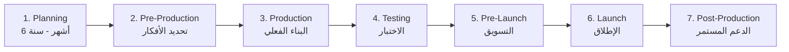
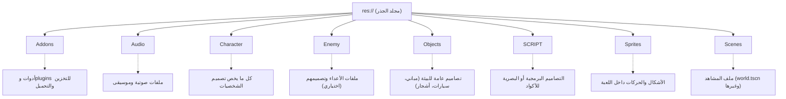
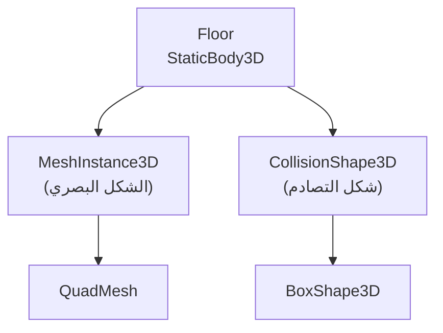
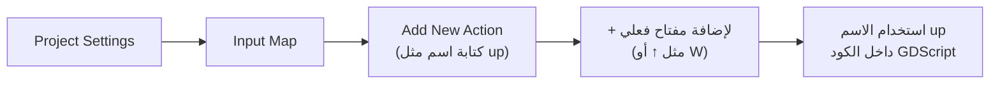
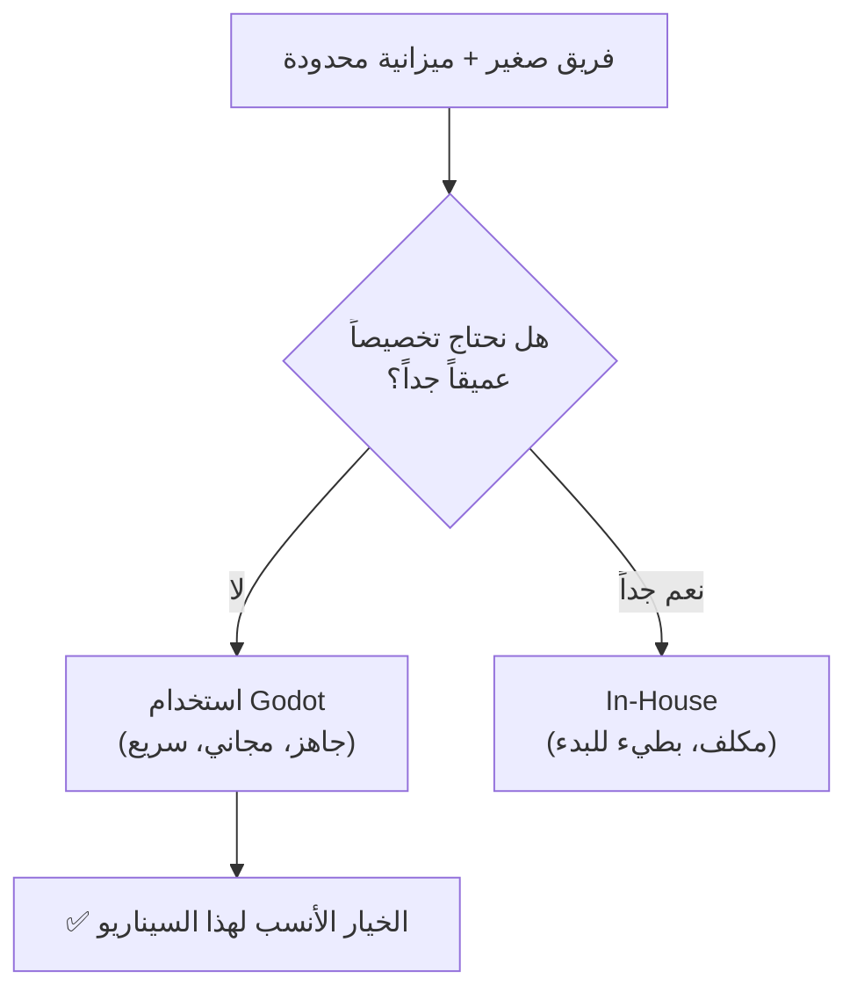
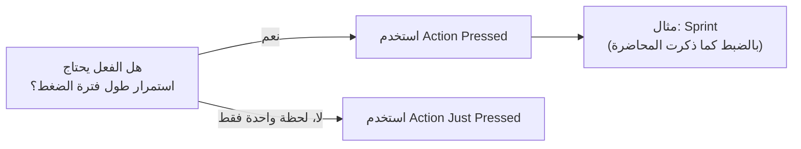

# المحاضرة 5 — Game Engines & Godot Development (محركات الألعاب وتطوير الألعاب بمحرك Godot)
> **المادة:** هندسة البرمجيات (المستوى الرابع) | **الموضوع:** صناعة الألعاب، دورة حياة التطوير، والتطبيق العملي بمحرك Godot

---

## الجزء الأول: الشرح التفصيلي

### 1. محركات الألعاب: التعريف والتاريخ

#### 📍 أين نحن الآن؟
نبدأ المحاضرة من الصفر: ما هو "محرك اللعبة" أصلاً، وكيف تطوّرت هذه الفكرة صناعياً عبر السنين.

#### ⬅️ الربط مع السابق
هذا أول موضوع في المحاضرة — لا يوجد سابق مباشر، لكنه يُبنى على فهمك العام لـ SDLC (دورة حياة تطوير البرمجيات) من محاضرات سابقة في هذه المادة.

#### 💡 الفكرة الأساسية
**`Game Engine` هو برنامج وسيط جاهز يوفّر للمطورين كل الأدوات الأساسية (رسم، فيزياء، صوت، إدخال) بدل إعادة بنائها من الصفر لكل لعبة.**

<!-- @type: fact -->
<!-- @render: {type: "theory-first", coverage: "100%"} -->

---

#### 📖 الشرح

قبل أي شيء، لازم نجاوب سؤال بسيط: ليش نحتاج "محرك" أصلاً؟ لو بدك تصنع لعبة، أنت مش محتاج فقط ترسم شخصية وتحركها — أنت محتاج نظام يحسب الفيزياء (الجاذبية، التصادمات)، نظام يعرض الجرافيكس على الشاشة بسرعة (Rendering)، نظام يسمع لوحة المفاتيح والماوس (Input)، ونظام يشغّل الصوت والموسيقى. كل هذا معقّد جداً لو بنيته من الصفر لكل لعبة جديدة — فهون بيجي دور `Game Engine`: هو الطبقة الوسطى اللي بتوفّر لك كل هذا جاهزاً، وانت بس تركّز على "لعبتك" فوقه.

**تاريخ محركات الألعاب — كيف تطوّرت الصناعة:**

في الماضي، كان المبرمج يحتاج **ترخيص (License)** من شركة أخرى لاستخدام محرك جاهز لصنع لعبته — يعني يدفع فلوس لاستخدام محرك بناه غيره. وإذا لم يرد المبرمج (أو الاستوديو) شراء رخصة، كان لازم يصمم محركه الخاص فيه — وهذه العملية كانت تستهلك ما يقارب **سنة كاملة** من العمل قبل حتى البدء بصنع اللعبة نفسها.

هذا أدى لظهور نمط شائع في كبرى الشركات: كل شركة كبرى تطوّر محركها الخاص، ويُعرف هذا باسم **`In-House Engine`** — محرك داخلي مصمم خصيصاً لأسلوب واحتياجات ألعاب هذه الشركة بالتحديد. مثال حقيقي مذكور في المحاضرة: استوديوهات **CD Project Red** (البولندية) طوّرت محركها الخاص لسلسلة ألعاب **The Witcher**.

#### 💡 التشبيه
فكّر بـ `Game Engine` مثل **مطبخ مجهز بالكامل** (أفران، سكاكين، أدوات) — لو ما عندك مطبخ مجهز، لازم تبني مطبخك بنفسك (ترخيص محرك أو بناء In-House) قبل حتى ما تبلش تطبخ الوصفة (اللعبة). وجه الشبه: المطبخ المجهز = المحرك الجاهز، الوصفة = اللعبة نفسها.

---

#### 🎯 الملخص السريع
- `Game Engine` = طبقة وسطى جاهزة توفّر أدوات الرسم، الفيزياء، الصوت، الإدخال
- في الماضي: تحتاج **ترخيص** من شركة أخرى لاستخدام محركها
- البديل: بناء **`In-House Engine`** خاص بالشركة — يستهلك حوالي سنة من العمل
- مثال حقيقي: CD Project Red بنت محركها الخاص لسلسلة The Witcher

#### 📚 التطبيق
هذا الفهم يمهّد لسؤال استراتيجي أهم: **متى تبني محركك الخاص، ومتى تستخدم محركاً جاهزاً مثل Godot؟** — هذا ما سنراه في قسم المقايضة أدناه، وهو أيضاً ما يمهّد لبقية المحاضرة حيث سنستخدم Godot (محرك جاهز مجاني) لبناء لعبة فعلية.

#### ⚖️ المقايضة: In-House Engine مقابل ترخيص محرك جاهز

| الجانب | In-House Engine | ترخيص/استخدام محرك جاهز (License أو مجاني كـ Godot) |
| --- | --- | --- |
| **التكلفة الأولية** | عالية جداً (فريق كامل + حوالي سنة عمل) | منخفضة (رسوم ترخيص أو مجاني تماماً) |
| **التخصيص** | كامل ١٠٠٪، مصمّم خصيصاً لأسلوب اللعبة | محدود بخيارات المحرك المتاحة |
| **الوقت للبدء بصنع اللعبة** | طويل جداً (سنة قبل البدء الفعلي) | فوري تقريباً |
| **مناسب لـ** | استوديوهات كبيرة براس مال ضخم (CD Project Red) | استوديوهات صغيرة/متوسطة، مشاريع تعليمية، Indie Games |

#### ⚠️ أخطاء شائعة

#### الفهم الخاطئ ❌:
يظن كثير من المبتدئين أن كل الشركات الكبرى "تشتري" محركاً جاهزاً دائماً، أو بالعكس أن بناء محرك خاص هو الخيار "الأفضل" دوماً.

#### الفهم الصحيح ✅:
القرار استراتيجي بالكامل: يعتمد على الميزانية، الوقت المتاح، وحاجة اللعبة لتخصيص عميق. لا يوجد خيار "أفضل" مطلقاً — Godot نفسه مثال على محرك جاهز ومجاني ممتاز لكثير من المشاريع.

#### 📄 النص الأصلي من المحاضرة
<details>
<summary>عرض النص الأصلي (coverage: 100%)</summary>

> باعللأا تاكرمح خيرات (تاريخ محركات الألعاب)
> - كان المبرمج يحتاج إلى رخصة من الشركة لاستخدام محرك لصنع لعبة في الماضي
> - إذا لم يرد المبرمج شراء الرخصة، فكان عليه أن يقوم بتصميم محرك خاص فيه، تلك العملية كانت تستهلك ما يقارب سنة
> - في كثير من الشركات الكبرى، تقوم كل شركة بتطوير محركاتها الخاصة والتي تُعرف باسم In-House Engine واستعمالها لتطوير ألعابها، أمثلة عن هذه الألعاب:
> 1. سلسلة ألعاب The Witcher المطورة من استوديوهات Cd Project Red البولندية

**ملاحظة على التغطية:**
- ✓ تم شرح التعريف والتاريخ والمثال الحقيقي بالكامل
- ℹ️ إضافة من الدليل: تشبيه المطبخ، جدول المقايضة، الربط بمحرك Godot المستخدم لاحقاً في المحاضرة

</details>

---

### 2. دورة حياة تطوير اللعبة (Game Development Lifecycle)

#### 📍 أين نحن الآن؟
بعد فهم "لماذا نحتاج محركاً"، ننتقل لفهم **كيف تُصنع اللعبة كاملة من الصفر للإطلاق** — وهي عملية صناعية منظّمة من 7 مراحل متتالية.

#### ⬅️ الربط مع السابق
اختيار المحرك (In-House أو جاهز) هو قرار يُتخذ **داخل** مرحلة من هذه المراحل السبع — بالتحديد في مرحلة Planning أو Pre-Production.

#### 💡 الفكرة الأساسية
**تطوير أي لعبة يمر بسبع مراحل متتالية وثابتة: Planning → Pre-Production → Production → Testing → Pre-Launch → Launch → Post-Production.**

<!-- @type: fact -->
<!-- @render: {type: "diagram-first", coverage: "100%"} -->

---

#### 📊 المخطط: المراحل السبع لتطوير اللعبة



**الشرح:** كل مرحلة تعتمد على اكتمال التي قبلها — لا يمكن دخول Production بدون تحديد الأفكار في Pre-Production، ولا يمكن Launch بدون نجاح Testing.

---

#### 📖 الشرح

**المرحلة 1: Planning (التخطيط)**
هذه أول مرحلة، وتستغرق من **6 أشهر إلى سنة كاملة** من دورة حياة تطوير اللعبة. فيها نتعرّف على **كل جوانب** اللعبة التي نريد صنعها، قبل كتابة أي كود. المحاضرة تحدد ثلاثة أسئلة أساسية يجب الإجابة عليها قبل إطلاق أي لعبة:
- ما هو التصنيف (Genre) الذي تندرج تحته اللعبة؟
- ما هي الميكانيكيات (Mechanics) التي نريد إضافتها في اللعبة؟
- ما هو المحرك الذي سنستخدمه في صناعة اللعبة؟

**المرحلة 2: Pre-Production (ما قبل الإنتاج)**
هنا نحدد الأفكار التي سنستخدمها فعلياً، ونتخلى عن الأفكار التي لن نحتاجها، ونوزّع المهام على فريق التطوير الذي يتكوّن من:
- **الرسامون (Artists):** يحددون نمط الرسم والألوان التي تتناسب مع طبيعة عالم اللعبة والتصنيف الذي تندرج ضمنه
- **المصممون (Designers):** هم المسؤولون عن تصميم وهندسة جميع الجوانب الأساسية في اللعبة
- **الكاتّاب (Writers):** هم المسؤولون عن كتابة قصة اللعبة، الحوارات، والسيرة الذاتية للشخصيات بشكل يتناسب مع طبيعة اللعبة

**المرحلة 3: Production (الإنتاج)**
في هذه المرحلة يقوم المطورون والمصمم في صنع عالم اللعبة وتقديم بيئة تفاعلية تتناسب مع القصة ونمط الرسم وأسلوب اللعب. يتم تصميم النموذج (Model) الخاص بكل شخصية ورسمها وتحريكها، ممثلو الأصوات يقومون بتسجيل النصوص والحوارات، مهندس الأصوات يقومون بصنع الموسيقى التصويرية والمؤثرات الصوتية، والكاتّاب يقوم بوضع تفصيل للشخصيات مع حواراتهم.

**المرحلة 4: Testing (الاختبار)**
تصبح اللعبة مكتملة الأركان وجاهزة للإصدار، وكل ما علينا فعله الآن هو اختبار اللعبة والتأكد من عدم وجود أي أخطاء برمجية وأن كل شيء يعمل بشكل صحيح.

**المرحلة 5: Pre-Launch (ما قبل الإطلاق)**
نبدأ عملية تسويق اللعبة إلى الجمهور المستهدف. يمكن إصدار عروض ترويجية تُظهر طبيعة اللعبة وعوالمها بجودة عالية مع إخراج مميز، ويمكن أن نقوم بالكشف عن اللعبة في معارض خاصة مثل E3 و PAX أو حلقات تقنية مثل State of Play و Nintendo Direct.

**المرحلة 6: Launch (الإطلاق)**
يمكن أن نتعاقد مع إحدى شركات أجهزة الألعاب ونجعل إصدار اللعبة حصرياً على أجهزة محددة، ويمكن أن يتم الإصدار على جميع المنصات — فالأمر يعود للناس والطريقة التي يريدون إصدار اللعبة فيها.

**المرحلة 7: Post-Production (ما بعد الإنتاج)**
متابعة اللعبة بشكل دوري بعد إصدارها، عن طريق إصدار تحديثات لكل فترة لإصلاح الأخطاء التي قد تظهر لضمان أن تبقى اللعبة مستقرة، وإصدار محتوى جديد للعبة (`DLC`) لإضافة أفكار جديدة لم تتضمنها اللعبة، ويمكن أن تكون هذه المحتويات مجانية أو مدفوعة.

#### 🎯 الملخص السريع
- 7 مراحل ثابتة ومتتالية: Planning → Pre-Production → Production → Testing → Pre-Launch → Launch → Post-Production
- Planning تحدد الأساسيات (Genre, Mechanics, Engine) وتستغرق 6 أشهر-سنة
- Pre-Production توزّع الأدوار (Artists, Designers, Writers)
- Testing لا يعني نهاية العمل — بل بداية Pre-Launch
- Post-Production مستمرة طوال عمر اللعبة عبر التحديثات و `DLC`

#### 📚 التطبيق
في بقية هذه المحاضرة، سنمر عملياً بجزء من مرحلتي **Pre-Production/Production** بالتحديد: سنختار المحرك (Godot)، وسنبني عالماً (Floor) وشخصية (Player) — أي أننا ننتقل الآن من النظرية الصناعية إلى التطبيق الفعلي داخل مرحلة الإنتاج.

#### 🤔 تفعيل الفهم
لو كنت مديراً لفريق تطوير صغير، وأحد أعضاء الفريق يريد البدء بكتابة كود اللعبة فوراً بدون تحديد Genre أو Mechanics أو Engine، ما هي المرحلة التي يتجاهلها؟ وما المخاطر المحتملة؟

#### ⚠️ أخطاء شائعة

#### الفهم الخاطئ ❌:
يظن البعض أن Testing هي آخر خطوة قبل إطلاق اللعبة مباشرة للجمهور.

#### الفهم الصحيح ✅:
بعد Testing تأتي مرحلتان كاملتان أخريان: Pre-Launch (التسويق) ثم Launch (الإصدار الفعلي) — وحتى بعد الإطلاق، هناك Post-Production المستمرة.

#### 📄 النص الأصلي من المحاضرة
<details>
<summary>عرض النص الأصلي (coverage: 100%)</summary>

> باعللاا ريوطت لحارم (مراحل تطوير الألعاب)
> Planning: يتم فيها التعرف على كل جوانب اللعبة التي نريد صنعها، وتستغرق هذه المرحلة من 6 أشهر إلى سنة في دورة حياة تطوير الألعاب
> قبل إطلاق اللعبة، هناك بعض الأسئلة الأساسية التي تحتاج إجابة: ما هو التصنيف الذي تندرج تحته اللعبة؟ ما هي الميكانيكيات التي نريد إضافتها في اللعبة؟ ما هو المحرك الذي سنستخدمه في صناعة اللعبة؟
>
> Pre-Production: نقوم في هذه المرحلة بتحديد الأفكار التي سنستخدمها والتخلي عن الأفكار التي لن نحتاجها، وتوزيع المهام التي سيعمل عليها فريق التطوير والذي يتكون من: الرسامين (Artists)، المصممين (Designers)، الكتّاب (Writers)
>
> Production: في هذه المرحلة يقوم المطورين والمصمم في صنع عالم اللعبة وتقديم بيئة تفاعلية تتناسب مع القصة ونمط الرسم وأسلوب اللعب، يتم تصميمها ورسمها وتحريكها Model الخاص بكل شخصية، ممثلو الأصوات يقومون بتسجيل النصوص والحوارات، مهندس الأصوات يقومون بصنع الموسيقى التصويرية والمؤثرات الصوتية، الكتّاب يقوم بوضع تفصيل للشخصيات مع حواراتهم
>
> Testing: في هذه المرحلة تصبح اللعبة مكتملة الأركان وجاهزة للإصدار وكل ما علينا فعله الآن هو اختبار اللعبة والتأكد من عدم وجود أي أخطاء برمجية وأن كل شيء يعمل بشكل صحيح
>
> Pre-Launch: في هذه المرحلة نبدأ عملية تسويق اللعبة إلى الجمهور المستهدف. إصدار عروض ترويجية تظهر طبيعة اللعبة وعوالمها بجودة عالية مع إخراج ممتاز ويمكن أن نقوم بالكشف عن اللعبة في معارض خاصة مثل E3 و PAX أو حلقات تقنية مثل State of Play و Nintendo Direct
>
> Launch: يمكن أن نتعاقد مع إحدى شركات أجهزة الألعاب ونجعل إصدار اللعبة حصرياً على أجهزة محددة، ويمكن أن يتم إصدار على جميع المنصات فالأمر يعود للناس والطريقة التي يريد إصدار اللعبة فيها
>
> Post-Production: متابعة اللعبة بشكل دوري بعد إصدارها، عن طريق إصدار تحديثات لكل فترة لإصلاح الأخطاء التي قد تظهر لضمان أن تبقى اللعبة مستقرة، إصدار محتوى جديد للعبة (DLC) لإضافة أفكار جديدة لم تتضمنها اللعبة ويمكن أن تكون هذه المحتويات مجانية أو مدفوعة

**ملاحظة على التغطية:**
- ✓ تم شرح كل المراحل السبع بالكامل، مع كل التفاصيل الفرعية (الأدوار، الأسئلة، الأمثلة)
- ℹ️ إضافة من الدليل: مخطط Mermaid، تفعيل الفهم، الربط مع بقية المحاضرة

</details>

---

### 2.1. Testing وأهمية Beta Testers

#### 📍 أين نحن الآن؟
نتوسّع في مرحلة Testing بالتحديد، لأن المحاضرة أضافت تفصيلاً مهماً عنها: بعض الشركات لا تكتفي بفريقها الداخلي للاختبار.

#### 💡 الفكرة الأساسية
**بعض الشركات تستخدم مختبرين خارجيين يُدعون `Beta Testers` للتأكد من صحة اللعبة واكتشاف الأخطاء قبل الإطلاق النهائي.**

<!-- @type: practice -->
<!-- @render: {type: "theory-first", coverage: "100%"} -->

---

#### 📖 الشرح

بعض الشركات تستخدم مختبِرين عبر الإنترنت يُدعون **`beta testers`** للتحقق من صحة اللعبة والتأكد من عدم وجود أخطاء (`bugs`). هذا يمنح الشركات ملاحظات (`feedback`) عامة عن اللعبة، وأيضاً يسمح بإجراء تغييرات — صغيرة كانت أو جذرية — على اللعبة ككل، بناءً على ردود فعل هؤلاء المختبِرين.

المحاضرة تذكر أمثلة حقيقية حديثة على أهمية (وأحياناً فشل) هذه العملية: **Cyberpunk 2077**، **Wuthering Waves**، و **NTE**، حيث كانت هناك حوادث ملحوظة تتعلق بجودة الإطلاق ومدى كفاية الاختبار قبله.

#### 💡 التشبيه
`Beta Testing` مثل **تجربة طبق جديد على مجموعة أصدقاء قبل تقديمه في مطعم رسمي** — بدل ما تفاجأ بردة فعل الزبائن الحقيقيين، تجرّب أولاً على عيّنة صغيرة تعطيك رأيها الصريح. وجه الشبه: الأصدقاء = beta testers، الزبائن = الجمهور العام بعد الإطلاق.

#### 🎯 الملخص السريع
- `Beta Testers`: مختبرون خارجيون عبر الإنترنت، ليسوا موظفين رسميين بالضرورة
- الهدف: اكتشاف الأخطاء + الحصول على `feedback` عام
- النتيجة: قد تؤدي لتغييرات صغيرة أو جذرية في اللعبة
- أمثلة حقيقية ذُكرت: Cyberpunk، Wuthering Waves، NTE

#### 📚 التطبيق
هذا يوضح أن Testing ليست مسؤولية فريق التطوير فقط — بل قد تُوسَّع لتشمل الجمهور المستهدف نفسه، قبل الدخول لمرحلة Pre-Launch والتسويق الرسمي.

#### ⚠️ أخطاء شائعة

#### الفهم الخاطئ ❌:
يظن بعض الطلاب أن استخدام Beta Testers يعني أن اللعبة "فاشلة" أو "غير جاهزة".

#### الفهم الصحيح ✅:
هي ممارسة استباقية وقائية، حتى الألعاب الكبرى (AAA) تستخدمها، والغاية منها تقليل المخاطر لا الاعتراف بالفشل.

#### 📄 النص الأصلي من المحاضرة
<details>
<summary>عرض النص الأصلي (coverage: 100%)</summary>

> Some companies use online testers called –beta testers- to check the validity of our game and check the bugs.
> This usually give companies feedbacks about the game in general too, also it allow for changes be it small or drastic in the game as a whole.
> In the recent years we had some really good examples about such incidents like, cyber punk, wuthering waves, NTE, etc…

**ملاحظة على التغطية:**
- ✓ تم شرح النص الإنجليزي الكامل من صفحات 17-19 من المحاضرة
- ℹ️ إضافة من الدليل: تشبيه المطعم، الربط بمرحلة Pre-Launch

</details>

---

### 3. مقدمة إلى محرك Godot وإنشاء مشروع جديد

#### 📍 أين نحن الآن؟
ننتقل الآن من النظرية الصناعية العامة إلى **تطبيق عملي مباشر**: سنستخدم محرك **`Godot`** (محرك جاهز ومجاني — تذكّر مقايضة In-House مقابل الجاهز من القسم الأول) لبناء لعبة فعلية خطوة بخطوة.

#### ⬅️ الربط مع السابق
اختيار Godot هنا هو تطبيق حي لقرار "المحرك" الذي ناقشناه في مرحلة Planning (القسم 2) — اختيار محرك جاهز مجاني بدل بناء In-House Engine.

#### 💡 الفكرة الأساسية
**Godot هو محرك ألعاب مجاني ومفتوح المصدر، يدعم صناعة ألعاب ثنائية وثلاثية الأبعاد، ويعتمد على نظام "عُقد" (`Node`) هرمي لتنظيم كل عناصر اللعبة.**

<!-- @type: fact -->
<!-- @render: {type: "diagram-first", coverage: "95%"} -->

---

#### ⚙️ الخطوات: إنشاء مشروع جديد في Godot

```algorithm
1 | فتح Godot وإنشاء مشروع جديد | New Project | يحدد اسم ومسار المشروع
2 | اختيار مسار العرض الصحيح | Rendering: Forward+ | يضبط طريقة عرض الرسوميات (rendering path)
3 | الضغط على Create لبدء المشروع | Create | يفتح الواجهة الرئيسية الفارغة
4 | اختيار نوع العقدة الجذرية | Node 2D / Node 3D | Node 3D لصناعة لعبة ثلاثية الأبعاد، Node 2D لصناعة لعبة ثنائية الأبعاد، أو واجهة مستخدم (User Interface) في حال الحاجة لها
5 | حفظ المشهد وتسميته | Ctrl+S | يحفظ المشهد بامتداد .tscn (هنا: world.tscn)
```

#### ملاحظة:
المحاضرة توضّح أنه في حال صناعة لعبة ثلاثية الأبعاد، نختار `Node 3D`، وفي حال صناعة لعبة ثنائية الأبعاد، نختار `Node 2D`، وفي حال احتجنا لصناعة واجهة مستخدم (`User Interface`)، نختار الواجهة المخصصة لها. في هذه المحاضرة تحديداً، تم اختيار `Node 3D` لأن اللعبة المبنية ثلاثية الأبعاد.

---

#### 📖 الشرح

أول خطوة عملية في أي مشروع Godot هي التأكد من **المسار الصحيح** للعبة التي نريد تصميمها: نحدد اسماً لها، ونتأكد من اختيار مسار العرض (`rendering path`) المناسب وهو `forward+` (المسار الافتراضي الحديث في Godot 4 لمعالجة الرسوميات). بعد الضغط على `Create` للبدء بالمشروع، نجد أننا أمام الواجهة الحالية الفارغة تماماً.

هنا نقوم باختيار نوع المشهد الأساسي: في حال صناعة لعبة ثلاثية الأبعاد نختار **`Node 3D`**، وفي حال صناعة لعبة ثنائية الأبعاد نختار **`Node 2D`**، ولصناعة واجهة للمستخدم (`user interface`) نختار الواجهة المخصصة لها. في الجلسة الحالية سنستخدم `Node 3D`.

الخطوة الأخيرة قبل البدء بالبناء الفعلي: نقوم بإعادة تسمية الملف إلى اسم مناسب (`world`)، ونحفظ الملف من خلال الضغط على `Ctrl+S`، وتظهر لنا واجهة "حفظ" (`save`) نقوم بالحفظ فيها.

#### ملاحظة:
جزء من هذه الخطوات (الصفحات 29، 31، 32، 34، 37، 39) كانت أصلاً **لقطات شاشة من محرر Godot** توضّح شكل الواجهة بالضبط (نوافذ الإنشاء، القوائم المنسدلة، شكل شجرة العُقد الفارغة). للرؤية التفصيلية الكاملة لشكل الواجهة، راجع هذه الصفحات في ملف `العاب.pdf`.

**ملخص هذه الخطوات المرئية:** تُظهر تسلسل النقر الفعلي على أزرار Godot: نافذة "مشروع جديد" ← نافذة اختيار نوع المشهد الجذري (2D/3D/UI) ← شجرة العُقد الفارغة بعد الإنشاء ← نافذة الحفظ بعد Ctrl+S.

#### 🎯 الملخص السريع
- `Forward+`: مسار العرض الافتراضي المُختار عند إنشاء المشروع
- `Node 3D`: نختاره لمشروع ثلاثي الأبعاد (هذه المحاضرة)
- `Node 2D`: نختاره لمشروع ثنائي الأبعاد
- الحفظ بـ `Ctrl+S` ينتج ملف مشهد بامتداد `.tscn`

#### 📚 التطبيق
بعد إنشاء المشهد الجذري (`world.tscn`)، نحتاج تنظيم ملفات المشروع بشكل منطقي قبل البدء بإضافة أي محتوى فعلي — وهذا موضوع القسم التالي.

#### ⚠️ أخطاء شائعة

#### الفهم الخاطئ ❌:
يظن بعض المبتدئين أن اختيار `Node 2D` أو `Node 3D` قرار يمكن تجاهله أو أنه مجرد تفصيل شكلي.

#### الفهم الصحيح ✅:
هذا القرار يحدد **كل** الفيزياء والرسوميات المتاحة لاحقاً (مثلاً `CollisionShape3D` لا يعمل إلا داخل مشروع `Node 3D`) — لذلك يجب اتخاذه بوعي منذ بداية المشروع تماشياً مع اختيار "Genre" و"Mechanics" من مرحلة Planning.

#### 📄 النص الأصلي من المحاضرة
<details>
<summary>عرض النص الأصلي (coverage: 90%)</summary>

> رايتخا نم دكاتن و اهل مسا ددحن و اهميمصت ديرن يلا ةبعلل حيحصلا راسملا نم دكاتلاب موقن forward+
> node 2d node 3d — داعبلاا ةيثلاث ةبعل ةعانصل رايتخاب موقن، داعبلاا ةيئانث ةبعل ةعانص لاح في و رانخ ةهجاو ةعانصل و مدختسملل user interface رايخاب موقن
> ctr+s WORLD node — ظفلحاب موقن و ىلع طغضلا للاخ نم فللما ظفح و لىا لا ةيمست ةداعاب موقن

**ملاحظة على التغطية:**
- ✓ شرح كامل لخطوات الإنشاء الثلاث (المسار، نوع المشهد، الحفظ)
- ⚠️ لم يتم شرح تفاصيل شكل الواجهة بصرياً (كانت لقطات شاشة — أُشير لها أعلاه)
- ℹ️ إضافة من الدليل: توضيح لماذا القرار بين 2D/3D مهم استراتيجياً

</details>

---

### 3.1. تنظيم ملفات المشروع (Project File Structure)

#### 📍 أين نحن الآن؟
بعد إنشاء المشهد الرئيسي، الخطوة المنطقية التالية — قبل أي محتوى فعلي — هي بناء **هيكل مجلدات منظّم**، لأن مشاريع الألعاب تكبر بسرعة وتحتوي أنواعاً كثيرة من الملفات (صوت، صور، سكربتات).

#### 💡 الفكرة الأساسية
**Godot يوفّر مجلد جذر باسم `res://` نبني تحته هيكلاً ثابتاً من المجلدات المتخصصة، كل واحد لنوع معيّن من ملفات اللعبة.**

<!-- @type: practice -->
<!-- @render: {type: "diagram-first", coverage: "100%"} -->

---

#### 📊 المخطط: هيكل مجلدات المشروع



---

#### 📖 الشرح

نقوم بإنشاء ملفات (مجلدات فرعية) داخل الملف الأب `res://` من خلال تبويب `filesystem`. كل مجلد له غرض محدد بدقة، بحسب المحاضرة:

1. **`Addons`**: هو فلم الأدوات، يُستخدم لتخزين وتحميل الأدوات المرادة استعمالها أثناء صناعة اللعبة
2. **`Audio`**: وهو فلم الموسيقى، ويتم تخزين أي ملفات صوتية بداخله
3. **`Character`**: وهو الملف الذي سيتم حفظ كل ما يخص الشخصيات بداخله
4. **`Enemy`**: ملف حفظ الأعداء وتصاميمهم (ليس ضروري الوجود، حيث أن بعض الألعاب لا تحتوي على أعداء ولا تحتوي على `Enemy` بتاتاً)
5. **`Objects`**: وهو الملف الذي يحتوي على التصاميم العامة للبيئة المحيطة (سيارات، أبنية، أشجار، طرقات أو `Mesh`)
6. **`SCRIPT`**: وهو الملف الذي يحتوي على التصاميم البرمجية أو البصرية التي تتواجد في اللعبة
7. **`Sprites`**: وهو الملف الذي يحتوي على الأشكال والتحركات الموجودة داخل اللعبة
8. **`Scenes`**: وهو ملف المشاهد

المحاضرة بعد ذلك توضّح خطوة عملية: يتم نقل ملف `world.tscn` إلى داخل ملف `scenes` — وتسأل المحاضرة سؤالاً بلاغياً مهماً: **"لماذا قمنا بنقل الملف إلى `scenes`؟"** — الجواب الضمني (المستنتج من بنية الهيكل نفسها): لأن `Scenes` هو المكان المخصص حصراً لكل ملفات المشاهد، فوضع `world.tscn` هناك يحافظ على تنظيم المشروع منذ اللحظة الأولى، بدل تركه عشوائياً في الجذر.

#### 💡 التشبيه
هيكل المجلدات هذا مثل **خزانة ملابس منظّمة بأدراج مخصصة** (جوارب، قمصان، بناطيل) — بدل رمي كل شيء في درج واحد. وجه الشبه: كل درج = مجلد متخصص (`Audio`, `Character`...)، والملابس = الأصول (`assets`) المختلفة للعبة.

#### 🎯 الملخص السريع
- `res://` هو جذر المشروع الذي تُبنى تحته كل المجلدات
- 8 مجلدات أساسية: Addons, Audio, Character, Enemy, Objects, Script, Sprites, Scenes
- `Enemy` هو المجلد الوحيد **الاختياري** — يعتمد على وجود أعداء في اللعبة أصلاً
- ملفات المشاهد (`.tscn`) تُنقل دائماً لمجلد `Scenes` فوراً بعد إنشائها

#### 📚 التطبيق
بعد هذا التنظيم، نبدأ فعلياً ببناء أول عنصر داخل عالم اللعبة: الأرضية — وسنحتاج هنا مجلد `Objects` و`Scenes` تحديداً.

#### ⚠️ أخطاء شائعة

#### الفهم الخاطئ ❌:
يظن البعض أن مجلد `Enemy` إلزامي في كل مشروع Godot بما أن المحاضرة تذكره كأحد المجلدات الثمانية.

#### الفهم الصحيح ✅:
المحاضرة تنص بوضوح أن وجود هذا المجلد "ليس ضروري الوجود" — فبعض الألعاب (كألعاب المنصات التعاونية أو الألعاب التعليمية البسيطة) لا تحتوي أعداءً بتاتاً.

#### 📄 النص الأصلي من المحاضرة
<details>
<summary>عرض النص الأصلي (coverage: 100%)</summary>

> filesystem res - بيوبت للاخ نم بلاا فللما لخاد تافلم ءاشناب موقن
> Addons: و هو فلم الأدوات، يستخدم لتخزين وتحميل الأدوات المرادة استعمالها أثناء صناعة اللعبة
> Audio: وهو فلم الموسيقى ويتم تخزين أي ملفات صوتية بداخله
> Character: وهو الملف الذي سيتم حفظ ما يخص الشخصيات بداخله
> Enemy: ملف حفظ الأعداء وتصاميمهم (ليس ضروري الوجود حيث أن بعض الألعاب لا تحتوي على أعداء ولا تحتوي على Enemy)
> Objects: وهو الملف الذي يحتوي على التصاميم العامة للبيئة المحيطة (سيارات، أبنية، أشجار، طرقات أو مشيز)
> SCRIPT: وهو الملف الذي يحتوي على التصاميم البرمجية أو البصرية التي تتواجد في اللعبة
> Sprites: وهو الملف الذي يحتوي على الأشكال والحركات الموجودة داخل اللعبة
> Scenes: وهو ملف المشاهد
> نقوم بنقل ملف إلى داخل الملف: scenes world.tscn
> سؤال: لماذا قمنا بنقل الملف إلى scenes؟

**ملاحظة على التغطية:**
- ✓ شرح كل المجلدات الثمانية بدقة
- ✓ الإجابة على السؤال البلاغي المطروح في المحاضرة
- ℹ️ إضافة من الدليل: تشبيه الخزانة

</details>

---

### 4. بناء عالم اللعبة: الأرضية (Floor Construction)

#### 📍 أين نحن الآن؟
أول خطوة عملية فعلية في تنفيذ اللعبة: بناء **الأرضية** التي سيتحرك اللاعب عليها.

#### ⬅️ الربط مع السابق
بعد تنظيم المجلدات (`Objects`, `Scenes`)، نبدأ الآن نضع فيها محتوى فعلياً — أول عنصر هو الأرضية، لأن لا يمكن وجود لاعب أو حركة بدون سطح يقف عليه.

#### 💡 الفكرة الأساسية
**الأرضية تُبنى كجسم ثابت (`StaticBody3D`) يحتوي على عُقدتين فرعيتين: واحدة للشكل البصري (`MeshInstance3D`) وواحدة لشكل التصادم الفعلي (`CollisionShape3D`).**

<!-- @type: fact -->
<!-- @render: {type: "diagram-first", coverage: "100%"} -->

---

#### 📊 المخطط: بنية عقدة الأرضية



**الشرح:** `MeshInstance3D` و`CollisionShape3D` يجب أن يكونا **ابنَين (Children)** لعقدة `StaticBody3D` — هذا شرط بنيوي إلزامي في Godot لأي جسم فيزيائي.

---

#### ⚙️ الخطوات: بناء الأرضية

```algorithm
1 | إضافة عقدة Static Body 3D | Create | ينشئ الجسم الثابت (الأرضية لن تتحرك أبداً)
2 | إضافة Mesh Instance 3D كابن للـ Static Body | Add Child Node | يحدد الشكل البصري الذي يظهر للاعب
3 | إضافة Collision Shape 3D كابن للـ Static Body | Add Child Node | يحدد شكل التصادم الفعلي (غير مرئي)
4 | اختيار BoxShape3D من الـ Inspector | Inspector → Shape → New BoxShape3D | يولّد صندوق تصادم بأبعاد قابلة للتعديل
5 | اختيار QuadMesh من خيارات Mesh | Inspector → Mesh → New QuadMesh | يولّد سطحاً مسطحاً (Quad) كشكل بصري للأرضية
```

---

#### 📖 الشرح

نبدأ الخطوة الأولى بتنفيذ اللعبة من خلال بناء الأرضية (`floor`) — وهي الأرض التي سنتحرك عليها. لبناء أي جسم (`Mesh`) في Godot، تجدر ملاحظة مهمة جداً: **الجسم يتشكّل من `MeshInstance3D` و `CollisionShape3D` معاً**، ويجب الانتباه إلى أنهما يجب أن يكونا **ابنَين (children)** لعقدة `StaticBody3D`.

نضغط على `create` لإنشاء الجسم الثابت (`static body 3d`)، ثم نضيف تحته `mesh instance 3d` و`collision shape 3d`.

**سؤال يطرحه محتوى المحاضرة نفسه: ما الفرق بين `MeshInstance3D` و `CollisionShape3D`؟**
- **`MeshInstance3D`**: يحدد **كيف يبدو** الجسم بصرياً — هو ما يراه اللاعب فعلياً على الشاشة
- **`CollisionShape3D`**: يحدد **كيف يتصرف** الجسم فيزيائياً — غير مرئي، لكنه يمنع اللاعب من السقوط عبر الأرضية

من تبويب `inspector` الخاص بـ `CollisionShape3D`، نقوم بتوليد صندوق من خلال الضغط على `shape`، ونلاحظ وجود العديد من الأشكال الموجودة في المحرك، ونختار `BoxShape3D`.

بعد ذلك، من `inspector` الخاص بـ `MeshInstance3D`، نذهب إلى خيار `Mesh` ونختار `QuadMesh` (شكل مسطح رباعي الأضلاع، مناسب جداً للأرضيات المسطحة).

#### ملاحظة:
عدة صفحات في هذا القسم (42، 44، 46، 48، 53-55، 58، 60) كانت **لقطات شاشة من محرر Godot** توضّح بالضبط أماكن الأزرار (`inspector`, `Shape`, قائمة الأشكال المنسدلة، شكل الـ Mesh قبل وبعد التعديل). راجع هذه الصفحات في `العاب.pdf` لرؤية الواجهة بالتفصيل.

**ملخص هذه الخطوات المرئية:** توضّح تسلسل النقر: فتح `Inspector` ← الضغط على حقل `Shape` الفارغ ← ظهور قائمة أشكال (Box, Sphere, Capsule...) ← اختيار `BoxShape3D` ← نفس التسلسل تقريباً لاختيار `QuadMesh` من حقل `Mesh`.

#### 💡 التشبيه
`MeshInstance3D` و `CollisionShape3D` مثل **واجهة متجر وجدار المتجر الفعلي** — الواجهة (`Mesh`) هي ما يراه الزبون من الخارج (جميلة، مزخرفة)، بينما الجدار الفعلي (`Collision`) هو ما يمنع أي شخص من المرور عبره فعلياً حتى لو الواجهة شفافة بصرياً.

#### 🎯 الملخص السريع
- الأرضية = `StaticBody3D` (لن تتحرك) + ابنان: `MeshInstance3D` (بصري) + `CollisionShape3D` (فيزيائي)
- `MeshInstance3D` و`CollisionShape3D` **يجب** أن يكونا ابنَين للـ `StaticBody3D` — قاعدة بنيوية إلزامية
- `BoxShape3D`: شكل التصادم المُختار للأرضية
- `QuadMesh`: الشكل البصري المسطح المُختار للأرضية

#### 📚 التطبيق
بعد إنشاء الشكل الأساسي للأرضية، نحتاج ضبط **خصائصها** بدقة (الحجم، التوجيه، المادة) — وهذا موضوع القسم التالي مباشرة.

#### ⚠️ أخطاء شائعة

#### الفهم الخاطئ ❌:
يظن بعض المبتدئين أن `MeshInstance3D` وحدها كافية لبناء أرضية يقف اللاعب عليها.

#### الفهم الصحيح ✅:
`MeshInstance3D` بمفردها **بصرية فقط** — بدون `CollisionShape3D`، سيسقط اللاعب عبر الأرضية بصرياً حتى لو بدت صلبة على الشاشة، لأن المحرك لا "يعرف" فيزيائياً أن هناك سطحاً هناك.

#### 📄 النص الأصلي من المحاضرة
<details>
<summary>عرض النص الأصلي (coverage: 95%)</summary>

> floor - و اهيلع كرحتلاب موقنس يتلا ضرلاا ءانب يه و ةبعللا ةعانص ذيفنت في ةوطخ لواب نلاا ادبن: اهيمسن floor
> We press create to create the static body: static body 3d\ mesh instant 3d\ collision shape 3d
> ةظحلام: مسمج يا ةعانص دنع نم لكشتي مسلمجاف: floor collision shape 3d & mesh instant 3d بيج : لىا هابتنلاا بيج ل ءانبا ونوكي نا
> لاؤس: mesh instant 3d collision shape 3d و ينب قرفلا وه ام؟
> inspector collision shape 3d - لا بيوبت نم لا نم قودنص ديلوتب موقن box shape 3d shape - راتنخ و كرلمحا في ةدوجولما لكشلاا نم ديدعلا دوجو ظحلان و ىلع طغضلاب موقن
> shape inspector mesh instant 3d - راتنخ ث رايتخاب موقن لا رايخ تتح لىا باهذلاب موقن نلاا quad mesh

**ملاحظة على التغطية:**
- ✓ شرح كامل لبنية Static Body + Mesh + Collision
- ✓ شرح الفرق بين Mesh و Collision (سؤال المحاضرة نفسها)
- ⚠️ تفاصيل شكل الواجهة البصرية موجودة في لقطات الشاشة (أُشير لها أعلاه)
- ℹ️ إضافة من الدليل: تشبيه واجهة المتجر

</details>

---

### 4.1. خصائص Mesh وتوجيهه

#### 📍 أين نحن الآن؟
بعد اختيار `QuadMesh` كشكل بصري، نحتاج الآن ضبط خصائصه بدقة — لأن الشكل الافتراضي لا يظهر بالضرورة كأرضية صحيحة من أول مرة.

#### 💡 الفكرة الأساسية
**كل `Mesh` في Godot له لوحة خصائص كاملة تتحكم بالحجم، عدد التقسيمات الفرعية، التوجيه، والمادة — وضبطها بدقة ضروري لتحويل شكل افتراضي إلى أرضية واقعية.**

<!-- @type: fact -->
<!-- @render: {type: "diagram-first", coverage: "100%"} -->

---

#### 📊 جدول خصائص QuadMesh

| الخاصية | الوظيفة |
| --- | --- |
| **`Size`** | التحكم بالحجم الكلي للـ Mesh |
| **`Subdivide Width`** | عدد التقسيمات الفرعية على طول المحور X |
| **`Subdivide Depth`** | عدد التقسيمات الفرعية على طول المحور Z |
| **`Orientation`** | الاتجاه الذي يقابله المستوى (Face X/Y/Z) |
| **`Material`** | المادة التي سيُصنع منها الـ Mesh (اللون، الملمس) |
| **`Flip Faces`** | قيمة بوليانية (`true`/`false`) تقلب اتجاه الـ Mesh عكس اتجاه النقاط الخاصة به عند اختيارها |
| **`Add UV2` (Light mapping)** | يُستخدم من أجل تحسين وتعديل الخريطة الضوئية |
| **`Lightmap Size Hint`** | يُستخدم لتحديد دقة مصدر الإضاءة |

---

#### 🔄 قبل / بعد: توجيه الـ Mesh

**قبل:** نلاحظ أن الـ `Mesh` قد ظهر بشكل **عمودي** (كحائط قائم)، بينما نحتاجه بشكل **أفقي** (كأرضية مسطحة).

**بعد:** من خلال تعديل خاصية `Orientation` — وتحديداً اختيار `Face Y` — يتحول اتجاه الـ Mesh إلى الوضع الأفقي الصحيح.

**ماذا تغيّر؟** خاصية `Orientation` هي التي تحدد أي محور يقابله المستوى المسطح — تغييرها من الوضع الافتراضي إلى `Face Y` يجعل الشكل يواجه الأعلى بدل مواجهة الأمام، فيصبح صالحاً كأرضية.

بعد ضبط التوجيه، نذهب إلى خاصية `Size` ونختار الأبعاد التي نريدها للأرضية، ثم نعود لضبط `CollisionShape3D` (الذي أنشأناه سابقاً بشكل `BoxShape3D`) بإضافة الأبعاد المناسبة له — بحيث تتطابق أبعاد التصادم مع أبعاد الشكل البصري تماماً.

#### 📖 الشرح

لوحة الأدوات الخاصة بـ `Mesh` تحتوي أدوات للتحكم وتعديل الشكل: `Size` للتحكم بالحجم، `Subdivide Width` و`Subdivide Depth` لعدد التقسيمات الفرعية على طول كل محور (مفيدة لو أردنا تفاصيل إضافية أو تأثيرات إضاءة دقيقة لاحقاً)، `Orientation` للاتجاه، `Material` لتحديد المادة التي سيُصنع منها الـ Mesh، و`Flip Faces` وهي قيمة بوليانية إذا تم اختيارها يتم قلب الـ Mesh عن طريق عكس اتجاه النقاط الخاصة بها. أما `Add UV2` فهو موجود من أجل تحسين وتعديل الخريطة الضوئية (`light mapping`)، و`Lightmap Size Hint` يُستخدم لتحديد دقة مصدر الإضاءة.

#### 💡 التشبيه
تعديل `Orientation` مثل **تدوير طاولة موضوعة عمودياً على الحائط لتصبح مسطحة على الأرض** — الشكل نفسه لم يتغيّر، لكن اتجاهه في الفضاء هو ما تغيّر بالكامل.

#### 🎯 الملخص السريع
- `Orientation` هو المفتاح لتحويل Mesh عمودي إلى أرضية أفقية (`Face Y`)
- `Size` يحدد أبعاد الأرضية — ويجب أن يطابق أبعاد `CollisionShape3D`
- `Flip Faces` يُستخدم فقط عند ظهور الأسطح بشكل معكوس (مشكلة بصرية شائعة)
- `Add UV2` و`Lightmap Size Hint` متعلقتان بجودة الإضاءة، لا بالشكل الأساسي

#### 📚 التطبيق
بعد ضبط الشكل والأبعاد بدقة، الخطوة الطبيعية التالية هي إعطاء الأرضية **مظهراً** فعلياً (لون/ملمس) من خلال `Material` — وهو موضوع القسم القادم.

#### ⚠️ أخطاء شائعة

#### الفهم الخاطئ ❌:
يظن بعض الطلاب أن تعديل حجم `Mesh` (`Size`) يُحدّث تلقائياً حجم `CollisionShape3D` المرتبط به.

#### الفهم الصحيح ✅:
هذان عنصران مستقلان تماماً في Godot — تعديل حجم أحدهما لا يغيّر الآخر أبداً؛ يجب ضبط كل واحد يدوياً بحيث يتطابقا، وإلا ستحصل على أرضية تبدو أكبر أو أصغر من منطقة التصادم الفعلية (اللاعب قد "يطفو" فوق الأرضية أو "يسقط" قبل نهايتها البصرية).

#### 📄 النص الأصلي من المحاضرة
<details>
<summary>عرض النص الأصلي (coverage: 90%)</summary>

> mesh - يدوماع لكشب رهظ دق لا نا ظحلان، يقفا لكشب نوكي نا هنم ديرن اننكل و، تادادعلاا للاخ نم ههاتجا يريغتب موقنس كلذل
> Size - مجلحاب مكحتلل | x Subdivide width - رولمحا لوط ىلع ةيعرفلا تاميسقتلا ددع | z Subdivide depth - رولمحا لوط ىلع ةيعرفلا تاميسقتلا ددع | Orientation - يوتسلما لباقي يذلا هاتجلاا | mesh Material - لا اهنم عنصيس يتلا ةدالما يه و | mesh true Flip faces - طاقنلا هاتجا سكع قيرط نع لا بلق متي هرايتخا تم اذا و نايلوب ةميق ذخاي | light mapping Add UV2 - ةينوللا ةطيرلخا ليدعت و ينستح لجا نم دجاوتي | Lightmap size hint - ةءاضلاا ردصم ةقد ديدحتل مدختسي
> face y orientation - راتنخ و رايتخاب نلاا موقن
> size - اهديرن يتلا داعبلاا رايتخاب موقن و لىا بهذن نلاا
> box shape collision shape 3d - انمق يذلا ىلع طغضلاب موقن و لا لىا باهذلاب موقن نلاا، اهديرن يتلا ةبسانلما داعبلاا ةفاضاب موقن و اقباس هرايتبخ

**ملاحظة على التغطية:**
- ✓ شرح كل خصائص Mesh المذكورة في الجدول الأصلي بدقة
- ✓ شرح خطوة تعديل Orientation وربطها بالمشكلة البصرية (عمودي/أفقي)
- ℹ️ إضافة من الدليل: تشبيه الطاولة، تحذير عدم تطابق الأبعاد تلقائياً

</details>

---

### 4.2. المواد والألوان (Material)

#### 📍 أين نحن الآن؟
الأرضية الآن لها شكل وأبعاد وتصادم صحيح — الخطوة الأخيرة لإكمالها بصرياً هي إعطائها **مظهراً** (لوناً أو ملمساً) من خلال `Material`.

#### 💡 الفكرة الأساسية
**`Material` هي الخاصية التي تحدد لون وملمس أي `Mesh` — وأهم خاصية فرعية بداخلها هي `Albedo` التي تتحكم باللون الأساسي.**

<!-- @type: fact -->
<!-- @render: {type: "diagram-first", coverage: "100%"} -->

---

#### 📖 الشرح

نقوم بتغيير نوع المادة التي نريد صناعة الـ `Mesh` من خلالها عبر الضغط مرة أخرى على `Material`، فتظهر لنا قائمة ثانية مع العديد من التعديلات الجاهزة للتحكم والتصميم. نذهب إلى خاصية **`Albedo`** الخاصة بـ `Mesh` الأرضية (`floor`) لتغيير لون الأرضية الخاصة بلعبتنا — باعتبارها ستكون الخاصية المسؤولة عن اللون النهائي الظاهر للاعب. نضغط على `color` لتغيير اللون إلى اللون الذي نريده.

#### 💡 التشبيه
`Material` مثل **طبقة الطلاء والملمس على قطعة أثاث خشبية جاهزة** — نفس القطعة (الـ Mesh)، لكن الطلاء (`Albedo`) هو الذي يحدد كيف تبدو نهائياً للمشتري (اللاعب).

#### 🎯 الملخص السريع
- `Material` تحدد مظهر أي `Mesh` (لون، ملمس، انعكاس)
- `Albedo` هي الخاصية الفرعية المسؤولة عن **اللون الأساسي**
- تغيير اللون يتم من لوحة `color` المنبثقة بعد الضغط على `Albedo`

#### 📚 التطبيق
بهذا تكتمل الأرضية بالكامل (شكل + تصادم + مظهر). الخطوة التالية منطقياً هي إضافة **شخصية/لاعب** يقف على هذه الأرضية ويتحرك عليها — وهو موضوع الجزء الثاني من المحاضرة (`Chapter Two`).

#### 📄 النص الأصلي من المحاضرة
<details>
<summary>عرض النص الأصلي (coverage: 100%)</summary>

> mesh - قيرط نع الهلاخ نم لا ةعانص ديرن يتلا ةدالما عون يريغتب نلاا موقن
> material - ميمصتلا و مكحتلل ةزهالجا تادادعلاا نم ديدعلا عم ةيناث ةمئاق روهظ ظحلان و ىرخا ةرم ىلع طغضلاب موقن
> floor mesh albedo - انب ةصالخا ةبعللاب صالخا لا نوكتس اهرابتعاب لا نول يريغتل لىا باهذلاب موقن
> clolor - هديرن يذلا نوللا لىا نوللا يريغتل ىلع طضلاب موقن

**ملاحظة على التغطية:**
- ✓ شرح كامل لخطوات تعديل المادة واللون
- ℹ️ إضافة من الدليل: تشبيه طبقة الطلاء

</details>

---

### 5. تصميم الشخصية: الأسئلة الأساسية

#### 📍 أين نحن الآن؟
ننتقل الآن إلى الفصل الثاني من المحاضرة (`CHAPTER TWO — CONTROLS AND MOVEMENTS`) — بعد اكتمال الأرضية، نحتاج شخصية تتحرك عليها.

#### ⬅️ الربط مع السابق
الأرضية (`StaticBody3D`) هي البيئة الثابتة؛ الشخصية القادمة ستكون العنصر **المتحرك** الذي يتفاعل مع هذه البيئة.

#### 💡 الفكرة الأساسية
**قبل تصميم أي شخصية، تطرح المحاضرة خمسة أسئلة توجيهية أساسية يجب الإجابة عليها أولاً.**

<!-- @type: principle -->
<!-- @render: {type: "theory-first", coverage: "100%"} -->

---

#### 📖 الشرح

المحاضرة تفتح موضوع تصميم الشخصية بخمسة أسئلة توجيهية، تُشكّل عملياً إطار قرار (`decision framework`) لأي مصمم شخصيات:

1. **كيف نقوم بتصميم شخصية؟** — سؤال عن المنهجية العملية
2. **ما هي الأشياء المطلوبة حتى يتم صناعة شخصية ما؟** — سؤال عن المتطلبات (نموذج، حركة، صوت، سلوك...)
3. **ما هي أنواع الشخصيات التي يمكن تصميمها؟** — سؤال عن التصنيف (بطل، عدو، شخصية مساعدة...)
4. **ما الفرق بين الشخصية والمنظور، وهل يمكن الجمع بينهما؟** — سؤال عن علاقة تصميم الشخصية بزاوية الكاميرا (منظور شخص أول/ثالث)
5. **هل يمكن لنوع محدد من الشخصية أو المنظور أن يغيّر أو يحدد نوع لعبة ما؟** — سؤال استراتيجي عن تأثير قرار التصميم على هوية اللعبة ككل

هذه الأسئلة لا تُجاب عليها بشكل نظري مباشر في هذا القسم من المحاضرة، بل تُستخدم كإطار توجيهي (`framework`) يفتح الباب للتطبيق العملي المباشر الذي يلي: بناء `Player Node` فعلياً وربط سكربت حركة به.

#### 🤔 تفعيل الفهم
لو كنت تصمم لعبة منظورها من الشخص الأول (`First-Person`)، كيف يؤثر هذا القرار على "نوع الشخصية" التي تحتاج تصميمها بصرياً؟ (تلميح: فكّر في كمية التفاصيل التي يحتاجها نموذج شخصية لن يُرى وجهها أبداً من قِبل اللاعب نفسه).

#### 🎯 الملخص السريع
- 5 أسئلة توجيهية تسبق أي تصميم شخصية فعلي
- تشمل: المنهجية، المتطلبات، الأنواع، علاقة الشخصية بالمنظور، وتأثير هذا القرار على هوية اللعبة
- هذه الأسئلة نظرية تمهيدية — التطبيق الفعلي (كتابة كود الحركة) يبدأ في القسم التالي مباشرة

#### 📚 التطبيق
بعد هذه المقدمة النظرية، تنتقل المحاضرة فوراً للتطبيق: إنشاء `Player Node` وربط سكربت حركة فعلي — وهذا ما سنغطيه في الأقسام القادمة.

#### 📄 النص الأصلي من المحاضرة
<details>
<summary>عرض النص الأصلي (coverage: 100%)</summary>

> CHAPTER TWO ---- CONTROLS AND MOVMENTS----
> ةيصخشلا ميمصت:
> 1. ؟ةيصخش ميمصتب موقن فيك
> 2. ؟ام ةيصخش ةعانص متي تىح ةبولطلما ءايشلاا ام
> 3. ؟اهميمصت نكيم يتلا تايصخشلا عاونا يه ام
> 4. ؟امهنيب عملجا نكيم له و ةيصخشلا و روظنلما ينب قرفلا ام
> 5. ؟ام ةبعل عون دديح وا يرغي نا روظنلما وا ةيصخشلا نم ددمح عونل نكيم له

**ملاحظة على التغطية:**
- ✓ ترجمة وشرح الأسئلة الخمسة بالكامل
- ℹ️ إضافة من الدليل: تفعيل الفهم، الربط بالتطبيق العملي القادم

</details>

---

### 5.1. إنشاء عقدة اللاعب وربط السكربت

#### 📍 أين نحن الآن؟
بعد الأسئلة النظرية، ندخل التطبيق الفعلي: إنشاء عقدة اللاعب (`Player`) وربط أول سكربت حركة به.

#### 💡 الفكرة الأساسية
**نضيف سكربتاً (`Script`) لعقدة اللاعب من داخل مجلد `SCRIPT` الذي أنشأناه سابقاً، ثم نختبر النتيجة فوراً بزر `Play`.**

<!-- @type: fact -->
<!-- @render: {type: "code-first", coverage: "95%"} -->

---

#### ⚙️ الخطوات: إضافة سكربت للاعب واختباره

```algorithm
1 | إضافة الأشكال (Meshes) الخاصة باللاعب | Add Child Node | يبني الشكل البصري للشخصية
2 | إضافة سكربت جديد | Attach New Script | يُحفظ داخل مجلد SCRIPT الذي أنشأناه مسبقاً
3 | الانتقال بين المظهر 3D والكود | زر التبديل أعلى المحرر | يسمح بالتبديل بين تعديل المشهد وكتابة الكود
4 | حفظ المشروع | Ctrl+S | يحفظ كل التعديلات والخطوات
5 | إضافة عقدة كاميرا للاعب | Add Child Node → Camera3D | يمنح اللاعب رؤية من منظوره
6 | تجربة كل شيء بزر Play | زر Play (أعلى يمين الواجهة) | يشغّل المشهد الرئيسي لمعاينة النتيجة فورياً
```

---

#### 📖 الشرح

بعد إضافة الأشكال (`meshes`) الخاصة باللاعب من خلال الخطوات التالية، نقوم عند إضافة السكربت بالتأكد من مكان حفظ السكربت — والمكان هو المجلد الذي أنشأناه سابقاً باسم `SCRIPT`.

نضغط على زر الانتقال بين المظهر ثلاثي الأبعاد والكود البرمجي الذي نقوم بتصميمه من خلاله للتنقل بين الاثنين حسب الحاجة. نضغط على زر حفظ المشروع والخطوات التي قمنا بتصميمها (`Ctrl+S`).

أما الآن، فنذهب إلى عقدة اللاعب (`Player Node`) ونبحث عن `Camera3D` ونقوم بإضافتها كابن (`child`) للاعب — لأن الكاميرا يجب أن ترى من منظور اللاعب نفسه.

من هذه الخطوة، سوف نقوم بتجربة كل ما نقوم بصنعه أو كتابته أو تصميمه أو إضافته من خلال الضغط على أيقونة `play` في أعلى الصفحة من جهة اليمين. عند الضغط، نلاحظ ظهور أيقونة تحذيرية لاختيار المشهد الرئيسي (`main-scene`)، فنقوم بالضغط على `select` ونختار من مجلد `scenes` ملف `WORLD.TCSN`.

نلاحظ عند بدء المحرك أننا نستطيع التحرك باستخدام أسهم التوجيه (`up, down, left, right`) — هذا سلوك افتراضي أساسي في Godot حتى قبل كتابة أي كود مخصص للحركة، بسبب وجود عناصر تحكم افتراضية مرتبطة بالفعل. بعد إغلاق شاشة العرض، نعود إلى عقدة `world` ونضيف `Directional Light` كابن لها — لإضاءة المشهد بشكل يشبه ضوء الشمس الطبيعي.

#### ملاحظة:
عدة صفحات هنا (79، 81، 83-85، 87، 88) كانت **لقطات شاشة من محرر Godot** توضّح شكل زر `Play`، نافذة اختيار المشهد الرئيسي، وشكل زاوية `Directional Light` الكروية للتحكم باتجاه الضوء. راجع هذه الصفحات في `العاب.pdf` للتفاصيل البصرية الدقيقة.

#### 💡 التشبيه
اختبار اللعبة بزر `Play` بشكل متكرر بعد كل خطوة صغيرة مثل **تذوّق الطبخة أثناء تحضيرها** بدل الانتظار لنهاية الوصفة بالكامل — تكتشف الأخطاء فوراً بدل تجميعها.

#### 🎯 الملخص السريع
- السكربت يُحفظ داخل مجلد `SCRIPT` المنظّم مسبقاً
- `Camera3D` تُضاف كابن مباشر لعقدة `Player`
- زر `Play` يحتاج تحديد `main-scene` أول مرة فقط (يُطلب هذا تلقائياً)
- `Directional Light` تُضاف كابن لعقدة `world` لإضاءة عامة تشبه الشمس

#### 📚 التطبيق
اللاعب الآن له شكل، كاميرا، وإضاءة — لكنه لا يستجيب لحركة مخصصة نكتبها نحن بعد. القسم القادم يبدأ بربط مفاتيح التحكم الفعلية (`Input Maps`).

#### ⚠️ أخطاء شائعة

#### الفهم الخاطئ ❌:
يظن بعض المبتدئين أن ظهور القدرة على التحرك بأسهم التوجيه فور تشغيل اللعبة يعني أن كود الحركة المخصص قد كتبناه بالفعل.

#### الفهم الصحيح ✅:
هذا سلوك افتراضي عام في محرك Godot غير مرتبط بأي سكربت كتبناه نحن — الحركة **المخصصة والمرتبطة بمنطق لعبتنا الفعلي** (السرعة، القيود، التفاعل مع الكاميرا) تحتاج كتابة كود صريح، وهذا موضوع الأقسام القادمة.

#### 📄 النص الأصلي من المحاضرة
<details>
<summary>عرض النص الأصلي (coverage: 90%)</summary>

> script meshes - ةيلاتلا تاوطلخا للاخ نم بعلال ةفاضاب موقن لا ةفاضا دعب
> script SCRIPT - في هئاشناب انمق يذلا دللمجا وه ناكلما و لا ظفح ناكم نم دكاتلاب موقن لا ةفاضا دنع مساب ةيادبلا
> script 3d - لا للاخ نم هميمصتب موقن يذلا يمجبرلا دوكلا و داعبلاا يثلاث رهظلما ينب لقنتلل ىلع طغضلاب موقن
> ctr+s - اهميمصتب انمق يتلا تاوطلخا و عورشلما ظفح ىلع طغضلاب موقن
> camera 3d node PLAYER NODE - اهتفاضاب موقن و ىلع ثحبن و بعلال نبا ةفاضاب موقن و لىا باهذلاب موقنف نلاا اما
> play - ينميلا ةهج نم ةحفصلا ىلعا في ةنوقيا ىلع طغضلا للاخ نم هتفاضا وا هميمصت وا هتباتك وا هعنصب موقن ام لك بيرجتب موقن فوس ةوطلخا هذه نم
> main-scene - رايتخلا ةيريذتح ةنوقيا روهظ ظحلان
> scenes WORLD.TCSN select - دلمج نم راتنخ و ىلع طغضلاب موفن
> up, down , left , right - هيجوتلا مهسا مادختساب كرحتلا عيطتسن اننا ظحلان كرلمحا ءدب دنع
> world node - لىا باهذلا و ضرعلا ةشاش قلاغاب موقن
> world directional light - ل نبا ك ةفاضاب موقن و
> directional light - ديدحتل ةيوركلا تارشؤلما كيرحتب موقن ءوضلا عبنم هاتجاب مكحتلل و مهي لا لا عقوم "ةيواز " هاتجا ءوضلا
> play - ىلع طغضلاب كلذ دعب موقن

**ملاحظة على التغطية:**
- ✓ شرح كامل لخطوات إضافة السكربت والكاميرا والإضاءة واختبار اللعبة
- ⚠️ التفاصيل البصرية الدقيقة (شكل الأزرار) كانت لقطات شاشة (أُشير لها أعلاه)
- ℹ️ إضافة من الدليل: تشبيه تذوّق الطبخة

</details>

---

### 5.2. أنظمة الإدخال: تعريف مفاتيح الحركة (Input Maps)

#### 📍 أين نحن الآن؟
اللاعب يتحرك حالياً بسلوك Godot الافتراضي فقط — نحتاج الآن تعريف نظام إدخال **مخصص** بالكامل لمشروعنا (`up`, `down`, `left`, `right`, `jump`).

#### ⬅️ الربط مع السابق
بعد رؤية أن الحركة الافتراضية موجودة لكنها غير مرتبطة بمنطقنا الخاص، الخطوة الطبيعية هي بناء نظام إدخال (`Input System`) نتحكم فيه بالكامل.

#### 💡 الفكرة الأساسية
**كل مفتاح تحكم في Godot يُعرَّف مرة واحدة باسم موحّد (`Action`) من `Project Settings → Input Map`، ثم يُستخدم هذا الاسم داخل الكود بدل الإشارة المباشرة لمفتاح لوحة المفاتيح.**

<!-- @type: fact -->
<!-- @render: {type: "code-first", coverage: "100%"} -->

---

#### 📊 المخطط: تدفّق تعريف مفتاح تحكم جديد



---

#### ⚙️ الخطوات: تعريف مفاتيح التحكم

```algorithm
1 | حذف كل زر قبل تعريفه بهذه الطريقة | UI Cleanup | يمنع تعارض أسماء المفاتيح
2 | تحديد أزرار الإدخال المطلوبة | inputs | نحدد الأسماء التي نحتاجها لاحقاً بالكود
3 | إضافة تعليمة jump مع تغيير اسم التعليمة | action just pressed | يربط اسم الحدث jump بالضغط اللحظي
4 | فتح إعدادات المحرك | Project Settings → Input Map | يعرّف المفاتيح على مستوى المشروع كله
5 | إنشاء معرّف جديد لكل مفتاح | Add New Action | يجب أن يتطابق اسم المفتاح مع اسم المعرّف بدون أي تغيير
6 | إضافة 5 مفاتيح: up, down, left, right, jump | تكرار الخطوة السابقة 5 مرات | تغطي كل الحركة الأساسية المطلوبة
7 | ربط كل معرّف بزر فعلي | الضغط على + بجانب المفتاح | يفتح نافذة اختيار الزر الفعلي على الكيبورد/الماوس
8 | تأكيد الربط | ok | يحفظ الربط بين اسم المعرّف والزر الفعلي
```

---

#### 📖 الشرح

في هذه الخطوة، نذهب إلى عقدة اللاعب (`player node`)، ونقوم بتغيير أزرار الإدخال (`inputs`) التي نريدها إلى اسم `Node` الخاص باللاعب.

قبل كل مفتاح جديد، نقوم بحذفه بهذه الطريقة (يقصد: تنظيف أي مفتاح قديم أولاً لضمان عدم التعارض)، ثم نضيف تعليمة `jump` عن طريق تغيير اسم التعليمة إلى `action just pressed`.

بعد تعريف الإدخالات (`inputs`)، يجب علينا تعريف مفاتيح الإدخال من خلال ضبط المحرك (`project settings`). نتنقل من `project settings` إلى `input map`، ونقوم بتعريف أي مفتاح في اللعبة بالطريقة نفسها، والتي تشمل خطوتين إلزاميتين:
1. **تعريف المفتاح في السكربت** مع إسناد نوع المفتاح واسمه
2. **تثبيت وربط المفتاح** الذي نريده مع محرك اللعبة الداخلي

عملياً، ننشئ معرّفات (`identifiers`) للمفاتيح في نظام اللعبة عن طريق الضغط على `add new action`، حيث نضع اسم المفتاح الذي قمنا بتعريفه بدون أي تغيير — والقاعدة الإلزامية هنا هي: **يجب أن يتطابق اسم المفتاح واسم المعرّف الذي قمنا بإنشائه بالحرف**.

نقوم بإضافة 5 مفاتيح قد قمنا بتعريفها مسبقاً: `up`, `down`, `left`, `right`, `jump`.

للربط الفعلي، نضغط الآن على إشارة `+` بجانب أحد المفاتيح، ونُدخل المفتاح الذي نريد أن نربطه مع الفعل المُعنَي في دودنا البرمجي الخاص بنا، ثم نضغط على `ok`.

#### 💡 التشبيه
نظام `Input Map` مثل **دفتر عناوين هاتفية** — بدل أن يحفظ الجميع رقم الهاتف الفعلي مباشرة (١١ رقماً)، يحفظون اسماً مثل "أمي" ويربطونه برقم فعلي مرة واحدة. وجه الشبه: اسم المعرّف (`up`) = "أمي"، الزر الفعلي (سهم لأعلى) = الرقم الفعلي — وبإمكانك تغيير الزر الفعلي لاحقاً بدون تعديل الكود الذي ينادي `up`.

#### 🎯 الملخص السريع
- كل مفتاح يُعرَّف باسم (`Action`) موحّد من `Project Settings → Input Map`
- اسم المعرّف واسم المفتاح المستخدم بالكود **يجب أن يتطابقا حرفياً**
- 5 مفاتيح أساسية لهذه اللعبة: `up`, `down`, `left`, `right`, `jump`
- ربط كل مفتاح بزر فعلي يتم عبر أيقونة `+` بجانب اسم المعرّف

#### 📚 التطبيق
بعد تعريف هذه المفاتيح، نحتاج فهم **كيف** نستخدمها بالكود بشكل صحيح — وهناك أكثر من طريقة (استمرار الضغط أم لحظة الضغط فقط)، وهذا موضوع القسم القادم.

#### ⚠️ أخطاء شائعة

#### الفهم الخاطئ ❌:
يظن بعض الطلاب أنه يمكن اختيار أي اسم عشوائي للمعرّف في `Input Map` بغض النظر عن الاسم المستخدم داخل الكود.

#### الفهم الصحيح ✅:
المحاضرة تنص بوضوح على وجوب تطابق الاسمين حرفياً "بدون أي تغيير" — أي عدم تطابق (حتى بحرف واحد أو حالة أحرف مختلفة) سيجعل الكود لا يتعرف على المفتاح المُعرَّف بتاتاً.

#### 📄 النص الأصلي من المحاضرة
<details>
<summary>عرض النص الأصلي (coverage: 100%)</summary>

> player node: لىا باهذلاب موقن نلاا
> inputs: اهديرن يتلا لاخدلاا رارزا لىا لا يريغتب موقن و
> ui - ةقيرطلا هذهب فرمح لك لبق لا فذبح موقن
> action just jump - ةميلعتلا مسا يريغت قيرط نع لا ةميلعت ةفاضاب موقن و pressed
> inputs - كرلمحا طبض للاخ نم لاخدلاا حيتافم فيرعت انيلع بيج لا فيرعت دعب
> input maps project settings project - راتنخ مث راتنخ نم، ةقيرطلا سفنب ةبعللا في حاتفم يا فيرعت متي و
> script.1 هسما و حاتفلما عون دانسا عم لا في حاتفلما فيرعت
> 2. يلخادلا ةبعللا كرمح عم هديرن يذلا حاتفلما طبر و تيبثت
> action add new action - وا لا مسا يضن ثيح ىلع طغضلا قيرط نع ةبعللا ماظن في حيتافملل تافرعم ءاشناب نلاا موقن "هئاشناب انمق يذلا فرعلما مسا و حاتفلما مسا قباطتي نا بيج" يريغت يا نودب هفيرعتب انمق يذلا حاتفلما
> up, down , left , right , jump - اهفيرعتب انمق حيتافم 5 ةفاضاب موقن
> نا ديرن يذلا حاتفلما لخدن و حيتافلما دحا بنابج + لا ةراشا ىلع طغضاب نلاا موقن ok mouse ىلع لاب طغضن مث انب صالخا يمجبرلا دوكلا في ينعلما لعفلا عم هطبرن

**ملاحظة على التغطية:**
- ✓ شرح كامل لخطوات تعريف وربط مفاتيح الإدخال
- ✓ توضيح القاعدة الإلزامية لتطابق الأسماء
- ℹ️ إضافة من الدليل: تشبيه دفتر العناوين

</details>

---

### 5.3. أنواع أحداث الإدخال (Input Event Types)

#### 📍 أين نحن الآن؟
عرّفنا المفاتيح، لكن هناك أكثر من **طريقة** لقراءتها بالكود — والمحاضرة تخصص ملاحظات ختامية كاملة (`NOTES`) لتوضيح الفرق بينها.

#### 💡 الفكرة الأساسية
**Godot يوفّر ثلاثة أنواع أساسية لقراءة الإدخال: `Action Pressed` للاستمرار، `Action Just Pressed` للحظة واحدة، و`On Click/Press` (دوال مُوجَّهة بالأحداث) للتعامل مع حركات معقدة كالماوس.**

<!-- @type: fact -->
<!-- @render: {type: "theory-first", coverage: "100%"} -->

---

#### 📖 الشرح

هذه الملاحظات الختامية في المحاضرة (`NOTES`) توضّح تصنيفاً تقنياً مهماً جداً لأي مبرمج ألعاب، وهو الفرق بين طرق قراءة الإدخال:

**1. `Action Pressed`**
تُستخدم فقط عندما نحتاج ملاحظة (`feedback`) مستمرة وثابتة من الإدخال — أي طالما الزر مضغوط، الفعل يستمر. أمثلة ذكرتها المحاضرة: توازن الركض (`sprint balance`)، الهجوم المتكرر (`spam attacks`)، شحن المهارات/الهجمات (`charge skills-attacks`) في الألعاب.

**2. `Action Just Pressed`**
تُستخدم للملاحظة السريعة والاختيارية والثابتة — أي أنها تُفعَّل **مرة واحدة فقط** عند لحظة الضغط الأولى، بغض النظر عن طول مدة استمرار الضغط. أمثلة ذكرتها المحاضرة: الحركة (`movements`)، القفز (`jump`)، فتح القائمة الرئيسية (`open main menu`).

**3. `On Click` / `On Press`**
هذه دالة موجَّهة بالحدث (`event driven function`) — تُستخدم لحركات الماوس أو التعامل مع حركات ماوس معقدة، مثل الأمثلة التي رأيناها في قسم التحكم بالكاميرا القادم.

#### 💡 التشبيه
الفرق بين `Action Pressed` و`Action Just Pressed` مثل **زر جرس الباب مقابل مفتاح الإنارة الكهربائي المستمر** — زر الجرس (`Just Pressed`) يُصدر صوتاً واحداً بمجرد الضغط بغض النظر عن مدة استمرار ضغطك، بينما مفتاح الإنارة (`Pressed`) يبقى الضوء مشتعلاً طالما تضغط عليه باستمرار (بمفاتيح من نوع "زر الضغط المستمر").

#### 🎯 الملخص السريع
- `Action Pressed`: ملاحظة مستمرة طالما الزر مضغوط (Sprint, Spam Attacks, Charge)
- `Action Just Pressed`: مرة واحدة فقط عند لحظة الضغط (Movement, Jump, Menu)
- `On Click`/`On Press`: دوال موجَّهة بالأحداث، مخصصة لحركات الماوس المعقدة

#### 📚 التطبيق
هذا التصنيف ضروري جداً لفهم قسم التحكم بالكاميرا القادم، حيث تُستخدم دالة `_unhandled_input` — وهي بالضبط من فئة "الدوال الموجَّهة بالأحداث" (`event driven`) التي تحدثنا عنها للتو.

#### ⚠️ أخطاء شائعة

#### الفهم الخاطئ ❌:
يستخدم بعض المبرمجين المبتدئين `Action Pressed` لتنفيذ القفز (`jump`)، فتلاحظ اللعبة أن الشخصية "تقفز عدة مرات متتالية بسرعة" أثناء استمرار الضغط بدل قفزة واحدة نظيفة.

#### الفهم الصحيح ✅:
القفز يجب أن يُستخدم معه `Action Just Pressed` تماماً كما حددت المحاضرة — لأنه فعل لحظي (مرة واحدة لكل ضغطة)، بينما `Action Pressed` مخصصة للأفعال التي منطقياً يجب أن تستمر طالما الزر مضغوط (كالركض).

#### 📄 النص الأصلي من المحاضرة
<details>
<summary>عرض النص الأصلي (coverage: 100%)</summary>

> -----NOTES-----
> - action pressed: only when constant input feedback is getting used,
> - ex: sprint balance, spam attacks, charge skills-attacks in games.
> - action just pressed: used for constant quick and optional feedback is getting used,
> - ex: movements, jump, open main menu.
> - on click\ on press: is an event driven function
> - ex: mouse movements, or handling complex mouse movements.

**ملاحظة على التغطية:**
- ✓ شرح كامل ودقيق للأنواع الثلاثة مع كل الأمثلة المذكورة حرفياً
- ℹ️ إضافة من الدليل: تشبيه جرس الباب/مفتاح الإنارة، الربط بقسم الكاميرا

</details>

---

### 5.4. التحكم بالكاميرا عبر الماوس

#### 📍 أين نحن الآن؟
بعد فهم أنواع الإدخال، نطبّق النوع الثالث (`event driven`) عملياً: جعل الكاميرا تتبع حركة الماوس، تماماً كألعاب المنظور الأول الحقيقية.

#### ⬅️ الربط مع السابق
هذا تطبيق مباشر لمفهوم "الدوال الموجَّهة بالأحداث" الذي شرحناه في القسم السابق — الماوس هنا هو الحدث الذي "يوجّه" الدالة.

#### 💡 الفكرة الأساسية
**دالة `_unhandled_input` تستقبل حركة الماوس، وتُستخدم لتدوير الكاميرا حول محورين (يمين/يسار وأعلى/أسفل) بواسطة `rotate_y` و `rotate_x`.**

<!-- @type: practice -->
<!-- @render: {type: "code-first", coverage: "100%"} -->

---

#### 💻 الكود: تدوير الكاميرا بالماوس

```gdscript
# Reference to the camera node
var camera = $Camera3D

# Sensitivity value to control how fast the camera rotates
var sensitivity = 0.005

func _unhandled_input(event):
    # Check if the input event is specifically mouse motion
    if event is InputEventMouseMotion:
        # Rotate the whole player body left/right based on horizontal mouse movement
        rotate_y(-event.relative.x * sensitivity)
        # Rotate only the camera up/down based on vertical mouse movement
        camera.rotate_x(-event.relative.y * sensitivity)
```

#### شرح كل سطر
1. `var camera = $Camera3D`: يُعرّف متغيّراً يشير مباشرة لعقدة الكاميرا الابنة، لتسهيل الوصول إليها لاحقاً بدون كتابة مسارها الكامل كل مرة
2. `var sensitivity = 0.005`: يحدد قيمة ثابتة تتحكم بسرعة استجابة الكاميرا لحركة الماوس — قيمة أصغر = دوران أبطأ وأدق
3. `func _unhandled_input(event)`: دالة تُستدعى تلقائياً عند أي إدخال لم تُعالجه عناصر واجهة أخرى — هذه هي الدالة "الموجَّهة بالحدث" التي ناقشناها
4. `if event is InputEventMouseMotion`: يتحقق أن الحدث الحالي هو **حركة ماوس** بالتحديد (وليس ضغط زر مثلاً) قبل تنفيذ أي كود
5. `rotate_y(-event.relative.x * sensitivity)`: يدوّر عقدة اللاعب بالكامل حول المحور العمودي (Y) بمقدار يتناسب مع حركة الماوس الأفقية (`x`) — وهذا ما يجعل اللاعب "يلتفت" يميناً ويساراً
6. `camera.rotate_x(-event.relative.y * sensitivity)`: يدوّر **الكاميرا فقط** (لا كل اللاعب) حول المحور الأفقي (X) بمقدار يتناسب مع حركة الماوس العمودية (`y`) — وهذا ما يجعل النظرة "تتجه للأعلى/الأسفل"

---

#### 📖 الشرح

نذهب إلى عقدة اللاعب (`player node`) ونقوم بتعريف أزرار الإدخال التي نريدها. الدالة المستخدمة هنا هي عبارة عن دالة تصل بالأزرار التي نقوم باستخدامها، ويتضمن ذلك لوحة المفاتيح (`keyboard`) والماوس (`mouse`)، وتُعرف باسم **`Unhandled Input`**.

نُعرّف عبارة عن عبارة `event.relative`، وهي مصممة لضبط حساسية الماوس (`mouse sensitivity`) الخاصة بنا. سؤال يطرحه محتوى المحاضرة: **ما هي وظيفة العبارة `var camera = $Camera3D`؟** — الجواب: هي طريقة اختصار (`shortcut`) للوصول إلى عقدة الكاميرا من داخل الكود بدون كتابة مسارها الكامل كل مرة نحتاج فيها للتعامل معها.

نقوم بإكمال العبارة وإضافة التعليمة التي نريد تنفيذها في حال تحقق شرط معيّن: `if event is InputEventMouseMotion`. هذا الشرط يتحقق تحديداً من أن الحدث هو حركة ماوس، بحيث نستطيع الوصول إلى الأزرار التي نستخدمها (شامل الكيبورد والماوس معاً) عبر عبات `capture mouse motion`.

#### 💡 التشبيه
الفرق بين `rotate_y` على اللاعب و`camera.rotate_x` على الكاميرا فقط مثل **إنسان يلفّ جسمه بالكامل يميناً/يساراً، لكنه يحرّك رقبته فقط للأعلى/الأسفل** — الجسم كله لا يميل للخلف عند النظر للسماء، فقط الرقبة (الكاميرا) هي التي تتحرك عمودياً.

#### 🎯 الملخص السريع
- `_unhandled_input(event)`: الدالة المسؤولة عن استقبال حركات الماوس والكيبورد غير المُعالجة مسبقاً
- `rotate_y`: يدوّر **جسم اللاعب كله** أفقياً (يمين/يسار)
- `camera.rotate_x`: يدوّر **الكاميرا فقط** عمودياً (أعلى/أسفل)
- `sensitivity`: متغيّر يضبط سرعة استجابة الكاميرا لحركة الماوس

#### 📚 التطبيق
تدوير الكاميرا عمودياً بلا قيود يسمح بدوران كامل غير واقعي (360 درجة) — المشكلة التي يحلّها القسم القادم عبر `clamp`.

#### ⚠️ أخطاء شائعة

#### الفهم الخاطئ ❌:
يظن بعض المبرمجين أن استخدام `rotate_x` على عقدة اللاعب نفسها (بدل الكاميرا) سيعطي نفس نتيجة النظر للأعلى والأسفل.

#### الفهم الصحيح ✅:
تطبيق `rotate_x` على جسم اللاعب بالكامل سيجعل الجسم نفسه "ينحني للخلف والأمام" بشكل غير طبيعي؛ الحل الصحيح — كما في المحاضرة — هو تطبيق الدوران العمودي على **الكاميرا فقط** بينما يبقى جسم اللاعب يدور أفقياً حول محوره الرأسي فقط.

#### 📄 النص الأصلي من المحاضرة
<details>
<summary>عرض النص الأصلي (coverage: 95%)</summary>

> player node: لىا باهذلاب موقن نلاا
> function - ةديدج فيرعتب كلذ دعب موقن: func _unhandled_input(event): if event is InputEventMouseMotion:
> Unhandeled input - سوالما و دروبيكلا كلذ نمضتي و اهمادختساب موقن يتلا رارزلاا لىا لوصولاب موقي عبات وه
> capture mouse motion - طرش ققتح لاح في اهذيفنت ديرن يتلا ةميلعتلا ةفاضا و عباتلا لامكاب نلاا موقن: rotate_y(-event.relative.x * sensivity) camera.rotate_x(-event.relative.y * sensivity)
> var camera = $Camera3D - للاخ نم ايرماكلا عبات فيرعتب موقن
> ؟ عباتلا ةفيظو يه ام : لاؤس

**ملاحظة على التغطية:**
- ✓ شرح كامل للكود والدالة، مع الإجابة على سؤال المحاضرة نفسها عن وظيفة `$Camera3D`
- ℹ️ إضافة من الدليل: تشبيه لفّ الجسم/الرقبة، ترتيب الشرح كسطر بسطر

</details>

---

### 5.5. تقييد حركة الكاميرا (Clamp)

#### 📍 أين نحن الآن؟
بعد ربط حركة الماوس بالكاميرا، نواجه مشكلة واقعية: يمكن للكاميرا الدوران 360 درجة عمودياً بشكل غير طبيعي — نحتاج تقييد هذا.

#### 💡 الفكرة الأساسية
**دالة `clamp()` تحصر أي قيمة رقمية بين حدّين، وتُستخدم هنا لمنع الكاميرا من الدوران عمودياً بشكل كامل وغير واقعي.**

<!-- @type: practice -->
<!-- @render: {type: "code-first", coverage: "100%"} -->

---

#### 💻 الكود: تقييد زاوية الكاميرا

```gdscript
func _unhandled_input(event):
    if event is InputEventMouseMotion:
        rotate_y(-event.relative.x * sensitivity)
        camera.rotate_x(-event.relative.y * sensitivity)
        # Restrict the camera's vertical rotation between two safe limits
        camera.rotation.x = clamp(camera.rotation.x, -1.2, 1.2)
```

#### شرح كل سطر
1. `camera.rotation.x = ...`: نُعيد كتابة قيمة الدوران العمودي للكاميرا بعد كل حركة ماوس
2. `clamp(camera.rotation.x, -1.2, 1.2)`: تحصر القيمة الحالية للدوران بين حدّين أدنى وأعلى (بالراديان تقريباً هنا) — أي قيمة تتجاوز هذين الحدّين تُقصّ تلقائياً عند الحد الأقصى المسموح

---

#### 📖 الشرح

عند تحريك الكاميرا (`rotation`)، إذا لم يحصل الدوران بشكل كامل (٣٦٠ درجة)، فهذا أمر غير واقعي (`unrealistic`) — والمقصود هنا بالضبط عكس ذلك: الدوران الكامل غير المقيَّد هو الأمر غير الواقعي وغير المرغوب، لأن أي إنسان حقيقي لا يستطيع لفّ رأسه للخلف بالكامل. لذلك، من خلال إضافة تعليمة `clamp`، نقوم بحصر التحرك بين قيمتين لمنع ذلك.

#### 💡 التشبيه
`clamp()` مثل **مفصل رقبة الإنسان الفعلي** — رقبتك تستطيع النظر للأعلى والأسفل لكن بحدود تشريحية معينة، لا يمكنها أبداً الدوران بزاوية كاملة. `clamp` هو ما يمنح كاميرا اللعبة "مفصلاً" مشابهاً بحدود منطقية.

#### 🎯 الملخص السريع
- `clamp(value, min, max)`: يحصر أي قيمة رقمية بين حدّين
- بدون `clamp`: الكاميرا تدور عمودياً 360 درجة بشكل غير واقعي
- مع `clamp`: الدوران العمودي محدود بزاوية منطقية تحاكي حركة رقبة إنسان حقيقي

#### 📚 التطبيق
بعد ضبط الكاميرا، الخطوة الأخيرة في المحاضرة هي تحسين تجربة اللاعب بالكامل عبر إخفاء الماوس وإضافة وسيلة للخروج — موضوع القسم الأخير.

#### ⚠️ أخطاء شائعة

#### الفهم الخاطئ ❌:
يظن بعض المبرمجين أن الهدف من `clamp` هو منع أي حركة للكاميرا كلياً.

#### الفهم الصحيح ✅:
الهدف ليس منع الحركة، بل **حصرها ضمن نطاق واقعي** — الكاميرا تبقى قابلة للحركة بحرية كاملة أفقياً (`rotate_y` بلا `clamp`)، والتقييد يُطبَّق فقط على المحور العمودي (`rotate_x`) لأنه المحور الذي يصبح غير واقعي عند تجاوزه حدوداً معينة.

#### 📄 النص الأصلي من المحاضرة
<details>
<summary>عرض النص الأصلي (coverage: 100%)</summary>

> rotation - ةجرد 360 يا لماك لكشب لصيح لا نا ف ايرماكلا كيرتح دنع - يعقاو يرغ رما وه و
> clamp - ةميلعت فيرعتب كلذ دعب موقن: ؟اهتفيظو يه ام
> clamp - .كلذ عنلم ينتميق ينب كرحتلا رصبح موقن ةفاضاب

**ملاحظة على التغطية:**
- ✓ شرح دقيق لوظيفة clamp وسبب استخدامها بالضبط
- ℹ️ إضافة من الدليل: تشبيه مفصل الرقبة، توضيح القيم الرقمية التقريبية للحدود

</details>

---

### 5.6. أسر الماوس ومفتاح الخروج (Mouse Capture & Escape)

#### 📍 أين نحن الآن؟
هذا آخر قسم عملي في المحاضرة: تحسينان أخيران لتجربة اللاعب — إخفاء مؤشر الماوس تلقائياً، وإضافة زر خروج نظيف من اللعبة.

#### 💡 الفكرة الأساسية
**نستخدم `_ready()` لأسر الماوس تلقائياً عند بدء اللعبة، و`_process()` مع `Action Just Pressed` لتنفيذ خروج نظيف عند الضغط على `Escape`.**

<!-- @type: fact -->
<!-- @render: {type: "code-first", coverage: "100%"} -->

---

#### 💻 الكود: أسر الماوس عند بدء اللعبة

```gdscript
func _ready():
    # Hide and lock the mouse cursor inside the game window as soon as the scene loads
    Input.mouse_mode = Input.MOUSE_MODE_CAPTURED
```

#### شرح كل سطر
1. `func _ready()`: دالة خاصة تُنفَّذ **مرة واحدة فقط**، فور دخول العقدة الحالية للمشهد بنجاح — مناسبة تماماً لأي إعداد أولي يحدث مرة واحدة فقط
2. `Input.mouse_mode = Input.MOUSE_MODE_CAPTURED`: يُخفي مؤشر الماوس تماماً ويحبسه داخل نافذة اللعبة، بحيث لا "يهرب" المؤشر خارج النافذة أثناء اللعب

---

#### 💻 الكود: الخروج من اللعبة بزر Escape

```gdscript
func _process(delta):
    # Check every frame if the escape key was just pressed once
    if Input.is_action_just_pressed("escape"):
        # Cleanly quit the running game
        get_tree().quit()
```

#### شرح كل سطر
1. `func _process(delta)`: تُنفَّذ **في كل إطار (frame)** طوال تشغيل اللعبة — مناسبة لأي فحص مستمر
2. `if Input.is_action_just_pressed("escape")`: يتحقق أن المفتاح المُعرَّف باسم `escape` قد ضُغط **للحظة واحدة فقط** — تطبيق مباشر لمفهوم `Action Just Pressed` الذي شرحناه سابقاً
3. `get_tree().quit()`: يستدعي دالة الخروج النظيف من اللعبة بالكامل

---

#### 📖 الشرح

نلاحظ أننا نستطيع التحرك، لكننا نريد أن يختفي مؤشر الماوس (`cursor`)، لذلك نقوم بإضافة التابع (`function`) الذي يتميّز بأنه قابل للتنفيذ لمرة واحدة فقط — وهو `_ready()`.

بعد أن قمنا بهذا، الآن نحتاج زراً لإغلاق اللعبة، وسنقوم بإضافة زر كي يقوم بتلك الوظيفة، عبر التحقق داخل `_process(delta)` من أن مفتاح `escape` قد ضُغط للحظة واحدة (`is_action_just_pressed`)، ثم استدعاء `get_tree().quit()` لإنهاء تشغيل اللعبة.

#### ⚠️ ملاحظة هامة:
لا يجب أن ننسى أنه يجب علينا ربط الزر بالنظام الخاص باللعبة من خلال `Project Settings` — أي أن كتابة الكود وحدها لا تكفي؛ يجب أيضاً تعريف مفتاح `escape` نفسه كـ `Action` في `Input Map` (تماماً كما فعلنا مع `up`, `down`, `left`, `right`, `jump` سابقاً) قبل أن يعمل هذا الكود فعلياً.

#### 💡 التشبيه
أسر الماوس (`MOUSE_MODE_CAPTURED`) مثل **قفل باب غرفة الألعاب من الداخل أثناء اللعب** — تمنع أي "تشتت" أو خروج غير مقصود (هروب المؤشر لشاشة أخرى)، وزر `Escape` هو المفتاح المخصص لفتح الباب والخروج بأمان عند الحاجة.

#### 🎯 الملخص السريع
- `_ready()`: تُنفَّذ مرة واحدة فقط، مناسبة لأسر الماوس عند بدء اللعبة
- `_process(delta)`: تُنفَّذ كل إطار، مناسبة للفحص المستمر لمفتاح `escape`
- `get_tree().quit()`: الدالة الرسمية لإنهاء تشغيل اللعبة بالكامل
- **لا تنسَ** ربط `escape` كـ `Action` في `Input Map` — الكود بمفرده غير كافٍ

#### 📚 التطبيق
بهذا تكتمل الحلقة الكاملة لهذه المحاضرة: من فهم صناعة الألعاب نظرياً، إلى بناء عالم وشخصية وكاميرا وتحكّم كامل بمحرك Godot عملياً — وهذا الأساس الذي تُبنى عليه أي ميكانيكية لعب إضافية (قفز، هجوم، جمع عناصر) في محاضرات لاحقة.

#### 🤔 تفعيل الفهم
لو أردت إضافة ميزة "إيقاف مؤقت" (`Pause Menu`) تظهر عند الضغط على `escape` بدل الخروج المباشر من اللعبة، أي جزء من الكود الحالي تحتاج لتعديله؟ وهل ستبقى تستخدم `is_action_just_pressed` أم `is_action_pressed`؟ لماذا؟

#### ⚠️ أخطاء شائعة

#### الفهم الخاطئ ❌:
يظن بعض المبرمجين أن كتابة كود `if Input.is_action_just_pressed("escape")` كافية بمفردها لتفعيل زر الخروج فعلياً في اللعبة.

#### الفهم الصحيح ✅:
كما نبّهت المحاضرة صريحاً في نهايتها، يجب أولاً تعريف `escape` كـ `Action` فعلي داخل `Project Settings → Input Map` وربطه بزر لوحة مفاتيح حقيقي — تماماً كخطوات القسم 5.2 — وإلا فإن الكود لن "يجد" أي مفتاح باسم `escape` ليتحقق منه أصلاً.

#### 📄 النص الأصلي من المحاضرة
<details>
<summary>عرض النص الأصلي (coverage: 100%)</summary>

> ready - لباق هناب زيمتي عباتلا اذه نا ثيح عباتلا ةفاضاب موقن كلذل يفتتخ نا سوالما نم ديرن نكل و كرحتلا عيطتسن اننا ظحلان: func _ready(): Input.mouse_mode = Input.MOUSE_MODE_CAPTURED
> escape - انمق نا دعب نلاا و ةفيظولا كلتب موقيل رزك ةفاضاب موقنس و ةبعللا قلاغلا رز لىا جاتحنس كلذب: func _process(delta): if Input.is_action_just_pressed("escape"): get_tree().quit()
> project settings - للاخ نم ةبعللاب صالخا ماظنلاب رزلا طبرن نا بيج انا ىسنن لا و

**ملاحظة على التغطية:**
- ✓ شرح كامل ودقيق للكودين (أسر الماوس + الخروج) مع كل الملاحظات الختامية للمحاضرة
- ✓ التنبيه المهم عن ضرورة ربط escape بـ Input Map مذكور بوضوح
- ℹ️ إضافة من الدليل: تشبيه قفل الباب، سؤال تفعيل الفهم عن Pause Menu

</details>

---

## الجزء الثاني: ملخص شامل (Alternative Complete Reading)

### الفكرة الأساسية

هاي المحاضرة بتحكي قصة كاملة من طرفين مختلفين تماماً بس متصلين ببعض: الطرف الأول هو **صناعة الألعاب كصناعة كاملة** — يعني كيف من الفكرة الأولى لحد ما تنزل اللعبة عند اللاعب وتضل تتحدث بعد سنين، والطرف الثاني هو **تطبيق عملي مباشر** ببناء لعبة حقيقية خطوة بخطوة بمحرك Godot، من أرضية فاضية لحد شخصية بتتحرك وكاميرا بتتحكم فيها بالماوس. هاي المحاضرة نادرة نوعاً ما ضمن مادة هندسة البرمجيات، لأنها مش نظرية بس زي محاضرات UML أو SRS، هي فيها كود فعلي وتطبيق حي.

### ليش يهمك؟

حتى لو مو ناوي تصير مطور ألعاب، هاي المحاضرة مفيدة جداً لأنها بتوريك **كيف مبادئ هندسة البرمجيات اللي درستها (Planning, Design, Testing, Post-Production) تنطبق حرفياً على صناعة حقيقية** — صناعة الألعاب. وكمان، لو حبيت تجرب بناء لعبة صغيرة كمشروع شخصي أو مشروع تخرج، هاي المحاضرة بتعطيك الأساس العملي الكامل: كيف تنظّم مشروع Godot، كيف تبني عالم، وكيف تخلي شخصية تتحرك وتشوف بكاميرا حقيقية.

### المتطلبات السابقة

قبل ما تفهم هاي المحاضرة كويس، لازم يكون عندك:
- فكرة أساسية عن البرمجة (متغيرات، دوال، شروط) — لأن جزء كبير من المحاضرة كود `GDScript` فعلي
- فهم عام لمفاهيم `OOP` (لأن كل شيء بـ Godot هو `Node` يرث من `Node` أساسي)
- فهم عام لمراحل تطوير البرمجيات (`SDLC`) من محاضرات سابقة بالمادة، لأن المراحل السبع لتطوير الألعاب شبيهة بيها كتير

---

### من صناعة الألعاب إلى بناء لعبة فعلية

خلّينا نبلش من البداية: ليش نحتاج محرك ألعاب أصلاً؟ لو بدك تصنع لعبة من الصفر بدون أي مساعدة، رح تحتاج تبني بنفسك نظام فيزياء، نظام رسم جرافيكس، نظام صوت، ونظام إدخال — وهاد شغل ضخم جداً. هون بيجي دور `Game Engine`: طبقة وسيطة جاهزة توفّرلك كل هاد، وانت بس تركّز على لعبتك.

بالماضي، كانت الشركات الصغيرة تحتاج تدفع فلوس (ترخيص/`License`) لتستخدم محرك جاهز صنعته شركة تانية. أما الشركات الكبرى، غالباً كانت تفضّل تبني محركها الخاص (`In-House Engine`) — وهاد قرار مكلف جداً، بياخد تقريباً سنة كاملة بس لبناء المحرك نفسه، قبل حتى ما تبلش تصنع اللعبة. مثال حقيقي: استوديوهات CD Project Red البولندية بنت محركها الخاص عشان سلسلة ألعاب The Witcher. القرار بين In-House ومحرك جاهز (مثل Godot اللي رح نستخدمه بهاي المحاضرة) هو قرار استراتيجي بالكامل — ما في خيار "أفضل" مطلقاً، كل شي يعتمد على الميزانية والوقت والفريق.

بعد هاد الفهم، المحاضرة بتاخدنا لموضوع أكبر: **دورة حياة تطوير اللعبة الكاملة**، وهي سبع مراحل ثابتة ومتتالية. أول مرحلة هي **Planning**، وبتاخد من 6 أشهر لسنة كاملة، وفيها لازم نجاوب على 3 أسئلة أساسية: شنو تصنيف اللعبة (Genre)؟ شنو الميكانيكيات اللي بدنا نضيفها؟ وشنو المحرك اللي رح نستخدمه؟ بعدها بتيجي **Pre-Production**، وفيها بنحدد الأفكار اللي رح نستخدمها فعلياً ونوزّع المهام على الفريق: الرسامين (يحددون نمط الرسم والألوان)، المصممين (يصممون كل الجوانب الأساسية)، والكتّاب (يكتبون القصة والحوارات).

بعدها بتيجي **Production** — وهي أطول وأثقل مرحلة عملياً — وفيها المطورين والمصممين يصنعوا عالم اللعبة الفعلي، الشخصيات تُصمّم وتُرسم وتُحرَّك، ممثلو الأصوات يسجّلوا الحوارات، ومهندسو الأصوات يصنعوا الموسيقى والمؤثرات. بعد ما تخلص Production، بندخل **Testing** — وهون بنتأكد إن اللعبة خالية من الأخطاء البرمجية وكل شي يعمل صحيح. المحاضرة كمان بتذكر إن بعض الشركات بتستخدم **Beta Testers** — مختبرين خارجيين عبر الإنترنت — يعطوا فيدباك عام ويكشفوا أخطاء ما شافها الفريق الداخلي، ولو هاد الفيدباك رح يقود لتغييرات صغيرة أو حتى جذرية. أمثلة حقيقية حديثة على أهمية هاي الخطوة: Cyberpunk 2077، Wuthering Waves، وNTE.

بعد نجاح Testing، بندخل **Pre-Launch** وهي مرحلة التسويق — عروض ترويجية، ظهور بمعارض مثل E3 وPAX، أو حلقات تقنية مثل State of Play وNintendo Direct. بعدها **Launch** — الإصدار الفعلي، اللي ممكن يكون حصري لجهاز معين أو على كل المنصات مرة واحدة، القرار بيرجع للاستوديو. وأخيراً **Post-Production** — وهي مرحلة مستمرة طول عمر اللعبة، من خلال تحديثات دورية لإصلاح الأخطاء، وإصدار محتوى إضافي (`DLC`) يمكن يكون مجاني أو مدفوع.

---

### من النظرية للتطبيق: بناء لعبة فعلية بمحرك Godot

بعد هاد الفهم النظري الكامل لصناعة الألعاب، المحاضرة بتنتقل فجأة (وهذا اللي بيخليها نادرة ومختلفة عن باقي محاضرات المادة) لتطبيق عملي 100% باستخدام محرك **Godot** — محرك ألعاب مجاني ومفتوح المصدر.

أول خطوة عملية: نفتح Godot، نحدد اسم المشروع، ونتأكد من اختيار مسار العرض `Forward+`. بعد الضغط على `Create`، نختار نوع المشهد الجذري: `Node 3D` لو اللعبة ثلاثية الأبعاد (وهاد اللي اختارته المحاضرة)، أو `Node 2D` لو ثنائية الأبعاد. بعدها نحفظ المشهد باسم `world.tscn` عبر `Ctrl+S`.

قبل ما نبلش نبني أي محتوى فعلي، المحاضرة بتأكد على أهمية **تنظيم ملفات المشروع** من البداية — لأن مشاريع الألعاب بتكبر بسرعة كبيرة. بننشئ 8 مجلدات تحت الجذر `res://`: `Addons` (للأدوات)، `Audio` (للموسيقى والصوت)، `Character` (للشخصيات)، `Enemy` (للأعداء — وهاد المجلد الوحيد الاختياري، مش كل لعبة لازم فيها أعداء)، `Objects` (للبيئة العامة زي السيارات والأبنية والأشجار)، `SCRIPT` (للأكواد)، `Sprites` (للأشكال والحركات)، و`Scenes` (لملفات المشاهد، وهون بننقل ملف `world.tscn` اللي أنشأناه).

الخطوة العملية الأولى الفعلية: بناء **الأرضية**. بالنسبة لأي جسم في Godot لازم نبني تركيبة من ثلاث عُقد: `StaticBody3D` (الجسم الثابت اللي مش رح يتحرك)، وابنَين له بشكل إلزامي — `MeshInstance3D` (الشكل البصري اللي يشوفه اللاعب) و`CollisionShape3D` (شكل التصادم الفيزيائي غير المرئي). الفرق بينهم مهم جداً نفهمه: لو بنيت بس `MeshInstance3D` بدون `CollisionShape3D`، اللاعب رح "يطفو" أو يسقط عبر الأرضية بصرياً، لأن المحرك فيزيائياً ما بيعرف إن في سطح هناك، حتى لو الشكل بادي صلب على الشاشة.

بعد إنشاء الشكل الأساسي، بنختار `BoxShape3D` لشكل التصادم، و`QuadMesh` للشكل البصري. لكن الشكل الافتراضي مش دايماً جاهز مباشرة — لازم نضبط خصائصه: `Size` للحجم، `Subdivide Width/Depth` لعدد التقسيمات الفرعية، و**الأهم**: `Orientation` — لأن الـ Mesh بيظهر أول مرة بشكل عمودي (كحائط) بدل أفقي (كأرضية)، وبس نغيّر `Orientation` لـ `Face Y` بيصير أفقي صحيح. كمان في خاصية `Flip Faces` لو ظهر السطح معكوس، و`Add UV2` و`Lightmap Size Hint` المتعلقتان بجودة الإضاءة. وبعد الشكل، بنعدّل `Material` وتحديداً `Albedo` لتغيير لون الأرضية.

---

### تصميم الشخصية والتحكم بالحركة

بعد الأرضية، المحاضرة بتفتح فصل جديد كامل بعنوان "Controls and Movements"، وبتبلش بخمس أسئلة توجيهية عن تصميم الشخصية: كيف نصمم شخصية؟ شنو الأشياء المطلوبة؟ شنو أنواع الشخصيات الممكنة؟ شنو الفرق بين الشخصية والمنظور وهل ممكن نجمع بينهم؟ وهل نوع محدد من الشخصية أو المنظور ممكن يحدد نوع اللعبة كلها؟ هاي أسئلة نظرية تمهيدية بتفتح الباب للتطبيق المباشر.

عملياً، بننشئ عقدة `Player`، نضيف السكربت (محفوظ داخل مجلد `SCRIPT` المنظّم مسبقاً)، ونضيف `Camera3D` كابن مباشر للاعب. بعد اختبار اللعبة بزر `Play`، بنلاحظ إن اللاعب أصلاً يقدر يتحرك بأسهم التوجيه — بس هاد سلوك افتراضي من Godot نفسه، مش مرتبط بأي كود كتبناه إحنا. بنضيف كمان `Directional Light` كابن لعقدة `world` لإضاءة تشبه الشمس.

الخطوة الحقيقية للتحكم المخصص هي **Input Maps**: من `Project Settings → Input Map`، بنعرّف 5 مفاتيح: `up`, `down`, `left`, `right`, `jump`. القاعدة الحديدية هون: اسم المفتاح المُعرَّف بالإعدادات **لازم يتطابق حرفياً** مع الاسم المستخدم بالكود — أي فرق ولو حرف واحد بيخلي الكود ما يتعرف على المفتاح.

بس كيف نقرأ هاي المفاتيح بالكود؟ في ثلاث طرق، وهاد جزء مهم جداً وضّحته المحاضرة بملاحظاتها الختامية: **Action Pressed** للحالات اللي بدها فيدباك مستمر طول فترة الضغط (زي توازن الركض أو شحن هجوم)، **Action Just Pressed** للحالات اللي بدها فيدباك لحظي مرة واحدة بس (زي الحركة، القفز، فتح القائمة)، و**On Click/Press** وهي دوال موجَّهة بالحدث (`event driven`) مخصصة للماوس والحركات المعقدة.

هاد التصنيف الأخير بالضبط هو الأساس لآخر جزء عملي: **التحكم بالكاميرا عبر الماوس**. بنستخدم دالة `_unhandled_input(event)` اللي بتستقبل أي حركة ماوس غير معالجة، وبنتحقق إنها `InputEventMouseMotion`، وبعدين بنستخدم `rotate_y` لتدوير **جسم اللاعب كله** أفقياً (يمين/يسار)، و`camera.rotate_x` لتدوير **الكاميرا فقط** عمودياً (فوق/تحت) — والفرق هون مهم: لو دوّرنا جسم اللاعب كله عمودياً، رح "ينحني" بشكل غير طبيعي، فالحل هو تدوير الكاميرا لحالها.

لكن الدوران العمودي بدون قيود بيسمح بدوران كامل 360 درجة غير واقعي — إنسان حقيقي ما يقدر يلف رقبته بالكامل. الحل: دالة `clamp(value, min, max)` اللي بتحصر القيمة بين حدين، مطبّقة هون على `camera.rotation.x` بحدود منطقية.

آخر تحسينين بالمحاضرة: أسر الماوس تلقائياً عند بدء اللعبة عبر `_ready()` مع `Input.mouse_mode = Input.MOUSE_MODE_CAPTURED` (تُنفَّذ مرة واحدة بس)، وزر خروج نظيف عبر `_process(delta)` بيفحص كل إطار إذا `escape` ضُغط للحظة واحدة (`is_action_just_pressed`)، وبينادي `get_tree().quit()`. المحاضرة بتذكّرنا صريح بملاحظة أخيرة مهمة: الكود لحاله مش كافي، لازم كمان نربط `escape` كـ Action فعلي بـ Input Map — نفس الشي اللي عملناه مع باقي المفاتيح.

---

### الأخطاء الشائعة والمفاهيم الخاطئة

#### الفهم الخاطئ ❌:
كتير من الطلاب بيفكروا إن بناء محرك خاص (In-House) هو دايماً الخيار "الأفضل" أو الأكثر احترافية، أو بالعكس إن استخدام محرك جاهز زي Godot هو خيار "أقل مستوى".

#### الفهم الصحيح ✅:
القرار استراتيجي بالكامل ويعتمد على الميزانية والوقت والفريق — Godot نفسه محرك قوي جداً ومجاني، ومناسب لغالبية المشاريع، بينما In-House يبرر نفسه فقط لاستوديوهات ضخمة براس مال كافي لتحمّل سنة كاملة من العمل قبل أي محتوى فعلي.

#### الفهم الخاطئ ❌:
كتير بيخلطوا بين `Action Pressed` و`Action Just Pressed` ويستخدموا الأولى لأفعال لحظية زي القفز.

#### الفهم الصحيح ✅:
`Action Just Pressed` هي الصحيحة لأي فعل لحظي (قفز، فتح قائمة) — لأنها تُفعَّل مرة واحدة فقط بغض النظر عن مدة الضغط، بينما `Action Pressed` مخصصة للأفعال المستمرة فعلياً طول فترة الضغط (ركض، شحن هجوم).

---

### إيش اللي بيطلع بالامتحان

الأستاذ بيركّز غالباً على: الفرق الدقيق بين `MeshInstance3D` و`CollisionShape3D` (بصري مقابل فيزيائي)، ترتيب المراحل السبع لتطوير اللعبة وواجب كل مرحلة، الفرق بين الأنواع الثلاثة لأحداث الإدخال مع أمثلة كل نوع، ووظيفة `clamp` بالضبط وليش نحتاجها بالتحديد على المحور العمودي للكاميرا.

### الربط مع الموضوع الجاي

هاي المحاضرة بنت أساساً كاملاً: أرضية، لاعب، كاميرا، وتحكم. أي محاضرة قادمة عن ميكانيكيات لعب إضافية (قفز فعلي، جمع عناصر، أعداء وذكاء اصطناعي، أنظمة صحة) رح تُبنى مباشرة فوق هاد الأساس — يعني فهم عقد `Player`, `Input Map`, و`_process`/`_ready` هون هو المتطلب المسبق الأهم لأي شيء جاي بعده.

---

## الجزء الثالث: أسئلة اختيار من متعدد (MCQ)

### السؤال 1 (متوسط)
**السؤال:** ما الفرق الأساسي بين `In-House Engine` واستخدام محرك جاهز مثل Godot؟

أ) لا يوجد فرق حقيقي، كلاهما يؤديان لنفس النتيجة بنفس الوقت والتكلفة
ب) `In-House Engine` أسرع دائماً في التطوير بينما المحرك الجاهز أبطأ
ج) `In-House Engine` يمنح تخصيصاً كاملاً لكن يستهلك وقتاً وموارد كبيرة (سنة تقريباً)، بينما المحرك الجاهز جاهز فوراً لكن بخيارات محدودة أكثر
د) المحرك الجاهز مخصص فقط للألعاب ثنائية الأبعاد

**الإجابة الصحيحة:** ج

**التعليل الكامل:**
- ❌ أ): المحاضرة توضّح فرقاً واضحاً جداً في التكلفة والوقت بين الخيارين
- ❌ ب): المحاضرة تنص أن بناء In-House يستهلك وقتاً طويلاً (سنة تقريباً)، وهو أبطأ للبدء لا أسرع
- ✅ ج): هذا مطابق تماماً لما ورد في المحاضرة والمقايضة الموضحة في القسم الأول
- ❌ د): Godot (وأي محرك جاهز عموماً) يدعم كلا النوعين 2D و3D، والمحاضرة نفسها استخدمته لمشروع 3D

---

### السؤال 2 (متوسط)
**السؤال:** ما المرحلة التي تُطرح فيها الأسئلة "ما هو التصنيف الذي تندرج تحته اللعبة؟" و"ما المحرك الذي سنستخدمه؟"

أ) Testing
ب) Planning
ج) Post-Production
د) Launch

**الإجابة الصحيحة:** ب

**التعليل الكامل:**
- ❌ أ): Testing تُجرى بعد اكتمال بناء اللعبة، لا في مرحلة تحديد الأساسيات
- ✅ ب): المحاضرة تحدد هذه الأسئلة الثلاثة بالتحديد كأسئلة أساسية لمرحلة Planning (6 أشهر-سنة)
- ❌ ج): Post-Production تختص بالتحديثات والـ DLC بعد الإطلاق، لا بتحديد الأساسيات
- ❌ د): Launch هي مرحلة الإصدار الفعلي، بعد اتخاذ هذه القرارات بمراحل طويلة

---

### السؤال 3 (صعب)
**السؤال:** ماذا سيحدث لو أضفنا `MeshInstance3D` لجسم في Godot بدون `CollisionShape3D`؟

أ) اللاعب سيتصادم مع الجسم بشكل طبيعي تماماً
ب) الجسم سيظهر بصرياً لكن اللاعب سيسقط/يمر عبره فيزيائياً لأن المحرك لا "يعرف" فيزيائياً بوجود سطح
ج) Godot سيرفض تشغيل المشروع كلياً
د) الجسم سيصبح غير مرئي تماماً على الشاشة

**الإجابة الصحيحة:** ب

**التعليل الكامل:**
- ❌ أ): بدون Collision، لا يوجد تصادم فيزيائي إطلاقاً
- ✅ ب): هذا هو الفرق الجوهري الذي شرحته المحاضرة بين العنصر البصري (Mesh) والعنصر الفيزيائي (Collision) — أحدهما لا يعوّض غياب الآخر
- ❌ ج): Godot لا يرفض التشغيل، المشروع سيعمل لكن بسلوك فيزيائي خاطئ
- ❌ د): Mesh يبقى مرئياً بصرياً تماماً — المشكلة فيزيائية فقط لا بصرية

---

### السؤال 4 (متوسط)
**السؤال:** عند إنشاء `Floor` في Godot، ما العلاقة البنيوية الإلزامية بين `StaticBody3D`، `MeshInstance3D`، و`CollisionShape3D`؟

أ) الثلاثة عُقد مستقلة تماماً بلا أي علاقة تسلسل
ب) `MeshInstance3D` و`CollisionShape3D` يجب أن يكونا ابنَين (children) لـ `StaticBody3D`
ج) `StaticBody3D` يجب أن يكون ابناً لـ `MeshInstance3D`
د) لا يمكن استخدام الثلاثة معاً في نفس المشروع

**الإجابة الصحيحة:** ب

**التعليل الكامل:**
- ❌ أ): المحاضرة تنص صريحاً على وجوب أن يكونا "ابنَين" لعقدة StaticBody3D — علاقة تسلسل واضحة
- ✅ ب): هذا نص المحاضرة بالحرف: "يجب الانتباه إلى أن يكونا ابنَين لـ StaticBody3D"
- ❌ ج): العلاقة معكوسة تماماً عن الصحيح
- ❌ د): هذه البنية الثلاثية هي الطريقة القياسية والإلزامية لبناء أي جسم فيزيائي ثابت في Godot

---

### السؤال 5 (متوسط)
**السؤال:** ما الخاصية التي يجب تعديلها لتحويل `Mesh` من الظهور بشكل عمودي (كحائط) إلى الظهور بشكل أفقي (كأرضية)؟

أ) `Size`
ب) `Flip Faces`
ج) `Orientation`
د) `Material`

**الإجابة الصحيحة:** ج

**التعليل الكامل:**
- ❌ أ): `Size` تتحكم بالحجم فقط، لا بالاتجاه
- ❌ ب): `Flip Faces` تقلب اتجاه النقاط (مشكلة السطح المعكوس)، لا اتجاه المستوى نفسه
- ✅ ج): المحاضرة توضّح أن `Orientation` (واختيار `Face Y`) هو الحل لتحويل الشكل من عمودي لأفقي
- ❌ د): `Material` تتحكم باللون والملمس فقط، لا بالشكل الهندسي أو الاتجاه

---

### السؤال 6 (صعب)
**السؤال:** فريق تطوير يريد إضافة حركة "شحن هجوم" (`charge attack`) تستمر طالما الزر مضغوط. أي نوع إدخال يجب استخدامه؟

أ) `Action Just Pressed`
ب) `Action Pressed`
ج) `On Click` فقط
د) لا يمكن تنفيذ هذا في Godot

**الإجابة الصحيحة:** ب

**التعليل الكامل:**
- ❌ أ): `Just Pressed` تُفعَّل مرة واحدة فقط، غير مناسبة لفعل يحتاج استمرارية طول فترة الضغط
- ✅ ب): المحاضرة تذكر "charge skills-attacks" كمثال مباشر على استخدام `Action Pressed` — الفيدباك المستمر طالما الزر مضغوط
- ❌ ج): `On Click` مخصصة لأحداث الماوس المعقدة، ليست التصنيف المناسب هنا
- ❌ د): Godot يدعم هذا بسهولة عبر `Action Pressed`

---

### السؤال 7 (متوسط)
**السؤال:** ما الفرق بين `rotate_y` المُطبَّقة على جسم اللاعب و`camera.rotate_x` المُطبَّقة على الكاميرا في كود التحكم بالماوس؟

أ) كلاهما نفس التأثير تماماً
ب) `rotate_y` تدوّر جسم اللاعب كله أفقياً، بينما `camera.rotate_x` تدوّر الكاميرا فقط عمودياً
ج) `rotate_y` مخصصة للألعاب ثنائية الأبعاد فقط
د) `camera.rotate_x` تدوّر جسم اللاعب كله أيضاً

**الإجابة الصحيحة:** ب

**التعليل الكامل:**
- ❌ أ): التأثيران مختلفان تماماً في المحور والعنصر المتأثر
- ✅ ب): هذا هو التفسير الدقيق المشروح في المحاضرة — تجنّباً لانحناء جسم اللاعب بشكل غير طبيعي عند النظر للأعلى/الأسفل
- ❌ ج): كلا الدالتين تُستخدمان في مشاريع 3D تحديداً (كما في هذه المحاضرة)
- ❌ د): `camera.rotate_x` تؤثر فقط على عقدة الكاميرا، لا على جسم اللاعب بالكامل

---

### السؤال 8 (متوسط)
**السؤال:** ما وظيفة دالة `clamp(camera.rotation.x, -1.2, 1.2)` في كود التحكم بالكاميرا؟

أ) تمنع الكاميرا من الدوران كلياً
ب) تحصر زاوية الدوران العمودي للكاميرا ضمن حدود واقعية تحاكي حركة رقبة إنسان
ج) تزيد سرعة دوران الكاميرا
د) تربط الكاميرا بمفتاح `escape`

**الإجابة الصحيحة:** ب

**التعليل الكامل:**
- ❌ أ): الكاميرا تبقى قابلة للحركة، فقط ضمن نطاق محدود لا حركة معدومة
- ✅ ب): المحاضرة تشرح أن الدوران الكامل (360 درجة) غير واقعي، و`clamp` تحل هذه المشكلة بالتحديد
- ❌ ج): `clamp` لا علاقة لها بسرعة الدوران (تلك وظيفة `sensitivity`)
- ❌ د): لا علاقة مباشرة بين `clamp` ومفتاح `escape`

---

### السؤال 9 (سهل نسبياً/متوسط)
**السؤال:** أي دالة في Godot تُنفَّذ مرة واحدة فقط عند دخول العقدة للمشهد، وتُستخدم لأسر الماوس؟

أ) `_process(delta)`
ب) `_unhandled_input(event)`
ج) `_ready()`
د) `_physics_process(delta)`

**الإجابة الصحيحة:** ج

**التعليل الكامل:**
- ❌ أ): `_process` تُنفَّذ في كل إطار (frame) باستمرار، لا مرة واحدة
- ❌ ب): مخصصة لاستقبال أحداث الإدخال غير المُعالجة، لا للتنفيذ مرة واحدة عند البدء
- ✅ ج): المحاضرة تصف `_ready()` بالحرف بأنها "قابلة للتنفيذ لمرة واحدة فقط" — المكان الصحيح لأسر الماوس
- ❌ د): مخصصة لحسابات الفيزياء المتكررة، لا للتنفيذ لمرة واحدة

---

### السؤال 10 (متوسط)
**السؤال:** ما الشرط الإلزامي عند تعريف مفتاح جديد (مثل `jump`) في `Project Settings → Input Map`؟

أ) يمكن اختيار أي اسم عشوائي للمعرّف بغض النظر عن الكود
ب) اسم المعرّف يجب أن يتطابق حرفياً مع الاسم المستخدم داخل الكود
ج) يجب استخدام أرقام فقط كأسماء للمعرّفات
د) لا حاجة لتعريف المفتاح في Project Settings إذا عُرّف في السكربت

**الإجابة الصحيحة:** ب

**التعليل الكامل:**
- ❌ أ): المحاضرة تنص صريحاً على وجوب التطابق الحرفي بدون أي تغيير
- ✅ ب): هذا نص المحاضرة بالضبط — أي فرق (حتى بحرف) يكسر الربط بين الكود والمفتاح
- ❌ ج): لا قيد من هذا النوع مذكور في المحاضرة
- ❌ د): كلا الخطوتين (التعريف بالكود والربط بـ Input Map) إلزاميتان معاً كما وضّحت المحاضرة والقسم الأخير عن Escape

---

### السؤال 11 (صعب)
**السؤال:** مبرمج كتب `if Input.is_action_pressed("jump")` بدل `is_action_just_pressed` لتنفيذ القفز. ما المشكلة المتوقعة؟

أ) لا توجد أي مشكلة، النتيجة ستكون مطابقة تماماً
ب) الشخصية ستقفز بشكل متكرر وسريع طالما الزر مضغوط بدل قفزة واحدة نظيفة
ج) اللعبة ستتوقف عن العمل كلياً
د) الكاميرا ستدور بشكل غير متوقع

**الإجابة الصحيحة:** ب

**التعليل الكامل:**
- ❌ أ): الفرق بين النوعين جوهري تماماً، والنتيجة مختلفة عملياً وتجريبياً
- ✅ ب): هذا تماماً الخطأ الشائع المذكور في قسم "الفهم الخاطئ" — القفز فعل لحظي يجب أن يستخدم `Just Pressed`
- ❌ ج): اللعبة تستمر بالعمل، فقط السلوك المرصود سيكون غير مرغوب
- ❌ د): لا علاقة لهذا الخطأ بنظام الكاميرا إطلاقاً

---

### السؤال 12 (متوسط)
**السؤال:** ما الغاية من استخدام `Beta Testers` قبل إطلاق اللعبة نهائياً، بحسب المحاضرة؟

أ) لبيع اللعبة بسعر أرخص للمختبرين
ب) للتحقق من صحة اللعبة، اكتشاف الأخطاء، والحصول على فيدباك قد يقود لتغييرات صغيرة أو جذرية
ج) لتقليل عدد الموظفين الرسميين في الشركة
د) هي خطوة إلزامية بقانون صناعة الألعاب

**الإجابة الصحيحة:** ب

**التعليل الكامل:**
- ❌ أ): لا علاقة بالتسعير في هذا السياق
- ✅ ب): هذا نص المحاضرة بالضبط — فحص صحة اللعبة، اكتشاف bugs، والحصول على feedback يقود لتغييرات
- ❌ ج): لا علاقة بعدد الموظفين
- ❌ د): ليست إلزامية قانونياً، بل ممارسة اختيارية مثبتة الفائدة (Practice)

---

### السؤال 13 (متوسط)
**السؤال:** أي مجلد من مجلدات هيكل مشروع Godot المذكورة في المحاضرة هو الوحيد غير الضروري وجوده في كل مشروع؟

أ) `Scenes`
ب) `SCRIPT`
ج) `Enemy`
د) `Audio`

**الإجابة الصحيحة:** ج

**التعليل الكامل:**
- ❌ أ): `Scenes` ضروري لحفظ ملفات المشاهد في كل مشروع
- ❌ ب): `SCRIPT` ضروري لأي مشروع يحتوي كوداً
- ✅ ج): المحاضرة تنص صريحاً أن `Enemy` "ليس ضروري الوجود" لأن بعض الألعاب لا تحتوي أعداءً بتاتاً
- ❌ د): `Audio` ضروري لأي لعبة تحتوي صوتاً أو موسيقى (وهذا شامل تقريباً)

---

### السؤال 14 (صعب)
**السؤال:** بترتيب المراحل السبع لتطوير اللعبة، أي مرحلة تأتي **مباشرة بعد** Testing؟

أ) Launch
ب) Production
ج) Pre-Launch
د) Post-Production

**الإجابة الصحيحة:** ج

**التعليل الكامل:**
- ❌ أ): Launch تأتي بعد Pre-Launch مباشرة، لا بعد Testing مباشرة
- ❌ ب): Production تأتي قبل Testing وليس بعدها
- ✅ ج): الترتيب الصحيح: Planning → Pre-Production → Production → Testing → **Pre-Launch** → Launch → Post-Production
- ❌ د): Post-Production هي آخر مرحلة، تأتي بعد Launch لا بعد Testing مباشرة

---

### السؤال 15 (متوسط)
**السؤال:** ما وظيفة السطر `var camera = $Camera3D` في كود التحكم بالكاميرا، بحسب سؤال المحاضرة نفسها؟

أ) ينشئ عقدة كاميرا جديدة من الصفر
ب) يحذف الكاميرا الحالية
ج) طريقة اختصار للوصول إلى عقدة الكاميرا الموجودة مسبقاً بدون كتابة مسارها الكامل كل مرة
د) يربط الكاميرا بمفتاح escape

**الإجابة الصحيحة:** ج

**التعليل الكامل:**
- ❌ أ): السطر لا يُنشئ عقدة جديدة، بل يشير إلى عقدة `Camera3D` موجودة مسبقاً كابن للاعب
- ❌ ب): لا علاقة بالحذف إطلاقاً
- ✅ ج): هذا هو الجواب الذي يوضّحه الدليل على سؤال المحاضرة نفسها — اختصار (shortcut) للوصول المتكرر للعقدة
- ❌ د): لا علاقة مباشرة بمفتاح escape في هذا السطر بالتحديد

---

### السؤال 16 (متوسط)
**السؤال:** لماذا يجب ربط مفتاح `escape` في `Project Settings → Input Map` بالإضافة لكتابة كود `is_action_just_pressed("escape")`؟

أ) لأن الكود وحده يكفي، والربط بـ Input Map خطوة اختيارية فقط للتنظيم
ب) لأن الكود يستخدم اسم `Action` ("escape") الذي لا "يعرفه" المحرك إلا إذا عُرّف ورُبط فعلياً بزر حقيقي في Input Map
ج) لأن `escape` مفتاح محجوز لا يمكن استخدامه في GDScript أبداً
د) لأن هذا مطلوب فقط في مشاريع 2D لا 3D

**الإجابة الصحيحة:** ب

**التعليل الكامل:**
- ❌ أ): المحاضرة تنبّه صريحاً في نهايتها أن هذا الربط ضروري ولا يجوز نسيانه — ليس اختيارياً
- ✅ ب): بدون تعريف وربط `escape` كـ Action حقيقي، لن يجد الكود أي مفتاح بهذا الاسم ليتحقق من ضغطه، تماماً كقاعدة تطابق الأسماء في القسم 5.2
- ❌ ج): لا يوجد قيد من هذا النوع، `escape` اسم Action عادي يمكن تعريفه بحرية
- ❌ د): القاعدة عامة لكل أنواع المشاريع (2D و3D) في Godot

---

## الجزء الرابع: بطاقات سؤال وجواب (Q&A Cards)

### البطاقة 1
**Q:** ما هو `Game Engine` باختصار؟
**A:** طبقة وسيطة جاهزة توفّر أدوات الرسم والفيزياء والصوت والإدخال، بدل بناء كل هذا من الصفر لكل لعبة.

### البطاقة 2
**Q:** ما هو `In-House Engine`؟
**A:** محرك ألعاب داخلي تطوّره شركة بنفسها خصيصاً لألعابها، بدل ترخيص محرك جاهز من شركة أخرى.

### البطاقة 3
**Q:** كم مرحلة يمر بها تطوير أي لعبة، بحسب المحاضرة؟
**A:** سبع مراحل: Planning, Pre-Production, Production, Testing, Pre-Launch, Launch, Post-Production.

### البطاقة 4
**Q:** ما هو `DLC`؟
**A:** محتوى جديد يُضاف للعبة بعد إطلاقها (في مرحلة Post-Production)، ويمكن أن يكون مجانياً أو مدفوعاً.

### البطاقة 5
**Q:** ما الفرق بين `MeshInstance3D` و`CollisionShape3D`؟
**A:** `MeshInstance3D` يحدد الشكل البصري الذي يُرى، بينما `CollisionShape3D` يحدد شكل التصادم الفيزيائي غير المرئي.

### البطاقة 6
**Q:** ما الخاصية التي تُستخدم لتحويل Mesh من الظهور عمودياً إلى أفقياً؟
**A:** خاصية `Orientation` (باختيار `Face Y`).

### البطاقة 7
**Q:** ما الفرق بين `Action Pressed` و`Action Just Pressed`؟
**A:** `Action Pressed` تُفعَّل باستمرار طالما الزر مضغوط، بينما `Action Just Pressed` تُفعَّل مرة واحدة فقط عند لحظة الضغط الأولى.

### البطاقة 8
**Q:** أي دالة GDScript تُنفَّذ مرة واحدة فقط عند دخول العقدة للمشهد؟
**A:** دالة `_ready()`.

### البطاقة 9
**Q:** ما وظيفة `clamp()` في كود التحكم بالكاميرا؟
**A:** تحصر قيمة الدوران العمودي للكاميرا بين حدّين، لمنع دوران كامل 360 درجة غير واقعي.

### البطاقة 10
**Q:** ما القاعدة الإلزامية عند تعريف مفتاح جديد في `Input Map`؟
**A:** يجب أن يتطابق اسم المعرّف حرفياً مع الاسم المستخدم داخل الكود.

### البطاقة 11
**Q:** كيف يتم الخروج من اللعبة برمجياً في Godot؟
**A:** باستدعاء `get_tree().quit()`، عادة داخل شرط يفحص ضغط مفتاح `escape` عبر `is_action_just_pressed`.

### البطاقة 12
**Q:** لماذا نستخدم `Beta Testers` قبل إطلاق اللعبة؟
**A:** للتحقق من صحة اللعبة، اكتشاف الأخطاء، والحصول على فيدباك قد يقود لتغييرات صغيرة أو جذرية قبل الإطلاق الرسمي.

### البطاقة 13
**Q:** أي مجلد في هيكل مشروع Godot المذكور هو الوحيد الاختياري؟
**A:** مجلد `Enemy` — لأن بعض الألعاب لا تحتوي أعداءً بتاتاً.

### البطاقة 14
**Q:** ما الكود المستخدم لأسر مؤشر الماوس داخل نافذة اللعبة؟
**A:** `Input.mouse_mode = Input.MOUSE_MODE_CAPTURED` داخل `_ready()`.

---

## الجزء الخامس: أسئلة تصميم (Design Questions)

### سؤال التصميم 1
**السيناريو:** أنت مطوّر لعبة `Indie` صغيرة، فريقك مكوّن من 3 أشخاص فقط وميزانيتك محدودة جداً، واللعبة عبارة عن لعبة منصات ثلاثية الأبعاد بسيطة.

**المطلوب:** صمّم (وضّح خطوات القرار) هل تبني محركاً خاصاً (`In-House Engine`) أم تستخدم محركاً جاهزاً مثل Godot؟ اذكر الأسباب.

**نموذج الإجابة:**


**معايير التقييم:**
- [ ] ذكر أن Godot هو الخيار الأنسب هنا (ميزانية محدودة + فريق صغير)
- [ ] الإشارة إلى أن In-House يستهلك سنة تقريباً — غير مناسب لفريق صغير
- [ ] ربط القرار بمقايضة التكلفة/الوقت/التخصيص من القسم الأول

---

### سؤال التصميم 2
**السيناريو:** لديك أرضية مبنية بشكل صحيح (`StaticBody3D` مع `MeshInstance3D` و`CollisionShape3D`)، لكنك تكتشف أن اللاعب يسقط عبرها أحياناً عند الحركة السريعة.

**المطلوب:** حدد الخطوات المنطقية للتحقيق في المشكلة، بالترجوع إلى ما تعلمته عن بنية الأرضية.

**نموذج الإجابة:**
```algorithm
1 | تحقق من وجود CollisionShape3D فعلياً | فحص شجرة العُقد | التأكد أن الشكل موجود وليس محذوفاً بالخطأ
2 | تحقق من تطابق أبعاد Collision مع أبعاد Mesh | مقارنة Size في Inspector | التأكد أن منطقة التصادم لا تصغر عن الشكل البصري
3 | تحقق أن CollisionShape3D ابن مباشر لـ StaticBody3D | فحص التسلسل الهرمي | التأكد من البنية الإلزامية (لا Collision منفصل أو تحت عقدة خاطئة)
```

**معايير التقييم:**
- [ ] فهم أن غياب Collision أو عدم تطابق أبعاده هو السبب الأكثر احتمالاً
- [ ] الإشارة لضرورة كون Collision ابناً لـ StaticBody3D
- [ ] ربط الجواب بمفهوم "Mesh بصري ≠ Collision فيزيائي" من القسم الرابع

---

### سؤال التصميم 3
**السيناريو:** تريد إضافة ميزة "الجري" (`Sprint`) للعبتك: طالما اللاعب يضغط مفتاح `Shift`، تزداد سرعة الحركة؛ وعند تركه، تعود السرعة لوضعها الطبيعي فوراً.

**المطلوب:** حدد أي نوع من أحداث الإدخال (`Action Pressed` أو `Action Just Pressed` أو `Event Driven`) يجب استخدامه، ولماذا، وارسم تسلسل القرار.

**نموذج الإجابة:**


**معايير التقييم:**
- [ ] اختيار `Action Pressed` بشكل صحيح مع التعليل
- [ ] الإشارة إلى أن المحاضرة ذكرت "sprint balance" كمثال مباشر على هذا النوع
- [ ] فهم أن استخدام `Just Pressed` هنا سيعطي سلوكاً خاطئاً (تفعيل لحظي واحد فقط بدل استمرارية)

---

## الجزء السادس: ورقة المراجعة السريعة (Cheat Sheet)

### 6.1 مراحل تطوير اللعبة السبع

| المرحلة | المدة التقريبية | الهدف الرئيسي |
| --- | --- | --- |
| **Planning** | 6 أشهر - سنة | تحديد Genre, Mechanics, Engine |
| **Pre-Production** | - | تحديد الأفكار وتوزيع المهام (Artists/Designers/Writers) |
| **Production** | أطول مرحلة | بناء العالم، الشخصيات، الأصوات فعلياً |
| **Testing** | - | التأكد من خلو اللعبة من الأخطاء البرمجية (وقد تشمل Beta Testers) |
| **Pre-Launch** | - | التسويق (E3, PAX, State of Play, Nintendo Direct) |
| **Launch** | - | الإصدار الفعلي (حصري أو على كل المنصات) |
| **Post-Production** | مستمرة | تحديثات + DLC (مجاني أو مدفوع) |

### 6.2 خصائص Mesh الأساسية

| الخاصية | الوظيفة |
| --- | --- |
| `Size` | حجم الـ Mesh الكلي |
| `Subdivide Width` / `Subdivide Depth` | عدد التقسيمات الفرعية على المحورين |
| `Orientation` | اتجاه المستوى (الحل لمشكلة عمودي/أفقي) |
| `Material` / `Albedo` | المادة واللون الأساسي |
| `Flip Faces` | قلب اتجاه السطح المعكوس |
| `Add UV2` / `Lightmap Size Hint` | جودة ودقة الخريطة الضوئية |

### 6.3 أنواع أحداث الإدخال

| النوع | السلوك | أمثلة من المحاضرة |
| --- | --- | --- |
| `Action Pressed` | مستمر طالما الزر مضغوط | Sprint balance, Spam attacks, Charge skills |
| `Action Just Pressed` | مرة واحدة فقط عند الضغط | Movements, Jump, Open main menu |
| `On Click` / `On Press` (Event Driven) | موجَّه بالحدث، للماوس المعقد | Mouse movements, Camera control |

### 6.4 مرجع سريع للمصطلحات

| English | عربي |
| --- | --- |
| `Game Engine` | محرك اللعبة |
| `In-House Engine` | محرك داخلي خاص بالشركة |
| `Beta Testers` | مختبرون خارجيون قبل الإطلاق |
| `StaticBody3D` | جسم ثابت ثلاثي الأبعاد |
| `MeshInstance3D` | الشكل البصري |
| `CollisionShape3D` | شكل التصادم الفيزيائي |
| `Node` | العقدة — الوحدة الأساسية في Godot |
| `_ready()` | دالة تُنفَّذ مرة واحدة عند البدء |
| `_process(delta)` | دالة تُنفَّذ في كل إطار |
| `clamp()` | دالة تحصر قيمة بين حدّين |
| `sensitivity` | حساسية استجابة الكاميرا للماوس |
